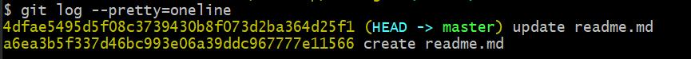
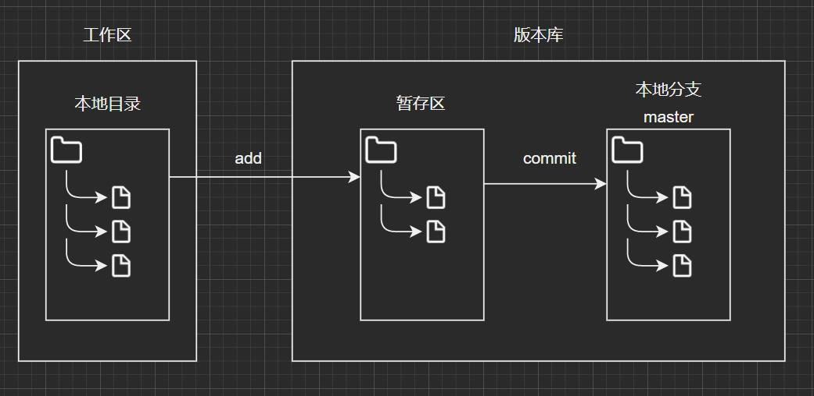
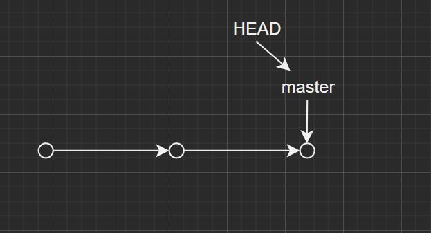
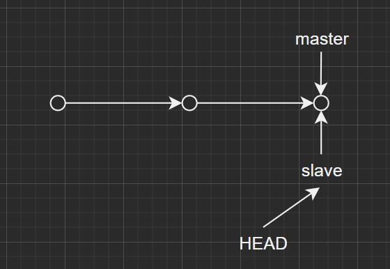
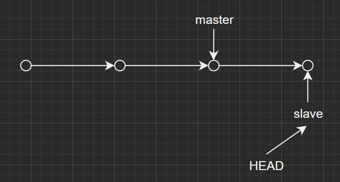
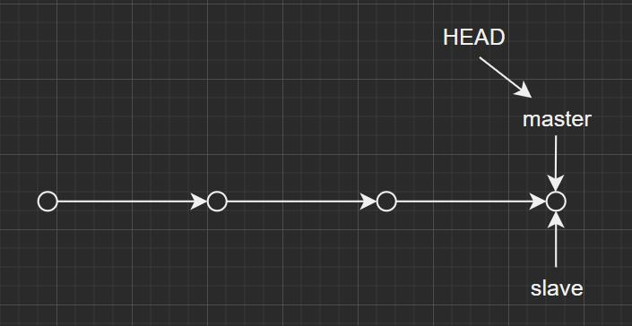
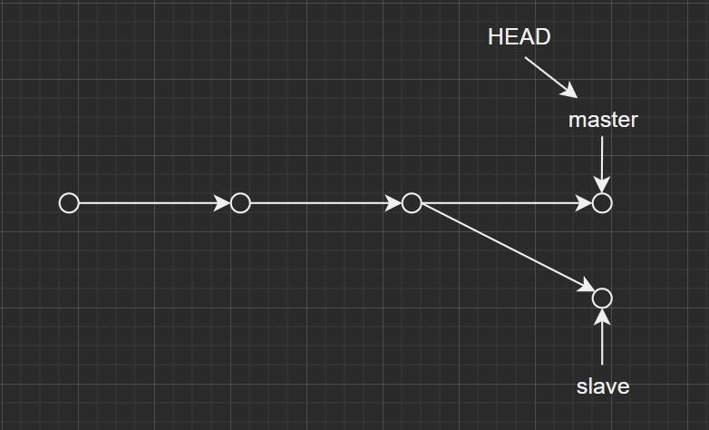
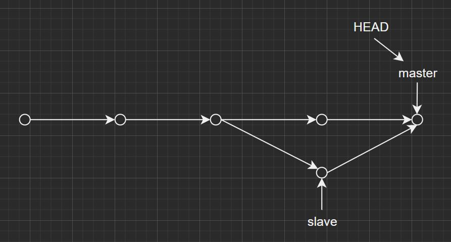
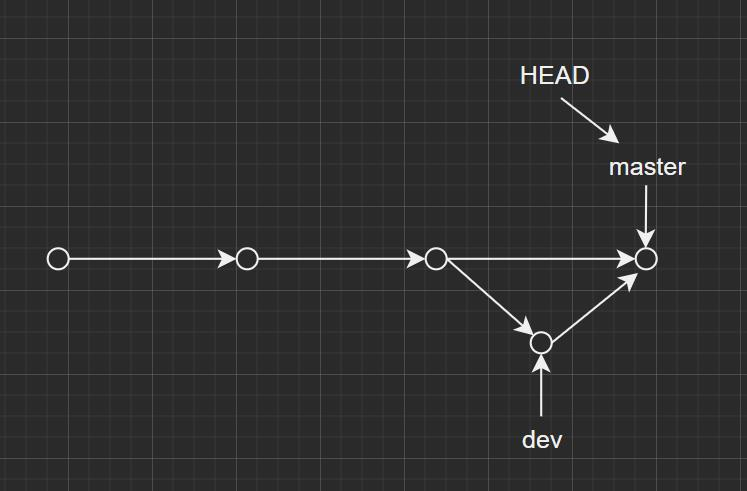

## 安装Git

windows用的比较多，就装windows里吧😀

步骤相对简单，直接官网下一个就ok，在桌面右键->Git Bash Here就能打开Git的命令窗口


## 配置Git

这个是全局配置Git的用户名和邮箱，在你git commit的时候会用到(全局的配置文件在用户目录下的.gitconfig)

```bash
git config --global user.name "your name"
git config --global user.email "your email"
```

```bash
# 格式化git log并简写为git lg
git config --global alias.lg "log --color --graph --pretty=format:'%Cred%h%Creset -%C(yellow)%d%Creset %s %Cgreen(%cr) %C(bold blue)<%an>%Creset' --abbrev-commit"
```

或者你想在指定的本地Git仓库内修改自己的信息，可以使用如下命令，这个的优先级是比global高的

```bash
git config --local user.name "your name"
git config --local user.email "your email"
```

> Github的提交记录列表中没有显示你设置的头像的原因就是你设置的邮箱和远程的邮箱不一致

##  快速开始

桌面打开git bash后

```bash
# 新建空的Git仓库文件夹
mkdir test-git
# 进入文件夹
cd test-git
# 查看当前所在目录(print work directory)
pwd
```

前置工作完成后就可以初始化Git仓库了

```bash
# 在test-git中生成了一个.git隐藏文件夹，用来记录和Git相关的信息，不要随意动他
git init
# 创建一个文件
touch readme.md
# 用vim命令编辑markdown文件中的内容，不会编辑的自行百度
vim readme.md
# 查看readme.md的内容 => hello
cat readme.md
# 查看工作树状态(包含未追踪的文件，待暂存和待提交的文件)
git status
```

此时发现新建的readme.md没有被追踪


提示需要将readme.md添加到暂存区内

```bash
# 添加工作目录下的所有文件到暂存区
git add .
# 或者这里我们指定文件
git add readme.md
```

此时发现文件的状态变成了待提交


```bash
# 提交到本地库 -m 表示本次提交的提示
# git add和git commit的区别是git add可以单独添加某一个文件，而git commit是批量操作的
git commit -m "create readme.md"
```

## 版本回退

紧接着上下文，我们如何查看本地库提交的版本呢❓

```bash
# 查看commit版本，这里是以简洁的形式呈现的，相关配置可参考官网
git log --pretty=oneline
```

结果如下，其中这一长串的16进制是通过SHA1算法整出来的，你操作的时候可能和我不太一样

```
a6ea3b5f337d46bc993e06a39ddc967777e11566 (HEAD -> master) create readme.md
```

此时我们修改readme.md的内容为helloworld

```bash
# 和版本库比较，可以指定具体文件
git diff
```

```
diff --git a/readme.md b/readme.md
index ce01362..31e0fce 100644
--- a/readme.md
+++ b/readme.md
@@ -1 +1 @@
-hello
+helloworld
```

把修改的内容提交到版本库中，生成了一条新的commit id，此时我们发现原先的HEAD指针指向了新的commit id



重点来了，如何版本回退呢？

我们可以使用

```bash
# --hard稍后介绍，HEAD^表示上一个commit id，HEAD^^表示再前一个，HEAD~100表示之前的第100个版本
git reset --hard HEAD^
```

强迫症又犯了，我又想回去了...怎么办呢？

其实很简单，你只要记得那个commit id就能回去，有人会问commit id那么长谁记得住，没问题

```bash
# HEAD引用记录解君愁
git reflog
```

```
a6ea3b5 (HEAD -> master) HEAD@{0}: reset: moving to HEAD^
4dfae54 HEAD@{1}: commit: update readme.md
a6ea3b5 (HEAD -> master) HEAD@{2}: commit (initial): create readme.md
```

```bash
# 此时我们又可以回到update readme.md的版本
git reset --hard 4dfae54
```

## 几个概念

Git作为先进的分布式版本控制系统，与SVN、CVS等比较，他的特点在于每个开发者在本地都有自己的版本库，协作时只需要将自己修改的信息发送给别人即可，引入Git服务器只是起一个中间交换的作用，而集中式版本控制系统都是由中央库去管理的，一旦中央库故障，GG

工作区(workspace)：就是你的本地目录

版本库(Local Repository)：可分为stage/index暂存区和分支(默认创建master)

画图理解如下



## 修改和删除

Git是面向修改记录的，而不是文件跟踪

首先我们来新增一个update.md修改内容为update，并添加到暂存区中，添加到暂存区中的update.md变为待提交状态，此时我们修改工作区的update.md文件，然后查看版本库状态，发现

```
$ git status
On branch master
Changes to be committed:
  (use "git restore --staged <file>..." to unstage)
        new file:   update.md

Changes not staged for commit:
  (use "git add <file>..." to update what will be committed)
  (use "git restore <file>..." to discard changes in working directory)
        modified:   update.md
```

一个是待提交，一个是未被添加到暂存区中，git commit会提交什么呢？

结果只是提交了添加到暂存区的update.md，此时我们再次查看版本库状态

```
$ git status
On branch master
Changes not staged for commit:
  (use "git add <file>..." to update what will be committed)
  (use "git restore <file>..." to discard changes in working directory)
        modified:   update.md

no changes added to commit (use "git add" and/or "git commit -a")
```

如果我们想要丢弃这个工作区的修改，可以使用

```bash
# 注意和git checkout(切换分支)的区别
git checkout -- update.md
# 这条命令的含义就是从版本库中检出update.md这个文件最新状态，并替换工作区文件的内容
```

检出有两种可能性，这里是工作区的update.md被二次修改了，第一次修改的update.md被commit了，暂存区是干净的状态，然后检出是从版本库里拿出来替换工作区的update.md，另一种情况就是如果第一次修改update.md被添加到暂存区后没有被commit，而且第二次修改了update.md没有被添加至暂存区，那么检出就是用暂存区中第一次修改的update.md来替换工作区中第二次修改的update.md

总的来说，检出就是从最新一次的git add或者git commit来替换工作区的内容

针对第二种情况，即使我们把工作区的内容替换了，但暂存区还是存在内容的，如果我们想取消暂存区的修改，该怎么处理呢？

```bash
# 使暂存区中的修改撤销到工作区中，使文件从待提交状态变为待暂存
git reset HEAD update.md
# 此时结合检出就能还原文件在版本库中的最后一次状态
```

删除就相对简单了，假如你在工作区删除了一个文件，如果你想先add在commit，那么版本库里也会被删除，如果add了没commit且需要还原文件，先reset再检出，如果没add且需要还原，直接检出就能防止误删，但是会丢失最近一次提交后的修改

需要注意的是，版本库中如果没有你的文件，在工作区删除是无法还原的

## 远程仓库

本地的内容相信大家已经看了个大概，这里再来讲讲远程分支的细节

当需要多人协作时，远程分支就比较管用

首先，推送远程分支我们需要一个Git服务器，国内有很多代码托管平台，诸如Github、Gitee、Coding...等等

就拿最广泛的Github举例，首先注册一个账号就可以开始免费使用Github了(白嫖使我快乐)，为了使我们的主机能够与Git服务器关联，首先我们需要先配置SSH，在你本机的用户目录下找到是否有.ssh文件夹，如果没有使用命令`ssh-keygen -t rsa -C "your email"`，生成的目录结构如下

```
.ssh
 - id_rsa
 - id_rsa.pub
 - known_hosts
```

在Github设置你的SSH：Settings->SSH and GPG keys->New SSH key->标题随意，Key填id_rsa.pub的内容

ok，回到我们的Repositories页面，新建一个仓库test-git，先不用初始化，建个空仓库，然后我们发现远程仓库的地址有两种形式，https和ssh协议，个人建议使用ssh的快一点，有的公司限制只能用https的

我们在本地中已经建立我们的库，我们只需要推送到远程仓库即可

```bash
# 添加远程仓库地址，指定别名为origin
git remote add origin git@github.com:pogyang/test-git.git
# 显示配置的远程仓库地址
git remote -v
# 推送(Github的新feature把默认分支改名为main，不过不影响我们使用master)
git push -u origin master
```

看到网上有很多关于说法，这里的-u有什么作用，以及和--set-upstream-to的区别，在我的理解看来-u参数的含义是将本地的提交全部推送到远程的master分支中，如果远程master不存在就创建，下次就可以随意拉取和推送了(当远程就这一个分支的时候可以直接使用git pull和git push)

在.git的config中生成的内容

```
[branch "master"]
	remote = origin
	merge = refs/heads/master
```

如果我们不使用-u参数呢？

用git push origin master貌似能成功推送，但是下次git push或者git pull的时候提示让你绑定远程分支，所以说-u是一次性到位的，而--set-upstream-to只是设定了绑定的分支

另一种方法就是clone，直接把远程库克隆到本地`git clone git@github.com:pogyang/test-git.git`，远程建库的时候可以预先用README.md初始化

## 分支

还记得之前`git checkout -- <filename>`命令吗，那个是标识从版本库中检出的，我们这里的`git checkout`是表示切换分支的

```bash
# 创建并切换分支
git checkout -b slave
# 或者使用switch，语义更清晰
git switch -c slave
# 查看分支，当前分支前面有个*
git branch
```

画图理解如下





然后在slave分支提交



master如果想要合并slave分支，那么很简单

```bash
# 先切换到master分支
git swtich master
# 合并slave，这里是使用的是Fast-forward模式，就是将原来的master指向slave最新的提交，速度很快在这里不存在冲突
git merge slave
```



然后用`git branch -d slave`删除slave分支，如果你没有完全合并slave分支会提示-D删除

并不是所有的分支管理都这么简单，假如master在merge前提交了自己的分支，那么就可能存在冲突



此时在master分支上，尝试用`git merge slave`的时候会出现

```
$ git merge slave
Auto-merging conflict.md
CONFLICT (content): Merge conflict in conflict.md
Automatic merge failed; fix conflicts and then commit the result.
```

且你会发现你的分支名变成了master|MERGING，提示你要手动合并冲突的文件，用git status有相应的提示

```
$ git status
On branch master
You have unmerged paths.
  (fix conflicts and run "git commit")
  (use "git merge --abort" to abort the merge)

Unmerged paths:
  (use "git add <file>..." to mark resolution)
        both modified:   conflict.md

no changes added to commit (use "git add" and/or "git commit -a")
```

这里提示还可以使用`git merge --abort`来取消此次merge

我们来手动处理下冲突的文件conflict.md

```
<<<<<<< HEAD
master branch
=======
slave branch
>>>>>>> slave
```

可以发现当前的分支内容master branch和slave分支的slave branch冲突了，Git用<<<<<<<、=======、>>>>>>>来分割冲突，我们处理后的结果如下

```
merge branch
```

然后add再commit发现分支名又还原为master



```bash
# 查看下分支合并图(参数含义以次是图形形式，简洁形式，commit id缩写形式)
git log --graph --pretty=oneline --abbrev-commit
```

```
*   3df978a (HEAD -> master) resolve conflict
|\
| * 8b7732d (slave) slave commit
* | a3c6977 master commit
|/
* 311e848 create conflict.md
```

然后删除slave分支`git branch -d slave`

## 实战分支管理

前面我们提到的Fast-forward模式合并，虽然他速度很快(其实就是指针的移动)，但会丢失合并其他分支的记录

这里给出一个demo，我们先在master提交一个ff.md文件，创建并切换到dev分支修改提交ff.md

```
$ git log --graph --pretty=oneline --abbrev-commit
* 2a5a03a (HEAD -> dev, master) dev update
* 00a12b8 dev start
* f9a000a (master) step two
* 105c38e step one
* 31220ac create ff.md
```

切回master去合并

```
$ git log --graph --pretty=oneline --abbrev-commit
* 2a5a03a (HEAD -> master, dev) dev update
* 00a12b8 dev start
* f9a000a step two
* 105c38e step one
* 31220ac create ff.md
```

发现分支分叉的信息丢失了，因为这里没有冲突默认采用的是Fast-forward模式，如果我们不想这么干，怎么做呢？

```bash
# 采用普通模式的合并
git merge --no-ff -m 'no-ff mode' dev
```

```
$ git log --graph --pretty=oneline --abbrev-commit
*   b8b9e62 (HEAD -> master) no-ff mode
|\
| * 2a5a03a (dev) dev update
| * 00a12b8 dev start
|/
* f9a000a step two
* 105c38e step one
* 31220ac create ff.md
```

画个图理解下



实际开发中，master分支一般都是很稳定的，通常用来发布版本使用，dev用作开发分支，我们多人协作开发使就需要先合并到dev分支上，最后由master分支来合并dev分支发布

有的时候比如线上的master分支中可能存在bug，需要bug-fix热修复，但你在dev的分支中开发到一半还没完全完成，怎么办呢？

```bash
# 相当于保存一个dev分支下的快照然后入栈，以备后续继续开发
git stash
# 查看stash的内容
git stash list
# 取指定快照但不会删除，需要用git stash drop删除
git stash apply stash@{0}
# 从栈顶取快照并删除
git stash pop
```

所以这里相当于是将我们修改的dev保存一个快照到stash使工作树清空，然后切换到master分支上去修复bug

```bash
# 确定修复master分支上的bug，先切过去
git checkout master
# 创建bug-001分支，处理bug然后提交
git switch -c bug-001
# 切回master合并
git merge --no-ff -m 'fix-bug-001' bug-001
# 删除bug-001分支
git branch -d bug-001
```

```
$ git log --graph --pretty=oneline --abbrev-commit
*   9bf5718 (HEAD -> master) fix-bug-001
|\
| * 9836de4 bug-001-fix
|/
*   b8b9e62 no-ff mode
|\
| * 2a5a03a (dev) dev update
| * 00a12b8 dev start
|/
* f9a000a step two
* 105c38e step one
* 31220ac create ff.md
```

ok，热修完成切回dev分支继续工作，但是我们发现master分支上bug的确是被修复了，但是这个bug在dev分支上还是存在的，难道要重复劳动？

Git已经帮我们解决了这个问题

```bash
# 需要指定修复bug的commit id
git cherry-pick 9836de4
```

```
$ git cherry-pick 9836de4
[dev 803fcd1] bug-001-fix
 Date: Thu Oct 15 16:26:51 2020 +0800
 1 file changed, 0 insertions(+), 0 deletions(-)
 create mode 100644 bug-fix.md
```

这样Git就会将修复的bug复制过来并在dev上生成一个新的commit id -> 803fcd1，再次从master上合并dev

```
$ git log --graph --pretty=oneline --abbrev-commit
*   80e9f6d (HEAD -> master) merge dev again
|\
| * 803fcd1 (dev) bug-001-fix
* |   9bf5718 fix-bug-001
|\ \
| * | 9836de4 bug-001-fix
|/ /
* | b8b9e62 no-ff mode
|\|
| * 4222a99 dev update
| * daebb20 dev start
|/
* 422bba2 step two
* 3051c54 step one
* ae24ade create ff.md
```

有的时候我们在项目中要开发实验性的功能，可以新建一个feature分支，如果需要该功能就合并，如果不需要就删除，还是比较灵活的，注意没有被完全合并的分支-d参数是删除不了的，要用-D参数强制删除

## 标签

这个就相对简单了，有点类似分支主要用于显示项目版本号

```bash
# 切换到需要打tag的分支，还可以指定对应的commit id(默认为HEAD)
git tag <tagname> <commit id>
# 指定标签信息
git tag -a <tagname> -m "msg" <commit id>
# 展示所有的标签
git tag
# 展示某个标签
git show <tagname>
```

```bash
# 推送标签到远程
git push origin <tagname>
# 推送所有标签
git push origin --tags
# 删除本地标签
git tag -d <tagname>
# 删除远程标签
git push origin :refs/tags/<tagname>
```

## 补充
附上一些其他的小命令
```bash
# 修改commit的注释
git commit --amend
# 生成ssh
ssh-keygen -t rsa -C "pogyang"
```

