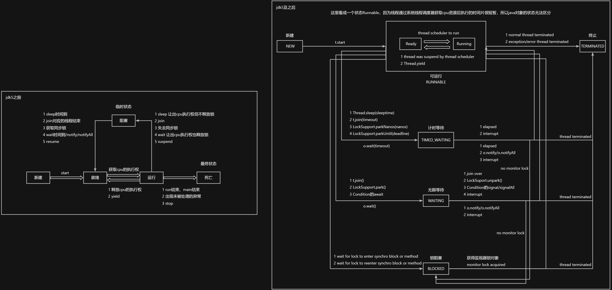
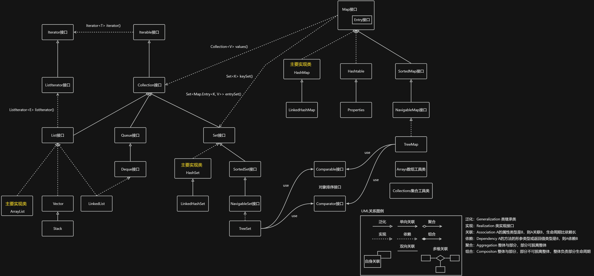
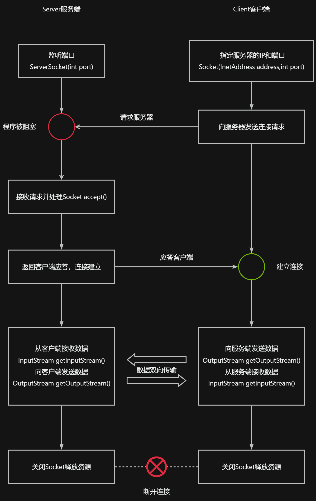

> [javase源码](https://github.com/pogyang/backend/tree/main/java/javase/src)
>

## JDK
`JDK` Java Development Kit

`JRE` Java Runtime Environment

`JVM` Java Virtual Machine

`LTS` Long-term Support

`JEP` Java Enhancement Proposals

JDK = JRE + Tools & Tool APIs

JRE = JVM + JavaSE API

LTS `8` `11` `17`

Oracle JDK & Open JDK

配置java环境：建议使用JAVA_HOME变量的方式例如

`JAVA_HOME` -> `C:\Program Files\Java\jdk-17`

`PATH` -> `%JAVA_HOME%\bin`

## HelloWorld
编写`HelloWorld.java`文件

用`javac`编译`HelloWorld.java`文件生成`HelloWorld.class`字节码

用`java HelloWorld`运行字节码文件

## 注释
## Java的优缺点
+ 优点
    - 跨平台性 Write Once Run Anywhere
    - 面向对象性 封装继承多态 高内聚低耦合
    - 健壮性 不使用指针和内存的申请和释放而使用GC管理内存
    - 安全性 类加载器 字节代码检查 使用不同namespace以防替代本地同名类
    - 简单性 俗称C++--
    - 高性能 JIT(Just In Time)即时编译技术
+ 缺点
    - 复杂
    - 并非适用所有领域

## 关键字
一共50个，其中const和goto是保留字，true/false/null虽然不在其中但任然看作关键字作为字面量表示布尔值和空值

## 标识符
+ 规则
    - 由`a-z A-Z 0-9 _ $`组成
    - 不能以数字开头
    - 不能包含空格
    - 不可以使用关键字和保留字但能包含关键字和保留字
    - 区分大小写长度无限制
+ 规范
    - 包名用小写
    - 类名/接口名用大驼峰
    - 变量名/方法名用小驼峰
    - 常量名用大写snake

## 变量的定义
## 数据类型
+ 计算机存储单位
    - 字节Byte是计算机用于计量存储容量的基本单位，一个字节等于8bit位
    - 位bit是数据存储的最小单位，二进制中0和1就是一个位
    - 转换关系 8bit=1Byte 1024Byte=1KB 1024KB=1MB 1024MB=1GB 1024GB=1TB
+ 基本数据类型
    - 整型
        * byte(1字节) -128~127
        * short(2字节) -2<sup>15</sup>~2<sup>15</sup>-1
        * int(4字节) -2<sup>31</sup>~2<sup>31</sup>-1（约21亿）
        * long(8字节) -2<sup>63</sup>~2<sup>63</sup>-1
        * 整型常量默认为int型
        * 定义long类型变量赋值时需要加后缀L/l
    - 浮点型
        * float(4字节) 单精度，尾数可以精确到7位有效数字`-3.403E38~3.403E38`
        * double(8字节) 双精度，精度是float的两倍`-1.798E3.08~1.798E308`
        * 浮点型常量有两种表示形式
            + 十进制数形式(必须要有小数点)如 5.12 512.0f .512
            + 科学计数法形式如 5.12e2 512E2 100E-2
        * 浮点型常量默认为double型
        * 定义float类型变量赋值时需要加后缀F/f
        * float类型表数范围要大于long类型的表数范围但精度不高(并不是所有的小数都可以用二进制浮点数表示)
        * 金融计算领域不适合使用浮点型数据，精确数字计算或保留指定的位数需要使用`BigDecimal`类
        * 0.1+0.2不等于0.3是因为计算机表示小数精度有限导致的，虽然IEEE 754计算标准极大提升了小数二进制的精度上限但不能突破物理边界所以不能实现每个小数十进制都对应一个小数二进制，比如(0.0010)<sub>2</sub>=(0.125)<sub>10 </sub>(0.0011)<sub>2</sub>=(0.1875)<sub>10</sub>四位二进制小数无法表示十进制0.125~0.1875之间的小数
    - 字符型
        * char(2字节)
        * java的内码使用Unicode字符集和utf-16字符编码，所以一个char可以存储一个数字、英文、标点、汉字、或其他常见字符
        * 四种表现形式
            + 单个字符（`''`内有且仅能只有一个字符）如`'a'`
            + Unicode码点（`'\uFFFF'`中的4个F表示4个16进制）如`'\u0023'`表示`'#'`，注意java编译器在处理源文件时会高优先对所有字符进行Unicode解码，包括注释中的字符，如果遇到非法的Unicode码点如`'\uXXXX'`，编译器就会在解析过程中无法识别该码点对应的字符从而编译error，解决方案为换成正确的Unicode码点或在其前加`\`再次转义
            + 转义字符（用`\`将其后的字符变为特殊字符常量）如`'\n'`表示换行符、`'\t'`表示制表符、`'\r'`表示回车符、`'\b'`表示退格符
            + 使用特殊的十进制对应ASCII码中的一个字符，如`97 -> 'a'`，`65 -> 'A'`，`48 -> '0'`
    - 布尔类型
        * boolean用来判断逻辑条件一般用于流程控制，boolean类型数据只有true和false两个值所以不能和其他基本数据类型做运算
        * jvm中没有任何提供boolean值专用的字节码指令，在编译之后用jvm中的int类型来代替即true用1表示、false用0表示
        * 编译时不谈占几个字节，但在jvm为其分配内存空间时占一个slot即4个字节
    - 自动类型提升
        * 当容量小的变量与容量大的变量做运算时结果自动转换为容量大的数据类型，此容量的大小并非指占用的内存空间的大小而是表示数据范围的大小，所以float(4字节)类型的变量可以接收long(8字节)类型的数据
        * byte类型的数据可以赋值给short类型的变量，但不能赋值给char类型的变量
        * byte/short/char类型的变量两两之间做运算结果是int类型，因为他们都是小字节类型(≤2个字节的)运算后可能溢出，java编译器为避免错误都转为更大的int运算
        * byte/short/char->int->long->float->double
    - 强制类型转换
        * 由容量大的转换为容量小的数据类型，用()中间写需要转换成的数据类型，可能会丢失精度
+ 引用数据类型
    - class/array/interface
    - enum/annotation/record
    - String
        * ""内可包含0/1/多个字符
        * 与基本数据类型只能用+进行连接运算，结果还是String类型

## 进制
+ binary/octal/decimal/hex
    - 二进制以0b或0B开头，八进制以0开头，十六进制以0x或0X开头字母不区分大小写
    - 二进制->十进制 权相加法 十进制->二进制 除2取余逆
    - 二进制<->八进制 3位为1个八进制
    - 二进制<->十六进制 4位为1个十六进制
+ 原码/反码/补码
    - 计算机底层存储都是用的补码，运算用补码结果看原码
    - 正数最高位符号位为0，原码反码补码都一样
    - 负数最高位符号位为1，原码除了符号位按位取反变为反码，反码+1变补码，逆操作补码-1变反码，反码除了符号位按位取反变为原码
    - 8位二进制中原码和反码的取值范围为`-127~-0 +0~+127`，-128使用-0的原码，-128没有原码和反码，-128的补码为10000000可用-127的补码-1推算

## 运算符
+ 按功能划分
    - 算术 +(加号) -(减号) * / % ++ --
    - 赋值 = += -= *= /= %= <<= >>= >>>= &= |= ^=
    - 比较(关系) > >= < <= == != instanceof
    - 逻辑 & | ^ ! && ||
    - 位 & | ^ ~ << >> >>>
    - 条件 (条件表达式)?表达式1:表达式2
    - Lambda ->
+ 按操作数个数划分
    - 一元(单目) +(正号) -(负号) ++ -- ! ~
    - 二元(双目) 除了一元和三元剩下都是二元
    - 三元(三目) 条件运算符
+ 优先级由高到低
    - 括号 () [] {}
    - 正负号 + -
    - 一元 ++ -- ! ~
    - 乘除余 * / %
    - 加减法 + -
    - 移位 << >> >>>
    - 关系 < <= > >= instanceof
    - 等价 == !=
    - 按位与 &
    - 按位异或 ^
    - 按位或 |
    - 条件与 &&
    - 条件或 ||
    - 三元 ? :
    - 赋值 = += -= *= /= %=
    - 位赋值 <<= >>= >>>= &= |= ^=
+ 注意
    - 取模后的结果与被模数的符号相同
    - 如果不能整除则向下取整
    - num++先取值后自增，++num先自增后取值，--同理
    - 比较运算符中boolean类型只能与boolean类型用== !=比较
    - & |两边都要执行，&&短路与左边false右边直接不执行，||短路或左边true右边直接不执行
    - <<有符号左移低位补0，符号位可能发生变化，>>有符号右移负数高位补1正数高位补0，>>>无符号右移高位正负数都补0，没有无符号左移
    - 不要过度依赖运算的优先级来控制表达式的执行顺序，这样可读性差，尽量使用()来控制表达式的执行顺序，如果一个表达式过于复杂可以分成几步来完成

## 流程控制
+ 顺序结构
    - java定义变量时采用合法的前向引用
+ 分支结构
    - 如果多个条件表达式之间没有交集(互斥)，则条件表达式的顺序无要求，如果条件表达式之间是包含关系，则需要将范围小的声明在上面否则范围小的条件表达式永远不会执行
    - 条件表达式必须是布尔表达式(关系表达式或逻辑表达式)或布尔变量
    - 条件表达式中注意b==false(!b)和b=false的区别
    - if/if-else/if-elseif/if-elseif-else
    - switch-case
        * 先根据switch的表达式匹配case，无匹配默认进入default有匹配进入对应case，遇到break跳出结构，否则继续执行其后case中的语句(穿透性)
        * switch中的表达式只能是特定类型如下byte/short/char/int/enum(jdk5)/string(jdk7)
        * case后跟的都是常量，使用表达式和这些常量进行相等的判断，不能进行范围的判断，default可有可无位置灵活
        * switch-case比if-else的效率高，符合场景时尽量使用
+ 循环结构
    - 四要素
        * 初始化条件
        * 循环条件
        * 循环体
        * 迭代部分
    - break和continue
        * break可用在switch-case和循环结构中，而continue只能用于循环结构中
        * break是结束或跳出当前循环，而continue是结束或跳出当次循环
        * 二者都是关键字后面都不能声明执行语句(return也是)
        * break使用频率比continue高
        * goto在java中是保留关键字没有实际用途在语言设计时有意去除的，在有的其他语言中goto语句可以随意将控制转移到程序中的任意一条语句上然后执行它但程序容易出错，java中的break和continue是不同于goto的
    - for/while/do-while
        * while的初始化条件在循环结束后依然有效，而for的初始化条件局部作用域仅在循环内部
        * 有明显的循环次数用for否则用while
        * do-while循环至少执行一次循环体
        * 无限循环while(true)/for(;;)
        * 结束循环结构
            + 循环条件不满足
            + break结束当前循环(就近原则，多重嵌套循环时结束break所在循环体的那一层循环)
            + return结束方法
            + 带标签的break(可以结束多重嵌套循环)，带标签continue(可以结束当次多重嵌套循环并进入迭代部分再执行下一次循环)

```java
public class Test{
    public static void main(){
        label:
        for(int i = 1;i <= 3;i++){
            for(int j = 1;j <= 3;j++){
                // 可以用来结束外层循环
                if(j == 2) break label;
            }
        }
    }
}
```

## 数组
+ 概念
    - 多个相同类型的数据按一定顺序排列的集合，并使用一个名字命名，并通过编号的方式对这些数据进行统一管理，简称多个相同类型数据的组合
        * 数组名
        * 下标/索引/角标
        * 元素
        * 数组的长度
+ 特点
    - 创建数组对象会在内存中开辟一整块连续的空间，占据空间的大小取决于数组的长度和数组元素的类型，数组中的元素在内存中是依次紧密排列的，有索引代表它是有序的
    - 数组本身是引用数据类型，数组中的元素可以是基本数据类型或引用数据类型，数组中的元素可以重复
    - 一旦初始化完成其长度就确定了不可更改
    - 数组名中引用的是这块连续空间的首地址
    - 通过下标直接调用指定位置的元素速度很快
    - 动态初始化时元素的默认初始化值为整形0/浮点型0.0/字符型是十进制0('\u0000')，不是字符'0'(十进制48、'\u0030')/布尔false/引用数据类型null，不是"null"
    - length是数组的属性
    - 数组的索引从0到length-1，非法索引会报`ArrayIndexOutOfBoundsException`异常
    - 从数组的底层机制来讲二维数组的本质任然是一维数组，即二维数组的元素是一维数组
    - `int[] arr1 = new byte[]{1,2,3};`这里元素不能自动类型提升编译报错，但`Object[] arr = new String[]{"a","b","c"};`这种可以，因为是多态的形式

## 算法
+ 排序：记录序列有对应的关键字序列，根据关键字序列排序所生成的新的记录序列称为排序，排序的目的是为了快速查找
+ 衡量排序算法的优劣
    - 时间复杂度：分析关键字的比较次数和记录的移动次数，使用大O表示法，1<log<sub>2</sub>n<n<nlog<sub>2</sub>n<n<sup>2</sup><n<sup>3</sup><...<2<sup>n</sup><n!<n<sup>n</sup>，通常将以2为底n的对数简写成logn
    - 空间复杂度：分析排序算法中需要多少辅助内存，使用大S表示法，S(n)是问题规模n的函数
    - 稳定性：若两个记录A和B的关键字相等，排序后A和B的先后次序保持不变，那么这种排序算法是稳定的
+ 排序算法的分类
    - 内部排序：整个排序的过程不需要借助外部存储器(如磁盘等)，所有的排序操作在内存中即可完成
    - 外部排序：参与排序的数据非常多，必须借助外部存储器，最常见的是多路归并排序，可以认为是由多次内部排序组成
+ 十大排序算法

| 排序算法 | 时间复杂度（平均） | 时间复杂度（最坏） | 时间复杂度（最好） | 空间复杂度 | 稳定性 |
| --- | --- | --- | --- | --- | --- |
| 插入 | n<sup>2</sup> | n<sup>2</sup> | n | 1 | 1 |
| 希尔 | n<sup>1.3</sup> | n<sup>2</sup> | n | 1 | 0 |
| 选择 | n<sup>2</sup> | n<sup>2</sup> | n<sup>2</sup> | 1 | 0 |
| 堆 | nlog<sub>2</sub>n | nlog<sub>2</sub>n | nlog<sub>2</sub>n | 1 | 0 |
| 冒泡 | n<sup>2</sup> | n<sup>2</sup> | n | 1 | 1 |
| 快速 | nlog<sub>2</sub>n | n<sup>2</sup> | nlog<sub>2</sub>n | nlog<sub>2</sub>n | 0 |
| 归并 | nlog<sub>2</sub>n | nlog<sub>2</sub>n | nlog<sub>2</sub>n | n | 1 |
| 计数 | n+k | n+k | n+k | n+k | 1 |
| 桶 | n+k | n<sup>2</sup> | n | n+k | 1 |
| 基数 | n*k | n*k | n*k | n+k | 1 |


## 面向对象
面向对象是一类编程风格、开发范式，除了面向对象OOP（object-oriented programming），还有面向过程POP（process-oriented programming）、指令式编程、函数式编程

### 基础
#### 包定义和导包
+ `a.*`表示导入a包下所有结构，如需使用a包的子包下的类任然需要导入
+ `java.lang`或当前包下的可省略import
+ 使用不同包的同名类需要以全类名的方式
+ `import static`表示导入类或接口的静态属性或方法
+ package必须写在源文件的第一行有且仅有一个，如果没有就表示源文件没有包含于包结构，命令行模式下需要把package注释
+ 包名属于标识符所以要满足标识符的规则和规范，全部小写域名倒置，不要用`java.xxx`包

#### 权限修饰符
| 修饰符 | 本类内部 | 本包内 | 其他包的子类 | 其他包的非子类 |
| --- | --- | --- | --- | --- |
| private | 1 | 0 | 0 | 0 |
| 缺省（不写） | 1 | 1 | 0 | 0 |
| protected | 1 | 1 | 1 | 0 |
| public | 1 | 1 | 1 | 1 |


外部类：缺省、public

成员方法/成员变量/成员内部类/构造器：所有修饰符

局部内部类：缺省

#### JavaBean
符合如下标准

+ 类是公共的
+ 有一个无参构造器（方便反射API的调用）
+ 有属性且有对应的get/set方法

#### UML
+ +/-/#分别表示public/private/protected
+ :前面一般为名称，后面为类型
+ 斜体表示抽象方法或抽象类

#### 设计模式23
+ 创建型模式
    - 工厂方法模式（简单工厂模式是工厂方法模式的简化版）
    - 抽象工厂模式
    - 创建者模式
    - 原型模式
    - 单例模式
        * 饿汉式：随着类的加载当前唯一的实例就创建了，写法简单提前加载使用快速线程安全但占用内存时间较长
            + `Runtime.getRuntime()`
            + 任务管理器/回收站
            + Application/应用程序的日志
            + 数据库连接池
        * 懒汉式：在需要使用时进行创建，节省内存空间但存在线程不安全的问题
        * 枚举类只有一个对象
+ 结构型模式
    - 外观模式
    - 适配器模式
    - 代理模式
    - 装饰模式
    - 桥接模式
    - 组合模式
    - 享元模式
        * 例如Integer.IntegerCache.cache保存了公用的Integer数组
+ 行为型模式
    - 模板方法模式
        * 抽象类中编写通用代码和抽象方法，在不同子类中实现抽象类中的抽象方法
        * 让子类总体上保留抽象类的行为模式的同时实现代码的复用和扩展
    - 观察者模式
    - 状态模式
    - 策略模式
    - 职责链模式
    - 命令模式
    - 访问者模式
    - 调停者模式
    - 备忘录模式
    - 迭代器模式
        * 迭代器不负责数据的存储，而是负责对集合的遍历
    - 解释器模式

#### this
+ 在方法中使用表示当前对象，在构造器中表示当前正在创建的对象
+ 可以在类的构造器中调用当前类的其他构造器，且n个构造器最多有n-1个this(参数列表)的结构
+ 必须声明在首行，且一个构造器内最多出现一次
+ 可用于区分重名的形参(局部变量)和成员变量
+ 类的方法或构造器里调用属性或方法一般都是省略了this

#### super
+ 子类的方法或构造器内在满足封装性的前提下可以用`super.`调用直接父类或间接父类的属性和方法
+ 一般情况下可以省略super，但子类重写了父类的方法或子类和父类的属性重名，则必须显示调用父类被重写的方法或父类中声明的属性
+ super调用构造器
    - 子类继承父类时不会继承父类的构造器，只能通过super(形参列表)的方式调用父类的构造器
    - super(形参列表)必须声明在首行
    - 构造器首行可以使用this(形参列表)调用本类中重载的构造器，所以this和super只能二选一
    - 子类的构造器没有显示调用this(形参列表)或super(形参列表)时，默认隐式调用super()父类空参构造器
    - 子类的每个构造器中要么调用本类的重载构造器要么调用父类的构造器
    - 一个类中有n个构造器，最多有n-1个构造器中使用this(形参列表)，剩下的那一个构造器一定是super(形参列表)
+ 通过子类构造器创建对象实例的过程中一定会直接或间接的调用父类构造器，才会将父类中的属性和方法加载到内存中供子类对象使用

#### Object
+ java中的任何一个类都直接或间接继承于Object类，其中没有声明属性提供一个空参构造器
+ `new Object().getClass().getSuperClass()`为null，此外接口、基本类型包装类、Void的Class类型的直接父类型均为null
+ 方法
    - equals
        * 自定义类在没有重写equals方法时比较的是两个地址值和==一样，String/File/Date/包装类等都重写了equals方法比较的是实体内容
    - toString
        * 自定义类在没有重写toString方法时使用的是Object的toString方法，String/File/Date/包装类都重写了toString方法表示实体内容
    - clone/finalize
    - getClass/hashCode
    - notify/notifyAll/wait()/wait(long)/wait(long,int)

#### static
+ 修饰属性/方法/代码块/内部类
+ 使用static修饰的成员变量叫做静态变量或类变量，不使用static修饰的成员变量叫做非静态变量或实例变量
    - 静态变量（静态域）在内存空间中只有一份被同一类的多个对象共享，静态变量和字符串常量池在jdk6及之前存放在方法区，jdk7及之后存放在堆空间（方法区是JVM的规范，Hotspot中jdk7及之前的实现为永久代，jdk8及之后的实现为元空间，堆空间发生gc比方法区更频繁，方法区很少发生gc，栈空间没有gc），静态变量随着类的加载和卸载而加载和消亡，可以被类直接调用也可以使用对象调用
    - 类的每一个实例都保存着一份实例变量，实例变量存放在堆空间的对象实体中，随着对象的创建和消亡而加载和消亡，只能使用对象进行调用
+ 使用static修饰的方法叫做静态方法或类方法，可以用类.静态方法的形式直接调用，静态方法内可调用静态结构(结构指属性和方法，前缀是当前类可省略)但不可调用非静态结构，非静态方法内部可调用静态/非静态结构，静态方法内不能使用this和super，静态方法和静态属性的调用不依赖于对象（只要类型正确就算对象是null都能调用）
+ jvm需要调用类的main()方法，所以该方法的访问权限必须是public，jvm执行main()方法不必创建对象所以必须用static修饰，该方法接受一个String类型的数组参数，数组保存的是执行java命令时传递给所运行的类的参数，因为main()时静态的所以不能直接访问该类中的非静态成员，必须创建一个该类的实例对象，再通过该对象访问类中的非静态成员

#### final
+ 可以修饰类/方法/变量，表示类不能被继承，方法不能被重写，修饰局部变量和成员变量表示一旦被初始化赋值就不能再更改其值（数据值、地址值），此时的"变量"就变成了"常量"，例如修饰String/StringBuffer/StringBuilder类，Object类的getClass()方法
+ 修饰成员变量时可以通过显示/代码块/构造器初始化赋值，没有初始化赋值只有成员变量的默认值时编译会报错，在普通成员方法里赋值也不行，修饰局部变量时在调用此变量前一定要初始化赋值，形参是在调用此方法时初始化赋值
+ final和static搭配修饰成员变量时称为全局常量
+ final修饰引用数据类型时表示地址值不可变，但地址值指向的对象实体中的内容如果没有用final修饰则可改变

#### interface
+ 接口是规范、标准或定义的一组规则，实现类和接口之间是`has-a`的关系
+ 接口中属性使用`public static final`修饰(全局常量)，方法使用`public abstract`修饰(方法在jdk8之前只能用这种形式)，不写也有默认的修饰符推断，interface可用public修饰或缺省
+ jdk8可以声明接口中的静态方法和default默认方法
    - 这两种形式都可以用public修饰，不写也用默认的修饰符推断任然为public
    - 接口中的静态方法和全局常量只能用接口来调用，不能使用其实现类或实现类的实例调用
    - 接口中的静态方法不能被实现类重写，如果在实现类中有同名同参的静态方法则视为对接口中静态方法的隐藏，反之实现类如果没有这个同名同参的静态方法则不能通过其实现类或实现类的实例调用
        * 此处与类继承不同的是，父类中的静态方法可以被子类继承但不能被子类重写，如果在子类中有同名同参的静态方法则视为对父类中静态方法的隐藏，反之子类如果没有这个同名同参的静态方法则可以通过子类或子类的实例调用继承自父类的静态方法
        * 隐藏的含义是在实现类或子类中定义的一个同名同参的新的静态方法，隐藏了接口或父类中的静态方法不构成重写关系
        * 静态方法只和类或接口有关，类方法的调用是先判断调用者的类型如果有对应的类方法则调用，如果没有再判断该类型是否有继承链，从继承链上层寻找继承的类方法，接口的静态方法只能用接口本身调用
    - 接口中的默认方法可以被实现类继承，实现类在没用重写该方法时默认调用的是接口中的默认方法，反之调用的是实现类中重写的方法
    - 类实现了两个接口，两个接口中有同名同参的默认方法则会报错产生接口冲突，需要在实现类中重写这个方法
    - 类继承了一个父类和实现了一个接口，父类和接口中有同名同参的方法(接口中是默认方法)，如果这个类没有重写该方法，则优先调用父类的方法
    - 在实现类中的非静态成员方法如果想调用接口的默认方法可以用如下形式：接口.super.方法
+ jdk9可以声明接口中的私有方法
    - 接口中用private修饰的方法，一般用于接口内方法的封装，实现类没有访问权限
+ 接口中不可以声明构造器和代码块，接口本身也不能实例化因为它没构造器
+ 一个类可以实现多个接口，这个类就叫实现类，所以就能一定程度上弥补类的单继承的局限性，一个接口可以继承多个接口
+ 类必须将实现的接口中的所有抽象方法都实现重写后才能实例化，否则此实现类必须声明为抽象类
+ 接口的多态形式：接口类型 变量 = 实现类对象
+ 接口和抽象类的异同
    - 都可以声明抽象方法，都不能实例化
    - 抽象类一定有构造器，接口没有构造器
    - 类和类之间可以是单继承关系，类和接口之间可以是实现关系，接口和接口之间可以是多继承关系
    - 基于接口的匿名实现类的对象其类型的直接父类是Object，基于抽象类的匿名子类的对象其类型的直接父类是抽象类本身
+ 创建接口的实现类对象的方式
    - 创建接口的实现类对象
    - 创建接口的实现类的匿名对象
    - 创建接口的匿名实现类的对象
    - 创建接口的匿名实现类的匿名对象
    - 使用lambda表达式
+ 顶级接口会隐式的将Object类中所有public方法都作为一个抽象成员方法声明放入接口，使得顶级或子接口引用都能调用这些隐式声明从而编译不报错，而实现类的顶级类是Object，实现类继承自Object的方法相当于实现了顶层接口的隐式抽象成员方法

### 类的成员
#### 属性field
+ 又称为成员变量/域/字段
+ 属性和局部变量的区别
    - 属性是声明在类内方法外的变量，随着对象的创建存储在堆空间中，随对象的消亡而消亡，作用域在整个类内部，可以使用权限修饰符public/protected/缺省/private修饰，有默认初始化值
    - 局部变量声明在方法/形参/构造器/代码块内，存储在栈空间中，随方法对应的栈帧入栈和出栈而分配和消亡，作用域仅限于此局部变量所在的方法/构造器/代码块内，不可以用权限修饰符修饰，使用前必须显示赋值，没有默认初始化值，形参(formal parameter)赋值是在调用方法时输入实参(actual parameter)，实参可以是值/变量/表达式

#### 方法method
+ 重载overload，同一个类相同的方法名，参数列表不同（个数，顺序，类型），与形参名/权限修饰符/返回值类型无关，调用时优先匹配确定的
+ jdk5可变个数形参`Object ... objs`，可接受的实参可以是0/1/多个，可参与方法重载，必须声明在形参列表最后，最多出现一次，和可变个数形参类型相同的数组参数不构成重载
+ 方法内声明的局部变量和方法参数都使用值传递(复制值的副本)，基本类型数据变量传递数据值，引用类型变量传递地址值
+ 方法递归分为直接递归（自己调自己）和间接递归（ABCA），是一种隐式循环，递归没有出口会死循环并产生`StackOverflowError`异常，递归内存耗用多速度比循环迭代慢要求高性能时避免使用
+ 重写override/overwrite
    - 父类被重写的方法和子类重写方法的方法名和形参列表必须相同
    - 子类重写的方法的权限修饰符不小于父类的（子类不能重写父类的private方法）
    - 被重写的方法和重写的方法返回值类型相同，如果是引用数据类型重写的方法的返回值类型可以是被重写方法的返回值类型的子类
    - 重写的方法throws出的异常的类型和被重写的方法throws出的异常的类型一样或是其子类，如果被重写的方法没有throws异常那么重写的方法也不能throws异常（这条重写规则只适用于编译时异常，而运行时异常可以随意抛）
    - `@Override`注解的作用是用来校检重写的方法

#### 构造器constructor
+ 作用：搭配new关键字创建类的对象，创建对象的同时给对象相关属性赋值
+ 可用权限修饰符修饰，可重载，不可重写
+ 在没有显示声明构造器时类默认有一个无参构造器（其权限修饰符和类的一致），一旦显示声明即系统不再提供无参构造器
+ 构造器和方法是两个概念，在字节码中每一个类的构造器都对应一个特殊的`<init>`方法，初始化当前创建的对象的信息（显示/代码块/构造器初始化），而字节码中静态的内容（如静态属性显示赋值和静态代码块）则在`<clinit>`中操作
+ 类的整体加载顺序口诀`由父及子，静态先行`
+ 实例变量赋值顺序
    - 成员变量默认值（必然自动执行）
    - 显示初始化/代码块中初始化（对象创建时执行一次，两者顺序是代码在下方的覆盖上方的）
    - 构造器初始化（对象创建时执行一次）
    - 对象.属性/对象.方法赋值（可以执行多次）

#### 代码块codeblock
+ 用来初始化类或对象的信息，只能用static修饰
+ 静态代码块随着类的加载只会执行一次，优先于非静态代码块执行，每次创建对象都会执行一次非静态代码块
+ 如果声明多个代码块则按照先后顺序执行，内部可以声明局部变量（注意就近原则）、调用属性和方法、输出语句
+ 静态代码块内只能调用静态结构，非静态代码块内可以调用静态/非静态结构
+ 如果成员变量不能通过简单的显示赋值来完成初始化，就可以用代码块的形式来处理，例如数据源的初始化

#### 内部类innerclass
+ 内部类的分类
    - 成员内部类：
        * 声明在外部类里的，其他成员外的
        * 作为类，可以声明属性、方法、构造器、代码块、内部类，可以继承父类、实现接口，可以用final、abstract修饰
        * 作为外部类的成员，可以调用外部类的属性或方法，可以用所有权限修饰符、static修饰
        * 创建成员内部类的实例（A为OutClass，B为InnerClass）
            + 静态成员内部类`A.B obj = new A.B()`
            + 非静态成员内部类`A a = new A()` `A.B obj = a.new B()`
        * 调用外部类的结构，注意区分静态和非静态
            + 属性：`this.name`表示成员内部类自己的属性，`A.this.name`表示外部类的属性
            + 方法：`this.foo()`表示成员内部类自己的方法，`A.this.foo()`表示外部类的方法
        * 如果单纯使用外部类，并不会触发成员内部类的加载，只有在需要使用成员内部类时，才会先加载外部类（如果外部类没加载），然后再加载成员内部类，使用成员内部类指的是创建成员内部类的实例或访问成员内部类的成员
        * jdk16及之后非静态的内部类（局部/成员内部类）中可以定义静态结构
    - 局部内部类：
        * 声明在方法、构造器、代码块内的，只可用缺省权限修饰符，不可用static修饰
        * 匿名的判断方式：创建对象时接方法体，实现类或子类名用接口名或父类名替代则称为匿名类，new出来的对象无变量接收称为匿名对象
        * 局部内部类编译后生成的.class文件名称形式，其中$后的序号是根据上下文自动生成的
            + 匿名局部内部类`A$1.class`
            + 非匿名局部内部类`A$1B.class`，在不同的局部作用域内可能有同名的局部内部类，所以用序号加以区分，如果只有一个非匿名局部内部类也是有序号的为1还是`A$1B.class`的形式
            + 成员内部类`A$B.class`
        * ‌局部内部类在第一次使用时加载‌

### 特征
#### 封装性encapsulation
+ 属性和方法的私有化

#### 继承性inheritance
+ 父类又称超类/基类，子类又称派生类，子类和父类之间是`is-a`的关系
+ 子类extends父类，子类是对父类的一种扩展，java支持多层继承所以有直接父类和间接父类的概念，子父类的概念是相对的
+ 子类拥有父类的所有属性和方法，但由于封装性的约束子类不能直接调用父类的私有属性或方法
+ java中类只支持单继承（一个父类可以有多个子类，一个子类只能有一个父类），而接口是可以多继承的，一个类如果没有显示声明其父类则默认继承于`java.lang.Object`
+ 子类可以重写父类中的方法，子类中声明的属性和父类中声明的属性是分别存在的，一般是先找子类里的属性和方法没有再去父类里找
+ 创建子类对象的过程中一定会调用父类的构造器，所以一个对象的创建伴随着多个构造器的调用，但在内存中创建的对象只有一个即为当前new后面构造器对应的类的对象，子类对象实例化从结果上体现的是继承性，从过程上体现的是优先调用父类构造器直到追溯到Object类的构造器

#### 多态性polymorphism
+ 前提：有类的继承关系和方法的重写
+ 形式：父类类型 父类引用 = 子类对象
+ 多态性虚方法调用：编译时看左边父类被重写的方法，运行时看右边子类重写的方法，即编译时不能确定方法的调用入口地址运行阶段才确定所以多态是一种运行时行为
+ 多态性适用于方法，属性不适用(多态中属性只可以调用父类的)
+ 优点是符合OCP原则极大减少了代码冗余不需要定义多个重载方法，缺点是因为声明的是父类的引用能调父类属性和虚方法但无法直接调用子类特有的属性和方法(内存中确实加载了子类的属性和方法)
    - OCP(open closed principle)：对扩展开放，对修改关闭，软件系统中各种组件应在不修改现有代码的基础上引入新功能，多态性中使用父类做方法的形参即使增加了新的子类方法也无需改变提高了扩展性符合开闭原则
+ 向上转型呈现多态性，如果想要调用子类特有的属性和方法则需要向下转型，向下转型（强转）前建议用`instanceof`判断，防止出现`ClassCastException`，多态时强转后的变量引用和原来的父类型引用地址相同指向同一个对象，`a instanceof O`判断a指向的实际对象是否是类O的实例，如果为true那么`a instanceof superO`一定是true，其中superO是O的直接或间接父类
    - a指向的实际对象的类型A和类O（可能是A类型）必须是在同一条继承链上否则编译报错，如果O是任意接口类型则不会编译报错，但只有A类型本身或A的直接或间接父类实现了O接口时才能用O接口类型多态的接收对象
    - 多态中父类型引用指向的实际对象的类型为子类型，才能向下强转，不是多态时实际对象是父类对象则不能向下强转
+ java中静态方法不能被重写但能重载，不存在多态性
+ 编译和执行时一致称作静态绑定，而多态性中方法的编译和执行不一致称作动态绑定

#### 抽象性abstract
+ abstract修饰的方法为抽象方法，包含抽象方法的类一定是抽象类，抽象类中可以没有抽象方法，抽象类中没有方法体的方法必须显示使用abstract修饰，抽象类本身不能被实例化但可以有默认或自定义构造器（子类会直接或间接的调用父类抽象类的构造器），抽象方法没有方法体，子类必须重写父类抽象类中的所有抽象方法才能实例化否则此子类任然需要定义为抽象类
+ abstract不能修饰成员变量/局部变量/构造器/代码块/私有方法/静态方法/final的方法/final的类
+ 创建抽象类的子类对象方式
    - 创建抽象类的子类对象
    - 创建抽象类的子类匿名对象
    - 创建抽象类的匿名子类对象
    - 创建抽象类的匿名子类的匿名对象
+ 接口和抽象类的对比

| | 抽象类 | 接口 |
| --- | --- | --- |
| 定义 | 可以包含抽象方法的类 | 主要是抽象方法和全局常量的集合 |
| 组成 | 构造方法、抽象方法、普通方法、变量、常量 | 常量、抽象方法（jdk8 静态/默认方法） |
| 使用 | 子类继承抽象类extends | 实现类实现接口implements |
| 关系 | 抽象类可以实现多个接口 | 接口不能继承抽象类但能继承多个接口 |
| 常见设计模式 | 模板模式 | 简单工厂、工厂模式、代理模式 |
| 对象 | 通过对象的多态性产生实例化对象 | 通过对象的多态性产生实例化对象 |
| 局限 | 抽象类有单继承的局限 | 接口没有局限 |
| 实际 | 作为一个模板 | 作为一个标准或表示一种能力 |
| 选择 | 如果抽象类和接口都可以使用的话，优先使用接口，避免单继承的局限性 | |


## 枚举类
+ 枚举本质上也是一种类，只不过这个类的对象是有限的
+ jdk5之前需自定义枚举类型，jdk5及之后使用enum快速定义枚举类型
+ 使用enum定义的枚举类，其默认的父类为`java.lang.Enum`，不要再显示的声明其父类
+ 使用enum定义的枚举类不能被显示实例化，因为它的构造器是私有的，其内部的每个枚举值都是枚举类的一个静态成员属性，每个静态成员属性都会在类加载时被初始化为该枚举类的一个内部实例化对象
+ Enum类中重写了toString方法，常见的方法见源码
+ 枚举类实现接口
    - 在枚举类实现接口中的所有的抽象方法，不同枚举类对象调用同一方法时执行的是相同的方法
    - 让枚举类的每个对象重写接口中的所有抽象方法，不同的枚举类对象调用同一方法时执行的是各自的实现的方法

## 注解annotation
+ 可以修饰包、类、构造器、方法、成员变量、参数、局部变量的声明，在不改变原有逻辑的基础上在源文件中嵌入一些补充信息，是在jdk5引入
+ 注解可以在类编译、运行时加载
+ 注释是给程序员看的，而注解是可以被编译器或其他程序读取，程序还能根据注解的不同做出相应的处理
+ 注解的使用场景
    - 生成文档相关的注解
        * @author 开发该类模块的作者，多个作者用逗号隔开
        * @version 该类模块的版本
        * @see 参考转向，也就是相关主题
        * @since 从哪个版本开始的
        * @param 对方法中某参数的说明，如果没有参数就不能写
        * @return 对方法的返回值的说明，如果返回类型是void就不能写
        * @exception 对方法可能抛出的异常的说明，如果方法没有显示用throws抛出异常就不能写
    - 编译时进行格式检查(下面三个都是jdk内置的)
        * @Override 限定检查重写方法，该注解只能用于方法上
        * @Deprecated 表示修饰的元素已过时，通常是因为修饰的结构危险或存在更好的选择
        * @SuppressWarnings 抑制编译器警告
    - 跟踪代码依赖性，实现替代配置文件功能
        * Servlet3.0提供的注解可替代web.xml文件中对Servlet的部署
        * Spring框架中关于事务管理
+ 注解的重要性：框架 = 注解 + 反射 + 设计模式
+ 元注解：对现有的注解进行说明
    - @Target 描述注解使用的范围，参考ElementType枚举类中常见使用范围限定
    - @Retention 保留策略
        * RetentionPolicy.SOURCE 注解仅在源码中可被编译器识别
        * RetentionPolicy.CLASS 注解可被记录到字节码文件中，但jvm运行时没有保留，这是默认的行为
        * RetentionPolicy.RUNTIME 注解可被记录到字节码文件中，jvm运行时也保留了，可被反射读取
    - @Documented 表明这个注解应该被javadoc工具记录
    - @Inherited 允许子类继承父类的注解

## JUnit单元测试
+ 黑盒测试：不需要写代码，只观察输入和输出
+ 白盒测试：需要写代码，关注程序具体执行的流程，也要观察输入和输出，JUnit就是白盒测试
+ 如果需要使用JUnit需要在项目的编译路径中引入JUnit库，即相关.class组成的jar包，jar包就是一个压缩包
    - hamcrest-core-1.3.jar
    - junit-4.13.1.jar依赖于上面的jar包
    - 先引入库，然后在模块的依赖中配置库，注意Scope要设置为Compile
+ 单元测试方法需要满足的条件
    - 所在的类必须是public、非抽象的、只能有唯一的无参构造器
    - `@Test`标记的方法本身必须是public、非抽象的、非静态的、void无返回值、()无参数的

## 包装类
+ 基本数据类型byte、short、int、long、float、double、boolean、char
    - 对应的包装类为Byte、Short、Integer、Long、Float、Double这六个父类为Number，还有Boolean、Character
+ 装箱和拆箱
    - 装箱：基本数据类型->包装类
        * 使用包装类的构造器
        * 建议 调用包装类的valueOf静态方法
    - 拆箱：包装类->基本数据类型
        * 调用包装对象的xxxValue方法
+ 包装类是引用数据类型所以用其声明属性时默认值为null
+ jdk5新特性语法糖（直接赋值）
    - 自动装箱 字节码里自动调用valueOf
    - 自动拆箱 字节码里自动调用xxxValue
+ 基本数据类型/包装类->String
    - 使用String的valueOf静态方法
    - 字符串拼接 +
+ String->基本数据类型/包装类
    - 调用包装类的parseXxx静态方法
    - 调用包装类的valueOf静态方法
+ jdk5引入的包装类对象缓存机制
    - 以Integer为例，Integer有一个静态内部类IntegerCache，里面有个final的静态属性cache，在类加载完成后IntegerCache里的静态代码块已完成了对cache的初始化，cache是一个Integer数组索引为0~255，对应保存的数据为-128~127，当自动装箱时字节码底层会调用包装类Integer.valueOf(int i)方法，其中会判断如果i>=-128&&i<=127则从cache数组中取出对应的Integer对象，如果i不在这个范围内则new新的Integer对象
    - 包装类对应的包装缓存对象的数据范围（这是设计模式中结构型模式的享元模式）
        * Byte Short Integer Long -128~127
        * Float Double 没有
        * Character 0~127
        * Boolean true/false

## idea快捷键/Debug
## 异常
+ 异常指的是在程序执行的过程中出现的非正常情况，如果不处理会导致jvm的非正常停止(进程停止)
+ 语法错误或逻辑错误并不是异常，语法错误编译不通过不会生成字节码文件根本不能运行，逻辑错误只是没有得到想要的结果
+ Throwable 异常的根父类，本身是受检异常
    - public void printStackTrace() 打印异常的详细信息，包含了异常的类型/原因/位置，在开发和调试阶段使用较多
    - public String getMessage() 获取发生异常的原因
    - Error 一般叫错误，本身是非受检异常，Throwable的子类，jvm无法解决的问题如jvm系统内部错误/资源耗尽等严重情况，一般不编写针对性的代码处理
        * StackOverflowError 栈内存溢出简称SOE
        * OutOfMemoryError 堆内存溢出简称OOM
    - Exception 一般叫异常，本身是受检异常，Throwable的子类，其他因编程错误或偶尔的外在因素导致的一般问题，需要编写代码针对性处理，否则一旦发生异常程序也会挂掉
        * 编译时异常
            + 即checked异常或受检异常，在编写代码时，编译器警示当前代码可能出现的异常，如果不处理则编译不通过
            + 不支持克隆异常 CloneNotSupportedException
            + 类未找到异常 ClassNotFoundException
            + 输入输出异常 IOException
                - 文件未找到异常 FileNotFoundException
                - 文件输入流读取文件到达文件末尾时未正确处理 EOFException
                - 套接字异常 SocketException
                - 未知主机异常 UnknownHostException
                - URL字符串格式不正确 MalformedURLException
        * 运行时异常
            + 即runtime/unchecked/非受检异常，编写代码阶段无论是否出现异常编译器都不检查，只有字节码文件在内存中加载运行类时才能被发现，一般是代码编写不当导致的
            + RuntimeException 是Exception的子类，这个类及其子类都表示运行时异常
                - 数组角标越界 ArrayIndexOutOfBoundsException
                - 类型转换异常 ClassCastException
                - 空指针访问 NullPointerException
                - 算术异常 ArithmeticException
                - 没有此元素异常 NoSuchElementException
                    * 输入类型不一致异常 InputMismatchException
                - 非法状态异常 IllegalStateException
                - 非法参数异常 IllegalArgumentException
                    * 数据格式转换异常 NumberFormatException
+ 异常处理方式
    - try-catch-finally
        * 抛抓模型：将可能出现异常的代码声明在try语句中，一旦出现异常，就会自动生成一个对应的异常类的对象，并将此对象抛出，针对这个异常对象使用之后的catch语句进行顺序匹配，一旦匹配上就进入对应的catch语句处理，正常处理异常后然后执行finally语句，或者手动异步throw一个异常对象后先执行finally结构finally里有return则程序继续执行没有则执行完finally结构然后程序异常终止，如果没有匹配上即没有可接收的异常类型则执行finally结构，finally里有return语句则程序继续执行如果没有则先执行完finally里的语句然后程序异常进程终止
        * 如果声明了多个catch结构，不同的异常类型在不存在父子类关系时声明顺序可以无序，如果存在则必须把子类声明在父类结构上面或者用多态性只写声明父类
        * try语句中声明的变量作用域仅在try结构中
        * 使用了try结构就必须跟catch或finally或二者都有，try-catch-finally可嵌套使用
        * catch中异常处理的方式
            + 自己编写输出语句
            + printStackTrace() 打印异常的详细信息
            + getMessage() 获取发生异常的原因
        * finally结构中写一定要被执行的代码
            + 一般数据库连接/输入输出流/Socket连接/Lock锁的关闭都放在finally里因为他们无论是否出现异常都必须执行，否则gc不会自动回收这些资源（有可能有其他引用指向这些资源）从而导致内存泄漏
            + 无论try或catch结构中是否有未被处理的异常，finally语句都一定会执行
            + 无论try或catch结构中是否有return语句，finally语句都一定会执行
            + finally结构中的return优先返回
            + 唯一的例外System.exit(0)是终止当前正在运行的jvm，直接强制挂掉进程
    - throws+异常类型
        * 是否真正处理了异常的理解
            + 从编译是否能通过的角度来看，如果出现异常则向上抛出编译通过，所以从这个角度来说算是处理了异常
            + throws仅仅是把可能出现的异常抛给了此方法的调用者，调用者任然需要处理该异常，所以从这个角度来说没有处理异常
    - 对于运行时异常，开发中一般不显示进行处理，在程序执行的过程中如果出现了则根据提示修改相关代码
    - 对于编译时异常，一定要处理否则编译报错（处理后就理解成将一个编译时异常延时到运行时出现）
    - 父类被重写的方法没有throws异常，子类重写的方法如果有异常则只能使用try-catch-finally进行处理不能throws
    - a中调用了b、c、d方法，bcd中如果有异常都throws出来，然后对a使用try-catch-finally
    - 一般在main方法里如果出现异常都是使用ry-catch-finally处理的，而不是向jvm再throws异常类型
+ final、finally、finalize的区别
+ throw、throws的区别
    - throw声明在方法内部，抛出的是异常对象
    - throws使用在方法声明处，抛出的是异常类型，异常类型可以有多个用逗号隔开
+ throw语句的下行代码不能执行编译失败
+ 深入理解抛抓模型
    - 抛
        * 自动生成异常对象（底层源码还是通过throw来实现的）
        * 针对特殊场景，一般用throw+异常对象手动抛出异常
    - 抓
        * 狭义上使用try-catch-finally捕获处理异常
        * 广义上使用try-catch-finally或throws处理异常
+ 自定义异常类
    - 继承现有的异常体系，通常为RuntimeException或Exception
    - 提供几个重载的构造器
    - 提供一个全局常量 static final long serialVersionUID
    - 见名知意

## 多线程
+ 程序：program，一组指令的集合，一段静态的代码
+ 进程：process，程序一次执行的过程或是正在内存中运行的应用
    - 每个进程都有一个独立的内存空间，其生命周期是创建、运行、销毁
    - 程序是静态的，进程是动态的
    - 进程为操作系统调度和分配资源的最小单位（也是系统运行程序的基本单位）
    - 一般现在的操作系统都是支持多进程的
    - java中一个进程对应一个jvm实例
    - 进程之间数据交换和通信成本较高
    - 一个应用程序多次运行就是多个进程
+ 线程：thread，是进程中的一条执行路径，一个进程至少有一个线程
    - 一个进程若同一时间并行执行多个线程就是支持多线程的
    - 线程是cpu调度和执行的最小单位
    - 虚拟机栈、本地方法栈、程序计数器是线程隔离的，即每个线程都自己有一份
    - 方法区、堆是线程共享的，通过操作共享内存实现线程间的通信，但存在线程安全问题
    - 线程的调度：java中使用抢占式调度
        * 分时调度：所有线程轮流拥有cpu的使用权，并且平均分配每个线程占用cpu的时间
        * 抢占式调度：优先级高的线程较大概率优先使用cpu，如果优先级相同则随机选择一个线程（线程的随机性）
    - 单核cpu在一个时间单元内只能执行一个线程的任务
    - 单核cpu在执行多任务时，使用单线程把任务串行比使用多线程把任务并发耗时更短
    - 多线程的优点
        * 提高应用程序的响应增强用户体验
        * 提高cpu的利用率
        * 改善程序结构，将复杂进程分为多个线程独立运行便于理解和修改
+ 多核cpu的效率是单核cpu的倍数吗：不是
    - 多核cpu有其他公共资源的限制（如内存、缓存、寄存器）
    - 多核cpu之间有协调管理损耗
+ 并行：parallel，多个事件同时发生，指在同一时刻，有多条指令在多个cpu上同时执行，核越多并行的程序越多
+ 并发：concurrency，多个事件在同一时间段内发生，即在一段时间内，有多条指令在单个cpu上快速轮换交替执行，宏观上呈现多个进程同时执行的效果，是因为微观上单核分时交替运行的时间非常短暂
+ 创建多线程的方式
    - 继承Thread类
        * 创建一个类继承于Thread类
        * 重写Thread类的run方法，将此线程要执行的操作声明在此方法体中
        * 创建这个子类的对象
        * 通过对象调用start方法（启动线程，jvm调用这个线程的run方法）
        * 简化上述4个步骤，可以创建Thread类的匿名子类的匿名对象调用start方法
    -  实现Runnable接口
        * 创建一个类实现Runnable接口
        * 实现接口的run方法，将此线程要执行的操作声明在此方法体中
        * 创建这个实现类的对象
        * 将这个对象作为Thread构造器的参数，创建Thread类的实例，然后调用start方法（启动线程，jvm调用这个线程的run方法）
        * 简化上述4个步骤，可以创建Runnable接口的匿名实现类的匿名对象传入Thread构造器创建Thread的实例，然后调用start方法
    - jdk5实现Callable接口
        * call()有返回值，可以使用throws方式处理异常，Callable可以使用泛型参数指明具体的call()的返回值类型，更加灵活
        * 主线程获取分线程call()返回值时会进入阻塞状态
    - jdk5使用线程池
        * 提高程序执行效率，提高了资源的复用率，可以设置线程池相关参数进行管理
    - 说明
        * 推荐使用实现Runnable的方式
            + 避免单继承的局限性
            + 更适合处理共享数据的问题
            + 实现了代码和数据的分离
        * Runnable接口、Thread类、实现类对象构成了代理模式，其中Thread是代理，实现类对象是被代理
        * start方法中会调用start0本地方法先是启动线程，然后执行Thread中的run方法，如果是继承Thread类的方式就执行重写的run方法，如果是实现Runnable接口的方式则执行Thread中的run方法，其中执行target.run方法target是实现类对象
+ 线程的常用方法见源码
+ 线程的优先级
    - 每个线程都有一定的优先级，同优先级的线程组成先进先出的队列，使用分时调度，优先级高的线程使用抢占式策略，从概率上来讲获取较多的执行机会，每个线程的默认优先级都和创建它的父线程具有相同的优先级
    - Thread类有三个常量`MAX_PRIORITY` `NORM_PRIORITY` `MIN_PRIORITY`表示10 5 1优先级，`NORM_PRIORITY`是默认优先级，可设置范围为[1,10]
+ 线程的状态



+ 线程安全
    - 什么是线程安全
        * 多个线程访问同一资源时，只有读操作则没有问题，但是多个线程中对同一资源有读写操作时就容易出现线程安全问题
    - 如何解决线程安全问题
        * synchronized同步机制
            + 同步代码块
                - 形式：`synchronized(同步监视器){需要被同步的代码}`
                - 需要被同步的代码即为操作共享数据的代码，共享数据即多个线程都要操作的数据，一个线程在同步代码执行期间其他线程必须等待
                - 同步监视器，俗称锁，哪个线程获取到了锁就能执行同步代码，可以由任何对象充当但多线程必须共用同一个(唯一)同步监视器
                - 同步监视器需要慎用this关键字，或考虑使用`类.class`确保唯一性
            + 同步方法
                - 将需要被同步的代码封装在一个用synchronized修饰的方法中
                - 非静态的同步方法默认同步监视器为this，静态的同步方法默认同步监视器为类本身
        * jdk5的Lock
            + 创建Lock接口实现类的实例，确保多个线程共用一个锁实例，可考虑用static final修饰此对象
            + lock和unlock方法配对使用，注意unlock一般需要放在finally结构中，否则会导致死锁或其他线程无法获取锁的问题
        * 说明
            + synchronized解决了线程安全的问题，但弊端是在操作共享数据时多线程其实是串行的，性能低
            + 第一个线程获取锁后执行同步代码其中有sleep(999)，线程进入计时等待状态让cpu不让锁，第二个线程获取到了cpu资源尝试获取锁失败，线程进入锁阻塞状态让出cpu，如果有其他线程以此类推，直到第一个线程计时等待完同步代码执行完后让锁(可能让cpu)，其他线程才能获取锁
            + 线程是否继续执行或让出cpu执行权取决于OS的调度策略和线程的State，而不是由jvm直接管理，锁的释放和线程是否让出cpu是两个概念
+ 死锁
    - 不同的线程分别占用对方需要的同步资源不放弃，都在等待对方放弃自己需要的同步资源，从而形成死锁
    - 产生死锁的原因：4个条件同时出现就会产生死锁
        * 互斥条件
        * 占用且等待
        * 不可抢夺（不可抢占）
        * 循环等待
    - 解决死锁：死锁一旦产生基本上很难人为干预只能尽量规避，可以考虑打破产生死锁的原因
        * 互斥条件基本上无法破坏，因为线程需要通过互斥来解决线程安全问题
        * 可考虑一次性申请所有需要的资源，这样就不存在等待问题
        * 占用部分资源的线程在进一步申请其他资源时，如果申请不到，就主动释放掉已占用的资源
        * 可以将资源改为线性顺序，申请资源时先申请序号小的，这样就可以避免循环等待的问题
+ synchronized和Lock区别
    - synchronized不管是同步方法还是同步代码块都要在结束一对{}后才释放锁
    - Lock通过两个方法控制需要被同步的代码更加灵活，Lock作为接口提供了多种实现类适合更多复杂的场景效率跟更高
+ 线程间的通信
    - 多个线程之间需要一些通信机制来协调有规律的执行，以此实现多线程共同操作一份数据
    - 三个方法
        * wait 执行后进入计时等待或无限等待状态，执行该方法的线程进入等待池，同时会释放同步监视器锁
        * notify 执行后会唤醒等待池中优先级较高的那一个线程，如果优先级相同则随机唤醒一个，被唤醒的线程进入锁池竞争锁，被唤醒的线程从wait的位置继续执行，注意执行notify的线程不会马上释放同步监视器锁，而是要等到执行该方法的线程执行完同步代码块的逻辑后，才会释放同步监视器锁
        * notifyAll 唤醒所有被wait的线程进入锁池竞争锁，其他和notify相同
        * 说明
            + 这个三个方法必须在synchronized修饰的同步代码块或同步方法内使用
            + 这个三个方法的调用者必须是同一个同步监视器，否则`IllegalMonitorStateException`
                - Lock需要配合Condition实现线程间的通信，因为Lock它没同步监视器
            + 这三个方法都在Object中
            + 处于WAITING或TIMED_WAITING状态的线程被打断会抛出`InterruptedException`然后被catch住，此时同步监视器锁被占用那么线程就进入BLOCKED状态直到获取到锁后再进入RUNNABLE状态开始处理异常，如果没被占用就直接进入RUNNABLE状态开始处理异常
+ wait、sleep、join

| 特点 | join | wait | sleep |
| --- | --- | --- | --- |
| 作用对象 | 当前线程等待另一个线程完成，即调用 join() 的线程会等待被调用线程完成 | 当前线程等待一个锁对象上调用的 notify() 或 notifyAll() 方法 | 暂停当前线程的执行，和任何其他线程无关 |
| 应用场景 | 用于线程间的依赖，确保一个线程在另一个线程结束后再继续执行 | 用于线程间通信，让一个线程等待其他线程的通知 | 用于在代码中实现短暂暂停（如定时任务、延迟等），不涉及线程通信 |
| 阻塞状态 | 调用 join() 的线程会进入 WAITING 状态，如果有超时参数则进入 TIMED_WAITING | 调用 wait() 的线程进入 WAITING，使用超时参数则进入 TIMED_WAITING | 调用 sleep() 的线程进入 TIMED_WAITING |
| 释放锁 | join() 方法不会释放调用线程持有的任何锁 | wait() 会释放当前线程持有的对象监视器锁，允许其他线程获取该锁 | sleep() 不会释放线程持有的锁，锁依旧保持占用状态 |
| 是否必须在同步代码块中 | 不要求，join() 可在同步块或非同步块中调用 | 必须在同步块或同步方法中调用，否则会抛出 IllegalMonitorStateException 异常 | 不要求，sleep() 可在同步块或非同步块中调用 |
| 唤醒方式 | 目标线程运行完后自动唤醒调用 join() 的线程，或因超时被唤醒，或是被中断 | 需要其他线程调用 notify() 或 notifyAll()，或因超时或中断自动唤醒，或是被中断 | 超时到期后自动唤醒，或者被中断 |
| 相似点 | 1 都能使当前线程进入阻塞状态，直到满足特定条件或是达到设定的时间<br/>2 因为这三个方法而进入阻塞状态的线程都可以被 interrupt() 方法中断，从而抛出 InterruptedException，随后会从阻塞状态中恢复执行 | | |


## 编码
+ 编码和解码
    - 编码Encode：按照某种规则，将字符存储到计算机中
    - 解码Decode：将存储在计算机中的二进制数据，按照某种规则解析显示出来
+ 字符集和字符编码
    - 字符集Charset：一组字符的集合，常见的字符集为ASCII字符集、GBK字符集、Unicode字符集
        * Unicode(统一码、万国码)字符集中定义了每个字符，一个字符对应一个码位，如A在Unicode中的码位是U+0041,Unicode码位范围U+0000-U+10FFFF，Unicode码位高位00-10表示17个平面，每个平面包含2<sup>16</sup>个码位，基本多语言平面BMP(Basic Multilingual Plane)又称第0平面(Plane 0)表示码位范围U+0000-U+FFFF， BMP中U+D800-U+DFFF之间码位永久保留不映射到字符，其他的16个都是辅助平面SP(Supplementary Planes)，表示码位范围U+10000-U+10FFFF
    - 字符编码Character Encoding：将字符集中的每个字符映射为二进制数据的规则和算法
    - 关系：一套字符集对应一套或多套字符编码而一套字符编码属于一套字符集，如Unicode字符集对应utf-8/16/32字符编码
+ 外码和内码
    - 外码external encoding：即程序与外部交互时使用的字符编码，如java中String默认序列化使用utf-8，java编译后的class文件中字符串常量和符号名字也使用utf-8编码，另外对外输出也可使用指定编码
    - 内码internal encoding：即程序内部使用的字符编码，java应用程序在运行时，内存中的char、String使用utf-16编码
        * 在jvm内部，内存中采用Unicode字符集和utf-16字符编码，这就是java内码，1个char=1个utf-16的码元=2个字节，一个数字、英文、标点、中文等常见字符都对应BMP的1个码位即4个16进制=2个字节，所以都可用1个char表示，而SP中的1个码位对应1个代理对=8个16进制=4个字节=2个utf-16的码元=2个char
        * jvm内部中默认使用utf-16的小端字节序LE（little endian），即在jvm内存中的字节存放顺序是低位字节在前，是带有字节顺序标记BOM（byte order mark）的为2字节的`0xFF 0xFE`
            + utf-16的大端字节序BE（big endian），字节存放顺序是高位字节在前，其BOM为2字节的`0xFE 0xFF`
            + windows自带的文本文档另存为字符编码utf-8时文件时有3个字节的BOM为`0xEF 0xBB 0xBF`，而idea中创建的默认不带
+ 码点和码元
    - 码点code point：指字符集里的字符的编号，即一个字符对应一个码点，码点又叫码位
    - 码元code unit：一套字符编码中编码一个字符最少的字节数，码元又叫编码单位，如utf-8码元为1，utf-16码元为2
+ 不同的字符编码
    - Base64：是一种字符编码，共64个字符，二进制6位对应一个ASCII字符（解码后的一组字符只包含ASCII可打印字符）
    - US-ASCII：美国标准信息交换代码（American Standard Code for Information Interchange），是一种基于拉丁字母的字符编码系统，使用7位表示，共128个字符，对应Unicode码点范围U+0000~U+007F，包括英文、数字、标点符号和一些控制字符
    - ISO-8859-1：是ISO发布的字符编码又称为Latin-1，使用8位表示，共256个字符，对应Unicode码点范围U+0000~U+00FF
        * ISO（International Standards Organization）国际标准化组织
        * 0~127：兼容ASCII且完全相同
        * 128~255：增加了西欧语言、希腊语、泰语、阿拉伯语、希伯来语对应的文字符号等
    - 支持中文的字符编码
        * GB2312：兼容ASCII，包含了7445个字符，6763个汉字和682个非汉字字符，编码使用1个或2个字节
        * GBK：全称为汉字内码扩展规范Chinese Internal Code Specification，兼容GB2312，共23940个码位，支持21003个汉字和图形字符，包含了汉字、繁体、日文假名、韩文、特殊符号等，是最常用中文字符编码，编码使用1个或2个字节
        * GB18030：兼容GBK，收录汉字数超过70000余个，包含了大部分的中文（简体、繁体、甲骨文、象形文、少数民族文字等），实际生产很少用，编码使用1个或2个或4个字节
        * Big5：包含13053个繁体中文汉字和其他字符，主要用于台湾和香港，编码使用1个或2个字节
        * utf-8是一种可变长度字符编码，使用1～4个字节为每个字符编码
            + 1个字节：ASCII 字符（0-127），对应Unicode码点范围U+0000~U+007F
            + 2个字节：拉丁文等字符，对应Unicode码点范围U+0080~U+07FF
            + 3个字节：中文等字符，对应Unicode码点范围U+0800~U+FFFF
            + 4个字节：其他极少使用的Unicode辅助字符，对应Unicode码点范围U+10000~U+10FFFF
            + 优点：多种语言环境，效率高
            + 缺点：处理复杂
            + 场景：存储和传输文本数据
            + 举例：如`杨`这个字符，对应Unicode的码点16进制为U+6768、10进制为26472、2进制为`0110 0111 0110 1000`，在3字节编码的范围内，将其从高位到低位拆分为3份放入对应位置得到utf-8的2进制编码`1110 0110 1001 1101 1010 1000`、16进制为e6 9d a8、10进制为-26 -99 -88
        * utf-16是一种可变长度字符编码，使用2或4个字节表示一个字符
            + 2个字节：BMP内的字符
            + 4个字节：SP内的字符
                - U+D800-U+DBFF作为high surrogates，U+DC00-U+DFFF作为low surrogates，各自2<sup>10</sup>个形成代理对surrogate pair共2<sup>20</sup>个来表示Unicode码位范围U+10000-U+10FFFF
            + 优点：对于许多常用的非英语字符占用空间相对较小通常为2个字节，因为使用2或4的长度处理某些操作时更高效
            + 缺点：不兼容ASCII可能需要额外处理，对于只使用ASCII字符的文本可能占用更多空间
            + 场景：一般用于处理大量文本，映射某些编程语言中的字符类型如java的char类型
        * utf-32是一种固定长度字符编码，使用4个字节表示一个字符
            + 优点：适用于任何Unicode字符
            + 缺点：处理大量ASCII文本时会浪费空间
            + 场景：一般用于高精度文本处理

| Unicode码点范围（16进制） | utf-8编码方式（二进制） |
| --- | --- |
| 0000 0000~0000 007F | 0xxxxxxx（兼容ASCII） |
| 0000 0080~0000 07FF | 110xxxxx 10xxxxxx |
| 0000 0800~0000 FFFF | 1110xxxx 10xxxxxx 10xxxxxx |
| 0001 0000~0010 FFFF | 11110xxx 10xxxxxx 10xxxxxx 10xxxxxx |


+ 不同字符编码中存储一个英文字母或常见中文字符占用几个字节?

| 字符编码 | 英文字母 | 常见中文 |
| --- | --- | --- |
| ASCII | 1 | 无中文字符 |
| ISO-8859-1 | 1 | 无中文字符 |
| GB2312 | 1 | 2 |
| GBK | 1 | 2 |
| GB18030 | 1 | 2 |
| BIG5 | 1 | 2 |
| UTF-8 | 1 | 3 |
| UTF-16 | 2 | 2 |
| UTF-32 | 4 | 4 |


## String
+ 声明
    - final修饰说明类不可被继承
    - 实现了Serializable可序列化接口，凡是实现此接口的类的对象就可以通过网络或本地流进行数据传输
    - 实现了Comparable可比较接口，凡是实现此接口的类，其对象都可比较大小
+ 属性
    - jdk8-`private final char value[]`，存储字符串数据的容器，声明为final表示此value数组一旦被初始化其地址就不可改变
    - jdk9+`private final byte[] value`，为了节省空间使用byte类型的数组（char类型是2字节，byte类型是1字节）
+ 字符串常量池String Constant Pool的理解
    - 位置：jdk6- 在方法区（永久代），jdk7+在堆中
    - 结构：字符串常量池里的字符串表StringTable的本质是Hashtable，采用的是数组加链表的结构，链表中的节点是Hashtable.Entry，而Hashtable.Entry的key是字符串的值，value是字符串对象的引用，在jvm中有几种方式可视为放入字符串常量池
        * jvm系统初始化时自动放入字符串表的内容，如`"java"`
        * 使用到字符串字面量时（反编译常量折叠后的也算）且字符串表中查找不到这个字面量的key
            + jdk6-：生成的字符串对象在方法区内，字符串表里存的是这个字面量key和对象地址value作为键值对的Entry
            + jdk7+：生成字符串对象在堆里，字符串表里存的是这个字面量key和对象地址value作为键值对的Entry
        * intern方法
            + jdk6-：字符串对象a调用intern方法时，底层用equals判断字符串表里有无对应的key和a的字符串值相同，如果有直接返回对应的value，如果没有则会`复制a对象得到b对象放入方法区`，然后将a的字符串值和b对象地址作为键值对Entry存入字符串表，最后返回b对象的地址，其中a和b的value(这里value指String的属性)指向同一数组
            + jdk7+：字符串对象a调用intern方法时，底层用equals判断字符串表里有无对应的key和a的字符串值相同，如果有直接返回对应的value，如果没有则会将a的字符串值和`复制a对象在堆中的地址`作为键值对Entry存入字符串表，然后返回a对象的地址
            + 小结：intern方法在jdk6-和jdk7+中行为不同，一个是复制对象，一个是复制地址，但字符串表的Entry的value都保存（驻留）的是对象的地址值，字符串表不可存在重复相同的key
+ 不可变性
    - 当对字符串变量用字面量重新赋值时，需要重新指定一个字符串常量池的位置进行赋值，不能在原有的位置修改
    - 当对现有的字符串进行拼接操作时，需要在堆中重新开辟空间保存拼接后的字符串，不能在原有的位置修改
    - 当字符串调用replace方法替换字符时，需要在堆中重新开辟空间保存修改后的字符串，不能在原有的位置修改
+ 实例化的两种方式
    - `String s = "hello";`
        * 这种生成1个String对象，是字符串常量池里引用地址指向的对象(对象在堆里)
    - `String s = new String("abc");`
        * 这种生成2个String对象，两对象的引用地址不同但他们的value属性地址相同指向同一数组
        * 一个是new生成的对象(对象在堆里)，一个是字符串常量池里引用地址指向的对象(对象在堆里)
+ 字符串拼接符+规则
    - +拼接的都是常量且至少有一个是字符串类型
        * 合并之后的字面量如果在字符串常量池里有则直接返回池里对应的那个地址，如果没有则生成对象池中保存地址然后返回地址
        * 常量折叠：编译时会自动合并常量，结果在字节码里呈现为一个字符串字面量
        * 常量折叠的常量具体指的是是字面量（基本类型或字符串类型的字面量）或编译期常量
            + 编译期常量必须同时满足4个条件
                - 声明为final
                - 声明为基本类型或字符串类型
                - 声明时就已经初始化
                - 使用常量表达式进行初始化
            + `final String str = UUID.randomUUID().toString() + "abc"`这种叫运行时常量，因为它不是使用常量表达式进行初始化的，所以不能进行常量折叠
    - +拼接的至少有一个项是运行时才能确定的且至少有一个是字符串类型
        * 常量折叠后，jvm会把拼接优化成StringBuilder的append方法，并最终调用toString返回新new的String对象，即返回堆空间中此对象的地址
        * concat方法，不管常量或变量调用此方法且不管参数是常量或变量，都返回一个新new的字符串对象，如果参数是空字符串则返回调用者本身
+ String、StringBuffer、StringBuilder常用方法见源码
+ String、StringBuffer、StringBuilder
    - String：不可变的字符序列，线程不安全
    - StringBuffer：可变的字符序列，jdk1声明，线程安全效率低
    - StringBuilder：可变的字符序列，jdk5声明，线程不安全效率高
    - 三者在jdk8-底层使用char[] value，jdk9+底层使用byte[] value，不过后二者的value没有声明为final
    - StringBuffer和StringBuilder的父类`AbstractStringBuilder`有两个属性，value用于字符存储，count是实际使用字符的个数，jdk8-当不断向StringBuffer或StringBuilder对象中append字符串时，一旦count将要大于value.length时就需要扩容，默认为原有容量的2倍+2，并将原有value数组中的元素复制到新数组
    - 频繁对字符串进行增删改等操作时，建议使用StringBuffer或StringBuilder替换String，因为String效率低，不涉及线程安全问题时建议使用StringBuilder效率更高，如果大体确定操作字符的个数建议使用带`int capacity`参数的构造器，避免底层多次扩容，性能更高

## 常用API
+ 日期时间
+ Comparable/Comparator
+ 系统相关
+ 数学相关

## 集合
+ 概述
    - java中的容器(内层层面)：数组、集合框架
    - 对比数组
        * 数组一旦初始化，其长度就不可变了不便于扩展（除非指向新数组），其元素的类型就是确定的，不是此类型的元素就不能放到此数组中（除非多态的形式）
        * 数组中的多个元素是依次紧密排列的，有序的，可重复的
        * 元素的类型既可以是基本数据类型也可以是引用数据类型
        * 数据存储单一，对于无序、不可重复场景就不适合
        * 数组中可用的方法、属性很少，具体需求都需要自己来组织代码逻辑
        * 数组中元素的删除、插入效率差，而查找和尾部添加效率高
    - 集合框架图
        * Collection：用于存储一个一个的数据，也称单列数据集合
            + List：用于存储有序的可重复的数据（主要用来替换数组，俗称“动态”数组）
            + Set：用于存储无序的不可重复的数据
        * Map：用于存储key-value键值对数据（有映射关系的），也称双列数据集合



+ 迭代器
    - 遍历Collection，不能用来遍历Map，但可以遍历Map中key/value/entry的集合
    - 获取迭代器：调用iterator方法返回新的迭代器对象
    - 迭代器的方法
        * hasNext：指针不动，判断是否有下一个元素
        * next：指针下移，返回下移后集合对应位置的元素
+ jdk5+增强for循环
    - 用于遍历集合和数组，遍历集合时增强for循环底层还是用的迭代器
    - 形式：for(要遍历的集合或数组的元素类型 临时变量 : 要遍历的集合或数组) { 操作临时变量语句 }
    - 增强for循环的循环体中对临时变量的修改，可能不会导致原有集合或数组中元素的修改（修改的场景：临时变量指向的是对象然后修改对象的属性）
    - 普通的`fori`循环遍历集合时只能遍历List
    - jdk8中接口`Iterable<T>`的`default void forEach(Consumer<? super T> action)`可用于遍历集合，底层使用for循环
+ Collection
    - 常用方法：size/isEmpty/add/addAll/equals/hashcode/contains/containsAll/remove/removeAll/retainAll/iterator/clear/toArray/toArray(T[] a)
    - 和数组的转换
        * toArray()
        * Arrays.asList(T... a)
    - 向Collection中添加元素的要求：添加元素所属的类一定要重写equals方法，因为Collection中相关的方法需要调用equals
+ List
    - 方法基于Collection外，还有和索引相关的常用方法：remove/set/get/add/addAll/subList/indexOf/lastIndexOf
    - 实现类
        * ArrayList：List接口的主要实现类，线程不安全但效率高，底层使用Object数组存储，尾部添加和查找时效率高O(1)，插入和删除时效率低O(n)
            + 源码分析
                - jdk7：底层先初始化一个长度为10数组`this.elementData = new Object[10]`，当添加到第11个元素时需要扩容，默认扩容长度为原来的1.5倍`newCapacity = oldCapacity + (oldCapacity >> 1)`，并将原有数组的元素复制到新数组中
                - jdk8：底层先初始化一个空{}数组`this.elementData = DEFAULTCAPACITY_EMPTY_ELEMENTDATA`，首次添加元素时，会将`elementData`指向一个长度为10的新数组，再添加元素，其余核心步骤和jdk7一样
                - 如果大体确认ArrayList的元素个数，推荐使用带自定义初始容量参数的构造器，避免底层数组的扩容和元素复制
        * LinkedList：底层使用双向链表存储，插入和删除时效率高O(1)，尾部添加(有可能是O(1))和查找时效率低O(n)，适用于频繁插入和删除的场景
            + 源码分析：LinkedList是双向链表不需要扩容，其静态内部类`Node`维护了item、next、prev，添加元素Node时的核心方法为`linkLast`，初始化LinkedList时，LinkedList的first和last都是null，添加第一个元素时first和last都指向它，添加第二个元素时first指向第一个元素而last指向第二个元素，第二个元素的prev指向第一个元素，第一个元素的next指向第二个元素，从而形成双向链表
        * Vector：jdk1实现类，线程安全但效率低，底层使用Object数组存储
            + 源码分析：核心步骤和jdk7的ArrayList一样，只有在扩容方面不同，如果没有传入自定义容量增长参数`capacityIncrement`，默认扩容长度为原来的2倍`newCapacity = oldCapacity + ((capacityIncrement > 0) ? capacityIncrement : oldCapacity)`
+ Set
    - 方法基于Collection
    - 比List、Map使用的频率少，一般用于过滤重复数据
    - Set的实现类底层对应的Map的实现类，存储时同一Set的实现类对象底层的key-value的value都是同一Object对象，所以处理Set的实现类对象时只需要关注key即可
    - 实现类
        * HashSet：Set接口的主要实现类，底层使用HashMap的数据结构
            + LinkedHashSet：HashSet的子类，底层使用LinkedHashMap的数据结构
        * TreeSet：底层使用TreeMap的数据结构
+ Map
    - 常用方法：put/putAll/remove/clear/get/containsKey/containsValue/size/isEmpty/equals/keySet/values/entrySet
    - 实现类
        * HashMap：Map接口的主要实现类，线程不安全但效率高，key和value值都可以是null，底层使用数组+单向链表+红黑树（jdk8才有的红黑树）的数据结构
            + 源码分析：以添加和修改的过程为例
                - jdk7：使用HashMap的无参构造器，默认初始容量为16，加载因子(影响扩容频率)`loadFactor`为0.75，阈值`threshold`为12，将(key,value)进行`put`操作，首先调用`key.hashCode`方法得到哈希值1，此哈希值1经过方法`hash`得到哈希值2，再经过`indexFor`确定Entry在数组`Entry<K,V>[] table`中的位置`i = 哈希值2 & (length-1)`，Entry维护了next、hash、键、值字段
                    * i位置上没有元素则添加成功（情况1），否则i位置上有元素(oldKey,oldValue)，则需比较key和oldKey的哈希值2，不相同则添加成功（情况2），相同则调用`key.equals(oldKey)`，返回false则添加成功（情况3），返回true则认为key和oldKey是相同的，oldKey保持不变，用value的值替换oldValue（情况4）
                    * 情况1是将(key,value)放到table的i位置，情况2和3是使用头插法在table[i]用(key,value)替换，而(key,value)的next指向(oldKey,oldValue)形成单向链表，对于put方法来说情况1/2/3是添加返回null，而情况4是修改返回oldValue
                    * 不同映射关系的key可能满足哈希值1、哈希值2、i结果相同，统称为哈希冲突
                    * `(size >= threshold) && (table[i] != null)`时进行扩容`resize`，默认的新容量和新阈值为原来的2倍
                    * 容量大小设计为2的n次幂是为了方便计算元素在table上的索引值
                    * HashMap允许添加key为null的值，默认放到table索引0的位置
                    * 每次存入HashMap的Entry其hash属性都是第一次存入时计算的值后面都不会变
                - jdk8：对比和jdk7的不同之处
                    * 使用HashMap的无参构造器，底层并未初始化table数组，当首次添加(key,value)时才使用resize初始化table
                    * 键值对使用静态内部类`Node`封装替换jdk7的Entry，属性还和原来一样，所以table类型为`Node<K,V>[]`
                    * 单向链表使用尾插法，即老元素的next指向新元素，俗称七上八下
                    * 多了一个红黑树的数据结构，数组索引i位置上的所有元素达到树化阈值8且数组长度大于等于最小树化容量64时（小于64仅扩容），就调用`treeifyBin`将此索引位置i上的所有元素转化为红黑树存储，单向链表过长时间复杂度为O(N)，而红黑树时间复杂度为O(logN)效率更高，当删除红黑树上的元素达到反树化阈值6时退化为单向链表，`TreeNode`节点占用空间大约为Node的两倍
            + LinkedHashMap：HashMap的子类，在其数据结构的基础上增加了双向链表，用于记录添加元素的先后顺序，遍历元素时就可以按添加元素的顺序遍历，适合频繁遍历操作，key和value值都可以是null
                - 源码分析：基于jdk8的HashMap，LinkedHashMap声明了`LinkedHashMap.Entry`继承自HashMap.Node，多了before、after指针，重写了HashMap的`newNode`方法，其中`linkNodeLast`用于构建双向链接
                - 元素的特点
                    * 元素所有的key彼此之间不可重复、是无序的，共同构成了一个keySet的`Set<K>`集合
                        + key对象所在类必须同时重写hashCode和equals方法，使用idea自动生成的即可，保证两个方法的一致性
                    * 元素所有的value彼此之间可重复、是无序的，共同构成了一个values的`Collection<V>`集合，value对象所在类要重写equals方法
                    * 元素的entry就是指key-value，所有entry彼此之间不可重复、是无序的，共同构成了一个entrySet的`Set<Entry<K,V>>`集合，源码中已对entry对象所在类重写了hashCode和equals
                - 无序性：不是指随机性，也不是指添加和遍历元素的顺序不一致，而是根据添加元素的key对象的哈希值，计算其在数组中的位置，此位置不是依次排列的，表现为无序性
                - 不可重复性：元素的key不可重复，比较的标准是hashCode的哈希值和equals返回的布尔值，先比较哈希值相同再equals返回true时则认为元素的key相同
        * TreeMap：底层使用红黑数存储，key的值不能是null，可以按添加元素中key-value的key对象的指定属性的大小顺序进行遍历
            + 添加元素的key对象必须是同一类型否则异常`ClassCastException`
            + 必须选择一种排序方式（自然或定制排序）否则异常`ClassCastException`
            + 判断元素相同的标准：与元素的key对象所在类的hashCode和equals方法无关，自然排序的compareTo或定制排序的compare方法返回值为0则表示两个元素相同
            + 判断两个元素相同后的行为
                - 在TreeMap中是保持原来的key不变，用后添加元素的value值替换原来的value值
                - 在TreeSet中也是保持原来的key不变，因为两个元素的value都指向同一Object对象，替换后还是一样的相当于没变化
        * Hashtable：jdk1实现类，线程安全但效率低，key或value值都不能是null，底层一直使用的数组+单向链表的数据结构
            + Properties：Hashtable的子类，key和value都是String类型，用于处理属性文件
                - 数据和代码的解耦：将数据封装到配置文件中，然后在程序中读取配置文件，无需修改代码省去了重新编译打包发布的过程
+ Collections
    - 操作List、Set、Map等集合的工具类
    - 常用方法：reverse/shuffle/sort/sort/swap/max/min/binnarySearch/frequency/copy/replaceAll/addAll
    - 提供了多个unmodifiableXxx方法，该方法返回指定Xxx的不可修改的视图
    - 提供了多个synchronizedXxx方法，该方法可以使指定集合包装成线程同步的集合

## 泛型
+ 概念：jdk5引入参数化类型(parameterized type)，泛型相当于一个标识，可以声明在类、接口、方法上，声明形式是`<T>`，其中T称之为类型参数(type argument)，类型参数是在使用时（继承类、实现接口、创建对象、调用方法等）确定，即在类型参数位置传递具体类型时确定，对比方法的声明和调用可以简单理解成类型参数是类型形参，而具体类型是类型实参
+ 没有泛型时会出现的问题
    - 类型不安全，任何类型的对象都可添加成功，例如集合中不传递具体类型则使用原始类型Object
    - 强转操作繁琐，可能出现`ClassCastException`
+ 注意点
    - 声明泛型类后，可以在类的内部（如属性、构造器、方法中）使用类的泛型
    - 一旦指明泛型的具体类型，使用对应泛型的位置都要替换为具体类型，所以泛型要么不用要么一路用
    - 泛型位置如果没有指明具体类型，编译后会进行泛型擦除
        * 泛型擦除(generic type erasure)：是一种编译优化技术，java的泛型是伪泛型只存在于源代码，编译器进行代码编译后所有泛型都会被擦除并替换为他们的原始类型，这种设计可以保持之前版本java代码的兼容性
        * 原始类型(raw type)：java总是会自动的为泛型类型提供一个相应的原始类型，原始类型就是指泛型的第一个限定类型（从左向右），无限定类型泛型的原始类型默认为Object
    - 泛型位置传递的具体类型只能只能是引用数据类型，如果是基本数据类型先转换为包装类
    - 除了创建泛型类的对象外，在子类继承泛型类、实现类实现泛型接口时，也可以指明具体类型，如`public class B extends A<String>`
    - 子类如果也不确定父类的泛型，那么声明子类时可以延续父类的泛型声明，如`public class B<T> extends A<T>`，在这个基础上还可以为子类声明新增泛型，如`public class B<T,E> extends A<T>`，反之子类也可单独声明自己的泛型，实现类实现泛型接口同理
    - 同一位置声明多个泛型时将他们包裹在尖括号里用逗号隔开，如`<E1,E2,E3>`
    - jdk7+新特性，类型参数自动推断，如`Map<String, Integer> hashMap = new HashMap<>()`
        * jdk9+后增强，如`Comparator<String> comparator = new Comparator<>(){}`
    - 泛型接口和泛型抽象类不能直接实例化，因为接口和抽象类本身也不能直接实例化
    - 不能`new E[]`实例化泛型类型的数组对象，但可以声明泛型类型的数组如`E[] arr = (E[])new Integer[10]`，泛型类型的对象同理
    - 在类或接口上声明的泛型不可以在静态成员中使用
        * 静态成员的生命周期比实例化对象更早，在类加载时静态成员访问不到泛型类或泛型接口的泛型
    - 异常类不可声明泛型，因为异常都是确定的
+ 泛型方法
    - 形式：`public static <E> E test(E e){}`
    - 泛型类中的方法使用了类的泛型，泛型接口中的方法使用了接口的泛型，这些都和泛型方法无关
    - 只有在方法上声明泛型，这个方法才是泛型方法，泛型类型可能出现在形参列表或返回值类型的位置
    - 泛型方法可以用static修饰并且必须在泛型声明之前，可以用static是因为类加载时静态方法中使用的泛型类型在此方法上被明确声明了，这里注意区别于泛型类或泛型接口的泛型
+ 通配符
    - `?`：通配符表示任意类型，以集合为例`List<?>`，可读不可写，但可写入null
    - `? extends A`：上限通配符，表示A及其所有子类的类型，接口同理，以集合为例`List<? extends A>`，可读不可写，但可写入null
    - `? super A`：下限通配符，表示A及其所有父类的类型，接口同理，以集合为例`List<? super A>`，可读可写入A及其所有子类的类型的对象

## 数据结构
+ 数据间的逻辑关系：集合/线性/树形/图形结构
+ 数据的存储结构（物理结构）：顺序/链式/索引/散列结构
+ 运算结构：分配资源建立结构释放资源、插入和删除、获取和遍历、修改和删除
+ 开发实践经验
    - 线性表：一维数组、单向链表、双向链表、栈、队列
        * 栈stack：先进后出，FILO(first in last out)，LIFO(last in first out)，属于抽象数据类型ADT(abstract data type)，可用数组或链表构建
        * 队列queue：先进先出，FIFO(first in first out)，属于抽象数据类型ADT(abstract data type)，可用数组或链表构建
    - 哈希表/散列表：HashMap、HashSet等
    - 图
    - 树
        * 树的相关概念
            + 节点和结点的区别：节点着眼于连接与关系，结点着眼于实体与个体，在树的概念里均可
            + 术语：节点、根节点、父节点、子节点、兄弟节点、节点的度数、树叶、非终端节点、树的深度、节点的层数、同代、子树
                - 兄弟节点：具有相同父节点的节点
                - 节点的度数：每个节点拥有子节点的个数
                - 树叶：度数为0的节点，也叫终端节点或叶子节点
                - 非终端节点：不是树叶的节点，度数不为0的节点，也叫分支节点
                - 节点的层数：根节点层数为1，其余节点层数等于其父节点层数加1
                - 树的深度：树中节点最大层数，也叫树的高度
                - 同代：相同层数的节点
                - 子树：每个节点的不同分支，一个分支下所有内容看作一个整体称为一个子树
        * B树：B+树、B*树、Bx树、UB树、2-3树、2-3-4树、(a,b)-树、Dancing tree、H树
        * 非二叉树：Exponential tree、Fusion tree、区间树、PQ tree、Range tree、SPQR tree、Van Emde Boas tree
        * 空间划分树：四叉树、八叉树、k-d树、vp-树、R树、R*树、R+树、X树、M树、线段树、希尔伯特R树、优先R树
        * Trie：前缀树、后缀树、基数树
        * 其他树：堆、散列树、Finger tree、Metric tree、Cover tree、BK-tree、Doubly-chained tree、iDistance、Link-cut tree、树状数组
        * 二叉树(binary tree)
            + 二叉树的遍历
                - 前序遍历：中左右(根左右)，先访问根节点，再前序遍历左子树，最后前序遍历右子树
                - 中序遍历：左中右(左根右)，先中序遍历左子树，再访问根节点，最后中序遍历右子树
                - 后序遍历：左右中(左右根)，先后序遍历左子树，再后续遍历右子树，最后访问根节点
            + 完全二叉树：叶子节点只能出现在最底层和次底层，且最底层的所有叶子节点必须在次第层叶子节点的左侧
                - 满二叉树：除了叶子节点外的其他节点都必须有两个子节点，第n层的总节点数为2<sup>n-1</sup>
            + 二叉查找/搜索/排序树：BST(binary search tree)
                - 作用：对BST进行中序遍历得到有序集合便于检索
                - 满足如下性质
                    * 如果左子树不为空，则左子树上所有节点的值都小于根节点的值
                    * 如果右子树不为空，则右子树上所有节点的值都大于根节点的值
                    * 左子树和右子树都是BST
                - 其他二叉树：笛卡尔树、Top tree、T树
                - 自平衡BST(self-balancing BST)：也可以简单叫平衡二叉树(balanced binary tree)
                    * 严格平衡二叉树
                        + AVL树
                        + 作用：减少BST的高度，查找效率高
                        + 在BST的基础上满足如下性质
                            - 左右子树的高度差的绝对值不超过1
                            - 左右子树都是严格平衡二叉树
                    * 非严格平衡二叉树：非严格指的是弱平衡或近似平衡
                        + 替罪羊树、伸展树(Splay tree)、树堆(Treap)、AA树、节点大小平衡树(Size balanced tree)
                        + 红黑树(red-black tree)
                            - 时间复杂度：查找/插入/删除/最坏向上调整/总体都是O(logN)，与树的高度成正比
                            - 规则：
                                * 节点可以是黑色或红色
                                * 根节点是黑色
                                * 所有叶子节点都是黑色并且为`NIL`（占位符，空节点，哨兵节点，不存储数据）
                                * 每个红色节点的两个子节点都是黑色（确保所有叶子节点到根节点的所有路径上不会出现连续的红色节点）
                                * 从任一节点到所有叶子节点的所有路径都包含相同数目的黑色节点，这个数目就叫起始节点的黑高(black height)，注意计算时不包括起始节点但包括NIL，确保从根节点到叶子节点的最长路径(红黑相间)不超过最短路径(一般全是黑色)的2倍
                            - 以插入节点为例，插入节点时可能破环红黑树的规则，违规需要进行处理
                                * recolor：将某个节点变红或变黑
                                * rotation：将某些节点和子树进行旋转（左旋或右旋互为逆操作，因为在java实现里只是进行了常数次的指针调整，所以旋转操作的时间复杂度为O(1)）
                                * 各种情况如下表：N=New 新节点，P=Parent 父节点，G=Grandparent 祖父节点，U=Uncle 叔叔节点，插入的新节点都是红色，产生的问题可能是根节点变红或红红冲突，调整某个节点时可能使它的祖父节点出现新的违规，即修复过程需要向上传递直到解决所有违规

| 情况 | 条件 | 调整 |
| --- | --- | --- |
| 0 | N是根节点 | 将N染黑 |
| 1 | U是红色，P是G的左孩子，不关心N是P的左孩子或右孩子 | PU染黑，G染红，当前节点指向G向上检查 |
| 2 | U是红色，P是G的右孩子，不关心N是P的左孩子或右孩子 | PU染黑，G染红，当前节点指向G向上检查 |
| 3（左左） | U是黑色，P是G的左孩子，N是P的左孩子 | P染黑，G染红，对G进行右旋 |
| 4（右右） | U是黑色，P是G的右孩子，N是P的右孩子 | P染黑，G染红，对G进行左旋 |
| 5（左右） | U是黑色，P是G的左孩子，N是P的右孩子 | 对P进行左旋，N染黑，G染红，对G进行右旋 |
| 6（右左） | U是黑色，P是G的右孩子，N是P的左孩子 | 对P进行右旋，N染黑，G染红，对G进行左旋 |


## IO流
+ File
    - File类的一个对象代表硬盘或网络中可能存在的一个文件或一个文件目录(文件夹)，与平台无关，这个对象是内存层面的，即使文件或文件目录不存在它也能创建成功但使用它读写时会异常
    - File类的对象，通常是作为io流的端点(起点、终点)出现的，即读写操作必须通过io流
    - 构造器
        * public File(String pathname)：以pathname为路径创建对象，可以是相对路径或绝对路径，如果是相对路径，则默认当前路径在系统属性`user.dir`中存储
            + DOS、HTML的路径里`./`表示当前目录，`../`表示当前目录的上一层目录，不过java代码的字符串里这样写无效
            + java的字符串里`/`和`\\`作用相同表示文件夹结构
            + 绝对路径：windows系统中`/`写在字符串开头就表示用户当前工作目录所在的磁盘目录，假设是d磁盘，`/hello.txt`和`d:/hello.txt`作用相同，盘符既可小写也可大写，而linux系统中`/`写在字符串开头表示根目录
            + 相对路径：相对于用户当前工作目录查找，`user.dir`表示如果在单元测试方法里就是相对于当前module，如果在main方法里就是相对于当前project，java的字符串里开头不是`/`的路径就是相对路径
        * public File(String parent,String child)：以parent为父路径且只能是一个文件目录，以child为子路径创建对象，child可以是文件或文件目录
        * public File(File parent,String child)：以一个父File对象和一个子文件路径创建对象，这个parent只能是文件目录，child可以是文件或文件目录
    - 常用方法见源码
+ IO流总览

| 分类 | 字节输入流 | 字节输出流 | 字符输入流 | 字符输出流 |
| --- | --- | --- | --- | --- |
| 抽象基类 | InputStream | OutputStream | Reader | Writer |
| 访问文件（节点流） | FileInputStream | FileOutputStream | FileReader | FileWriter |
| 访问数组 | ByteArrayInputStream | ByteArrayOutputStream | CharArrayReader | CharArrayWriter |
| 访问管道 | PipedInputStream | PipedOutputStream | PipedReader | PipedWriter |
| 访问字符串 | | | StringReader | StringWriter |
| 缓冲流（处理流） | BufferedInputStream | BufferedOutputStream | BufferedReader | BufferedWriter |
| 转换流（处理流） | | | InputStreamReader | OutputStreamWriter |
| 对象流（处理流） | ObjectInputStream | ObjectOutputStream | | |
| 过滤器流 | FilterInputStream | FilterOutputStream | FilterReader | FilterWriter |
| 打印流 | | PrintStream | | PrintWriter |
| 推回输入流 | PushbackInputStream | | PushbackReader | |
| 数据流（处理流） | DataInputStream | DataOutputStream | | |


+ IO流
    - I表示输入input：读取外部数据（磁盘、光盘等存储设备的数据）到程序（内存）中
    - O表示输出output：将程序（内存）数据输出到磁盘、光盘等存储设备中
    - 分类
        * 按数据流向分为输入流（InputStream、Reader结尾）和输出流（OutputStream、Writer结尾）
        * 按操作数据单位分为字节流（InputStream、OutputStream结尾，8bit）和字符流（Reader、Writer结尾，16bit）
        * 按IO角色分为节点流和处理流
            + 节点流：直接从数据源读取数据，或直接向目标源写入数据
            + 处理流：不直接连接数据源或目标源，而是“连接”到已存在的流（节点流或处理流）上，通过对数据的处理为程序提供更强大的读写功能，关闭作为处理流的外层流时内层流也会自动关闭，所以内层流的关闭可以省略
    - 访问文件IO
        * 对于输入流，File类的对象对应的存储设备的文件必须存在，否则异常FileNotFoundException
        * 对于输出流
            + 若文件不存在，会自动创建此文件，并写出数据到此文件中
            + 若文件存在
                - 构造器的append参数默认为false：最终会新建同名文件覆盖原来的文件
                - 构造器的append参数为true：最终会在原来的文件末尾追加写出内容
        * 对于字符流只能处理文本文件，不能处理非文本文件
            + 文本文件：.txt .java .c .cpp .py等
            + 非文本文件：.doc .xls .jpg .pdf .mp3 .mp4 .avi等
        * 对于字节流通常是用于处理非文本文件，如果是文本文件的复制也可以用但不推荐
        * 在字节流处理的过程中出现乱码可能是因为汉字被字节分割了
    - 缓冲流IO
        * BufferedReader的readLine方法返回的字符串不包含换行符
        * 缓冲流的默认读写数组长度为8192，即缓冲字节流的读写数组`byte[] buf`为8kb，缓冲字符流的读写数组`char[] cb`为16kb，若自定义的读写数组接近这个大小则效率差不多，不过一般都是直接使用缓冲流来提升文件读写效率的，大文件时使用缓冲流效率高可以减少与磁盘的交互
        * 对于输出流
            + 正常关闭
                - 当目标文件不存在时，输出流关闭后会新建文件并将内存中的数据写出到文件中
                - 当目标文件存在时，输出流关闭前文件变空，输出流关闭后就会将内存中的数据写出到文件中
            + 如果输出流未关闭就不会写出数据，可使用flush方法确保数据写出
                - flush方法：即时刷新，主动将内存中的数据写出到磁盘中
        * 换行符
            + windows: carriage return & line feed (CRLF) ---> `\r\n`
            + linux/unix/macOs: line feed (LF) ---> `\n` (0a)<sub>16</sub>=(10)<sub>10</sub>
            + classic mac os: carriage return (CR) ---> `\r` (0d)<sub>16</sub>=(13)<sub>10</sub>
            + idea设置文件换行符：`Settings->Editor->Code Style->Line separator->Unix and macOs (\n)`
                - 设置后只有新建的文件才是LF
            + BufferedWriter的newLine方法可以自动使用不同操作系统的换行
    - 转换流IO
        * InputStreamReader：将输入字节流转换为输入字符流，读取字节，解码为字符
        * OutputStreamWriter：将输出字符流转换为输出字节流，写出字符，编码为字节
        * 解码时最好和要读取文件本身的字符编码一致，或者兼容要读取文件本身的字符编码
        * 若解码和要读取文件本身的字符编码不同，但文件只包含两者都能兼容的字符，那么也不会出现乱码
        * 转换流处理中解码和编码默认都使用utf8字符编码，还可以在构造器内显示指定字符编码参数
    - 数据流
        * DataOutputStream：将内存中基本数据类型和String类型的变量写出到具体文件中
        * DataInputStream：将文件中保存的数据还原为基本数据类型和String类型的变量
    - 对象流
        * 可以读写基本数据类型和引用数据类型的变量
        * 对象的序列化和反序列化机制：对象的序列化是把内存中的java对象转换为与平台无关的二进制流，从而把这个二进制流持久化到磁盘（理解成人体冷冻）或通过网络将这个二进制流传输到另一个网络节点（理解为传送门），而反序列化就是当其他程序获取了这种二进制流并恢复成原来的java对象
            + 使用场景：不同进程之间的通信，客户端与服务器端传输数据（CS架构 client/server），浏览器端与服务器端传输数据（BS架构 browser/server）
        * ObjectOutputStream：实现序列化过程，将内存中的java对象保存在文件中或通过网络传输出去
        * ObjectInputStream：实现反序列化过程，将文件中的数据或网络传输过来的数据还原为内存中的java对象
        * 一个类的对象能够序列化的要求
            + 类要实现Serializable接口，这个接口是标识接口无需实现任何方法
            + 要求声明一个全局常量用于唯一标识当前类：`任意权限修饰符ANY-ACCESS-MODIFIER static final long serialVersionUID = 任意长整形如42L`
                - 如果不声明，系统会针对当前类自动生成一个`local class serialVersionUID`，此时将类的对象序列化为二进制流，二进制流中的标识为`stream classdesc serialVersionUID`，显然这两个`serialVersionUID`是一样的，此时如果修改这个类的代码（注释和空行不算）`local class serialVersionUID`也会自动修改，此时反序列化异常`InvalidClassException`提示`local class incompatible`
            + 类的属性也必须是可序列化的（类的对象序列化时，针对那些没用到的属性，这些属性就不一定要可序列化）
                - 对于基本数据类型默认可序列化
                - 对于引用数据类型要实现Serializable接口（最好也加上serialVersionUID）
            + 其他注意
                - 瞬态`transient`修饰的属性不会序列化
                - `static`修饰的属性不会序列化，因为静态变量的值不属于实例对象
        * JSON(javascript object notation)
            + 对象：是键值对组成的无序集合，用`{}`包围，键值对之间用`,`分隔，键是字符串，值可以是字符串、数字、布尔值、数组、对象、null
            + 数组：是值的有序集合，用`[]`包围，值之间用`,`分隔，值可以是JSON允许的任意类型，包括对象和数组
            + 字符串必须用`""`包围且支持反斜杠转义，而数字、布尔值(true/false)、null不需要用`""`包围
            + 不支持注释，没有`undefined`类型，字符串用`''`包围无效
            + 应用场景：用于不同编程语言间的数据交互，用于存储配置信息，用于作为许多Web API的返回数据格式
    - 标准流
        * System.in：`public static final InputStream in = null`，系统标准输入流，默认从键盘输入
        * System.out：`public static final PrintStream out = null`，系统标准输出流，默认从显示器输出(理解为控制台)，其父类为`FilterOutputStream`，父类的父类为`OutputStream`
        * System.err：`public static final PrintStream err = null`，系统标准错误输出流
        * 这三个常量的声明是故意小写的，虽然用final修饰并显示初始化为null，按java语法一般就不能修改了，但这三个常量的值是由C/C++等系统函数进行初始化和修改值的
        * System的set静态方法：将系统标准流重定向为自定义输入字节流或打印流
            + setIn(InputStream is)（此方法里包含native setIn0(InputStream is)）
            + setOut(PrintStream out)（此方法里包含native setOut0(PrintStream out)）
            + setErr(PrintStream err)（此方法里包含native setErr0(PrintStream err)）

## 网络
| IPv4分类 | 组成 | 开始结束地址 | 子网掩码 | 说明 |
| --- | --- | --- | --- | --- |
| A类地址 | 1位固定为`0`+7位网络号+24位主机号 | 1.0.0.1-126.255.255.254 | 255.0.0.0 | 第1个字节为网络地址，其他3个字节为主机地址，私有地址范围是10.0.0.0-10.255.255.255，127.x.x.x是保留地址用于环回测试 |
| B类地址 | 2位固定`10`+14位网络号+16位主机号 | 128.0.0.1-191.255.255.254 | 255.255.0.0 | 前2个字节为网络地址，后2个字节为主机地址，私有地址范围是172.16.0.0-172.31.255.255，<br/>保留地址是169.254.x.x |
| C类地址 | 3位固定`110`+21位网络号+8位主机号 | 192.0.0.1-223.255.255.254 | 255.255.255.0 | 前3个字节为网络地址，最后1个字节为主机地址，私有地址范围是192.168.0.0-192.168.255.255 |
| D类地址 | 4位固定`1110`+多播地址 | 224.0.0.1-239.255.255.254 | 未定义 | 不分网络地址和主机地址 |
| E类地址 | 4位固定`1111`+保留为今后使用 | 240.0.0.1-255.255.255.254 | 未定义 | 不分网络地址和主机地址 |


+ 通信要素
    - IP地址：internet protocol address 唯一的标识网络中的设备
        * IPv4：32位2进制，分为4段，每段字节是1个无符号10进制，采用分级式定址
        * IPv6：128位2进制，分为8段，每段2字节是4个16进制，用`:`隔开
        * 相关DOS命令
            + `ipconfig`查看ip地址、子网掩码、网关
            + `ping 域名或IP地址`检测网络是否连通和分析网速
        * 其他相关概念
            + 公网地址：广域网、外网使用的地址
            + 私有地址：局域网、内网使用的地址
            + 本地回路地址：localhost/127.0.0.1
            + 域名解析
                - 浏览器输入`www.qq.com`域名，系统先检查hosts文件是否有映射，如果有则调用对应的IP地址，完成解析
                - 如果没有则查找本地DNS解析器缓存，如果有则调用对应的IP地址，完成解析
                - 如果没有则找TCP/IP参数中设置的首选DNS服务器发送请求，使用`递归查询`，这个本地DNS服务器是由网络服务提供商ISP动态分配的也可手动设置，如果查询的域名是通过本地DNS服务器区域解析的则此解析具有权威性，如果是通过本地DNS服务器的缓存解析的则此解析不具有权威性
                - 如果本地DNS服务器区域和缓存都失效，则根据DNS服务器的设置（是否设置转发器）进行查询，如果是转发模式则使用`递归查询`，则本地DNS服务器会把请求转发给上一级DNS服务器，如果不能解析上一级再转发给根DNS或上上级DNS以此循环，直到找到域名对应的IP，最后把结果返回给本地DNS服务器再返回给客户机
                - 如果本地DNS服务器不是转发模式则使用`迭代查询`，是根提示方式，本地DNS服务器会把请求发送给13台根DNS服务器，根DNS服务器判断域名的顶级域名是由谁授权管理并返回一个负责该顶级域名服务器的IP，本地DNS服务器接收到后再发送请求给这个顶级域名服务器，如果该顶级域名服务器还是无法解析就会找负责二级域名的服务器的IP并返回，本地DNS服务器接收到后，重复操作进行查询，直到找到域名对应的IP，最后把结果返回给本地DNS服务器再返回给客户机
                    * 根提示简化流程为`. -> com -> qq.com -> www.qq.com`
                    * 迭代查询：发送多次请求直到结果返回
                    * 递归查询：发送一次请求等待结果返回
    - 端口：port 唯一的标识设备中的进程
        * 2字节表示，范围是0~65535
            + 公认端口：0~1023 被预先定义的服务通信占用，如HTTP(80)、HTTPS(443)、FTP(21)、Telnet(23)
            + 注册端口：1024~49151 分配给用户进程或应用程序，如Tomcat(8080)、MySQL(3306)
            + 动态/私有端口：49152~65535
    - 协议：protocol 为了实现高可用高性能的数据传输
        * 通信协议分层：同层之间可以通信，上一层可以调用下一层但与再下一层不发生关系
        * OSI参考模型：open system interconnect 模型过于理想化未能广泛推广
        * TCP/IP参考模型：transmission control protocol/internet protocol 国际标准模型，而TCP/IP协议是指互联网相关的各类协议族总称

| OSI参考模型 | 各层作用 | TCP/IP参考模型 | TCP/IP参考模型各层对应协议举例 | 对应结构 |
| --- | --- | --- | --- | --- |
| 应用层 | 为应用程序提供服务 | 应用层 | HTTP HTTPS FTP Telnet  IMAP SMTP POP3<br/>DNS TFTP SNMP DHCP RIP | 应用程序 |
| 表示层 | 数据格式转化、数据加密 | | | |
| 会话层 | 建立、管理、维护会话 | | | |
| 传输层 | 建议、管理、维护端对端的连接 | 传输层 | TCP UDP | 操作系统 |
| 网络层 | IP选择和路由选择 | 网络层 | IP ICMP IGMP | |
| 数据链路层 | 提供介质访问和链路管理 | 物理+数据链路层<br/>（网络接口层） | Link ARP RARP | 设备驱动程序、网络接口 |
| 物理层 | 物理传输 | | | |


+ TCP的UDP区别
    - TCP：传输控制协议，通信的两个应用进程是客户端和服务端，建立的TCP连接是基于字节流的传输通道，采用三次握手和四次挥手端对端可靠通信，存在重发机制，在连接中可以进行大量数据的传输，传输完毕需要释放已建立的连接效率低，此外TCP还可以进行流量和拥塞控制
        * 首部包含内容：源端口号、目标端口号、序列号、确认号、首部长度、保留位、控制位、窗口大小、校验和、紧急指针、选项、填充、数据
        * 和TCP的有关的控制位：同步SYN synchronization、确认ACK acknowledgment、结束FIN finish，控制位置1表示开启，置0表示关闭
        * 三次握手：three-way handshake 建立连接
            + 首先客户端请求连接前先随机生成初始序列号如X，开启控制位SYN，向服务端发送请求连接报文，之后客户端处于同步已发送状态`SYN-SENT`
            + 服务端接收到客户端的报文后先随机生成初始序列号如Y，开启控制位SYN和ACK，服务端的确认号等于客户端的序号X+1，把该报文发送给客户端且该报文不包含应用层的数据，之后服务端处于同步已接收状态`SYN-RECEIVED`
            + 客户端接收到服务端的报文后，开启控制位ACK，序列号是X+1等于服务端的确认号，确认号等于服务端的序号Y+1，把该报文发送给服务端且该报文可以携带数据，之后客户端处于连接已建立状态`ESTABLISHED`，服务端接收到客户端的报文后也进入连接已建立状态`ESTABLISHED`
        * 四次挥手：four-way handshake 释放连接
            + 首先经过HTTP的请求和响应后序列号和确认号不断递增，这里先写成序列号为A确认号为B，开启控制位FIN和ACK，向服务端发送结束连接报文，表示客户端不再发送数据，客户端进入`FIN_WAIT_1`状态，等待服务器确认
            + 服务端接收到客户端的报文后，开启控制位ACK，序列号是B等于客户端的确认号，确认号等于客户端的序列号A+1，向客户端发送报文，服务端进入`CLOSE_WAIT`状态，这个状体是半关闭状态允许服务器完成内部处理（如关闭文件或释放资源），但仍然可以向客户端发送数据，而客户端接收到报文后进入`FIN_WAIT_2`状态
            + 服务端发送完数据后，会开启控制位FIN和ACK，序列号B和确认号A+1不变，向客户端发送报文，服务端进入最后确认`LAST_ACK`状态，等待客户端确认
            + 客户端接收到服务端的报文后，开启控制位ACK，序列号A+1等于服务端的确认号，确认号等于服务端的序列号B+1，向服务端发送最后的确认报文，客户端进入`TIME_WAIT`状态并开始计时2MSL，如果服务端接收到报文后就进入`CLOSED`状态然后客户端计时结束后也进入`CLOSED`状态，如果服务端超时并且没有接收到客户端的确认报文，服务端就重新发送FIN+ACK的报文，此时客户端如果在计时范围内接收到这个报文则重新发送最后的确认报文并重新计时，重复流程直到客户端完整计时完后进入`CLOSED`状态，客户端和服务端都进入`CLOSED`状态TCP连接才叫彻底释放
                - MSL：maximum segment lifetime 表示一个TCP段在网络中可以存活的最长时间，MSL的值RFC 793规定的是2分钟，但在实际应用中，常常设置为30秒、1分钟或2分钟，具体时间取决于系统的实现，作用是确保最后一个ACK报文段被正确接收，防止"老"数据包在网络中滞留，让网络中的TCP报文段自然消失
        * 适用场景：浏览网页、文件传输等
    - UDP：user datagram protocl 用户数据报协议，通信的两个应用进程是发送端和接收端，不需要建立连接，不能保证数据的完整性是不可靠的，单个数据报的大小限制在64K内但可发送多个数据报，发送数据结束时无需释放资源开销小通信效率高
        * 首部包含的内容：源端口号、目标端口号、长度、校验和、数据
        * 适用场景：音频、视频等
+ 基于TCP的Socket通信
    - 套接字Socket：用于区分不同应用程序进程间的网络通信和连接，由IP地址、传输层协议（TCP或UDP）和端口号组成，用于发送或接收数据包



+ URL：uniform resource locator 统一资源定位符
    - 完整形式：`http://127.0.0.1:8888/example/abc.jpg?name=pogyang&age=18` 应用层协议+IP或域名+端口号+资源路径+参数列表，一般URL都是隐藏默认端口号的，不同协议的默认端口号不同

## 反射
+ 概述：反射允许程序在运行期间借助Reflection API取得任何类的内部信息，可以调用运行时类中的构造器、属性和方法（包括私有的但要设置可访问），框架场景中大量使用反射体现动态性，暴力反射违背了面向对象的封装性
    - 优点：提高了灵活性、扩展性和自适应能力，降低耦合性，允许程序创建和控制任何类的对象，无需提前硬编码目标类
    - 缺点：性能低，可读性差，模糊程序内部逻辑
+ `Class`：反射的源头，Class本身也是一个类（描述类的类型），Class类的构造器是私有的只能由系统创建Class对象，一个Class对象对应的是一个加载到jvm中的.class文件，一个加载的类在jvm中只会有一个Class对象，每个类的实例都会记得自己是由哪个Class对象所生成，.class文件通过类的加载器加载时会将类结构存储在方法区而创建的Class对象存储在堆内存
    - 获取Class对象（不是创建）
        * 调用运行时类的静态属性如`Object.class`
        * 调用运行时类的对象的getClass方法如`new Object().getClass()`
        * 调用Class的静态方法forName如`Class.forName("java.lang.Object")`
            + `第一次`加载则走完类加载过程期间会调用类构造器`<clinit>`方法，但不会调用实例构造器`<init>`方法因为在实例化对象时才会调用
        * 通过类的加载器如`ClassLoader.getSystemClassLoader().loadClass("java.lang.Object")`
            + 只会进行类加载过程的第一步加载
    - Class对象可以对应任意类型
        * 外部类、成员内部类、成员静态内部类、局部内部类、匿名内部类
        * 接口/数组/枚举/注解/基本类型/void/Class本身
        * 注意：数组的元素类型和维度一样它们的Class对象才相同
+ 类加载器的分类（以jdk8为例）
    - BootStrapClassLoader：引导/启动类加载器
        * 由C/C++实现，java里不能获取其实例，是null，没有父加载器
        * 负责加载java的核心库（JAVA_HOME/jre/lib/rt.jar和sun.boot.class.path路径下的内容）
        * 只加载包名以java、javax、sun等开头的类
    - 继承于ClassLoader
        * ExtClassLoader扩展类加载器
            + 由`sun.misc.Launcher$ExtClassLoader`实现
            + 实例的parent属性为null代表其父加载器为启动类加载器
            + 从java.ext.dirs系统属性所指定的目录中或jdk安装目录的jre/lib/ext目录下加载类库
        * AppClassLoader应用程序类加载器（又叫系统类加载器）
            + 由`sun.misc.Launcher$AppClassLoader`实现
            + 实例的parent属性为ExtClassLoader对象代表其父加载器为扩展类加载器
            + 负责加载环境变量classpath或系统属性java.class.path指定路径下的类库
            + 自定义类默认使用的类加载器
            + 获取这个类加载器`ClassLoader.getSystemClassLoader()`
        * 用户自定义类加载器
            + 可以实现应用隔离（同一个类在一个应用程序中可以加载多份），如Tomcat、Spring等中间件和组件框架
            + 可以实现数据的加密和解密
+ 双亲委派模型：parent delegation model
    - 流程
        * 请求委派：当一个类加载器收到类加载请求时，它不会立即自己尝试加载该类，而是将请求委派给其父加载器
        * 向上委派：如果父加载器存在，请求会继续向上传递，直到到达顶层的启动类加载器
        * 向下加载：如果父加载器无法找到所需的类，请求会返回到子加载器，由子加载器尝试加载该类
    - 优点
        * 避免恶意代码替换JDK中的核心类库，比如java.lang.String，确保核心类库的完整性和安全性
        * 避免一个类重复性地被加载，提升加载的性能
    - 打破双亲委派机制的典范
        * Web容器Tomcat/Jboss，数据库框架JDBC Driver
        * 继承ClassLoader重写loadClass方法，SPI机制（service provider interface）
+ 类加载过程
    - 加载：loading 将类的.class文件读入内存并创建对应的Class对象，此过程由类加载器完成
    - 链接：linking
        * 验证：verify 确保加载的类信息符合jvm规范，例如字节码文件以魔数cafababe开头
        * 准备：prepare 为类的静态变量在方法区分配内存并赋予默认值
        * 解析：resolve 将jvm常量池内的符号引用（常量名）替换为直接引用（地址）
    - 初始化：initialization 执行类构造器`<clinit>`方法，是静态变量的显示赋值和静态代码块中的语句合并产生的
+ ReflectionAPI的应用
    - 创建运行时类的对象
    - 获取运行时类所有结构
    - 调用指定结构
    - 框架中实现动态性
+ 创建对象的几种方法
    - 使用new
        * 直接new
        * Xxx的静态方法
        * XxxBuilder/XxxFactory的静态方法
    - Class的newInstance：反射的方式，只能调用空参的构造器，private修饰的构造器不可调用
    - Constructor的newInstance：反射的方式，可以调用空参、带参的构造器，通过`getDeclaredConstructor`获取的构造器权限无要求
    - 使用clone：不调用任何构造器，当前类需要实现`Cloneable`接口，实现clone方法
    - 使用反序列化：从文件或网络中获取一个对象的二进制流，然后转换为对象
    - 使用第三方库Objenesis

## 新特性
+ jdk8：lambda表达式
    - `->`：lambda操作符又叫箭头操作符
    - `->`的左边：对应函数式接口的实现类重写方法的形参列表，形参类型可省略（类型推断），仅在只有一个形参时可省略`()`
    - `->`的右边：对应函数式接口的实现类重写方法的方法体，方法体只有一行语句时可省略`{}`，如果省略了且此语句有return关键字那么这个return也必须省略，方法体有多行语句时都不可省略
    - 整体：本质是函数式接口的实现类的对象，可以看作成一个匿名函数（借鉴OOF面向函数编程思想）
    - 函数式接口：用注解`@FunctionalInterface`修饰的接口，只包含一个抽象方法（jdk8还可以包含静态和default方法，jdk9私有方法），java预定义的一些函数式接口在`java.util.function`，4个核心函数式接口如下
        * `Consumer<T>`：消费型接口，`void accept(T t)`
        * `Supplier<T>`：供给型接口，`T get()`
        * `Function<T,R>`：函数型接口，`R apply(T t)`
        * `Predicate<T>`：判断型接口，`boolean test(T t)`
+ jdk8：方法引用
    - `对象::实例方法`：函数式接口中的抽象方法a与实现类重写方法内调用的方法b，它们的形参类型和返回值类型都对应兼容，此时可用b替换覆盖a即为方法引用，注意b方法是非静态方法需要对象调用
    - `类::静态方法`：函数式接口中的抽象方法a与实现类重写方法内调用的方法b，它们的形参类型和返回值类型都对应兼容，此时可用b替换覆盖a即为方法引用，注意b方法是静态方法需要类调用
    - `类::实例方法`：函数式接口中的抽象方法a与实现类重写方法内调用的方法b，它们的返回值类型兼容，假设a有n个参数，a的第1个参数是b的调用者，a的剩下的n-1个参数是b的参数且类型都对应兼容，此时可用b替换覆盖a即为方法引用，注意b方法是非静态方法需要对象调用但形式上写成对象所属的类，这个类就是a的第1个参数的具体类型
    - `类::new`：函数式接口中的抽象方法的形参列表决定了调用类对应的构造器，`Supplier<Object> s = Object::new`
    - `数组::new`：`Function<Integer, String[]> f = String[]::new`，必须提供数组的长度
+ jdk8：Stream API
    - 集合和Stream的区别：集合是一种内存层面的数据结构，而Stream是通过cpu计算集合、数组中的数据
    - Stream特点
        * 不会自己存储元素只是计算元素
        * 不会改变源对象
        * 中间操作返回一个持有处理中数据的新的Stream对象
        * 执行完终止操作得到需要的结果，一旦执行完终止操作就不能调用其他中间操作或终止操作
        * 同一个Stream对象不可重复操作，所以Stream对象的操作是一次性的
    - 常用方法见源码
+ jdk8：`Optional<T>`是一个容器类，可以保存T类型的值代表这个值存在，或仅保存null表示这个值不存在，用于避免`NullPointerException`
    - 常用方法见源码
+ GC的历史变革
    - jdk3：引入`Serial`，最早的GC，单线程进行GC，适用于单核处理器环境
    - jdk5：引入`Parallel`，多线程并行GC提高了效率，适用于多核处理器环境
    - jdk5：引入`CMS` concurrent mark sweep，尽可能减少停顿时间，通过并发收集大多数垃圾，但仍需短暂的停顿来完成标记和重新标记过程，适用于需要低停顿时间的服务器应用
    - jdk7：引入`G1` garbage first，用于多核处理器上实现高吞吐量和低停顿时间，G1将堆内存分割成多个区域，并优先处理垃圾最多的区域，G1可以尽量比避免full gc，如果避免不了，就会强制停止所有的应用线程`STW`(stop the world)然后清理内存
    - jdk9：默认GC变为G1，之前是Parallel
    - jdk10：为G1提供了并行的full gc，以往的full gc使用一个单线程的标记-清除-压缩算法，现在支持使用多个线程同时full gc，从而减少停顿提高性能，可使用`-XX:ParallelGCThreads`参数指定用于并行GC的线程数
    - jdk11：引入`Epsilon`，一个几乎不做任何事情的GC，主要用于测试和性能分析，因为它不进行任何GC
    - jdk11：由`Oracle JDK`引入`ZGC`，是一个并发、基于region、压缩型的GC，支持TB级内存容量，低停顿时间(<10ms)，对整个程序吞吐量QPS(queries per second)的影响小于15%，将来可扩展实现机制，有多层堆（热对象置于DRAM而冷对象置于NVMe闪存）和压缩堆，通过使用可移动的堆布局和读屏障等技术来实现，ZGC在处理大规模堆时表现出色，适用于需要极低停顿时间的实时应用程序
    - jdk12：提供可中断的`G1 Mixed`，增强G1，自动返回未使用的堆内存给操作系统
    - jdk12：由`Red Hat`提出低停顿时间的GC`Shenandoah`，只存在于`Open JDK`，暂停时间与堆内存大小无关，是一个实验性功能，类似于ZGC，旨在提供极低的停顿时间，通过使用多种并发和并行技术来实现，它支持在运行时动态改变堆大小，这对于容器等动态内存需求的应用非常有用
    - jdk13：ZGC将未使用的堆内存返回给操作系统
    - jdk14：ZGC支持macOS和windows，是一个实验性功能
    - jdk15：ZGC变为正式特性，之前需要通过`-XX:+UnlockExperimentalVMOptions -XX:+UseZGC`来启用，现在只需要`-XX:+UseZGC`即可启用
    - jdk15：`Shenandoah`变为正式特性，之前需要通过`-XX:+UnlockExperimentalVMOptions -XX:+UseShenandoahGC`来启用，现在只需要`-XX:+UseShenandoahGC`即可启用
    - jdk16：ZGC并发编程处理，STW时jvm需要为每个线程选择一个时间点停止运行，这些时间点就叫安全点`safepoints`，而ZGC的并发线程堆栈处理可以保证java线程在安全点并发执行，从而提高程序性能和效率
    - 其他
        * jvm启动参数规则
            + `-`：表示标准参数，所有JVM都支持，并且向后兼容
            + `-X`：表示非标准参数，绝大多数都是控制JVM的参数
            + `-XX:`：表示非稳定参数，专门用于控制JVM行为
                - `-XX:+`：表示启用option
                - `-XX:-`：表示不启用option
                - `-XX:=`：表示设置option的值为数字类型(可带单位)或字符串
            + `-D`：表示系统参数赋值（可以是系统默认有的参数，也可以是自己定义的参数），在程序中可以通过`System.getProperty(key)`获取，通过`System.setProperty(key, value)`进行设置
        * 查看jvm性能的工具：jinfo、jstack、jconsole、jvisualvm，GCViewer、GCEasy、Misson Control
+ jdk7：try-catch资源自动关闭
    - try()中声明得资源，无论是否发生异常，无论是否处理异常，都会自动关闭资源对象，就不用在finally里手动关闭了
    - 这些资源实现类必须实现`AutoCloseable`或`Closeable`接口，实现其中的close方法，`Closeable`是`AutoCloseable`的子接口，jdk7几乎让所有的资源类都满足了这个条件
    - 写到try()中资源类的变量默认都是final声明的不可修改，多个资源间用`;`隔开
    - jdk9中可以在try之前定义流对象，try()里直接放流对象引用变量（也变成final即使出了try-catch也不可修改），也能自动关闭资源对象
+ jdk9：jshell命令即写即得快速运行，交互式编程环境REPL工具(read evaluate print loop)
+ jdk9：不可以使用`String _ = "hello";`这种underscore单独命名标识符了
+ jdk10：用`var`替代局部变量显示声明的类型，实现类型推断
    - 适用场景：局部变量、增强for循环的临时变量、fori循环、返回值类型是复杂泛型结构
    - 不可使用的场景（产生歧义的地方，一般都是因为编译器不知道是什么类型）
        * 声明成员变量、方法的返回值类型/形参类型
        * lambda表达式或方法引用的函数式接口类型声明
        * 声明catch语句的异常类型
        * 声明一个数组，并为数组静态初始化（不用new的方式）
        * 方法内没有初始化的局部变量的声明
+ jdk11：命令行可以使用`java Hello.java`直接编译运行一体化，这个类必须包含main方法
+ jdk14：switch表达式
    - jdk12预览特性、jdk13二次预览特性、jdk14正式特性
    - 传统switch缺点
        * 匹配自上而下，如果忘记break，匹配case后所有的case都会执行（case穿透）
        * 所有case语句共用一个作用域，即不同的case定义的变量名不能重复
        * 不能再一个case里写多个匹配条件，整个switch不能作为表达式返回值
    - 扩展switch表达式
        * 用`->`替代`:`，这种写法自动带`break;`不需要手动写，为了保证兼容性，原来的`:`仍然可用，但不能和`->`混用
        * 可以将多个case的匹配条件合并到一个case里，用`,`隔开
        * switch表达式整体可以作为返回值用变量来接收，每个case都要有对应的返回值
        * jdk13二次预览特性中switch里可以用yield返回指定数据，并结束switch结构（yield语句在`->`写法下必须要用`{}`包围），如果没有yield就意味着switch表达式无返回值
        * jdk21正式特性：switch表达式模式匹配，switch可传入对象，在case里判断强转一体化（不用写instanceof直接用`类型 变量`接收）
+ jdk15：文本块的使用，提高文本的可读性，不用大量使用`+`拼接或`\n`换行
    - jdk13预览特性、jdk14二次预览特性、jdk15正式特性
    - 适用场景：html字符串、json字符串、sql字符串、普通文本
    - 形式：`"""abc"""`
    - jdk14二次预览特性中在文本块内使用`\`表示取消换行、`\s`表示空格
+ jdk16：自动匹配模式，由原来的`obj instanceof A`变为`obj instanceof A a`，可以直接操作a免去强转代码，即判断强转一体化
    - jdk14预览特性，jdk15二次预览特性、jdk16正式特性
+ jdk16：record记录类
    - jdk14预览特性、jdk15二次预览特性、jdk16正式特性
    - 全新的类型，被隐式final修饰，绑定的实例属性也是被隐式final修饰，会自动编译出public权限的get、hashCode、equals、toString、构造器
    - 形式：`public record User(int id, String name){}`
    - 具备的功能
        * 获取成员变量的简单方法，区别于传统的getter，使用属性名的方式获取如`user.id()`
        * 自动编译的hashCode、equals、toString方法会将所有属性都进行计算
        * 只有单个构造器，其参数列表对应record声明
    - 其他
        * 可以在声明的record中定义静态属性、静态方法、构造器、实例方法，不可以定义非静态属性
            + 这里自定义的构造器必须用this调用存在的构造器
        * record不能用abstract修饰，不能显示继承父类因为声明为record的类默认继承`Record`
+ jdk17：sealed修饰符
    - jdk15预览特性、jdk16二次预览特性、jdk17正式特性
    - sealed可用于修饰类或接口
    - 例如sealed修饰的类是一个密封类，必须用`permits`限定子类，子类必须继承，子类必须用final、sealed、non-sealed三者之一修饰
        * 子类用final修饰表示子类不可被继承
        * 子类用sealed修饰表示子类是密封类，仍然要遵循上述规则
        * 子类用non-sealed修饰表示无限制
+ jdk17：删除Applet API
