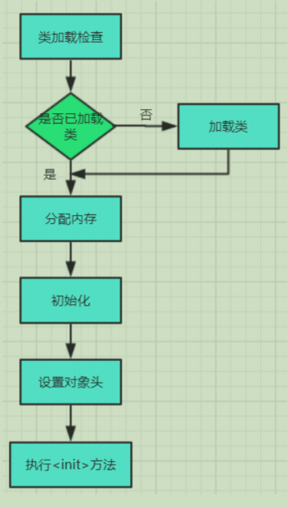
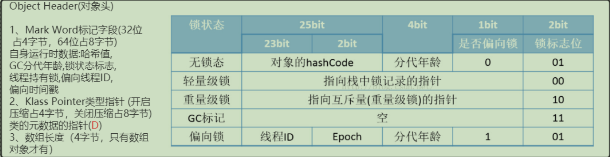

## 对象创建流程



### 类加载检查

在对象创建的过程中，是利用字节码new指令创建对象，首先会去判断这个指令参数是否在常量池中能否找到对应的符号引用，如果有则这个类已经被加载，如果没有则需类加载，new指令一般对应new关键词、对象clone、对象serializable

### 分配内存

如果类已经被加载了，则给新对象在堆中分配内存(不一定是在堆内存中的，也有可能是在栈上的，后面会介绍到)，此时会遇到一些问题，如何划分内存给对象？如何在并发环境下解决内存使用冲突的问题？

划分内存：

- 指针碰撞(Bump the Pointer)(默认)，如果Java堆中内存是规整的，则用指针划分内存中的空闲与占用区域，为对象分配内存就是让指针朝着空闲的区域移动对象大小的距离

- 空闲列表(Free List)，如果Java堆中内存不是规整的，空闲区域和占用区域相互交错，那么为对象分配内存的时候就会存在内存碎片的问题，那么计算机就必须维护一个空闲列表，当需要为新对象分配内存时，就需要从这个空闲列表上找到一个足够大的空间来存放对象并更新空闲列表的记录

并发解决：

- CAS(compare and swap)，JVM采用CAS失败重试的方式来保证更新操作的原子性来对分配内存空间的行为进行同步处理
- TLAB(Thread Local Allocation Buffer)，本地线程分配缓冲即在堆中的Eden区为每个线程分配一个线程独立的内存空间默认为Eden区的1%，对应JVM的vm options为-XX:+/-UserTLAB(默认开启-XX:+UserTLAB)，-XX:TLABSize指定TLAB的大小

### 初始化

所谓的初始化即对象分配完内存后，JVM需要将分配到的内存空间都初始化为默认值(不包括object header)，如果使用了TLAB，则可以提前至TLAB分配时执行，这样就可以使得实例对象不赋值就能访问到对象的默认值

### 设置对象头

这个得结合hotspot源码来理解，在32位(现在也有64位)的hotspot虚拟机中的对象内存分配布局主要分为3块：对象头(object header)、实例数据(instance data)、对齐填充(padding)(保证对象是8byte的证整数倍)



这里着重介绍下对象头

首先对象头的mark word字段(32位占4byte，64位占8byte)是根据锁状态来进行区分的，32位中的后三位和后两位决定了锁状态，对于无锁和偏向锁中间的四位决定了gc回收的分代年龄(一般为年轻代做复制算法分代年龄+1)，无锁态还包含对象的hashcode，偏向锁还包含偏向线程ID和偏向时间戳

其次对象头中还有一个klass pointer类型指针(你没有听错就是klass)，有个指针压缩的概念就是说把原来的8byte类型指针压缩为4byte，对于类型指针的深入理解可以举个栗子A a = new A()，那么这个a对象一般是存在堆内存中的，这个对象对应的klass pointer指向方法区的类元信息A.class(这个是C++实现的，方法区存的是A这个类的所有代码信息)，而在Java中的Class clazz = a.getClass()则是访问类元信息的一个入口(对应可以理解为反射)

对于是数组类型的对象才会在对象头中有数组长度为4byte大小

上图介绍的是32位的hotspot中的对象存储，那么针对于64位的对象是怎么样的呢，其实根据计算机原理32位的计算机(2^32^)可以最多存储大约4GB的对象，而现在的64位机器可以存储8G、16G、32G甚至更多的对象其实就是比2^32^多了1、2、3位，在mark word中其实就是体现为unused的位数

附加测试代码需引入
```xml
<dependency>
    <groupId>org.openjdk.jol</groupId>
    <artifactId>jol-core</artifactId>
    <version>0.9</version>
</dependency>
```

```java
public class TestObjectHeader {
    // -XX:+UseCompressedOops 默认开启的压缩所有指针
    // -XX:+UseCompressedClassPointers 默认开启的压缩对象头里的类型指针Klass Pointer
    // Oops : Ordinary Object Pointers

    public static void main(String[] args) {
        ClassLayout layout1 = ClassLayout.parseInstance(new Object());
        System.out.println(layout1.toPrintable());

        ClassLayout layout2 = ClassLayout.parseInstance(new int[]{});
        System.out.println(layout2.toPrintable());

        ClassLayout layout3 = ClassLayout.parseInstance(new A());
        System.out.println(layout3.toPrintable());
    }

    static class A {
        int a;
        byte b;
        String c;
        Object d;
    }
}
```

我们来分析最后一个A对象在64位机器中的存储
```
com.pog.jvm.TestObjectHeader$A object internals:
 OFFSET  SIZE               TYPE DESCRIPTION                               VALUE
      0     4                    (object header)                           01 00 00 00 (00000001 00000000 00000000 00000000) (1)
      4     4                    (object header)                           00 00 00 00 (00000000 00000000 00000000 00000000) (0)
      8     4                    (object header)                           65 cc 00 f8 (01100101 11001100 00000000 11111000) (-134165403)
     12     4                int A.a                                       0
     16     1               byte A.b                                       0
     17     3                    (alignment/padding gap)
     20     4   java.lang.String A.c                                       null
     24     4   java.lang.Object A.d                                       null
     28     4                    (loss due to the next object alignment)
Instance size: 32 bytes
Space losses: 3 bytes internal + 4 bytes external = 7 bytes total
```

前8byte是mark word标记字段，offset为8时的4byte是被压缩的类型指针(不开启压缩为8byte)，int类型占4byte，byte类型占1byte，这个byte会被自动对齐为4byte，String和Object类型是引用类型，都是被压缩的类型指针，各占4byte，至此共有28byte，根据padding规则对齐为32byte

那么问题来了为什么要在64位的机器中使用32位的指针压缩？首先我的回答是内存占用，64位肯定占的内存多呀，使用较大的指针在主内存和缓存之间移动数据时会占用较大的带宽，同时gc也会承受更多的压力，此外32位的机器最大支持4G内存，使用指针压缩编码和解码的方式就可以用32位地址来支持更大的内存，堆内存小于4G时不使用指针压缩，JVM会直接用低位取址，堆内存大于32G时指针压缩失效，采用64位寻址

### 执行init方法

执行`<init>`方法可以理解为构造方法，与初始化不同，比如初始化是给属性默认值，而这里是给属性赋予我们所指定的值，比如下例，age默认值为0，指定值为18

```java
private Integer age=18;
```

