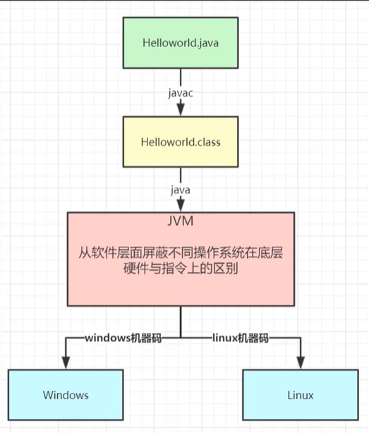
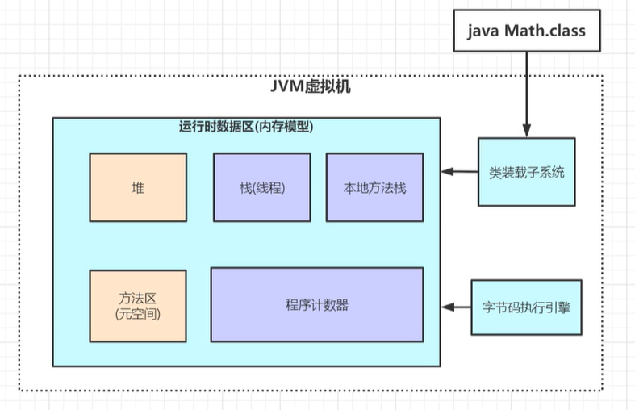
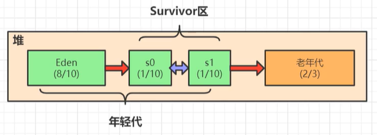

## JVM整体架构



一般我们写的java文件经过`javac`编译之后会生成class类文件，当我们想要运行这些类文件的时候，再用`java`命令调用，这时候在不同操作系统的机器上就要用JVM来进行底层的区别

## JVM内存模型



JVM内存模型(JDK8)的核心分为这五个区域，堆heap、线程栈jvm stacks、本地方法栈native method stacks、方法区、程序计数器Program Counter Register，字节码执行引擎可以控制程序计数器的动态变化，并在方法区执行字节码文件，还可以执行gc回收，图中浅紫区域的方块每个线程都有一份

- 虚拟机栈
  - 当main函数调用时会开启一个主线程，在这个主线程内部开辟一个栈空间用来存放各种栈帧(调用的方法)，比如main线程内调用main方法，main方法入栈作为底部的栈帧，然后main方法里调用secondary方法、secondary栈帧入栈，这类似于数据结构中栈的FILO结构，当secondary方法完成调用时出栈，回到main方法后main方法完成出栈

- 栈帧的内部有
  - 局部变量表(数组结构)：一般0索引位置代表调用这个方法的对象this，另外如果在main栈帧内部创建一个对象，这个对象引用存在main栈帧的局部变量表中，对象实例存在堆内存中，当有多个对象时则栈与堆形成了对应的关系
  - 操作数栈(栈结构)：一般存值的过程是通过JVM指令将值入栈、出栈，再将值存入局部变量表的局部变量中，用值时候在从局部变量表中加载入栈...这一系列的过程都是通过JVM指令来完成的，可以下载参考[JVM指令手册](https://wwe.lanzous.com/irC8Re552ja)，操作数栈可以理解为方法运行时计算的中转站
  - 方法出口：main方法执行到调用secondary方法时，程序会去执行secondary，此时记录此时位置(即方法出口)，当secondary方法执行完毕时回到这个位置继续执行main方法
  - 动态链接：简单理解为定义方法时的方法名的符号引用指向了方法区对应方法代码块的内存地址，即执行特定方法时动态地找到了对应的方法

> StackOverFlowError 线程请求深度大于JVM允许深度

> OutOfMemory(OOM) 虽然虚拟机栈空间可动态扩展，但超出时发生异常

- 堆



> 首先了解下gcroot的概念，gcroot的根节点可以为线程栈的局部变量、方法区的静态变量、本地方法栈的变量等，利用可达性算法从gcroot出发标记所有直接或间接引用的对象为非垃圾对象

堆内存中主要分为伊甸园(Eden)、存活者区(Survivor)、老年代(old)

堆中eden区满了会触发minor gc，非垃圾对象会被用复制算法复制到s0区，然后eden区的全部清除，然后继续向eden区放入对象，触发minor gc后会将非空的s0和eden区做gc回收，还在gc链上的对象任然是用复制算法复制到s1区，然后清空s0和eden区，然后继续向eden区放入对象，然后会将非空的s1区和eden区再做gc回收...按照一定的规则一直存活的对象最终将会被放入old区

```java
public static void main(String[] args){
    List<User> list = new ArrayList<>();
    while(true){
        list.add(new User());
    }
}
```

上述程序list这个引用是线程中的局部变量，也是gcroot，它的gc链一直被标记且不断加入对象，即便old区满了触发full gc也不会被回收，从而导致OOM

gc回收时会触发STW(stop the world)，这个设计是必须的，即在进行gc回收时字节码执引擎开启的后台gc线程会使用户线程停止(用户会略微感到卡顿)，假如在gc回收时不停止用户线程，那么原来的用户线程局部变量作为gcroot在线程执行完成后被释放，对应原来gc链上的所有直接或间接引用对象变为垃圾对象，gg

Objet对象有对象头，有个属性是分代年龄，每执行一次复制算法分代年龄+1，到达15时放入old区，这是会被放入old区的一种规则

动态年龄判断机制：一般是在minor gc触发后判断一批对象总大小是否大于当前存放对象的s区的内存大小的50%，如果是那么会将s区中年龄大于这批对象最大年龄的对象直接扔进old区，主要是希望存活时间较长的对象尽早进入old区

- 方法区

JDK8之前叫永久代，之后叫做元空间，JDK8之后是操作直接内存，方法区内容一般会存常量、静态变量、类信息等，例如类中的一个静态变量引用指向了一个new出来的对象，这个静态引用是在方法区的，new出来的对象是在堆内存中的，则方法区和堆形成了对应的关系

- 本地方法栈

区别java和其他语言的标识(JVM执行的Java方法是字节码)，一般为c或c++编写的底层native方法，这块区域是专门为本地方法调用所分配的内存空间


- 程序计数器

因为程序运行时可能是多线程的，多线程之间会互相抢夺时间片，假设当前线程正在运行时，突然资源被抢，这时就会记录当前代码未运行的位置然后挂起，然后去执行优先级更高的线程，当回到原来的线程时，从记录的位置继续运行，这个记录的未来将会执行的位置体现在利用javap -c反编译字节码文件的顺序中，可自行了解

## JVM内存参数设置

例如
```
java ‐Xms2048M ‐Xmx2048M ‐Xmn1024M ‐Xss512K ‐XX:MetaspaceSize=256M ‐XX:MaxMetaspaceSize=256M ‐jar test.jar
```

其中堆中有-Xms最小堆内存，-Xmx最大堆内存，-Xmn新生代内存空间

方法区中有-XX:MaxMetaspaceSize最大元空间，默认-1不限制(但受限于物理内存)，-XX:MetaspaceSize为触发full gc的阈值，默认21M，采用动态扩容机制，即回收垃圾少阈值变大，回收垃圾多阈值变小

栈中-Xss为每个线程中栈的最大内存空间，理论上这个空间越小，JVM能开启的线程数越多