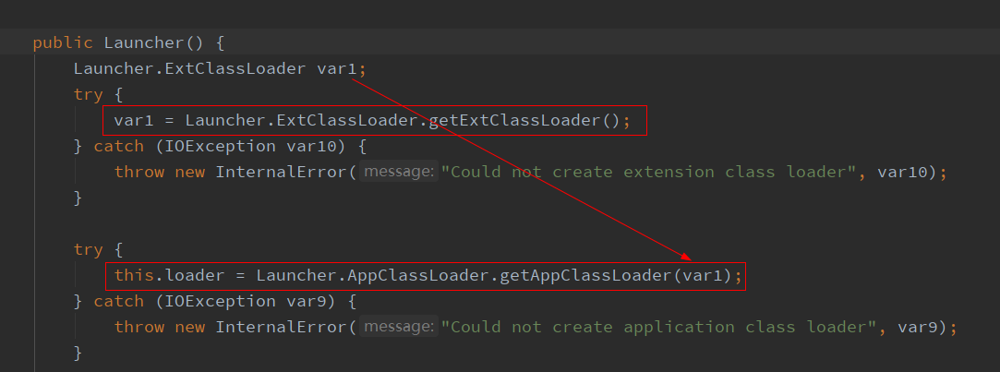

> 双亲委派源码分析

## 整体流程


从流程图分析，当我们用java执行代码时，java.exe调用底层jvm.dll库文件创建jvm，创建出一个引导类加载器，这是由navtive方法实现的(hotspot的底层实现)，然后C++又会调用java代码创建JVM启动器，其核心为sun.misc.Launcher这个类，调用这个类的getLauncher()方法为单例模式，构造实例对象时会在内部创建ExtClassLoader和AppClassLoader，然后就会执行两个重要的方法loadClass和findClass，完成加载的过程

## 类加载的过程


一般分为几个步骤

加载：只有通过IO读取字节码时类才会被加载，比如调用类的静态方法和new对象等，在加载的过程中在内存中生成一个java.lang.Class对象，作为方法区中这个类的各种数据的访问入口，且加载模式为懒加载(用到时才加载)，只是声名变量是不会加载类的

验证：class字节码文件的开头有cafe babe标识，JVM会去验证字节码文件的正确性

准备：为类的静态变量分配内存，赋予类型默认值(常量final直接赋值)

解析(静态链接)：注意，这个在类加载的过程中完成的，比如静态方法main()，main作为java中的符号字面量是存在常量池Constant Pool中的，在类加载的过程中会将这个符号引用转变为对应方法区定义main方法的直接引用，而动态链接则是在程序运行的过程中调用的方法完成符号引用到直接引用的转变

初始化：给类的静态变量赋予指定值并执行静态代码块(从这里不难看出一个类如果有静态代码块时，new这个类时肯定先执行static{}，然后再去执行构造方法，这样才符合先加载类后构造的逻辑)

补充：类被加载到方法区后包含运行时常量池，类信息，字段信息，方法信息，类加载器的引用(加载这个类的类加载器对象)，对应class实例的引用(比如new出来的对象在heap中的地址)

## 类加载器的分类

- 引导类加载器：加载JVM运行的jre下的lib下的核心类库，如rt.jar、charsets.jar

```java
System.out.println(String.class.getClassLoader());
// null
```

- 扩展类加载器：加载JVM运行的jre下的lib下的ext下的jar包

```java
System.out.println(com.sun.crypto.provider.DESKeyFactory.class.getClassLoader());
// sun.misc.Launcher$ExtClassLoader
```

- 应用程序类加载器：加载ClassPath路径下的类包，即自我实现的类

```java
System.out.println(Test.class.getClassLoader());
// sun.misc.Launcher$AppClassLoader
```

- 自定义类加载器：加载用户自定义路径下的类包

注意，因为引导类加载器的底层是C++写的，所以获取加载核心库的引导类加载器打印值为null

所有的这些类加载器的终极父类都是ClassLoader，其中有个属性为ClassLoader parent

```java
ClassLoader systemClassLoader = ClassLoader.getSystemClassLoader();
ClassLoader extClassLoader = systemClassLoader.getParent();
ClassLoader bootStrapClassLoader = extClassLoader.getParent();
System.out.println("appClassLoader: " + systemClassLoader);
System.out.println("extClassLoader: " + extClassLoader);
System.out.println("bootStrapClassLoader: " + bootStrapClassLoader);
// appClassLoader: sun.misc.Launcher$AppClassLoader
// extClassLoader: sun.misc.Launcher$ExtClassLoader
// bootStrapClassLoader: null
```

## 类加载器的初始化过程

sun.misc.Launcher初始化时使用饿汉式单例模式，Launcher类构造方法内创建了两个类加载器



这里奠定了双亲委派的基础，即AppClassLoader的parent是ExtClassLoader，ExtClassLoader的parent是null


## 双亲委派机制


一般不用自定义类加载器，从应用程序类加载器出发，向上委托双亲，比如若是扩展类加载器在自己的类加载路径下找不到指定类就委托给引导类加载器寻找指定类，若是引导类加载器的核心库没有指定类，则会由子加载器自己加载

源码分析：假设一个用户自己写的类的加载过程，其中在向上委托的过程中最核心的代码为各种类加载器调用终极父类的loadClass方法，这个方法中首先判断目标类是否已被加载(findLoadedClass方法)，如果加载过了，直接返回，如果未加载，则调用应用程序类加载器的parent属性即扩展类加载器的loadClass方法，findLoadedClass方法如果任未找到目标类，此时扩展类加载器的parent属性为null，执行findBootstrapClassOrNull方法(本地方法)，如果返回为null，当前所在的类加载器为扩展类加载器，执行findClass方法(这个是在URLClassLoader中的方法)，如果未找到返回null，再出去执行应用程序类加载器的findClass方法，找到了！！！

## 双亲委派的设计初衷

这样向上委托向下自查的设计的原因是因为加载类的时候首先会判断这个类是否已经被加载过，如果加载过则不需要再加载，如果采用自上而下的加载模式则会浪费加载的性能，且这种双亲委派的模式可以防止核心库被篡改，因为只有引导类加载器才能加载核心库，还可以避免重复加载，向上委托的加载器如果已经加载了目标类则子加载器无需重复加载

## 全盘负责委托机制

这个机制指的是一个ClassLoader如果装载了一个类，那么这个ClassLoader也会去加载这个类所依赖的类，除非依赖的类是被指定的类加载器加载的

## 突破双亲的限制

双亲委派的核心是有parent这个ClassLoader类型的属性去调用loadClass方法，自定义突破类加载器在继承ClassLoader这个类重写loadClass方法时，去掉

```java
if(parent != null){
    c = parent.loadClass(name);
} else {
    c = findBootstrapClassOrNull(name);
}
```

即不给双亲委派加载，在重写的过程中要注意，有的类出于沙盒安全考虑是必须要交给双亲委派加载的，只需要加上前置判断即可，可以理解为只有自己自定义的类才不向上委托

## Tomcat的自定义类加载器

tomcat内部其实就是打破了双亲委派的机制，为了实现war包之间多版本的隔离


对于JSP文件，最终得用它生成的class文件在JVM中运行，但程序运行后修改JSP是不会重新加载的，此时就应该将原来的JSP类加载器先卸载，重新创建类加载器加载JSP文件实现热加载

从Tomcat的类加载机制上不难看出，Tomcat这个web容器中可以包含多个应用程序，这些应用程序是相互隔离的，依赖的版本不会互相影响

注意：同一个JVM中可以存在两个相同包名和类名的类对象，因为他们的类加载器可以不一样

