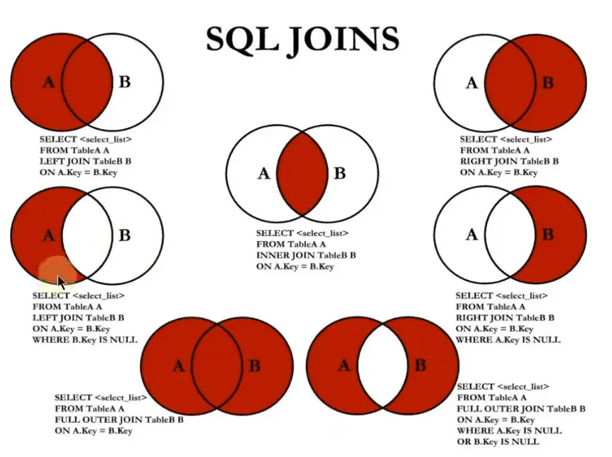

## 概述
+ 持久化persistence：把数据保存到可掉电式存储设备中以供之后使用，即将内存中的数据持久化到存储介质（数据库、磁盘文件、XML数据文件）
+ DB（database）：数据库，包含表table，表里包含行row（记录record）、列column（字段field）
+ DBMS（database management system）：数据库管理系统，[DBMS排名](https://db-engines.com/en/ranking)
+ SQL（structured query language）：结构化查询语言
+ RDBMS（relational DBMS）：优势是复杂查询、事务支持
+ 非RDBMS：传统型RDBMS的阉割版，性能高成本低，和NoSQL对应
    - 键值型DB：Redis，使用场景为内存缓存
    - 文档型DB：MongoDB、CounchDB，使用场景为存取文档
    - 搜索引擎DB：Elasticsearch、Solr、Splunk，针对RDBMS全文索引效率低的问题设计，核心原理为倒排索引，使用场景为搜索引擎
    - 列式DB：HBase，使用场景为分布式文件系统，优点是大量降低系统IO，缺点是功能有限
    - 图形DB：Neo4J、InfoGrid，使用场景为社交网络
+ E-R model（entity-relationship model）：实体-关系模型（对应java的ORM object relational mapping），一个实体集（class）对应一个表，一个实体（instance）对应一行，一个属性（attribute）对应一列
+ 表与表的关系：一对一（one-to-one），一对多（one-to-many），多对多（many-to-many），自我引用（self reference）

## 环境搭建
+ 版本区别
    - MySQL Community Server社区版本：开源免费
    - MySQL Enterprise Edition企业版本：付费
    - MySQL Cluster集群版：开源免费，可基于社区版或企业版架设集群，将几个MySQL Server封装成一个Server
    - MySQL Cluster CGE高级集群版：付费
+ 卸载MySQL：`Windows`
    - 停止MySQL服务：`cmd`->`services.msc`找到MySQL服务名，右键停止
        * 或使用命令行`net stop MySQL服务名`停止服务，`net start MySQL服务名`为启动服务（可能需要以系统管理员身份）
    - 通过控制面板、安装器都可以卸载，会自动删除服务列表里的服务
        * 使用安装器卸载的过程中可以勾选移除数据目录、卸载安装器
        * 曾经安装过mysql5版本或是解压缩版，服务不会自动删除，可使用命令行`sc delete MySQL服务名`手动删除服务
    - 确保文件目录删除：安装目录、数据目录，如果自定义过目录需要找到并删除，注意数据的备份
    - 确保清理注册表：`regedit`
        * `HKEY_LOCAL_MACHINE\SYSTEM\CurrentControlSet\Services\MySQL相关目录`
        * `HKEY_LOCAL_MACHINE\SYSTEM\CurrentControlSet\Services\EventLog\Application\MySQL相关目录`
        * `HKEY_LOCAL_MACHINE\SYSTEM\ControlSet001\Services\MySQL相关目录`
        * `HKEY_LOCAL_MACHINE\SYSTEM\ControlSet001\Services\EventLog\Application\MySQL相关目录`
            + 注意：不一定是ControlSet001，可能是ControlSet002、ControlSet003等
            + 注意：MySQL相关目录指的是与MySQL服务名相关的目录或以MySQL开头的目录
    - 删除环境变量：`cmd`->`sysdm.cpl`->高级->环境变量->在用户或系统变量的`path`找到mysql并删除
+ 安装方式1：通过安装器
    - [msi下载地址](https://downloads.mysql.com/archives/installer/)，下载文件大小较大的安装器，版本选择`8.0.26` `5.7.34`
    - 安装流程：`8.0.26` `Windows`
        * 选择安装类型`Custom`
        * 选择产品`MySQL Servers/MySQL Server/MySQL Server 8.0/MySQL Server 8.0.26 - X64`，选中添加的产品点击`Advanced Options`，选择自定义安装目录和数据目录（不能包含中文和中文的空格），也可以使用默认路径
        * 一直下一步进入配置界面，配置类型选择`Development Computer`，可以自定义Port端口号（默认为3306）
        * 推荐认证方法为强密码加密（基于SHA-256），还可以选择遗产认证方法（使用mysql5的认证方式）
        * 为`root`用户设置密码，简单设置为`root`，下方还可以添加用户
        * 设置服务名MySQL80，其他默认然后结束安装
        * 此时如果安装`5.7.34`会提示更新，取消勾选然后点击cancel，再add进入安装流程，产品选择64位，端口自定义为13306，设置服务名为MySQL57，和8.0的区别是没有认证方法，其他都一样
    - 配置环境变量：将安装目录的bin目录配置进`path`
+ 安装方式2：通过压缩包
    - [压缩包下载地址](https://downloads.mysql.com/archives/community/)，下载文件大小较小的zip包，版本选择`8.0.26` `5.7.34`
    - 安装流程：`8.0.26` `Windows`
        * 解压到指定目录，配置环境变量，在安装目录中新建`my.ini`文件
        * 以管理员开启`cmd`，cd进安装目录的bin目录
            + 以非安全模式初始化`mysqld --initialize-insecure --user=mysql`等待执行完成（生成data内的文件，登入免密）
            + 安装服务指定服务名`mysqld -install MySQL80`，启动服务`net start MySQL80`
            + 设置root账户密码`mysqladmin -uroot -P3306 password root`
        * `5.7.34`安装流程类似，只需要修改环境变量、字符集、端口号、安装目录、数据目录、服务名、设置密码

```plain
# default-character-set相当于同时设置了client、connection、results字符集
# character-set-server相当于同时设置了server、database字符集
# mysql5.7中字符集统一改为utf8
[client] # 作用于所有mysql客户端
default-character-set=utf8mb4
[mysql] # 作用于命令行客户端
default-character-set=utf8mb4
[mysqld] # 作用于服务端
port=3306 # 端口号
basedir=D:\env\mysql\mysql-8.0.26-winx64 # 安装目录
datadir=D:\env\mysql\mysql-8.0.26-winx64\data # 数据目录
max_connections=100 # 最大连接数
character-set-server=utf8mb4
default-storage-engine=INNODB # 默认存储引擎
```

+ 忘记密码重置
    - 先停止服务，以管理员开启`cmd`，cd到安装目录的bin目录
    - `mysqld --defaults-file="my.ini文件路径" --shared-memory --skip-grant-tables`
        * 如果安装目录有`my.ini`文件就不用加`--defaults-file`
        * 卡住是正常的表示服务启动了，这是一个守护进程，只不过是跳过了鉴权
    - 新开`cmd`，免密登入
    - `flush privileges;`
    - `alter user 'root'@'localhost' identified by 'root';`
    - 中断前面的守护进程(ctrl+c)，然后重开服务
+ 修改密码方式汇总
    - `set password for 'root'@'localhost' = '新密码';`
    - `alter user 'root'@'localhost' identified by '新密码';`
    - 无需登入`mysqladmin -u root -p旧密码 password 新密码`
    - 无需登入`mysql_secure_installation` `输入旧密码` `n` `y` `输入新密码` `重复输入新密码` `n` `n` `n` `y`
    - 只有mysql5可用
        * `set password for 'root'@'localhost' = password('新密码');` 
        * `use mysql;` `update user set authentication_string=password('新密码') where user='root';` `flush privileges;`
+ 安装失败问题汇总
    - 缺少环境支持：`.Net Framework` `Microsoft Visual C++` `MSVCP.dll`
    - 安装目录、数据目录、自定义的目录、注册表没删干净
    - 使用安装方式2提示xxx data is unusable，需要先停止服务，删除安装目录的data文件夹然后重新初始化
+ mysql登入方式：需确保服务开启
    - 如果是安装方式1，可用`MySQL Command Line Client`，但默认只有root账户
    - 命令行`mysql -h 主机名或ip地址 -P 端口 -u 用户 -p密码`，除了`-p`后不能带空格其他的都可带可不带，`-p`放最后位置，建议`-p`后换行输入密码
    - 图形界面管理工具登入
+ 简单命令
    - 查看版本：命令行`mysql -V` `mysql --version` `mysqladmin --version`，或命令行登入后`select version();`
    - 退出登陆：`quit;` `exit;`
    - 查看所有数据库：`show databases;`，以下是MySQL系统自带的数据库
        * `information_schema`：保存MySQL数据库服务器的系统信息，如数据库名、表名、列名、存取权限、数据文件所在的文件夹和系统使用的文件夹等
        * `performance_schema`：可以用来监控MySQL的各项性能指标
        * `sys`：以一种更容易理解的方式展示MySQL的各项性能指标
        * `mysql`：保存了MySQL运行时需要的系统信息，比如数据文件夹、当前使用的字符集、约束检查信息等
    - 使用/切换数据库：`use 数据库名;`，某些操作的前置操作，如果没有可以通过`数据库名.表名`的方式临时使用
    - 查看数据库结构：`show create database 数据库名;` `show create database 数据库名\G`
    - 查看当前使用的数据库：`select database() from dual;`
    - 查看所有表和视图：`show tables;` `show tables from 数据库名;`
    - 查看表或视图结构： `desc 表名或视图名;` `describe 表名或视图名;`
    - 查看表的详细定义信息：`show create table 表名;` `show create table 表名\G`
    - 查看字符集和比较规则：`show variables like 'char%';show variables like 'coll%';`
    - 查看mysql支持的字符集：`show charset;` `show character set;`
        * Maxlen表示该字符集一个字符最多需要几个字节
+ 字符集相关
    - 字符集
        * 服务运行时可临时设置`SET NAMES 字符集名;`，等价于把character_set_client、character_set_connection、character_set_results一起设置
        * mysql中utf8字符集指向的是utf8mb3字符集（mysql里可以视为相同）
            + utf8mb3表示一个字符最多使用3个字节表示，阉割版utf8
            + utf8mb4表示一个字符最多使用4个字节表示，正宗的utf8，可以存储一些emoji表情
        * character_set_client：服务器解码请求字节串时使用的字符集
        * character_set_connection：将请求字符串编码为字节串时使用的字符集
        * character_set_results：将匹配的列值编码为字节串时使用的字符集
        * character_set_database：数据库级别的字符集，mysql5默认latin1，8默认utf8mb4
        * character_set_server：服务器级别的字符集，mysql5默认latin1，8默认utf8mb4
        * character_set_filesystem：文件系统字符集，默认binary，无需修改
        * character_set_system：数据库系统使用的字符集，5默认utf8，8默认utf8mb3，无需修改
        * character_sets_dir：字符集目录
    - 比较规则：随字符集变化，也可手动指定
        * 后缀表示是否区分重音、大小写，后缀_bin表示以二进制方式比较
        * collation_connection：对应character_set_connection
        * collation_database：对应character_set_database，5默认latin1_swedish_ci，8默认utf8mb4_0900_ai_ci
        * collation_server：对应character_set_server，5默认latin1_swedish_ci，8默认utf8mb4_0900_ai_ci
    - mysql5出现中文乱码问题：修改`my.ini`（linux中`vim /etc/my.cnf`）添加`character_set_server=utf8`，建议使用高级文本编辑器，防止出现文件包含BOM头导致服务重启失败，重启服务后，需要通过`ALTER`修改原表或原库的字符集，或删除重建，因为配置只对新建有效
        * 注意：如果原数据为非utf8编码，数据本身编码不变，此时数据需要导出或删除，然后重新插入，所以需要考虑修改前后编码的兼容性，一般需要修改后的编码兼容修改前的
    - mysql中创建结构时如果未指定字符集，则向上层结构查找，顺序为`列->表->库->服务器`
    - 请求到响应过程中字符集变化
        * 客户端发送请求：一般客户端和OS的字符集一致，windows默认gbk，unix默认utf8，可视化工具可能会使用自定义字符集来编码发送到服务端的字符串，而不使用OS的默认字符集，所以尽量用命令行测试，这里客户端使用utf8，编码字符串`'我'`变为字节串`0xE68891`，发送到服务端
        * 服务端处理请求
            + character_set_client为utf8，解码`0xE68891`变为`'我'`
            + 设置character_set_connection为gbk，编码`'我'`变为`0xCED2`
            + 表中对应列的字符集假设也为gbk，列中找到字节串`0xCED2`，然后解码`0xCED2`变为`'我'`
            + character_set_results为utf8，编码`'我'`变为`0xE68891`
        * 服务端响应请求：服务端把字节串`0xE68891`发送给客户端，客户端用utf8解码得到`'我'`
+ 图形界面管理工具
    - MySQL WorkBench（GUITOOL）：分为社区版MySQL WorkBench OSS和商用版MySQL WorkBenchSE
    - SQLyog、phpMyAdmin、MySQLDumper、MySQL ODBC Connector
    - Navicat Preminum、dbeaver
+ 图形界面管理工具连接出错解决方式
    - 升级版本
    - 还原加密规则，MySQL8.0之前使用加密规则是mysql_native_password，之后的加密规则是caching_sha2_password
        * `use mysql;`
        * `alter user 'root'@'localhost' identified with mysql_native_password by 'root';`
        * `flush privileges;`
+ linux的mysql
    - 准备`VMware16` `CentOS7` `MobaXterm`
        * 需要设置静态ip，重置网络`systemctl restart network`，重启`reboot`
        * 设置->隐私->自动锁屏关闭
        * 可设置背景、锁屏图，终端字体大小颜色
    - 完整克隆虚拟机需要修改的内容
        * mac地址：虚拟机网络适配器中->高级->MAC地址生成
        * 主机名：`vim /etc/hostname`
        * ip地址、UUID：`vim /etc/sysconfig/network-scripts/ifcfg-ens33`，重置网络
    - mysql卸载
        * 关闭服务`systemctl stop mysqld`
        * 查看旧安装：`rpm -qa|grep -i mysql`或`yum list installed|grep mysql`
        * 卸载所有旧安装`yum remove mysql-xxx`
        * 删除mysql相关文件
            + 查找相关文件`find / -name mysql`
            + 删除所有相关文件`rm -rf xxx`
        * 删除mysql配置文件`rm -rf /etc/my.cnf`
    - mysql安装
        * 可以选择rpm、yum、编译安装源码包等方式，这里选择rpm
        * [tar包下载地址](https://downloads.mysql.com/archives/community/)，选择产品版本`8.0.25` `5.7.34`，OS选择`Red Hat Enterprise Linux / Oracle Linux`，OS版本选择`Red Hat Enterprise Linux 7 / Oracle Linux 7（x86，64-bit）`，下载`RPM Bundle`
        * 准备
            + mysql安装中会在`/tmp`目录下新建`tmp_db`文件，需授权`chmod -R 777 /tmp`
            + 检查依赖`rpm -qa|grep libaio` `rpm -qa|grep net-tools`，如果不存在需要安装
        * 安装过程
            + 安装中可能报错需删除依赖`yum remove mysql-libs`
            + 把需要的安装程序拷贝到`/opt`，必须按顺序执行
                - `rpm -ivh mysql-community-common-8.0.25-1.el7.x86_64.rpm`
                - 5.7没有`rpm -ivh mysql-community-client-plugins-8.0.25-1.el7.x86_64.rpm`
                - `rpm -ivh mysql-community-libs-8.0.25-1.el7.x86_64.rpm`
                - `rpm -ivh mysql-community-client-8.0.25-1.el7.x86_64.rpm`
                - `rpm -ivh mysql-community-server-8.0.25-1.el7.x86_64.rpm`
            + 查看版本`mysql -V`
            + 查看安装`rpm -qa|grep -i mysql`
            + 无密码服务初始化`mysqld --initialize-insecure --user=mysql`
            + mysql状态
                - 启动`systemctl start mysqld`
                - 关闭`systemctl stop mysqld`
                - 重启`systemctl restart mysqld`
                - 查看状态`systemctl status mysqld`
                - 查看进程`ps -ef|grep -i mysql`
                - 查看服务是否开机自启动`systemctl list-unit-files|grep mysqld`
                    * 默认是`enabled`
                    * 如果不是`enabled`可执行`systemctl enable mysqld`
                    * 如果想开机禁用可执行`systemctl disable mysqld`使其变为`disabled`
    - mysql登录
        * `mysql -uroot -hlocalhost -P3306 -p`无密码
        * 修改密码`ALTER USER 'root'@'localhost' IDENTIFIED BY 'root';`
        * 可使用`MobaXterm`连接虚拟机后登陆mysql
        * `SQLyog` `Navicat`连接失败，因为mysql默认只支持`localhost`，解决方案如下
            +  先确认网络
                - `ping ip地址`
                - `telnet ip地址 端口号`需要开启Telnet客户端
                - 关闭防火墙
                    * centos6临时停止`service iptables stop`
                    * centos7临时停止`systemctl stop firewalld`
                        + centos7开机禁用`systemctl disable firewalld`
                - 不关闭防火墙时检查开放端口
                    * 查看所有开放端口`firewall-cmd --list-all`
                    * 添加一个开放端口`firewall-cmd --add-port=3306/tcp --permanent`
                    * 重启防火墙`firewall-cmd --reload`
            + mysql内执行
                - `use mysql;`
                - `select Host,User from user;`
                - `update user set host = '%' where user ='root';`
                - `flush privileges;`
                - 如果是mysql8还需要`ALTER USER 'root'@'%' IDENTIFIED WITH mysql_native_password BY 'root';` `flush privileges;`
    - 安全策略
        * mysql8之前使用validate_password插件
            + 方式1：修改配置文件，必须重启服务才能启用
            + 方式2：运行时安装插件（推荐）
                - 安装`INSTALL PLUGIN validate_password SONAME 'validate_password.so';`
                - 卸载`UNINSTALL PLUGIN validate_password;`
        * mysql8引入组件特性，重构了validate_password，可以运行时安装组件，原来的插件方式也可以用
            + 安装`INSTALL COMPONENT 'file://component_validate_password';`
            + 卸载`UNINSTALL COMPONENT 'file://component_validate_password';`
            + 查看组件`SELECT * FROM mysql.component;`
        * 查看系统变量`show variables like 'validate_password%';`
        * 修改`SET GLOBAL validate_password_xxx = xxx;`
        * 密码强度测试`SELECT VALIDATE_PASSWORD_STRENGTH('密码');`，如果没有安装validate_password组件或插件则永远为0
            + 0：长度小于4
            + 25：长度大于4，小于validate_password_length
            + 50：满足等级LOW
            + 75：满足等级MEDIUM
            + 100：满足等级STRONG

```plain
[mysqld]
# 如果是在windows系统的my.ini则后缀名为dll
plugin-load-add=validate_password.so
# 四个值 ON/OFF/FORCE/FORCE_PLUS_PERMANENT
# 设置为FORCE_PLUS_PERMANENT可以防止服务运行时插件被卸载，如果卸载则报错
validate-password=FORCE_PLUS_PERMANENT
```

| 变量 | 默认值 | 描述 |
| --- | --- | --- |
| validate_password_check_user_name | mysql8默认ON，mysql5默认OFF | 是否可将密码设置为当前用户名 |
| validate_password_dictionary_file | | 检查密码的字典文件的路径名 |
| validate_password_length | 8 | 密码的最小长度 |
| validate_password_mixed_case_count | 1 | 密码具有的小写和大写字符的最小数量 |
| validate_password_number_count | 1 | 密码必须包含的数字个数 |
| validate_password_policy | MEDIUM | 密码强度检验等级，可使用数值或字符串形式指定<br/>0 LOW：只检查长度<br/>1 MEDIUM：检查长度、数字、大小写、特殊字符<br/>2 STRONG：检查长度、数字、大小写、特殊字符、字典文件 |
| validate_password_special_char_count | 1 | 密码必须包含的特殊字符个数 |


## SQL
+ 分类
    - DDL：data definition language 数据定义语言，如`CREATE` `DROP` `ALTER` `RENAME` `TRUNCATE`
    - DML：data manipulation language 数据操作语言，如`INSERT` `DELETE` `UPDATE`
    - DCL：data control language 数据控制语言，如`GRANT` `REVOKE`
    - DQL：data query language 数据查询语言，`SELECT`
    - TCL：transaction control language 事务控制语言，`COMMIT` `ROLLBACK` `SAVEPOINTS`
+ SQL的大小写
    - mysql在windows环境不区分大小写
    - mysql在linux环境区分大小写
        * 库名、表名、表别名、变量名严格区分大小写
        * 关键字、函数名、列名、列别名不区分大小写
    - 查看`SHOW VARIABLES LIKE 'lower_case_table_names';`
        * 0：大小写敏感
        * 1：大小写不敏感，创建的表、库是小写形式，查找都是转换为小写
        * 2：大小写不敏感，创建的表、库是原样形式，查找都是转换为小写
    - 修改（一般不需要改）
        * mysql5：以linux环境为例，`vim /etc/my.cnf`->`[mysqld]`->`lower_case_table_names=1`，重启服务
        * mysql8：以linux环境为例，停止服务->`rm -rf /var/lib/mysql`->`vim /etc/my.cnf`->`[mysqld]`->`lower_case_table_names=1`->启动服务
        * 服务重启或启动前需要将原表名、原库名都转换为小写，否则查找不到
+ SQL的mode
    - 5.7默认严格模式，5.6默认宽松模式
    - 查看
        * `select @@session.sql_mode;`
        * `select @@global.sql_mode;`
        * `show variables like 'sql_mode';`
    - 修改
        * 全局`SET GLOBAL sql_mode = 'modes...';`
        * 会话`SET SESSION sql_mode = 'modes...';`
        * 永久：配置文件->`[mysqld]`->`sql_mode`->重启服务
        * 生产环境一般采用`临时+永久`方式设置
+ 规则
    - 可以写在一行也可以多行，为了提高可读性，各子句分行写，必要时使用缩进
    - 分隔符Delimiter：每条命令结束的符号
        * 默认分隔符为`;`
        * `\g`效果和`;`一样
        * `\G`只在命令行有效，表示把查询出的每行记录都纵向显示
    - 关键字不能缩写和分行
    - 标点符号如`()`、`''`、`""`等必须成对出现，标点符号必须使用英文半角
    - 字符串和日期时间类型的数据尽量使用`''`包围，尽量大小写敏感
    - 列别名，尽量使用`""`包围，而且不建议省略`AS`(但开发中一般都省略)
    - 命名规则
        * 数据库名、表名不得超过30个字符，变量名限制为29个
        * 只能包含A-Z、a-z、0-9、_这63个字符
        * 数据库名、表名、列名等中间不要包含空格，且同层次的不能同名
        * 保证列名不能和关键字、保留字、数据库系统、常用方法的名字冲突，如果坚持使用必须要用着重号包围
        * 保证列名和列的数据类型一致防止在多表中错乱
+ 规范
    - 库名、表名、表别名、列名、列别名都小写
    - 关键字、函数名、变量名都大写
    - SQL语句以`;`结尾
+ 注释
    - `#abc`单行注释（mysql特有）
    - `-- abc`单行注释（--后面必须带一个空格）
    - `/* abc */`多行注释
+ 数据导入
    - 命令行登入后`source d:\test.sql`
    - 图形化界面管理工具导入sql脚本
+ SQL92/SQL99
    - mysql不支持SQL92语法但支持SQL99语法
+ SQL顺序
    - 声明顺序：`SELECT` `DISTINCT` `FROM` `JOIN` `ON` `WHERE` `GROUP BY` `HAVING` `ORDER BY` `LIMIT`
    - 执行顺序：`FROM` `ON` `JOIN` `WHERE` `GROUP BY` `HAVING` `SELECT` `DISTINCT` `ORDER BY` `LIMIT`

## DQL
+ 伪表`dual`：`SELECT 1 + 1, 2 * 2 FROM dual;`
+ 生产环境下不推荐使用`SELECT *`进行查询因为使用通配符`*`（表示匹配所有数据）会将那些可能不需要的数据都查出来效率低
+ `AS`（alias）：这个关键字可省略
    - 定义的别名最好加上`""`防止别名中包含空格，如`salary * 12 AS "annual sal"`
    - mysql中别名可以用`''`包围但不符合SQL规则，mysql中字符串和日期时间类型的数据可以用`""`包围但也不符合SQL规则，mysql中字符串里的大小写是不敏感的但不符合SQL规则
+ `DISTINCT`：去重，需要放到所有列名前面，如果是多个列名则是组合去重
+ 空值参与运算
    - 如果没有非空约束、默认值约束则所有类型的默认值都是`NULL`
    - 如果表中存在大量`NULL`会影响索引效果查询效率低
    - 一般情况下运算符或列值遇遇到`NULL`运算结果都为`NULL`
    - mysql里，空值是`NULL`长度为空且占用空间，注意和`0` `''` `'null'`区分，`''`表示空字符串长度为0
    - 相关函数`IFNULL` `ISNULL`...
+ 着重号：Oracle中无效

```sql
SELECT * FROM `order`;
```

+ 查询常数：如`SELECT 'abc' AS str FROM test;`
+ 过滤条件：使用`WHERE`子句将不满足条件的行过滤掉，必须声明在`FROM`后面，适用于所有关联查询

## 运算符
+ 算术运算符：`+` `-` `*` `/` `DIV` `%` `MOD`
    - `SELECT 100 + 35.5,100 + '1',100 + 'a',100 + NULL,100 / 0,100 / 2,100 DIV 3 FROM dual;`结果是135.5、101、100、NULL、NULL、50.0000、33
    - mysql中的字符串在进行计算时会隐式转换，如果不能转换成数值时就转换为0，如果比较运算符两边都是字符串就按编码比较每个字符
    - mysql中字符串拼接需要使用`CONCAT`函数，mysql中的字符串索引是从1开始的
    - 取余数时结果的符号和被模数的符号一致
+ 比较运算符：对表达式两边的操作数进行比较，结果为真返回1，为假返回0，其他情况为NULL
    - 查询表得到的结果每行都是满足条件的，条件满足对应1，如果条件对应0或NULL则没有结果
    - 符号型：`=` `<=>` `<>` `!=` `<` `<=` `>` `>=`
        * `SELECT 1 = 10,'a' = 0,'a' = 'a','a' = 'b','a' = NULL FROM dual;`结果是0、1、1、0、NULL
        * 安全等于运算符<=>和=的作用类似，唯一区别是两边都是NULL返回1，一个是NULL返回0
    - 非符号型：`IS NULL` `IS NOT NULL` `LEAST` `GREATEST` `BETWEEN AND` `ISNULL` `IN` `NOT IN` `LIKE` `REGEXP` `RLIKE`
        * `SELECT * FROM test WHRER NOT name <=> NULL;`表示查出表中name不为NULL的记录
        * `BETWEEN AND`包括边界值，必须左边是下界，右边是上界
        * `LIKE`模糊查询中，`%`表示任意个任意字符（也可以表示0个字符），`_`表示一个不确定的字符，`SELECT * FROM test WHERE name LIKE '_\_a%'`表示查出表中name第2个字符为下划线第3个字符为a的记录，`SELECT * FROM test WHERE name LIKE '_$_a%' ESCAPE '$';`这里表示定义$字符来转义
    - `:=` `=`SQL赋值运算符，注意区别比较运算符`=`
+ 逻辑运算符：`NOT` `!` `AND` `&&` `OR` `||` `XOR`
+ 位运算符：`&` `|` `^` `~` `<<` `>>`
+ 优先级由低到高
    - := =(赋值)
    - || OR XOR
    - && AND
    - NOT
    - BETWEEN CASE WHEN THEN ELSE
    - =(比较) <=> < <= > >= <> != IS LIKE REGEXP IN
    - |
    - &
    - << >>
    - -(减号) +
    - * / DIV % MOD
    - ^
    - -(负号) ~(按位取反)
    - !(逻辑非)
    - ()

## 排序和分页
+ `ORDER BY`：排序，默认升序`ASC`(ascending)，`DESC`(descending)是降序，后面跟多个列表示多级排序，必须声明在`WHERE`后面
    - `SELECT`起的列别名可以在`ORDER BY`使用，但不能在`WHERE`使用，因为SQL执行顺序如`FROM`->`WHERE`->`SELECT`->`ORDER BY`和书写顺序不同
+ `LIMIT`：如`LIMIT 0,20`第1个数字表示偏移量(0表示表中第1行记录)，第2个数字表示包括偏移量位置数据查询的个数，必须声明在`ORDER BY`后面
    - 公式为：LIMIT (页数 - 1) * 每页个数，每页个数
    - `LIMIT 0,20`和`LIMIT 20`等价，`SELECT * FROM test LIMIT 2 OFFSET 31`表示取表中第32、33行记录
    - 如果明确知道查询的结果只有1条，就使用`LIMIT 1`，这样可以减少数据表的网络传输量提升查询效率，不需要扫描完整的表
    - 拓展
        * 如果是`SQL Server` `Access`，需要使用`TOP`关键字，如`SELECT TOP 5...`
        * 如果是`DB2`，需要使用如`SELECT * FROM test FETCH FIRST 5 ROWS ONLY;`
        * 如果是`Oracle`，需要使用如`SELECT rownum,name FROM test WHERE rownum <= 5;`rownum表示隐藏列从1开始

## 多表查询
+ `SELECT student_name,teacher_name FROM students,teachers;`这种形式形成了笛卡尔积也叫交叉连接`CROSS JOIN`
+ 多表查询需要有连接条件，如果是n个表则需要至少n-1连接条件
+ SQL优化建议多表查询时每个列前缀都指明其所属表，省去多表匹配列的时间提高查询效率，且建议在`FROM`给所有表起别名简化查询，表别名在`SELECT` `WHERE`等位置可以使用，此时不能再使用表原名，并且SQL中出现的所有列的前缀都最好加上对应的表别名
+ 不同的角度
    - 等值连接和非等值连接：连接条件直接用`=`比较的为等值连接，而其他的都是非等值连接如`SELECT s.score,g.grade FROM scores s,grades g WHERE s.score BETWEEN g.low AND g.high;`
    - 自连接和非自连接：`SELECT e.id,e.name,m.id,m.name FROM emp e,emp m WHERE e.m_id = m.id;`，把同一个表看作多份表然后连接的叫自连接，而其他的都是非自连接
    - 内连接和外连接
        * 内连接：返回只满足连接条件的行
        * 外连接：除了返回满足连接条件的行，还返回左（右）表中不满足连接条件的行，这种叫左（右）外连接，没有匹配的行时结果表中相应的列为`NULL`，左外连接时左表为主表右表为从表，右外连接时右表为主表左表为从表
            + 满外连接：左外连接和右外连接的结果表合并再并去重
        * `SQL92`语法中使用`WHERE`实现内连接，使用`(+)`实现外连接，声明在连接条件处，Oracle支持，mysql不支持
        * `SQL99`语法中使用`[INNER] JOIN ON`实现内连接，`LEFT/RIGHT [OUTER] JOIN ON`实现外连接，`FULL [OUTER] JOIN ON`实现满外连接，中括号内可省略，`JOIN`后面跟表，`ON`后面跟条件，mysql不支持`FULL [OUTER] JOIN ON`但Oracle支持，mysql可以使用`UNION`实现满外连接
            + `UNION`：连接多条`SELECT`语句，`SELECT`的结果表两两之间的列必须完全一致，然后全部合并再去重
            + `UNION ALL`：和`UNION`类似，但不去重，因此尽量使用此种方式从而提高查询效率
            + `NATURAL JOIN`：自然连接，自动查询两表所有相同列然后对这些列进行等值连接，缺点是不灵活
            + `USING`：不适用于自连接，只能和`JOIN`一起使用，`JOIN USING()`，括号内指定两表同名列从而简化等值连接
            + `JOIN`：内连接时可以使用`a JOIN b JOIN c ON`这样的简化形式但不推荐
            + `ON`：只能和`JOIN`一起使用，只能写关联条件，虽然关联条件可以在`WHERE`中和其他条件一起写，但分开写可读性好
            + `a STRAIGHT_JOIN b`：强制使左边的a为驱动表，右边的b为被驱动表，限制优化器的优化行为
            + 【强制】超过三个表禁止`JOIN`，需要`JOIN`的列数据类型保证绝对一致，多表关联查询时，保证被关联的列需要有索引，即使双表`JOIN`也要注意索引、SQL性能



## 函数
+ 函数在不同DBMS之间的差异很大，即函数的代码可移植性差，比如大多数DBMS中使用`||`或`+`拼接字符串而mysql使用`CONCAT`
+ 分类
    - 自定义函数
        * 存储函数`FUNCTION`
    - 内置函数
        * 单行函数：可以嵌套，包括数值/字符串/日期和时间/流程控制/加密解密/MySQL信息等函数，参考8.0的[中文文档](https://mysql.net.cn/doc/refman/8.0/en/functions.html)或[官方文档](https://dev.mysql.com/doc/refman/8.0/en/functions.html)
        * 聚合函数(又叫分组函数/组函数)：mysql中不可嵌套，Oracle可以
            + `AVG` `SUM`：只适用于数值类型的列或变量
            + `MAX` `MIN`：适用于数值、字符串、日期时间类型的列或变量
            + `COUNT`：`COUNT(列名)`不会统计此列为`NULL`的行，但`COUNT(*)` `COUNT(1)`会统计，如果是`MyISAM`引擎则表自带`row_count`值，三者效率相同为O(1)，如果是`InnoDB`引擎则后两者一般效率高
            + `GROUP BY`：分组，多列分组前后顺序无影响，`SELECT`出现的非聚合函数的列必须声明在`GROUP BY`中，而`GROUP BY`中声明的列可以不出现在`SELECT`中，`GROUP BY`必须声明在`WHERE`后面`ORDER BY`前面
                - `WITH ROLLUP`：跟`GROUP BY`搭配使用，在所有查询出的分组记录后再增加一条记录，该记录计算所有分组记录的总和，不能和`ORDER BY`子句同时使用
                - `HAVING`：声明在`GROUP BY`后，如果过滤条件中出现了聚合函数就必须使用`HAVING`，而`WHERE`只能放没有聚合函数的过滤条件，相比较过滤条件全放在`HAVING`中两者一起搭配用反而执行效率高
                    * `WHERE`可以直接使用表中的列作为筛选条件但不能使用分组中的聚合函数作为筛选条件，`HAVING`必须和`GROUP BY`搭配使用，可以把分组中的聚合函数或分组列作为筛选条件
                    * 如果需要连接表，`WHERE`是先筛选后连接而`HAVING`是先连接后筛选

## 子查询
+ 子查询又叫内查询，主查询又叫外查询
    - 子查询先于主查询执行
    - 子查询的结果被主查询使用，子查询为空不返回任何行
    - 子查询要被`()`包围，子查询放在过滤条件右侧可读性强
    - 出现的位置：除了`GROUP BY` `LIMIT`外的位置都可以声明子查询
    - 非法使用子查询：多行子查询只使用单行比较符
    - 一般自连接比子查询效率高
    - 编写技巧：可以从里向外写，可以从外向里写，相关子查询一般都是从外往里写
+ 分类1
    - 子查询返回的结果是单行条目则是单行子查询
        * 单行比较符`=` `<` `<=` `>` `>=` `<>`
    - 子查询返回的结果是多行条目则是多行子查询
        * 又叫集合比较子查询
        * 多行比较符
            + `IN`：等于列表中的任意一个
            + `ANY`：和单行比较符一起使用，和子查询返回的某一个值比较
            + `ALL`：和单行比较符一起使用，和子查询返回的所有值比较
            + `SOME`：和`ANY`一样
        * 多行子查询结果如果包含`NULL`，按需求选择是否过滤
+ 分类2
    - 子查询只执行1次则是不相关子查询
    - 子查询执行多次则是相关子查询
        * 又叫关联子查询
        * 子查询中出现了主查询中的表
        * 配合`EXISTS`操作符使用，检查在子查询中是否存在满足条件的行，`NOT EXISTS`反之

## DDL
+ `CREATE`
    - `CREATE DATABASE IF NOT EXISTS 数据库名 CHARACTER SET 'utf8';`：推荐，创建数据库并指定字符集，要创建的数据库不存在则创建成功，如果存在则创建不成功但不会报错
    - 数据库不可以改名，一些可视化工具可以改名是因为底层建新库将旧库表全部复制到新库再删除旧库
    - `CREATE TABLE IF NOT EXISTS test(id INT,name VARCHAR(15) CHARACTER SET 'utf8' COLLATE 'utf8_general_ci') CHARACTER SET 'utf8' COLLATE 'utf8_general_ci';`
    - `CREATE TABLE test AS SELECT id,name FROM t;`：基于现有的表创建新表并且复制数据，新表约束只保留非空约束、默认值约束，原来表的主键对应新表的列，新表的这个列主键约束丢失且有非空约束和默认值0
    - mysql8新特性-计算列：`CREATE TABLE test(a INT,b INT,C INT GENERATED ALWAYS AS (a + b) VIRTUAL);`，其中c为计算列，数据是通过其他列自动计算过来的
+ `DROP`
    - 删除数据库：推荐`DROP DATABASE IF EXISTS 数据库名;`
    - 删除表：推荐`DROP TABLE IF EXISTS 表名;`，删除表结构和数据，释放表空间
+ `ALTER` 
    - `ALTER DATABASE 数据库名 CHARSET utf8;`：修改数据库字符集
    - `ALTER TABLE 表名 CHARSET utf8;`：修改表字符集
    - `ALTER TABLE test ADD salary DOUBLE(10,2);`：默认放到最后一列
    - `ALTER TABLE test ADD salary DOUBLE(10,2) FIRST;`：放到最前一列
    - `ALTER TABLE test ADD salary DOUBLE(10,2) AFTER id;`：放到指定列后
    - `ALTER TABLE test MODIFY name VARCHAR(20) DEFAULT 'aaa';`：修改列的数据类型、长度、默认值
    - `ALTER TABLE test CHANGE salary month_salary DOUBLE(10,2);`：重命名列，同时也具备`MODIFY`的功能
    - `ALTER TABLE test RENAME TO t;`：重命名表
    - `ALTER TABLE test DROP COLUMN 列名;`：删除指定列
+ `RENAME`
    - 重命名表：`RENAME TABLE t1 TO t2;`
+ `TRUNCATE`
    - 清空表：`TRUNCATE TABLE 表名;`，清空表数据保留表结构，数据不能回滚
    - 【参考】`TRUNCATE TABLE`速度比`DELETE`快，使用的系统和事务日志资源少，但其无事务且不触发`TRIGGER`可能造成事故，不建议在开发中使用，其功能和不带`WHERE`子句的`DELETE`相同

## TCL
+ `COMMIT`：提交数据，一旦执行数据就会被永久保存到数据库中不能回滚
+ `ROLLBACK`：在可以回滚的场景里使用就可以实现数据的回滚，回滚到最近一次的`COMMIT`之后

## DML
+ DDL的操作一旦执行不可回滚，DML操作默认情况下一旦执行也不可回滚，但执行DML操作之前如果设置了`SET autocommit = FALSE;`则DML操作可实现回滚，这条指令对DDL无效因为无法影响DDL操作内部自动的提交
    - mysql8新特性-DDL原子化：innoDB表的DDL支持事务的完整性，即DDL操作要么成功要么回滚，DDL操作回滚日志写入到data dictionary数据字典表mysql.innodb_ddl_log中（该表是隐藏表无法通过show tables;看到），用于回滚操作，通过设置参数可以将DDL操作日志打印输出到mysql错误日志中
        * 测试案例：在mysql5和mysql8中分别`DROP TABLE t1,t2;`，t2在库中不存在，mysql5删除了t1，mysql8删除t1操作被回滚
+ `INSERT`
    - `VALUES`可以写成`VALUE`但不是标准写法
    - `INSERT INTO test VALUES(1, 'zs');`：添加数据，这种方式一定要按列的声明顺序放数据
    - `INSERT INTO test(id,name) VALUES(1, 'zs');`：推荐，指定列添加数据，其他列默认赋`NULL`
    - `INSERT INTO test(id,name) VALUES(1, 'zs'),(2,'ls');`：推荐，添加多条数据
    - `INSERT INTO test(id,name) SELECT t_id,t_name FROM t WHERE t_id > 10;`：把查询的数据添加到表中，注意顺序、类型一致，且长度兼容
    - `INSERT INTO test(id,name) SELECT 1,'zs' UNION ALL SELECT 2,'ls';`
+ `DELETE`：删除指定数据保留表结构，可以实现数据回滚
    - 删除数据时可能会因为约束影响导致删除失败
    - `DELETE FROM test WHERE id = 1;`
    - `DELETE t1,t2 FROM t1 JOIN t2 ON t1.id = t2.id WHERE t1.name = 'zs';`
+ `UPDATE`
    - 修改数据时可能会因为约束影响导致修改失败
    - `UPDATE test SET name = 'zs';`：批量修改
    - `UPDATE test SET name = 'zs' WHERE id = 1;`：按条件修改
    - `UPDATE test SET name = 'zs',age = 18 WHERE id = 1;`：按条件修改一条数据的多个列

## 数据类型
+ 数值类型
    - 整数类型
        * `TINYINT` `SMALLINT` `MEDIUMINT` `INT/INTEGER` `BIGINT`：存储大小分别为1、2、3、4、8字节，例如`TINYINT`其有符号取值范围为-128-127默认显示宽度为4，其无符号取值范围为0-255默认显示宽度为3，一般使用`INT`较多，实际开发时需要在存储空间和可靠性之间平衡
        * 可选属性
            + 例如`INT(M)`：M表示显示宽度（如果是负整数则负号算在显示宽度里），不会影响整数类型的取值范围，整数类型如果不声明M系统会自动指定默认的显示宽度，此时mysql5表结构会显示这个默认的显示宽度而mysql8不会，且mysql8不推荐使用M这个可选属性
            + M一般和`ZEROFILL`搭配使用，声明`ZEROFILL`时mysql会自动添加`UNSIGNED`修饰整数类型，表示如果插入值的显示宽度小于M时值左边填充0然后存储，如果值显示宽度大于等于M时原样存储
            + `UNSIGNED`表示数据值必须无符号（非负），会影响整数类型的取值范围，例如`TINYINT`如果被`UNSIGNED`修饰取值范围从-128-127变为0-255
    - 浮点类型
        * `FLOAT` `DOUBLE`：单精度和双精度，存储大小分别为4、8字节，还有一个特殊的`REAL`默认和`DOUBLE`一样，可以`SET sql_mode = 'REAL AS FLOAT';`此时`REAL`就和`FLOAT`一样
        * mysql存储浮点类型的格式为`S(符号)M(尾数)E(阶数)`，所以无论值是否正负都会存储表示符号的部分，且无符号的浮点类型取值范围是有符号的浮点类型取值范围的一半，即无符号的浮点类型取值范围就是把负数取值范围砍掉，因为缩小了取值范围所以不推荐使用`UNSIGNED`修饰浮点类型，将来可能移除
        * mysql的非标准语法：`FLOAT(M,D)` `DOUBLE(M,D)`，其中precision精度`M=整数位个数+小数位个数`、scale标度`D=小数位个数`（1<=M<=255, 0<=D<=30，D<=M），例如`FLOAT(5,2)`表示取值范围为-999.99-999.99，不指定M和D时取值范围由硬件和操作系统决定，mysql8不推荐使用将来可能移除
            + mysql不管是否显示设置(M,D)，整数位或小数位个数越界时都会按预定方案处理，例如`FLOAT(5,2)`，存1000报错，存999.995报错，存999.005时警告但可以保存四舍五入后999.01的结果
        * 因为浮点数底层使用二进制存储，如果一个小数尾数不是0或5就无法用一个二进制来表达，所以浮点数是不准确的要避免使用`=`来比较
    - 定点数类型：`DECIMAL(M,D)` `DEC` `NUMERIC` 取值范围由M和D决定（0<=M<=65,0<=D<=30,D<=M），定点数在mysql内部是以字符串形式存储的所以一定是精准的，不指定(M,D)时默认为`DECIMAL(10,0)`在mysql8表结构中也会显示，存储大小都是4字节的定点数比`FLOAT`的取值范围小，存储大小都是8字节的定点数比`DOULBE`的取值范围小，整数位或小数位个数越界时和浮点类型处理方案相同，常用于精度要求较高的场景如金额计算
        * 定点数类型存储大小等于存储整数部分的字节加存储小数部分的字节，例如`DECIMAL(19,9)`按如下规律计算存储使用的字节数，`1(整数剩余1位)+4(整数9位)+4(小数9位)=9`，所以这个定点数类型使用9个字节
            + 规律：1-2位 1字节、3-4位 2字节、5-6位 3字节、7-9位 4字节
    - 位类型：`BIT(M)` ，1<=M<=64，占用空间为`(M+7)/8`字节(向下取整)，没有显示声明M时默认为1，可以使用`BIN` `HEX`函数查询位字段，如果想要查询时显示为十进制就用`位字段+0`
+ 日期和时间类型
    - `YEAR`：1字节，年，1901-2155
        * 格式`YYYY` 默认格式，没必要写成`YEAR(4)`
        * 格式`YY` 取值01-69时表示2001-2069，取值70-99时表示1970-1999，取值整数0表示0000年，取值字符串0表示2000年，mysql5.5.27开始2位格式不推荐使用
        * mysql8.0.19开始不推荐使用指定显示宽度`YEAR(4)`的数据类型
    - `TIME`：3字节，时间，-838:59:59-838:59:59
        * 格式`D HH:MM:SS` `HH:MM:SS` `HH:MM` `D HH:MM` `D HH` `SS`，D表示天数范围为0-34，例如取值`'12:10'`表示12:10:00
        * 格式`HHMMSS`，例如取值`1210`表示00:12:10
        * 可以通过单行函数取值`NOW` `CURTIME` `CURRENT_TIME`
    - `DATE`：3字节，日期，1000-01-01-9999-12-03
        * 格式`YYYY-MM-DD` `YYYYMMDD`
        * 格式`YY-MM-DD` `YYMMDD`，2位的YY和`YEAR`的YY同理
        * 可以通过单行函数取值`NOW` `CURDATE` `CURRENT_DATE`
    - `DATETIME`：8字节，日期时间，1000-01-01 00:00:00-9999-12-31 23:59:59，使用场景最多
        * 格式`YYYY-MM-DD HH:MM:SS` `YYYY@MM@DD@HH@MM@SS` `YYYYMMDDHHMMSS`
        * 格式`YY-MM-DD HH:MM:SS` `YY@MM@DD@HH@MM@SS` `YYMMDDHHMMSS`，2位的YY和`YEAR`的YY同理
        * 可以通过单行函数取值`NOW` `SYSDATE` `CURRENT_TIMESTAMP`
    - `TIMESTAMP`：4字节，日期时间，1970-01-01 00:00:00 UTC-2038-01-19 03:14:07 UTC，使用场景如注册时间、商品发布时间
        * 格式`YYYY-MM-DD HH:MM:SS` `YYYY@MM@DD@HH@MM@SS` `YYYYMMDDHHMMSS`
        * 格式`YY-MM-DD HH:MM:SS` `YY@MM@DD@HH@MM@SS` `YYMMDDHHMMSS`，2位的YY和`YEAR`的YY同理
        * 可以通过单行函数取值`NOW` `SYSDATE` `CURRENT_TIMESTAMP`
        * 使用`TIMESTAMP`在一个时区存储日期时间值然后在另一个时区查询这个值，查询结果和存储数据不同
            + mysql中设置时区：`SET time_zone = '+9:00';`
            + 计算当前中时区时间距离1970-01-01 00:00:00的秒数`SELECT UNIX_TIMESTAMP();`
+ 文本字符串类型
    - `CHAR(M)`：M表示这个列最多能放M个字符，0<=M<=255，不写M时默认为1
        * 存储空间大小：M个字符最多占用`M*W`个字节
            + W：某个字符集中最多需要多少字节来表示一个字符，1<=W<=4
            + 这里暂时不考虑字段在NULL值列表中占用的空间
        * 存储时字符串的字符个数小于M则在字符串右侧填充空格（底层为16进制的`20`）直到字符串的字符个数到达M
        * 查询或计算`CHAR`类型数据时会去除字符串尾部的所有空格（包括插入时人为指定的尾部空格），可使用`SET sql_mode='PAD_CHAR_TO_FULL_LENGTH';`验证空格的存在
        * 常见汉字处理：这里假设字符集为utf8mb4，一个常见汉字占3个字节
            + 例如`CHAR(20) NOT NULL`，存储时汉字最多20个，总共占用空间为60字节
        * 浪费存储空间但效率高，适用场景为存储速度要求高的短信息、固定长度UUID作为主键、频繁改变的列
    - `VARCHAR(M)`：M必须指定否则报错，M表示这个列最多能放M个字符，0<=M<=65533
        * 一个表只有一个`VARCHAR`类型的列，且W=1，且字段有非空约束，且受最大行大小65535影响，此时L分配2字节来表示（L表示字符串的实际字节数），这种情况下M才能取到极限值65533
        * 字符集不同M上限不同，例如utf8mb4的M上限为16383
        * 存储空间大小：M个字符最多占用`M*W`个字节+1或2个字节
            + W：某个字符集中最多需要多少字节来表示一个字符，1<=W<=4
            + 这里暂时不考虑字段在NULL值列表中占用的空间
            + M*W<=255：L分配1字节来表示
            + M*W>255
                - L<=127：L分配1字节来表示
                - L>127：L分配2字节来表示
        * 存储时字符串的字符个数小于M，则占用的存储空间大小为字符串的实际总字节大小+1或2个字节（这里也暂时不考虑字段在NULL值列表中占用的空间）
        * 查询或计算`VARCHAR`类型数据时不会去除任何空格
        * 常见汉字处理：这里假设字符集为utf8mb4，一个常见汉字占3个字节
            + 例如`VARCHAR(20) NOT NULL`，存储时汉字最多20个，总共占用空间为60字节+1字节
        * 节省存储空间但效率低，因为要计算长度
        * `VARCHAR`和`CHAR`在存储引擎中的对比
            + `MyISAM`最好使用`CHAR`使整表静态化，检索效率高，用空间换时间
            + `MEMORY`中两者都是当作`CHAR`类型来处理的
            + `InnoDB`建议使用`VARCHAR`，因为节省空间所以对磁盘IO和数据存储总量都有利，该引擎影响性能的主要因素是数据行使用的存储总量
    - 文本类型
        * `TINYTEXT`长度为L，0<=L<=255，占用L+1个字节
        * `TEXT`长度为L，0<=L<=65535（64KB），占用L+2个字节
        * `MEDIUMTEXT`长度为L，0<=L<=16777215（16MB），占用L+3个字节
        * `LONGTEXT`长度为L，0<=L<=4294967295（4GB），占用L+4个字节
        * 这四种类型存数据时不需要预先定义长度，系统会自动按实际长度存储，一般不推荐作为主键使用而是用`VARCHAR`或`CHAR`替代，存取数据时不会去除尾部的空格，一般用于存储比较大的文本段但索引效率低
    - `ENUM`长度为L，0<=L<=65535，占用1或2个字节，包含1-255个成员时占用1字节空间，包含256-65535个成员时占用2个字节，存值时只能选取单个枚举值且忽略大小写，还可以使用索引值调用枚举元素（从1开始），没有限制非空时可添加`NULL`
    - `SET`长度为L，0<=L<=64，L成员个数范围1-8 9-16 17-24 25-32 33-64，分别占用1、2、3、4、8个字节，存值时可以从集合选取多个元素在字符串内用`,`隔开，存重复值会自动过滤，存不在集合中的值会报错
+ 二进制字符串类型
    - `BINARY(M)`类比`CHAR`，以字节为单位，与`CHAR`不同的是存值时长度不足M时右边填充`'\0'`以达到M，查询`BINARY`类型数据不会被去除填充
    - `VARBINARY(M)`类比`VARCHAR`，以字节为单位，除了存储数据外还需要1或2个字节存储数据长度
    - `TINYBLOB` `BLOB` `MEDIUMBLOB` `LONGBLOB`类比文本类型，存图片、音频、视频二进制大对象，而实际开发中都是将媒体资源存在服务器磁盘然后在mysql中存储访问路径
    - `TEXT`和`BLOB`
        * 执行大量删除或更新操作后，删除`TEXT`和`BLOB`的数据会产生空洞，产生的文件碎片较多，为了提高性能建议使用`OPTIMIZE TABLE`进行碎片整理
        * 如果需要对大文本字段进行模糊查询，建议使用前缀索引（将文本开头字串作为索引），不过还是不推荐检索`TEXT`和`BLOB`的数据因为索引效率低
        * 频繁使用的表不建议包含`TEXT`和`BLOB`，可以单独分离为一张表，从而减少主表的碎片
+ JSON类型
    - 是一种数据交换格式
    - `CREATE TABLE test(js JSON);`
    - `INSERT INTO test VALUES('{"name":"zs","age":18}');`
    - `SELECT js->'$.name' name,js->'$.age' age FROM test;`可以使用`->`或`->>`
+ 空间类型
    - 单值类型：`GEOMETRY` `POINT` `LINESTRING` `POLYGON`
    - 集合类型：`GEOMETRYCOLLECTION` `MULTIPOINT` `MULTILINESTRING` `MULTIPOLYGON`

## 约束
+ 数据完整性data integrity指的是数据的精确性accuracy和可靠性reliability，使用约束就是为了确保数据的完整性
    - 实体完整性entity integrity：不能同时存在两条相同的记录
    - 域完整性domain integrity：列的数据需要完整的范围
    - 引用完整性reference integrity：关联表中必须有对应的记录
    - 用户自定义完整性user-defined integrity：唯一、非空、条件
+ 操作约束
    - `CREATE TABLE` `ALTER TABLE`
    - 查看表约束：`SELECT * FROM information_schema.table_constraints WHERE table_name = '表名';`
+ 分类1
    - 单列约束
    - 多列约束：多列组合如(name,age)一起加约束
+ 分类2
    - 列级约束：声明在每个列后面
    - 表级约束：声明在所有列后面
+ 分类3
    - 非空约束`NOT NULL`，多列组合不能有非空约束
    - 唯一约束`UNIQUE`
        * 允许出现多个`NULL`
        * 单列或多列组合可以有唯一约束，单列或多列组合可以绑定多个唯一约束
        * 单列创建唯一约束时如果未命名则默认和列名相同，多列组合创建唯一约束时如果未命名则默认取第一列的列名
        * 创建唯一约束时会默认创建单列或多列组合的唯一索引，唯一索引名和唯一约束名一样
        * 表级唯一约束完整写法是`CONSTRAINT uk_test_name UNIQUE(name)`，列级唯一约束就是在列后声明
        * 删除唯一约束只能通过删除唯一索引的方式需要指定唯一索引的名称，删除唯一索引后唯一约束会自动删除（唯一索引对应的字段有自增约束则唯一索引不能直接删除）
            + `SHOW INDEX FROM 表名;`查看表索引
            + `ALTER TABLE test DROP INDEX uk_test_name;`删除指定索引
    - 主键约束`PRIMARY KEY`：相当于唯一约束+非空约束
        * 一个表只能由一个主键约束
        * 如果是多列组合的复合主键约束，组合中的每列都不能有`NULL`且组合值不能重复
        * mysql的主键名只能是`PRIMARY`，就算自定义主键约束名也无效
        * 当在单列或多列组合上创建主键约束时，会自动创建对应的主键索引（使用索引可以提高检索效率），如果删除了主键约束则对应的主键索引也会自动删除（主键如果有自增约束就不能直接删除主键约束）
            + 删除主键约束`ALTER TABLE 表名 DROP PRIMARY KEY;`，删除主键约束后非空约束会保留
        * 主键是数据记录的唯一标识，一般不会修改主键字段的值，如果修改则可能破坏数据的完整性
    - 自增约束`AUTO_INCREMENT`
        * 需要产生唯一标识符或顺序值时可使用
        * 一个表只能有一个自增列，且自增约束必须作用于主键列或唯一列
        * 自增列的数据类型必须是整数类型，如果是表级自增约束还可以设置初始值
        * 如果自增列插入数据时指定了0或`NULL`则会根据自增变量赋值（不写自增列也可以自动自增），如果是手动指定具体值（可以是负数，不能原表中重复）则直接赋具体值，所以带自增约束的列值不一定是从1开始
        * mysql8新特性-自增变量的持久化：在mysql5如果内存中的自增变量（计数器）的值大于`max(primary key) + 1`，此时重启mysql服务，内存中自增变量重新计算变为`max(primary key) + 1`，此时插入数据在某些场景下就可能会导致业务主键非法，而在mysql8中自增变量是由重做日志`redo log`持久化的，每次自增变量发生改变都会写入其中，关闭服务时也会自动将自增变量写入其中，重开服务时内存会从重做日志中读取并初始化自增变量从而保证主键的合理性
    - 外键约束`FOREIGN KEY`：确保引用的完整性
        * 主表（父表）：被引用的表，被参考的表（自关联也算）
        * 从表（子表）：引用别人的表，参考别人的表
        * 从表的外键列只能引用主表的主键列或唯一列（因为被引用的值必须是唯一的），一个表可以建立多个外键约束，多列组合的外键约束是复合外键约束
        * 创建外键约束未命名默认不是列名而是自动产生的外键约束名（如`test_ibfk_1`规则是`表名_ibfk_序号`，ibfk：index-based foreign key，序号是从1递增的整数），也可以手动指定外键约束名
        * 表级外键约束的完整写法是`CONSTRAINT fk_s_t_id FOREIGN KEY (t_id) REFERENCES t(id) ON UPDATE CASCADE ON DELETE RESTRICT`
        * 从表的外键列名可以和主表被引用的列名不同，但是数据类型必须一样
        * 外键约束是针对双方的，即主表修改和删除受约束，从表添加和修改受约束，在从表上建立外键要求主表必须存在
            + 一般都是先创建主表再创建从表，创建从表时指定外键约束，而删表时是先删从表（或删除外键约束），再删主表
            + 当主表的记录被引用时不可删除这个记录，需要先删除对应从表中引用的记录，然后再删除被引用的主表记录
        * 创建外键约束时会自动在所在列上建立普通索引（使用索引可以提高检索效率），删除外键约束`ALTER TABLE 从表名 DROP FOREIGN KEY 外键约束名`，然后必须删除对应的普通索引（如果外键约束名是默认自动生成的则索引名为外键列名，如果外键约束名是手动指定的则索引名和这个外键约束名一样）
            + `SHOW INDEX FROM 表名;`查看表索引
            + `ALTER TABLE test DROP INDEX 索引名;`删除指定索引
        * 约束等级
            + `Cascade`主表修改或删除时，同步修改或删除从表匹配的记录
            + `Set null`主表修改或删除时，同步将从表匹配的记录的引用列赋`NULL`，这里列不能有非空约束
            + `No action`如果从表中有匹配的记录，则主表修改和删除受约束
            + `Restrict`同`No action`，都是立即检查外键约束，没有指定约束等级就相当于使用这种方式
            + `Set default`类比`Set null`，不同的是设置的是一个默认值（可能显示空白），mysql的InnoDB引擎不支持
            + 最佳实践：`ON UPDATE CASCADE ON DELETE RESTRICT`
        * mysql支持多种存储引擎，每个表都可以有自己引擎，但外键约束不能跨引擎使用，因为要确保数据的引用完整性
        * 【强制】最好不要使用外键和级联，一切外键概念必须在应用层解决，因为外键约束需要消耗系统资源影响性能，外键和级联更新只适用于单机低并发，在分布式、高并发集群环境不适用，级联更新是强阻塞存在数据库更新风暴风险，外键影响数据库插入速度
    - 检查约束`CHECK`，mysql5不支持，可以使用但没效果，mysql8支持，一般用于检查字段值的范围如`CHECK(salary>2000)`
    - 默认值约束`DEFAULT`：给某列指定默认值，插入数据时如果此列没有显示赋值，则赋值为默认值，如`DEFAULT 2000`

## 视图
+ 视图是一种虚拟表，本身不存储数据减少了数据冗余，占用很少的内存空间，只保存SQL逻辑不保存查询结果，所以视图是建立在已有表的基础上，这些表称为基表，视图一般用于数据量较多的大型项目中，可以简化查询应变灵活的需求，将用户对数据的访问权限限制为视图，可以控制数据的访问提高数据安全实现隔离性，缺点是基表结构变更则需要维护视图，维护比较复杂的可读性不好
+ 视图的创建和删除对基表无影响，但对视图进行DML操作时会使基表的数据相应的发生变化反之亦然
+ 视图的所有列对应查询语句的字段列表(或别名)，也可以手动指定视图的所有列名需要和查询的字段列表个数相同，视图中的列在基表中可能没有对应的字段(如使用聚合函数)，因此可以利用视图对基表数据进行格式化，此外还可以基于视图创建视图
+ 视图DDL
    - `CREATE [OR REPLACE] [ALGORITHM = {UNDEFINED|MERGE|TEMPTABLE}] VIEW 视图名称[(字段列表)] AS 查询语句 [WITH [CASCADE|LOCAL] CHECK OPTION]`
        * `[]`内表示可选，`ALGORITHM`默认是`UNDEFINED`，加上`OR REPLACE`表示后面的视图不存在时为创建行为存在时为替换修改行为
    - `ALTER VIEW 视图名[(字段列表)] AS 查询语句`
    - `DROP VIEW IF EXISTS 视图名1,视图名2,...`
        * 此操作不会删除基表的数据，只是删除了视图的定义
        * 如果视图c是基于视图a和b创建的，删除了视图a和b那么视图c就不能查询，则需要手动删除或修改视图c
+ 查看视图
    - 查看所有表和视图`SHOW TABLES;` `SHOW TABLES FROM 数据库名;`
    - 查看表或视图结构`DESC 表名或视图名;` `DESCRIBE 表名或视图名`
    - 查看视图或表的属性信息：`SHOW TABLE STATUS LIKE '表名或视图名';` `SHOW TABLE STATUS LIKE '表名或视图名'\G`，执行结果里注释`Comment`为`VIEW`表示该表是视图（可以理解为视图是一种特殊的表），其他大部分为`NULL`表示这是一个虚拟表
    - 查看视图的详细定义信息`SHOW CREATE VIEW 视图名;`
+ 对视图的一行记录进行增删改只会使对应基表的一行记录增删改，此时视图就叫能进行完整的DML，如下情况出现时不能对视图进行完整的DML，所以都是建议视图用于DQL，而DML都在基表完成
    - 定义视图时指定了`ALGORITHM = TEMPTABLE`，则视图不支持`INSERT` `DELETE`
    - 基表中所有被定义为非空且未指定默认值的列只要有一个不包含于视图，则视图不支持`INSERT`
    - 定义视图的查询语句中使用了`JOIN`，则视图不支持`INSERT` `DELETE`
    - 定义视图的查询语句的字段列表中使用了数学表达式或子查询，则视图不支持`INSERT`，也不支持`UPDATE`使用了数学表达式或子查询的字段值
    - 定义视图基于一个不能进行完整DML的视图
+ 不支持DML的视图
    - 定义视图的查询语句的字段列表中使用了`DISTINCT` `GROUP BY` `HAVING` `UNION` `UNION ALL` `聚合函数`
    - 定义视图的查询语句包含了子查询，而子查询中引用了`FROM`后面的表
    - 常量视图

## 存储过程
+ 含义：`Stored Procedure`，是一组经过预先编译的SQL封装，存储过程预先存储在mysql服务器，客户端只需调用存储过程命令即可
+ 存储过程一般用于更新，可以执行创建表、删除表、操作事务等功能
+ 优点
    - 简化操作提高了SQL的重用性，一次编译多次使用
    - 减少操作过程中的失误提高效率
    - 减少网络传输量即不需要多次连接数据库发送大量SQL
    - 防止SQL在传输过程中暴露，提高了数据查询的安全性
    - 存储过程可以设置对用户的使用权限安全性强
+ 缺点
    - 可移植性差不能跨数据库
    - 调试困难，扩展性差
    - 版本管理困难
    - 不适合高并发场景，数据库压力大
+ 对比视图和函数
    - 视图一般是进行DQL，而存储过程是直接操作底层数据表
    - 函数有返回值，而存储过程无返回值（这里的返回值指的是有无`RETURN`）
+ 存储的过程参数：可以无参，也可以是参数种类`IN` `OUT` `INOUT`（可以任意组合带多个，返回值可以`>=0`个），如果没有定义参数种类默认为`IN`，其中`INOUT`表示既可作为输入参数也可作为输出参数
+ 创建存储过程：`DELIMITER $ CREATE PROCEDURE 存储过程名(IN|OUT|INOUT 参数名 参数类型,...) [characteristics ...] BEGIN 存储过程体 END $ DELIMITER ;`
    - `DELIMITER`表示结束标记，mysql默认的语句结束符为`;`，为了防止和存储过程中的SQL语句结束符冲突，通常把`DELIMITER`定义为`$` `$$` `//`，避免使用`\`（因为是转义符），然后在`END`后使用，最后重新定义恢复为`;`
        * 如果使用的是Navicat工具，在编写存储过程时，会自动将`DELIMITER`设置为其他符号，所以无需声明和使用
    - characteristics表示存储过程的约束条件
        * `LANGUAGE SQL`表明存储过程体是由SQL语句组成，当前系统支持的语言为SQL
        * `[NOT] DETERMINISTIC`表示存储过程的执行结果是否确定，`DETERMINISTIC`表示每次执行存储过程时相同的输入会得到相同的输出，`NOT DETERMINISTIC`表示每次执行存储过程时相同的输入可能会得到不同的输出，默认为`NOT DETERMINISTIC`
        * `{CONTAINS SQL|NO SQL|READS SQL DATA|MODIFIES SQL DATA}`表示子程序使用SQL语句的限制
            + `CONTAINS SQL`当前存储过程的子程序包含SQL语句，但不包含读写数据的SQL语句
            + `NO SQL`当前存储过程的子程序不包含SQL语句
            + `READS SQL DATA`当前存储过程的子程序包含读数据的SQL语句
            + `MODIFIES SQL DATA`当前存储过程的子程序包含写数据SQL语句
        * `SQL SECURITY {DEFINER | INVOKER}`执行当前存储过程的权限，即指明哪些用户能够执行当前存储过程
            + `DEFINER`表示只有当前存储过程的定义者或创建者才能执行，`DEFINER`为默认值
            + `INVOKER`表示拥有当前存储过程的访问权限的用户才能执行
        * `COMMENT 'string'`注释信息，可以用于描述存储过程
    - 存储过程体中可以包含多个SQL语句，如果只有一条SQL语句，则可以省略`BEGIN END`
        * `DECLARE`声明变量，必须在使用其之前声明
        * `SET`为变量赋值
        * `SELECT INTO`把查询结果存放到变量中
+ 调用存储过程：`CALL 存储过程名(实参列表)`
    - 形参是`IN`，`CALL sp('zs');`
    - 形参是`OUT`，`SET @name;` `CALL sp(@name);` `SELECT @name;`
    - 形参是`INOUT`，`SET @name:='zs';或者SET @name='zs';` `CALL sp(@name);` `SELECT @name;`

## 存储函数
+ 存储函数即自定义函数，而内置函数则是mysql的开发者定义的
+ 存储函数可以放在查询语句中使用而存储过程不行，存储函数一般用于查询结果并返回一个值
+ 创建存储函数：`DELIMITER $ CREATE FUNCTION 函数名(参数名 参数类型,...) RETURNS 返回值类型 [characteristics ...] BEGIN 函数体 END $ DELIMITER ;`
    - `IN` `OUT` `INOUT`对存储过程是合法的，而在存储函数中总是默认为`IN`
    - 函数体中必须包含一个`RETURN`语句，且返回值只有一个
    - characteristics表示存储函数的约束条件，参考存储过程
    - 函数体如果只有一条语句，则可以省略`BEGIN END`
    - 创建存储函数过程中报错解决方案
        * 方式1：加上必要的函数特性`[NOT] DETERMINISTIC` `{CONTAINS SQL|NO SQL|READS SQL DATA|MODIFIES SQL DATA}`
        * 方式2：`SET GLOBAL log_bin_trust_function_creators = 1;`
+ 调用存储函数：`SELECT 存储函数名(实参列表)`
+ 存储过程和存储函数的查看、修改、删除
    - 查看创建信息`SHOW CREATE {PROCEDURE|FUNCTION} 存储过程或函数名;`，也可以在命令行使用`\G`显示
    - 查看状态信息`SHOW {PROCEDURE|FUNCTION} STATUS [LIKE 'pattern'];`，也可以在命令行使用`\G`显示
    - 查看信息`SELECT * FROM information_schema.ROUTINES WHERE ROUTINE_NAME = '存储过程或函数名' [AND ROUNTINE_TYPE = {'PROCEDURE'|'FUNCTION'}];`，也可以在命令行使用`\G`显示
        * 如果存储函数和存储过程重名则可以指定`ROUNTINE_TYPE`的值且必须全大写
    - 修改不影响功能，只是修改相关特性`ALTER {PROCEDURE|FUNCTION} 存储过程或函数名 [characteristic ...];`，这里的特性characteristic和创建时的特性characteristics略有不同，可修改的内容有限如下
        * `{CONTAINS SQL|NO SQL|READS SQL DATA|MODIFIES SQL DATA}`
        * `SQL SECURITY {DEFINER | INVOKER}`
        * `COMMENT 'string'`
    - 删除`DROP {PROCEDURE|FUNCTION} [IF EXISTS] 存储过程或函数名;`

## 变量
+ 系统变量：参考[服务器系统变量](https://dev.mysql.com/doc/refman/8.0/en/server-system-variables.html)
    - 全局系统变量
        * 静态变量（在mysql服务实例运行期间它们的值不能使用`SET`动态修改）属于特殊的全局系统变量
        * 对所有会话均有效，但不能跨重启，因为它只属于一个mysql实例
        * 在一个会话中修改了全局变量，另一个会话的同一个全局变量也会同步修改
        * 查看所有全局变量`SHOW GLOBAL VARIABLES [LIKE '%标识符%'];`
        * `@@global`用于标记全局变量
        * 查看：`SELECT @@global.变量名;`
    - 会话系统变量
        * 又叫local变量，仅对当前会话(连接)有效，所以会话系统变量是连接隔离的
        * 查看所有会话系统变量`SHOW SESSION VARIABLES [LIKE '%标识符%'];` `SHOW VARIABLES [LIKE '%标识符%'];`
        * `@@session`用于标记会话系统变量，而`@@`首先标记会话系统变量（默认会话级别），如果不存在再标记全局系统变量
        * 查看：`SELECT @@session.变量名;` `SELECT @@变量名;`
    - mysql中有些系统变量只能是全局的如`max_connections`，有些系统变量既可以是全局也可以是会话的如`character_set_client`，有些系统变量只能是会话变量如`pseudo_thread_id`用于标记当前会话的mysql连接id
    - 修改系统变量
        * 修改mysql配置文件`my.ini`然后重启服务
        * 在mysql服务运行期间用`SET`重新设置系统变量的值
            + 全局：`SET @@global.变量名 = 值;` `SET GLOBAL 变量名 = 值;`
                - mysql8新特性-全局变量的持久化：这里修改全局变量的值只会临时生效，服务重启后mysql会从配置文件中读取变量的默认值，而使用例如`SET PERSIST max_connections = 1000;`则是将配置保存到数据目录下的`mysqld-auto.cnf`文件中，下次启动服务时会读取该文件，用其中的配置来覆盖默认的配置文件
            + 会话：`SET @@session.变量名 = 值;` `SET @@变量名 = 值;` `SET SESSION 变量名 = 值;`
+ 用户自定义变量
    - 会话用户变量
        * 以`@`开头，作用域和会话变量一样，只对当前连接有效
        * 声明和赋值方式1：`SET @变量名 = 值;` `SET @变量名 := 值;`
        * 声明和赋值方式2：`SELECT @变量名 := 字段名或表达式 [FROM等子句];` `SELECT 字段名或表达式 INTO @变量名 [FROM等子句];`
        * 查看：`SELECT @变量名;`，如果变量未声明则得到`NULL`
    - 局部用户变量
        * 只在`BEGIN END`中有效，即只能在存储过程和存储函数中使用
        * 使用`DECLARE`声明，必须在首部，如果没有`DEFAULT`子句初始值为`NULL`
        * 声明方式1：`DECLARE 变量名 变量数据类型 [DEFAULT 变量默认值];`
        * 声明方式2：`DECLARE 变量名1,变量名2,... 变量数据类型 [DEFAULT 变量默认值];`
        * 赋值：`SET 变量名 = 值;` `SET 变量名 := 值;` `SELECT 字段名或表达式 INTO 变量名 FROM 表;`
        * 查看：`SELECT 变量名;`，必须在使用前声明

## 定义条件和处理程序
+ 定义条件和处理程序在存储过程和存储函数中都是支持的
+ 定义条件（可选）：事先定义程序执行的过程中可能出现的问题
    - 声明：`DECLARE 错误名称 CONDITION FOR 错误码或错误条件;`，MySQL_error_code和sqlstate_value都可以表示mysql的错误，前者是数值类型错误代码，后者是长度为5的字符串类型错误代码，例如针对`Error 1364（HY000）`可以使用不同的声明
        * `DECLARE field_has_no_default CONDITION FOR 1364;`
        * `DECLARE field_has_no_default CONDITION FOR SQLSTATE = 'HY000';`
+ 定义处理程序：定义了在遇到问题时采取的处理方式
    - 声明：`DECLARE 处理方式 HANDLER FOR 错误类型 处理语句;`
        * 处理方式
            + `CONTINUE`遇到错误执行处理语句并继续执行
            + `EXIT`遇到错误执行处理语句并退出
            + `UNDO`遇到错误执行处理语句并撤回之前的操作，mysql暂不支持此方式
        * 错误类型
            + `SQLSTATE = '字符串错误码'`匹配长度为5的sqlstate_value类型错误代码
            + `数值`匹配MySQL_error_code类型错误代码
            + `错误名称`通过错误名称匹配定义条件
            + `SQLWARNING`匹配01开头的SQLSTATE错误代码
            + `NOT FOUND`匹配02开头的SQLSTATE错误代码
            + `SQLEXCEPTION`匹配所有没有被`SQLWARNING`和`NOT FOUND`捕获的错误代码
        * 处理语句
            + `SET`语句
            + `BEGIN END`复合语句

## 流程控制
+ 顺序结构
+ 分支结构
    - `IF 表达式1 THEN 操作1 [ELSEIF 表达式2 THEN 操作2] ... [ELSE 操作n] END IF;`
        * 不同的表达式对应不同的操作，在`BEGIN END`中使用
    - `CASE 表达式 WHEN 值1 THEN 结果1或语句1 WHEN 值2 THEN 结果2或语句2 ... ELSE 结果n或语句n END [CASE];`或者`CASE WHEN 条件1 THEN 结果1或语句1 WHEN 条件2 THEN 结果2或语句2 ... ELSE 结果n或语句n END [CASE];`
        * 语句要加`;`
        * `END`后的`CASE`如果是放在`BEGIN END`中则必须要加，如果是在`SELECT`后面则不加
+ 循环结构
    - 循环四要素：初始化条件、循环条件、循环体、迭代条件
    - `[loop_lable:]LOOP 循环体 END LOOP [loop_lable];`
    - `[while_lable:]WHILE 循环条件 DO 循环体 END WHILE [while_lable];`
    - `[repeat_lable:]REPEAT 循环体 UNTIL 循环条件 END REPEAT [repeat_lable];`
    - 三者都可以省略label，但如果循环中添加了跳转语句`LEAVE` `ITERATE`则必须带label
    - 跳转语句
        * `LEAVE 标记名`表示跳出循环或跳出`BEGIN END`程序体
        * `ITERATE 标记名`只能在`LOOP` `WHILE` `REPEAT`内使用，表示跳过本次循环并进行下一次循环

## 游标
+ 游标又可以称为光标，是一种临时的数据库对象，可以充当指针指向数据库表中的行记录，游标可以在存储过程和存储函数中使用
+ 声明：`DECLARE cursor_name CURSOR FOR select_statement;`，一般在局部变量声明下方声明，如果是Oracle或PostgreSQL则需写成`DECLARE cursor_name CURSOR IS select_statement;`
+ 打开游标：`OPEN cursor_name;`将查询结果送到游标工作区，为游标逐条读取结果集中的记录做准备
+ 使用游标（从游标中获取数据）：`FETCH cursor_name INTO 变量名1[,变量名2...];`，执行完这条语句游标指针指向下一行，如果游标读取的数据行有多个列则必须准备相同个数的变量，这些变量必须在声明游标前就定义好
+ 关闭游标：`CLOSE cursor_name;`如果不及时关闭，游标会一直保持到存储过程或函数结束，占用系统资源，关闭后就不能检索查询结果中的数据行，除非再次打开游标，建议用完就关
+ 使用游标的过程中会对数据行加锁，在业务并发量大的情况下影响效率，还会消耗系统资源造成内存不足

## 触发器
+ 当对数据表进行DML操作时，需要自动执行一些数据库逻辑时，可以使用触发器来实现
+ 声明：`CREATE TRIGGER 触发器名称 {BEFORE|AFTER} {INSERT|DELETE|UPDATE} ON 表 FOR EACH ROW 触发器执行的语句块;`
    - 表：表示触发器监控的对象
    - `{BEFORE|AFTER}`，表示触发的时机，`BEFORE`表示事件之前触发，`AFTER`表示事件之后触发
    - `{INSERT|DELETE|UPDATE}`，表示触发的事件
    - 触发器执行的语句块：可以是单条SQL语句，也可以是`BEGIN END`复合语句块
    - 如果触发事件和时机是`BEFORE INSERT`，在触发器执行的语句块中的`NEW`就表示需要添加的记录，此时如果执行了如`SIGNAL SQLSTATE 'HY000' SET MESSAGE_TEXT = 'error message';`这样的语句，数据库就会抛出错误并退出当前SQL逻辑不再向下执行，所以`NEW`记录就会插入失败
    - 如果触发事件和时机是`BEFORE DELETE`，在触发器执行的语句块中的`OLD`就表示需要删除的记录
    - 如果基于从表的`DELETE`定义了触发器t，从表的外键约束指定了`ON DELETE SET NULL`，此时删除主表的一行记录，该主表记录能匹配从表的记录并使引用列的值赋`NULL`，但不会激活触发器t，只有对从表执行`DELETE`语句时才会触发
+ 查看：`SHOW TRIGGERS;` `SHOW CREATE TRIGGER 触发器名;` `SELECT * FROM information_schema.TRIGGERS;`
+ 删除：`DROP TRIGGER [IF EXISTS] 触发器名;`
+ 优点
    - 确保数据的完整性
    - 可以用于记录操作日志
    - 可以在操作数据前进行校验
+ 缺点
    - 可读性差
    - 相关数据的变更可能导致触发器出错

## 窗口函数
+ 聚合函数会把分组的结果聚合成一条记录，而窗口函数会把分组的结果对应置于每一条记录中，所以窗口函数不会因为分组而减少原表中的行数，一般用于在原表数据的基础上进行统计和排序
+ 窗口函数可以分为静态和动态，静态窗口函数的窗口固定不会因为记录的不同而不同，动态窗口函数的窗口大小会随记录的不同而变化
+ 语法结构
    - `窗口函数 OVER([PARTITION BY 字段名 ORDER BY 字段名 ASC|DESC [FRAME]])`
        * 如果`OVER()`则表示是基于所有满足条件的记录进行计算
    - `窗口函数 OVER 窗口名 ... WINDOW 窗口名 AS ([PARTITION BY 字段名 ORDER BY 字段名 ASC|DESC [FRAME]])`
    - `FRAME`子句表示进一步控制窗口函数的作用范围，如下是常见的窗口框架
        * `ROWS BETWEEN ... AND ...`基于行数来定义窗口框架
        * `RANGE BETWEEN ... AND ...`基于值的范围来定义窗口框架
        * `UNBOUNDED PRECEDING`表示从窗口的起点（第一行）开始
        * `CURRENT ROW`表示当前行
        * `UNBOUNDED FOLLOWING`表示到窗口的终点（最后一行）结束
+ 分类
    - 序号函数
        * `ROW_NUMBER`顺序排序
        * `RANK`并列排序，会跳过重复的序号，如1、1、3
        * `DENSE_RANK`并列排序，不会跳过重复的序号，如1、1、2
    - 分布函数
        * `PERCENT_RANK`等级值百分比
        * `CUM_DIST`累计分布值
    - 前后函数
        * `LAG(expr,n)`返回当前行的前n行的expr的值
        * `LEAD(expr,n)`返回当前行的后n行的expr的值
    - 首尾函数
        * `FIRST_VALUE(expr)`返回第一个expr的值
        * `LAST_VALUE(expr)`返回最后一个expr的值
    - 其他函数
        * `NTH_VALUE(expr,n)`返回第n个expr的值
        * `NTILE(n)`将分区的有序数据分为n个桶并记录桶编号

## 公用表表达式
+ 公用表表达式CTE(common table expressions)，又叫通用表表达式，是一个命名的临时结果集，可代替子查询，可以被多次引用，可以分为普通CTE和递归CTE，递归CTE对查询有一个共同根节点的树形结构数据非常高效
+ 递归CTE可以自己调用自己，子查询由2部分组成，种子查询和递归查询，中间通过`UNION [ALL]`进行连接
    - 种子查询：获得递归的初始值只执行一次，创建初始数据集
    - 递归查询：一直执行，直到没有新的查询数据产生时，递归返回
+ 声明：`WITH [RECURSIVE] CTE名称[(字段名列表)] AS (子查询) SELECT|DELETE|UPDATE语句;`

## MySQL8新特性
+ 更简便的支持NoSQL，不再依赖模式schema
+ 新增隐藏索引和降序索引，且被优化器支持
    - 隐藏索引：用于测试去掉索引对查询的性能影响
    - 降序索引：在查询中混合存在多列索引时，使用降序索引可以提高查询的性能
+ 针对原生JSON数据，增加了`JSON_ARRAYAGG` `JSON_OBJECTAGG`函数用于聚合为JSON数组或对象，新增了行内操作符`->>`是列路径运算符`->`的增强，对JSON排序做了提升，并优化了JSON的更新操作
+ 新增了`caching_sha2_password`，提高了数据库的安全性和性能
+ InnoDB是事务型数据库的首选引擎，支持事务安全表（ACID），支持行锁定和外键，在此基础上进行了改进，如在自增、索引、加密、死锁、共享锁等方面进行了大量的改进和优化，并且支持原子DDL，提高了数据的安全性，为事务提供了更好的支持
+ 之前的版本中字典数据都存储在元数据文件和非事务表中，mysq8新增了数据事务字典，在这个字典里存储着数据库对象信息，这些数据字典存储在内部事务表中
+ 支持Automic DDL，只有InnoDB支持，将与DDL操作相关的数据字典更新、存储引擎操作、二进制日志写入结合到一个单独的原子事务中，即使服务崩溃事务也会提交或回滚，如在执行`CREATE TABLE` `DROP TABLE` `ALTER TABLE` `RENAME TABLE` `TRUNCATE TABLE` `CREATE TABLESPACE` `DROP TABLESPACE`等都支持原子操作，即事务要么完全操作成功，要么失败后回滚，不再进行部分提交
+ 开始支持创建和管理资源组，允许将服务器内运行的线程分配给特定的组，以便线程根据组内可用资源执行，mysql存在两个默认组即系统和用户组，默认组不可删除其属性不能被更改，而用户创建的自定义组可以更改，在某些平台下资源管理可能受限或不可用
+ 支持公用表表达式CTE
+ 开始支持窗口函数，之前版本已存在的大部分聚合函数在mysql8中也可以作为窗口函数来使用
+ 正则表达式增加了`REGEXP_LIKE` `REGEXP_INSTR` `REGEXP_REPLACE` `REGEXP_SUBSTR`等函数，系统变量`regexp_stack_limit` `regexp_time_limit`能通过匹配引擎来控制资源消耗
+ 内部临时表的默认存储引擎`internal_tmp_mem_storage_engine`由`Memory`变为`TempTable`，`TempTable`为`VARCHAR` `VARBINARY`列提供高效存储，`temptable_max_ram`系统配置表示`TempTable`可使用的最大内存数量
+ 错误日志子系统由mysql组件构成，由系统变量`log_error_services`配置，实现日志事件的写入和过滤
+ 新的备份锁可以阻止可能造成快照不一致的操作，由`LOCK INSTANCE FRO BACKUP` `UNLOCK INSTANCE`语法支持，需要备份管理员特权
+ 增强mysql的复制，如对JSO文档的部分更新的二进制日志记录，该记录使用紧凑的二进制格式，设置新系统变量`binlog_raw_value_options`为`PARTIAL_JSON`来启用
+ 移除的旧特性：查询缓存、加密相关、空间函数相关、解析器不再将`\N`视为`NULL`、mysql_install_db、通用分区处理程序、部分系统变量和状态变量、mysql_plugin工具

