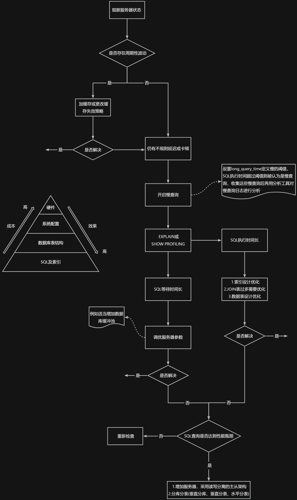
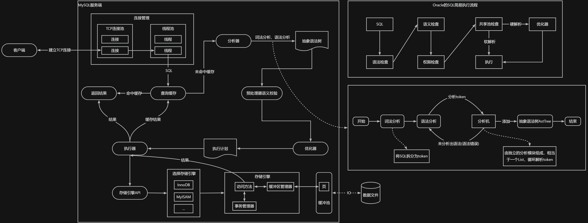
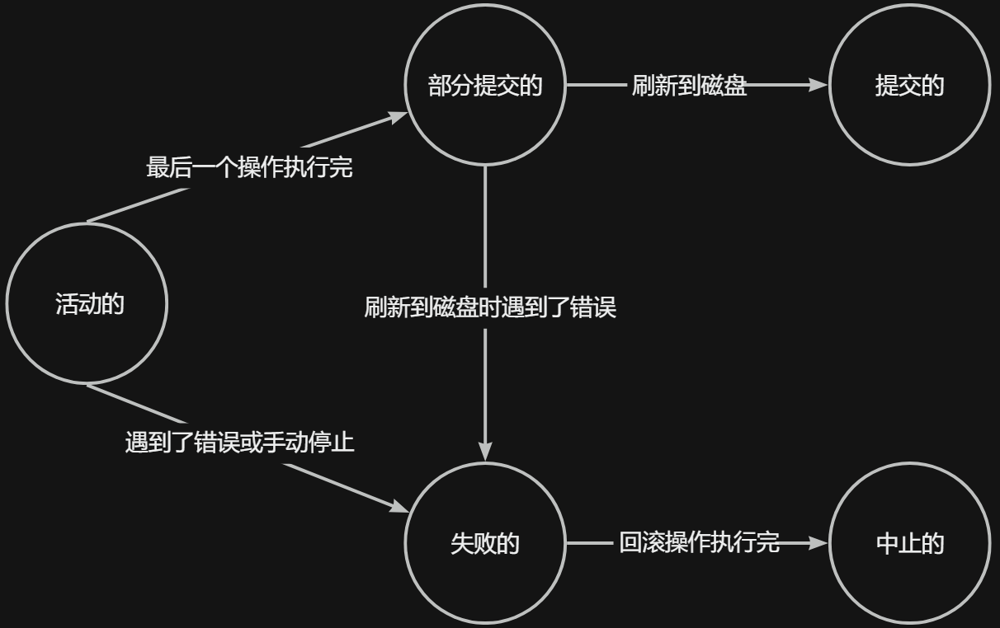

## 用户管理
+ `mysql -uroot -p -hlocalhost -P3306 mysql -e "select host,user from user"`
    - `-e`参数表示执行完这个SQL语句后退出服务器
+ 创建用户`CREATE USER 用户名@主机 [IDENTIFIED BY '密码'][,用户名@主机 [IDENTIFIED BY '密码']];`
    - 可以创建多个用户
    - 密码是可选的不过建议加上
    - 不写host默认为`%`，user和host是mysql.user表的联合主键，两个字段的值才能确定唯一记录
    - 例如`CREATE USER 'zs'@'%' IDENTIFIED BY '123';`
+ 修改用户`UPDATE mysql.user SET USER='ls' WHERE USER='zs';` `FLUSH PRIVILEGES;`，不刷新权限无效除非重启服务
+ 删除用户
    - `DROP USER 用户名[,用户名...];`，默认删除host为`%`的用户
        * 这种方式会删除用户以及对应的权限
        * `DROP USER 'zs'@'localhost';`，删除指定host的用户
    - `DELETE FROM mysql.user WHERE Host='%' AND User='zs';` `FLUSH PRIVILEGES;`不推荐使用这种方式会有残留
+ 查看`select host,user,authentication_string from mysql.user;`
+ 修改当前用户密码
    - `ALTER USER USER() IDENTIFIED BY '123';`
    - `SET PASSWORD='123';`
    - 5.7`SET PASSWORD = PASSWORD('123');`，8中`PASSWORD`函数弃用
+ 修改其他用户密码
    - `ALTER USER 'zs'@'%' IDENTIFIED BY '123';`
    - `SET PASSWORD FOR 'zs'@'%'='123';`
    - 5.7`UPDATE mysql.user SET authentication_string=PASSWORD('123') WHERE user = 'ls' AND host = '%';` `FLUSH PRIVILEGES;`
    - 5.5`UPDATE mysql.user SET PASSWORD=PASSWORD('123') WHERE user = 'zs' AND host = '%';` `FLUSH PRIVILEGES;`
+ 密码管理
    - 密码管理功能只针对使用基于mysql授权插件的账号，插件为`mysql_native_password` `sha256_password` `caching_sha2_password`
    - 密码过期：过期后可以登陆但无法操作提示需要修改密码
        * 全局
            + 更改变量值并持久化`SET PERSIST default_password_lifetime = 180;`
            + 配置文件->`[mysqld]`->`default_password_lifetime=180`
        * 单独设置策略：`CREATE USER` `ALTER USER`时使用`PASSWORD EXPIRE`
            + `PASSWORD EXPIRE`直接过期
            + `PASSWORD EXPIRE INTERVAL 天数 DAY`多少天过期
            + `PASSWORD EXPIRE NEVER`永不过期
            + `PASSWORD EXPIRE DEFAULT`延用全局密码过期策略
    - 密码重用限制
        * 全局
            + `SET PERSIST password_history = 6;`不能选择最近的6个密码
            + `SET PERSIST password_reuse_interval = 365;`不能选择最近1年内的密码
            + 配置文件设置
        * 单独设置策略：`CREATE USER` `ALTER USER`时使用`PASSWORD`
            + `PASSWORD HISTORY 数值`
            + `PASSWORD REUSE INTERVAL 天数 DAY`
            + 两者也可以一起用
            + `PASSWORD HISTORY DEFAULT` `PASSWORD REUSE INTERVAL DEFAULT`延用全局策略
    - 密码强度校验

## 权限管理
+ 查看所有权限列表`SHOW PRIVILEGES;`
+ 查看某用户的拥有的权限`SHOW GRANTS FOR 'zs'@'%';`
+ 查看当前用户拥有的权限
    - `SHOW GRANTS;`
    - `SHOW GRANTS FOR CURRENT_USER;` `SHOW GRANTS FOR CURRENT_USER();`
+ 授权原则
    - 只授予能满足需要的最小权限
    - 限制用户的登陆主机
    - 满足密码复杂度
    - 定期清理不需要的用户，回收权限或删除用户
+ 授予权限`GRANT 权限1,权限2,...,权限n ON 库名.表名 TO 用户名@主机 [IDENTIFIED BY '设置密码'];`
    - `GRANT ALL PRIVILEGES ON *.* TO 'zs'@'%' IDENTIFIED BY '123';`，`*.*`表示所有库的所有表，这里`ALL PRIVILEGES`不包含`GRANT`权限，所以被授权的用户无法给其他用户授权，除非使用`WITH GRANT OPTION`
    - 重复给用户添加权限视为权限叠加（不是覆盖）
+ 收回权限`REVOKE 权限1,权限2,...,权限n ON 库名.表名 FROM 用户名@主机;`，须用户重新登录后才能生效
+ 访问控制：针对`mysql`库
    - 连接核实阶段：检查权限表`user`
    - 请求核实阶段：向下检查权限表`db`->`tables_priv`->`columns_priv`

## 角色管理
+ 方便管理具有相同权限的用户，角色是权限的集合
+ 创建角色`CREATE ROLE 'role_name'[@'host_name'] [,'role_name'[@'host_name']]...`
    - 主机名默认为`%`，也可以省略
+ 授予角色权限`GRANT privileges ON table_name TO 'role_name'[@'host_name'];`
+ 查看角色的权限`SHOW GRANTS FOR 'manager'@'%';`
+ 查看当前角色`SELECT CURRENT_ROLE();`
+ 回收角色的权限`REVOKE 权限列表 ON 库名.表名 FROM 'role_name'@'host_name';`
+ 删除角色`DROP ROLE role [,role2]...`
+ 给用户赋予角色`GRANT role1[,role2,...] TO user1[,user2,...];`
    - 必须激活角色才能使角色权限生效，且需要用户重新登录
+ 激活角色
    - `SET DEFAULT ROLE 角色@主机 TO user1[,user2,...];`
        * `SET DEFAULT ROLE ALL TO 'zs'@'%';`，`ALL`表示激活所有已拥有的角色
        * 如果没有`DEFAULT`表示改变当前会话的角色
    - `SET GLOBAL activate_all_roles_on_login=ON;`
        * 这个变量默认值是`OFF`，也可以持久化全局变量，或在配置文件中设置
+ 撤销用户的角色`REVOKE role FROM user;`
+ 设置强制角色`SET GLOBAL mandatory_roles = 'role1,role2@localhost,role3@%.example.com';`
    - 也可以持久化全局变量，或在配置文件中设置
    - 强制角色是给每个创建账户的默认角色，无需手动设置，无法被`REVOKE` `DROP`

## 配置文件
+ 配置文件中的选项组如`[server]` `[mysqld]` `[mysqld_safe]` `[client]` `[mysql]` `[mysqladmin]`等
+ 不同的启动命令能读取的选项组不同

| 启动命令 | 类别 | 能读取的组 |
| --- | --- | --- |
| mysqld | 启动服务器 | [mysqld] [server] |
| mysqld_safe | 启动服务器 | [mysqld] [server] [mysqld_safe] |
| mysql.server | 启动服务器 | [mysqld] [server] [mysqld.server] |
| mysql | 启动客户端 | [mysql] [client] |
| mysqladmin | 启动客户端 | [mysqladmin] [client] |
| mysqldump | 启动客户端 | [mysqldump] [client] |


+ `[mysqld-5.7]`表示专用选项组，只有5.7的`mysqld`才能读取
+ 在同一配置文件中，如果不同的选项组有相同的启动选项，则声明在下方的优先级高
+ 如果是在命令行中指定启动选项，这个优先级比配置文件的高，如`mysql.server start --default-storage-engine=MyISAM`，这种是临时性的方式，重启服务后失效，而在配置文件中的启动选项则是永久性的

## 逻辑架构
+ mysql是典型的C/S架构，服务端程序使用mysqld
+ 逻辑架构示意图



+ mysql前置层次：Connectors，通过sdk来访问mysql，本质上是在tcp连接上通过mysql协议进行交互
+ mysql后置层次：存储层次的文件系统、日志文件
+ mysql server层次
    - 连接层
        * 账号密码身份认证、权限获取、连接管理
        * tcp连接池限制连接数，采用长连接模式复用tcp连接，tcp连接接收到请求后，有专门的线程池分配线程和这个客户端交互
    - 服务层
        * SQL interface：接收SQL命令，有查询缓存直接返回结果，没有则走分析器等待结果
        * Parser：对SQL进行词法分析、语法分析生成抽象语法树，再通过预处理器语义校检判断字段、表是否存在
        * Optimizer：生成执行计划，表明用什么索引进行查询（全表检索、索引检索）
            + 逻辑查询优化：等价变换SQL语句
            + 物理查询优化：通过索引和表连接
        * query cache：查询缓存，命中率不高所以mysql8已删除，推荐使用静态表
            + 命中率低的原因：必须是完全相同的SQL、多次调用函数结果不同如`NOW`、缓存失效
            + `query_cache_type`：0表示关闭、1表示开启、2表示按需，默认查询缓存是关闭的
                - 设置2时，使用`SELECT {SQL_CACHE|SQL_NO_CACHE} * FROM test WHERE id=1;`
            + 监控查询缓存相关参数`SHOW STATUS LIKE 'Qcache';`
            + mysql中的查询缓存指的是缓存查询结果而不是缓存查询计划
    - 引擎层
        * 插件式存储引擎，负责myql中数据的存储与提取
+ 测试SQL执行原理
    - `select @@profiling;`，0表示关闭、1表示开启，`set profiling = 1;`
    - 多次查询，然后`show profiles`显示最近几次查询，`show profile`最近一次查询，`show profile cpu,block io for query 指定查询id`
+ 对比Oracle的SQL执行流程
    - 语法检查、语义检查、权限检查
    - 共享池shared pool：包含了库缓存、数据字典缓冲区，主要作用是缓存SQL语句和该语句的执行计划
        * 软解析：对SQL语句Hash运算，在库缓存library cache查找，如果存在SQL执行计划就执行
            + 使用绑定变量减少硬解析如`SELECT * FROM TEST WHERE id=:id;`
        * 硬解析：在优化器内创建解析树、生成执行计划，然后执行
+ 数据库缓冲池buffer pool
    - InnoDB是以page为单位管理存储空间的，读取数据时会和磁盘IO交互，一般DBMS会申请占用内存作为缓冲池，把磁盘上的页缓存到内存中的缓冲池，减少与磁盘进行IO的时间
    - 缓冲池包含内容：数据页、索引页、锁信息、插入缓存、数据字典信息、自适应索引哈希等
    - 缓冲原则：位置决定效率，可以直接访问到数据，频次决定优先级，优先加载热点数据
    - 预读特性：使用了一些数据，大概率会使用其周围的数据，因此采用预读机制提前加载
    - 刷盘：对数据修改时，首先会修改缓冲池中数据，然后以一定的频率刷新到磁盘上，采用checkpoint机制，当缓冲池不够用时会强制checkpoint，将不常用的脏页dirty page回写到磁盘然后在缓冲池中释放这些页
        * 脏页：缓冲池中被修改的页，与磁盘上的数据页不一致
        * 脏页未刷盘mysql宕机，这部分数据永久丢失
        * 脏页只刷盘了一部分数据mysql宕机，如果想要回滚可使用`Redo log`和`Undo log`
    - 查看设置缓冲池大小
        * MyISAM只缓存索引，不缓存数据，对应参数为`key_buffer_size`
        * InnoDB对应参数为`innodb_buffer_pool_size`，默认128M，设置`SET GLOBAL innodb_buffer_pool_size=268435456;`变为256M
    - 缓冲池本质上是一块连续的内存空间，在多线程环境下，访问缓冲池中的数据时都需要加锁处理，一个缓冲池实例压力大，需要拆分为多个实例，可以设置参数`innodb_buffer_pool_instances`，注意不管设置几个实例缓冲池总大小是不变的且实例占用大小是平均的
        * 缓冲池大小小于1G时设置多个实例无效，推荐大于1G时设置多个实例

## 存储引擎
+ 存储引擎表示表的类型，又叫表处理器
+ 查看mysql提供什么引擎`show engines;`
+ 查看默认的存储引擎`show variables like 'storage_engine';` `SELECT @@default_storage_engine;`
+ 修改默认的存储引擎`SET DEFAULT_STORAGE_ENGINE=MyISAM;`
+ 设置表的存储引擎
    - 创建表时指定存储引擎`CREATE TABLE test(id int) ENGINE = 存储引擎名称;`
    - 修改表的存储引擎`ALTER TABLE test ENGINE = 存储引擎名称;`
+ 不同的存储引擎
    - InnoDB
        * 5.5时变为默认存储引擎，之前是MyISAM
        * 支持外键的事务型引擎，可以确保事务的完整提交和回滚
        * 除了查询和插入外，还需要修改和删除时优先选择该引擎
        * 是处理巨大数据量的最大性能设计
        * 底层文件结构
            + 表名.frm存储表结构(mysql8合并在表名.ibd中)
            + 表名.ibd存储数据和索引
        * 需要缓存数据和索引，内存要求高决定性能，处理效率略差
        * InnoDB和MyISAM

            | 对比项 | MyISAM | InnoDB |
            | --- | --- | --- |
            | 外键 | 0 | 1 |
            | 事务 | 0 | 1 |
            | 行表锁 | 表锁，不适合高并发 | 行锁，适合高并发 |
            | 缓存 | 只缓存索引，不缓存数据 | 数据和索引都缓存 |
            | 自带系统表使用 | 1 | 0 |
            | 关注点 | 节省资源、简单业务 | 并发写、事务、更大资源 |
            | 默认安装 | 1 | 1 |
            | 默认使用 | 0 | 1 |

    - MyISAM
        * MyISAM提供了大量的特性，包括全文索引、压缩、空间函数(GIS)等，但MyISAM不支持事务、行级锁、外键 ，有一个毫无疑问的缺陷就是崩溃后无法安全恢复 
        * 底层文件结构
            + 表名.frm存储表结构(mysql8变为表名_xxx.sdi)
            + 表名.MYD存储数据
            + 表名.MYI存储索引
        * 针对数据统计有额外的常数存储，所以count(*)效率高
        * 速度快，对事务完整性没有要求以SELECT、INSERT为主的应用
        * 应用场景：只读应用或以读为主的应用
    - Archive
        * 用于数据存档，仅支持插入和查询，5.5之后支持索引
        * 较好的压缩机制，使用zlib压缩库，数据文件扩展名为`.arz`，占用空间小
        * 采用行级锁，支持`AUTO_INCEMENT`列属性，该列可以具有唯一索引或非唯一索引，在其他任何列上创建索引都会报错
        * 插入速度快，查询效率较差，适合存储大量的独立的作为历史记录的数据
        * 支持备份、时间点恢复、加密数据（在服务器中实现，而不是在存储引擎实现）
        * 支持更新数据字典的统计信息、支持地理空间数据类型
        * 应用场景：日志和数据采集
    - Blackhole
        * 无任何存储机制，丢弃所有插入的数据
        * 但服务器会记录Blackhole表的日志，如复制数据库到备库时简单记录日志
    - CSV
        * 可以将普通的csv文件作为mysql的表来处理，不支持索引
        * csv引擎可以作为一种数据交换格式
        * csv存储的数据可以用文件编辑器打开或excel表格打开
        * 对于数据的快速导入和到处有优势
        * 存储数据时，以`,`分隔每个数据项
    - Memory
        * Memory采用的逻辑介质是内存 ，响应速度很快 ，但是当mysqld守护进程崩溃的时候数据会丢失 ，另外，要求存储的数据是数据长度不变的格式，比如，Blob和Text类型的数据不可用(长度不固定的)，其数据易丢失，生命周期短
        * 支持哈希hash索引和B+树索引，比MyISAM表要快一个数量级
        * Memory表的大小是受到限制的，表的大小主要取决于两个参数，分别是`max_rows`和`max_heap_table_size`，max_rows可以在创建表时指定，max_heap_table_size的大小默认为16MB，可以按需要进行扩大
        * 数据文件与索引文件分开存储
        * 应用场景：目标数据小且频繁访问、临时数据、不关心丢失数据
    - Federated：是访问其他MySQL服务器的一个代理 ，尽管该引擎看起来提供了一种很好的跨服务器的灵活性 ，但也经常带来问题，因此默认是禁用的
    - Merge：管理多个MyISAM表构成的表集合
    - NDB：也叫做NDB Cluster存储引擎，主要用于MySQL Cluster分布式集群环境，类似于Oracle的RAC集群，支持hash索引

## 索引
+ 索引`Index`，本质是数据结构
+ 优点
    - 降低数据库IO成本
    - 保证数据唯一性
    - 加速表之间连接
    - 减少查询中分组和排序的时间
+ 缺点
    - 创建、维护索引要耗费时间，随着数据量增加，所耗费时间也会增加
    - 索引需占用磁盘空间
    - 索引可提高查询速度，但会降低更新表速度（可以先删除表中索引，然后插入数据，完成后再创建索引）
+ 常见索引类型
    - 聚簇索引：不仅是索引类型，还是一种数据存储方式，理解为索引即数据，数据即索引，`聚簇`表示数据和索引存储在一起，聚簇索引不需要显式用`INDEX`创建，InnoDB会自动创建
        * 例子：`CREATE TABLE test(c1 INT,c2 INT,c3 CHAR(1),PRIMARY KEY(c1)) ROW_FORMAT = Compact;`，聚簇索引所在列为c1
        * 特点
            + 页内记录是按主键的大小顺序排成一个单向链表
            + 各个存放用户记录的页也是根据页中用户记录的主键大小顺序排成一个双向链表
            + 存放目录项记录的页分为不同的层次，在同一层次中的页也是根据页中目录项记录的主键大小顺序排成一个双向链表
            + B+树的叶子节点存储一个个完整的用户记录，完整的用户记录中存储了所有列的值（包括隐藏列）
        * 优点
            + 数据访问更快 ，因为索引和数据保存在同一个B+树中，所以获取数据比二级索引更快
            + 对于主键的排序、范围查找速度非常快
            + 范围查询时可以节省大量IO
        * 缺点
            + 插入速度严重依赖于插入顺序 ，按主键顺序插入最快，否则会出现页分裂严重影响性能，所以InnoDB表一般都会定义一个自增的ID列为主键
            + 更新主键代价高，因为会使被更新的行移动，所以一般InnoDB表主键不要更新
            + 二级索引需2棵B+树查找，第一次找到主键值，第二次根据主键值找到记录
        * 限制
            + mysql数据库目前只有InnoDB支持聚簇索引而MyISAM不支持
            + 由于数据存储方式只有一种，所以每个表的只能有一个聚簇索引，一般是该表主键
            + 如果没有显示定义主键，则会选择唯一非空索引替代，都没有则会为表自动添加一个隐藏列`row_id`作为主键来自动创建聚簇索引（隐藏列`row_id`是在没有主键和唯一非空索引时才存在的）
            + InnoDB表的主键尽量选择顺序id，不建议用无序的id（如UUID、MD5、HASH、字符串），因为这些无序的id无法保证数据的顺序增长
    - 二级索引：又叫辅助索引、非聚簇索引、secondary index、non-clustered Index
        * 例子：使用非主键列c2的大小进行记录和页的排序，过程类比聚簇索引，这里c2列无唯一性约束，所以c2列的值对应的用户记录可能分布在多个页中
        * 二级索引和聚簇索引的区别
            + 二级索引叶子节点存储的不是完整的用户记录，而只是`c2列+主键c1`
            + 目录项记录中不再是主键+页号的搭配，而变成了`c2列+主键c1+页号`的搭配，内节点(非叶子节点)中包含主键是为了保证目录项记录的唯一性方便排序，所以二级索引是联合索引的特例
            + 二级索引的所有节点的用户记录不保存隐藏列`transaction_id`和`roll_pointer`，如果有隐藏列`row_id`会保存，且不建议使用过长的字段作为主键
            + 二级索引不会影响数据存储，一个表可以有多个二级索引
            + 聚簇索引查询数据效率高，但增删改数据时效率比二级索引低
        * 回表：例如查找表的某条记录时，先通过二级索引找到主键值，如果想找到完整的用户记录就要到聚簇索引中再查一遍，类似这个过程的都叫回表，即根据c2列的值查询一条完整的用户记录需使用到2棵B+树
    - 联合索引
        * 例子：以c2和c3列的大小进行排序，先按c2列排序，c2列相同则按c3列排序
        * 联合索引是同时为多个列建立索引，联合索引叶子节点处的用户记录是`c2列+c3列+主键c1`
        * 以c2和c3列分别建立索引会产生2棵B+树，而建立联合索引只会产生1棵B+树
+ InnoDB的B+树索引的注意事项
    - 根节点页位置不变原则：某个表创建B+树索引时，都会为这个索引创建一个根节点页，开始表中没有数据，随后向表中插入用户记录时，先把用户记录存储到这个根节点中，当根节点中的可用空间用完时继续插入记录，此时会将根节点中的所有记录复制到一个新分配的页，比如页a中，然后对a进行页分裂，得到另一个新页，比如页b，这时新插入的记录根据键值的大小就会被分配到页a或者页b中，而根节点便升级为存储目录项记录的页，这个根节点的页号是不变的，需要使用这个索引时都会从这个固定位置开始查找
    - 一个页最少存储2条用户记录：一个B+树只需很少层级就可存储数亿条数据，查询速度相当不错，这是因为B+树索引是一个大的多层级目录，每经过一个目录都会过滤掉许多无效子目录，直到最后访问到真实数据，如果一个大的目录中只存放一个子目录且叶子节点只存放一条真实数据，就会导致目录层级非常非常多，所以InnoDB的一个页至少要存储2条用户记录
    - 索引树不是一次性加载的，而是逐一加载每一个磁盘页对应索引树节点
    - 一般B+树的高度都在2~4层，而根节点是常驻内存的，所以聚簇索引只需要1~3次IO就能查到数据
+ 即使多个存储引擎支持同一种索引，它们的实现原理也是不同的，InnoDB和MyISAM默认的索引是B树索引，而Memory默认的索引是Hash索引

| 索引/存储引擎 | MyISAM | InnoDB | Memory/Heap | NDB | Archive |
| --- | --- | --- | --- | --- | --- |
| B树索引 | 支持 | 支持 | 支持 | 不支持 | 不支持 |
| Hash索引 | 不支持 | 不支持 | 支持 | 支持 | 不支持 |
| R树索引 | 支持 | 支持 | 不支持 | 不支持 | 不支持 |
| 全文索引 | 支持 | 支持 | 不支持 | 不支持 | 不支持 |


+ MyISAM与InnoDB对比
    - InnoDB的索引、数据文件一体化，MyISAM索引、数据文件是分离的，索引文件仅保存数据地址
    - InnoDB的二级索引data域存储主键值，而MyISAM索引存储数据地址
    - MyISAM需要先回表，所以MyISAM建立的索引相当于是二级索引
    - MyISAM回表速度快，因为是直接根据数据地址获取数据的，而InnoDB的二级索引是通过获取主键之后再去聚簇索引里找数据，所以在查询效率上InnoDB的二级索引<MyISAM索引<InnoDB的聚簇索引
    - InnoDB一般要求表要有主键，MyISAM可以没有
+ 索引的代价
    - 空间：每建立一个索引都要为它建立一棵B+树，每一棵B+树的每一个节点都是一个页，一个页默认会占用16KB的存储空间
    - 时间：对数据增删改时，可能会对排序造成破坏，所以存储引擎需要额外的时间进行用户记录移位、页分裂、页回收等操作来维护排序，如果建了许多索引，每个索引对应的B+树都要进行维护导致性能较差
+ mysql数据结构选择的合理性
    - Hash
        * Hash算法是通过某种确定性的算法，如MD5、SHA1、SHA2、SHA3等将输入转变为输出，相同的输入可以得到相同的输出，但不可逆
        * 例如HashMap，CRUD的平均时间复杂度都是O(1)，而平衡二叉搜索树都是O(log<sub>2</sub>N)，所以Hash比B+树效率高
        * 适用性
            + 键值型数据库Redis存储的核心就是Hash表
            + 字段重复率低，经常需要等值查询时使用Hash索引，如Memory临时表
            + InnoDB本身不支持Hash索引，但提供自适应Hash索引(adaptive hash index)，表示当数据经常被访问时，满足一定条件后就会将这个数据页的地址存放到Hash表，后面访问时可以直接定位，当B+树比较深时使用效率高，`show variables like 'adaptive_hash_index';`
        * 局限性
            + 数据的存储没有顺序，所以Hash索引不支持`ORDER BY`排序，也不支持模糊查询和范围查询
            + 对于联合索引，Hash值是将联合索引键合并到一起计算的，无法对单独的一个键或几个索引键进行查询，所以Hash索引不支持联合索引的最左侧原则
            + 索引列的重复值如果很多查询效率就会降低，因为此时相当于在遍历链表
    - B-Tree：balance tree，叫B树不叫B减树
        * 是多路平衡查找树，它的每一个非叶子节点最多可以包含M个子节点，M称为B树的阶
        * 特性
            + 根节点的孩子数的范围是`[2,M]`
            + 每个中间节点包含`k-1`个关键字和`k`个孩子，孩子的数量=关键字的数量+1，k的取值范围为`[ceil(M/2), M]`
            + 叶子节点包括`k-1`个关键字（叶子节点没有孩子），k的取值范围为`[ceil(M/2), M]`
            + 假设中间节点的关键字为`Key[1] Key[2] ... Key[k-1]`，且关键字按升序排序，即`Key[i]<Key[i+1]`，此时`k-1`个关键字相当于划分了`k`个范围，也就是对应着k个指针，即为`P[1] P[2] ... P[k]`，其中`P[1]`指向关键字小于`Key[1]`的子树，`P[i]`指向关键字属于`(Key[i-1], Key[i])`的子树，`P[k]`指向关键字大于`Key[k-1]`的子树
            + 所有叶子节点位于同一层
        * 小结
            + B树插入和删除节点时如果导致树不平衡，就会自动调节节点位置来保持自平衡
            + 非叶子节点存储关键字+数据+指针，叶子节点存储关键字+数据，查找可能在非叶子节点结束，所以B树的查找相较于B+树是不稳定的
            + 其查询的过程相当于在给关键字做二分查找
    - B+Tree
        * 在mysql中B树索引指的就是B+树索引，B+树和数据结构中的B树不同，B+树是基于B树改造升级且不同存储引擎实现方式不同，B+树比B树更适合文件索引系统
        * B+树和B树的区别
            + B+树有k个孩子的节点就有k个关键字，即孩子数量=关键字数，而B树中孩子数量=关键字数+1
            + B+树非叶子节点的关键字同时也存在于子节点中，且是子节点中所有关键字最小的，而B树的非叶子节点的关键字不会存在于子节点中（即使有相同关键字的也是指不同的数据记录）
            + B+树非叶子节点仅用于索引不保存数据记录，而B树中非叶子节点既保存索引也保存数据记录
            + B+树所有关键字都在叶子节点出现，且叶子节点按关键字大小顺序构成双向链表
            + B+树查询效率更高更稳定，比B树更矮胖（阶数大深度低），范围查询效率也更高，因为B树的范围查询是通过中序遍历效率低
    - R-Tree：仅支持geometry数据类型，支持R树索引的存储引擎只有myisam、bdb、 innodb、ndb、archive，优势在于范围查找
+ InnoDB数据存储结构
    - 行格式
        * 行格式相关
            + 查看`select @@innodb_default_row_format;`
                - 5.0之前默认Redundant，5.1默认Compact，5.7默认dynamic
            + 创建`CREATE TABLE 表(列的信息) ROW_FORMAT=行格式名称;`
            + 修改`ALTER TABLE 表 ROW_FORMAT=行格式名称;`
            + 可在高级文本编辑器中用16进制编辑工具分析`.ibd`文件
            + mysql对一条记录占用的最大存储空间是有限制的，`BLOB` `TEXT`的列除外，所有列和部分记录的额外信息总共占用的字节数不能超过`row size`65535(不包括隐藏列和记录头信息)，例如用编码ASCII、Compact行格式的表只存储一个字段`VARCHAR(M)`，考虑极限情况这65535字节包含了数据+2字节的变产字段长度+1字节的NULL值标识，所以此时M最大能取到65532，如果这个字段定义为`VARCHAR(M) NOT NULL`就不包含1字节的NULL指标识，所以此时M最大能取到65533
            + 行溢出：一个页存放不了一条记录
                - Compact和Redundant行格式对于占用存储空间非常大的列，在记录的真实数据处只会存储该列的一部分数据(通常为768个前缀字节)，把剩余的数据在其他页中分页存储，然后在记录的真实数据处用20字节存储这些页的地址(这20字节包括这些页中数据占用的字节数)从而可以找到剩余数据所在页，这个过程称为页的扩展
                - Dynamic和Compressed行格式对于存放在BLOB中的数据采用了完全的行溢出的方式，即在数据页只存储20字节的溢出页地址，实际的数据都存放在溢出页off page中
        * COMPACT
            + 记录的额外信息
                - 变长字段长度列表
                    * 变长数据类型如`VARCHAR(M)` `VARBINARY(M)` `TEXT类型` `BLOB类型`
                    * 把所有变长字段的真实数据各自占用的字节数存储起来，形成变长字段长度列表
                    * 这里存储的字节数顺序和字段顺序是相反的
                - NULL值列表：为了对齐数据，占整数个字节
                    * 二进制的值为1表示该列的值为`NULL`，为0表示该列的值不为`NULL`
                    * NULL值列表存储的二进制位顺序和字段顺序是相反的，且会自动跳过主键和有非空约束的字段
                - 记录头信息record header：5字节
                    * 预留位1 1b、预留位2 1b：没有使用
                    * delete_mask 1b：逻辑删除，置1表示删除，置0表示未删除，因为如果真的移除就会导致重新排列影响性能，所有被标记删除的记录会组成垃圾单向链表，其占用的空间称为可重用空间，当有新记录插入时可能会覆盖其中的记录占用的空间
                    * min_rec_mask 1b：B+树每层的非叶子节点的最小记录的该值为1，其余都是0
                    * n_owned 4b：页目录中每个组的最后一条记录的头信息会存储该组一共有多少条记录即为n_owned，其余都是0
                    * heap_no 13b：当前记录在本页的位置，用户记录从2开始，两条虚拟记录为最小记录和最大记录，它们的heap_no为别为0和1，所以它们最靠前面
                    * record_type 3b：0普通记录，1表示B+树非叶子节点记录，2最小记录，3最大记录
                    * next_record 16b：当前记录的真实数据到下一条记录的真实数据的地址偏移量（相邻记录的真实数据的开始位置之间的字节数），下一条记录指的是按主键由小到大的顺序的下一条记录，最小记录的下一条记录为本页主键最小的用户记录，而本页主键最大的用户记录的下一条记录是最大记录，若没有下一条记录则为0
            + 记录的真实数据
                - 隐藏列：真正名称是`DB_ROW_ID` `DB_TRX_ID` `DB_ROLL_PTR`

                    | 列名 | 是否必须 | 占用空间 | 描述 |
                    | --- | --- | --- | --- |
                    | row_id | 否 | 6字节 | 如果没有为表显示定义主键，且表中也没有定义唯一索引，则innodb会自动为表添加这个隐藏列作为主键 |
                    | transaction_id | 是 | 6字节 | 每个事务都会分配一个事务id，当对某条记录发生变更时，就会将这个事务的事务id写入这个隐藏列 |
                    | roll_pointer | 是 | 7字节 | 表示回滚指针，指向最新undo log的指针，而undo log之间是新的指向老的 |

                - 所有列
        * Dynamic和Compressed
            + Dynamic/Compressed和Compact类似，但在处理行溢出数据时有分歧
            + Compressed另一个功能是，存储在其中的行数据会以zlib算法进行压缩，因此对于BLOB、TEXT、VARCHAR这类大长度类型的数据存储非常有利
        * Redundant：大部分和Compact一致
            + 记录的额外信息
                - 字段长度偏移列表：会把该记录的所有列（包括隐藏列）的长度信息都按逆序存储到字段长度偏移列表，例如三个隐藏列按顺序为`06 0C 13`（16进制），逆序存储为`13 0C 06`
                - 记录头信息：6字节，没有record_type
                    * 多了个`n_fileds` 10b：记录中列的数量，显然一个行最多支持1023个列
                    * 多了个`1byte_offs_flag` 1b：字段长度偏移列表中每个列对应的偏移量使用1个还是2个字节来表示，为1表明使用1字节，为0表明使用2字节
                        + 记录的真实数据占用的字节数不大于127，每个列对应的偏移量使用1字节存储
                        + 记录的真实数据占用的字节数大于127不大于32767，每个列对应的偏移量使用2字节存储
                        + 记录的真实数据占用的字节数大于32767，每个列对应的偏移量使用2字节存储，此时记录按Redundant的行溢出处理
                - 没有NULL值列表，处理NULL的方式是将列对应的偏移量值的第一个比特位作为判断NULL的依据，为1表示该列值为NULL，为0则不是，这也就解释了为什么记录的真实数据占用的字节数大于127时每个列对应的偏移量使用2字节存储
                    * 如果存储NULL值的字段是定长类型，如CHAR(10)，则该字段占用记录的真实数据部分10字节，对应的数据用一堆0填充
                    * 如果存储NULL值的字段是变长类型，如VARCHAR(10)，则该字段不占用记录的真实数据空间
            + 记录的真实数据
                - 隐藏列
                - 所有列
    - 页page：默认大小16KB，磁盘和内存交互的基本单位，`show variables like '%innodb_page_size%'`
        * `SQL Server`中页的大小为8KB，而在`Oracle`中用块Block来表示页，Oracle支持的块大小为2KB/4KB/8KB/16KB/32KB/64KB
        * 如果按类型划分，可分为目录项记录页、数据页、系统页、Undo页和事务数据页等
        * 上层结构：区、段、表空间
        * 注意点
            + 在B+树中，查找到数据页时，对数据页的页目录的所有槽slot进行二分查找找到一个记录分组，然后在分组中遍历单项链表找到需要的记录
            + 普通索引和唯一索引查询效率差不多，普通索引可能会存在用户记录中的关键字相同的情况，此时数据页加载到内存上，需要在内存上多几次"判断下一条记录"操作，因为是内存级别所以对于cpu来说消耗的时间可忽略不计
            + 数据页加载方式：数据库缓冲池读取数据页
                - 内存读取：一个页1ms
                - 随机读取：排队3ms、寻道4ms、半圈旋转2ms、传输1ms，总IO共10ms
                - 顺序读取：平均一个页0.4ms
        * 页的存储空间划分
            + 文件头File Header：38字节，描述页的各种通用信息
                - FIL_PAGE_OFFSET 4：页号
                - FIL_PAGE_TYPE 2：该页类型，如`FILE_PAGE_INDEX` `FILE_PAGE_UNDO_LOG` `FILE_PAGE_TYPE_SYS`等
                - FIL_PAGE_PREV 4和FIL_PAGE_NEXT 4：上一页和下一页的页号，这些页不一定是物理连续而是逻辑连续(双向链表)
                - FIL_PAGE_SPACE_OR_CHKSUM 4：页的校验和checksum值，为了检测一个页是否完整，采用类似hash算法，比较文件头和文件尾的检验和是否相等，如果不等则需要重新传输页
                - FIL_PAGE_LSN 8：页最后被修改时对应的日志序列位置log sequence number
                - FIL_PAGE_FILE_FLUSH_LSN 8：仅在系统表空间的一个页中定义，代表文件至少被刷新到了对应的LSN值
                - FIL_PAGE_ARCH_LOG_NO_OR_SPACE_ID 4：页属于哪个表空间
            + 页头Page Header：56字节，页的状态信息
                - PAGE_N_DIR_SLOTS 2：在页目录中的槽数量
                - PAGE_HEAP_TOP 2：还未使用的空间的最小地址
                - PAGE_N_HEAP 2：本页中的记录数量（包括最小最大记录和标记删除记录）
                - PAGE_FREE 2：第一个已经被标记删除的记录的地址
                - PAGE_GARBAGE 2：标记删除的所有记录的占用的字节数
                - PAGE_LAST_INSERT 2：最后插入记录的位置
                - PAGE_DIRECTION 2：记录插入的方向
                - PAGE_N_DIRECTION 2：一个方向连续插入的记录数量，
                - PAGE_N_RECS 2：本页中的记录数量（不包括最小最大记录和标记删除记录）
                - PAGE_MAX_TRX_ID 8：修改当前页的最大事务ID，该值仅在二级索引中定义
                - PAGE_LEVEL 2：当前页在B+树中所处层级
                - PAGE_INDEX_ID 8：索引ID，表示当前页属于哪个索引
                - PAGE_BTR_SEG_LEAF 10：B+树叶子段的头部信息，仅在B+树的根页定义
                - PAGE_BTR_SEG_TOP 10：B+树非叶子段的头部信息，仅在B+树的根页定义
            + 最大最小记录Infimum+supremum：26字节，两个虚拟的行记录，又叫伪记录
                - 最小和最大记录分别由5字节的记录头信息和8字节的固定部分（对应单词）组成
            + 用户记录User Records：大小不确定，存储行记录内容，相互之间形成单向链表
            + 空闲空间Free Space：大小不确定，页中还没有被使用的空间，用完了就要去申请新的页
            + 页目录Page Directory：大小不确定，存储用户记录的相对位置
                - 使用二分查找，将所有记录（包括最大最小记录，不包括标记删除的记录）分成几个组
                - 分组情况：最小记录单成1组，最后1组即最大记录所在组会有1~8条记录，其余的组记录数量在4~8之间，这样分组可以尽量平分，例如页中插入第8条用户记录时，会将8条用户记录和最大记录拆分为两个组分别包含4条和5条记录，此时会在页目录新增一个槽对应4条记录的组
                - 页目录存储的是每个组最后一条记录的地址偏移量，这些地址偏移量会按先后顺序存储，每组的地址偏移量又被称为槽slot，每个槽相当于指针指向了每组的最后一条记录
                - 数据页中查找指定主键值的记录过程：先通过二分法确定该记录所在槽，并找到该槽所在分组中主键值最小的记录，通过这个记录的next_record属性遍历该槽所在分组的所有记录
            + 文件尾File Tailer：8字节，检验页是否完整
                - INNODB_CHECKSUMS 4：和文件头的校验和对应
                - INNODB_CHECKSUM_ALGORITHM 4：完整性检查算法，默认crc32
    - 区extent：一个区会分配64个连续的页，大小为1MB
        * 例如B+树叶子节点，如果双向链表相邻的两个页的物理位置离的很远，就会出现随机IO性能差，所以一般数据量较大时都会分配多个连续的区，虽然可能造成空间的浪费，但可以消除很多随机IO
        * 碎片fragment区：完整区分配给某个段对于数据量较小的情况太浪费存储空间，所以引入了碎片区的概念，碎片区中的所有页并不是为了存储同一个段的数据而存在的，可以用于不同的目的，如有些页用于段A，有些页用于段B，有些页哪个段都不属于，相对比较灵活，碎片区直属于表空间并不属于任何一个段，一般某个段占用了32个碎片区的页时才会申请完整区
        * 分类：处于FREE/FREE_FRAG/FULL_FRAG状态的区都是独立的，直属于表空间，而处于FSEG状态的区是附属于某个段的
            + 空闲FREE：没有用到这个区的任何页
            + 有剩余空间的碎片区FREE_FRAG：表示碎片区中还有可用的页
            + 没有剩余空间的碎片区FULL_FRAG：表示碎片区中的所有页面都被使用，没有空闲页
            + 附属于某个段的区FSEG：每一个索引都可以分为叶子节点段和非叶子节点段
    - 段segement：不同类型的数据库对象以不同的段形式出现，段中不要求区和区之间必须是相邻的
        * 常见段：数据段(叶子节点段)、索引段(非叶子节点段)、回滚段
        * 段管理由引擎完成，简化DBA的管理
        * 段只是一种逻辑概念，可能包含若干碎片区的页，可能包含一些完整区
    - 表空间tablespace：是一个逻辑容器，一个表空间可以有多个段，一个段只属于一个表空间，数据库由一个或多个表空间组成
        * 基于linux的mysql，查看数据目录`show variables like 'datadir';`，默认为`/var/lib/mysql`
            + 命令相关目录`/usr/bin` `/usr/sbin`
            + 配置文件`/etc/my.cnf`
        * `innodb_file_per_table`，设置0表示数据存到系统表空间，设置1表示数据存到独立表空间
            + 可以自定义这个启动参数
            + 5.6.6-默认为0，5.6.6+默认为1
            + 查看`show variables like 'innodb_file_per_table';`
        * 分类
            + 系统表空间system tablespace：数据目录下的`ibdata1`，默认大小12M，不够用时可自我扩展大小
                - 可修改：`vim /etc/my.cnf`->`[server]`->`innodb_data_file_path=data1:512M;data2:512M:autoextend`->重启服务
                - 整个mysql进程只有一个系统表空间，存储引擎定义了一些内部系统表用于记录元数据，这些内部系统表统称为数据字典，其中`SYS_TABLES` `SYS_COLUMNS` `SYS_INDEXES` `SYS_FIELDS`为基本系统表，内部系统表一般不应该修改而是查看，可以通过`USE information_schema;` `SHOW TABLES LIKE 'innodb_sys%';`访问以`INNODB_SYS`开头的表，注意这些表和以`SYS`开头的内部系统表中的字段并不完全一样，仅供参考
            + 独立表空间file-per-table tablespace：又叫用户表空间，可自扩展
                - 5.7中`db.opt`存储数据库相关配置
                    * `InnoDB`的一个表对应`表名.frm`存储表结构、`表名.ibd`存储数据和索引
                    * `MyISAM`的数据和索引是分开存储的，一个表对应`表名.frm`存储表结构、`表名.MYD`存储数据、`表名.MYI`存储二级索引
                - 8中不提供`db.opt`
                    * `InnoDB`的一个表对应一个合并文件`表名.ibd`
                        + `SDI`序列化字典信息，被写在ibd文件内部
                        + 可以到ibd文件所在目录使用`ibd2sdi --dump-file=表名.txt 表名.ibd`
                        + 然后查看`表名.txt`中的信息
                    * `MyISAM`的一个表对应`表名_xxx.sdi` `表名.MYD` `表名.MYI`
                - `DROP TABLE`可自动回收表空间，其他情况表空间不能自动回收，如果对于统计分析或是日志表，删除大量数据后可以通过`alter table 表名 engine=innodb;`回收不用的空间，对于使用独立表空间的表，不管怎么删除，表空间的碎片不会太严重的影响性能，而且还有机会处理
            + 其他表空间：通用表空间general tablespace、临时表空间 temporary tablespace、撤销表空间undo tablesapace
+ 索引分类
    - 按功能逻辑
        * 普通索引：创建时不附加任何限制条件，只是提升查询效率，这类索引可以创建在任何数据类型上，其值是否唯一或非空要由字段本身的完整性约束条件决定
        * 唯一索引：使用`UNIQUE`设置索引为唯一索引，限制该索引对应列值必须是唯一的，但允许有多个重复的`NULL`，一个表可以有多个唯一索引
        * 主键索引：特殊的唯一索引，在唯一索引的基础上增加了非空约束，一个表最多只能有一个主键索引，因为这是由主键索引的物理实现方式决定的（数据在文件中只能按一种顺序存储）
        * 全文索引：又叫全文检索，使用`FULLTEXT`设置索引为全文索引，在定义该索引的列上支持全文查找，允许插入重复值和空值，全文索引只能创建在`CHAR` `VARCHAR` `TEXT`系列类型的字段上，不支持局部索引和前缀索引
            + 一般适用于查询数据量较大的字符串类型的字段，建议先添加数据然后建立索引
            + 3.23.23开始支持，5.6.4之前只有myisam支持，之后innodb才支持，当不支持中文分词需要第三方插件，5.7.6内置ngram全文解析器支持亚洲语种分词，所以使用全文索引时需要搞清楚版本支持情况，但RDBMS后来逐渐被搜索引擎`solr` `ElasticSearch`替代
            + 典型的两种类型
                - 自然语言的全文索引：整个索引中出现次数最少的关键字，匹配时的相关度越高
                - 布尔全文索引
            + 全文索引使用`SELECT * FROM 表名 WHERE MATCH(title,content) AGAINST('查询字符串');`查询，比模糊查询like效率快N倍，但存在精度问题
        * 空间索引：使用`SPATIAL`设置索引为空间索引，空间索引只能建立于空间数据类型上，目前只有myisam支持空间检索，且索引的字段必须非空
    - 按物理实现方式
        * 聚簇索引：见上文
        * 二级索引：见上文
    - 按作用字段
        * 单列索引：只作用于一个列上的索引，一个表可以有多个单列索引
        * 联合索引：又叫多列、组合索引，是在表的多个字段组合上建立索引，但是只有查询条件中使用了这些字段中的第一个字段才会被使用，例如基于id、name、age建立`idx_id_name_age`，只有查询条件中使用了id字段该索引才会被使用，所以使用联合索引时遵循最左前缀集合
+ 索引的创建
    - 创建表时
        * 隐式创建索引：在声明有主键约束、唯一约束、外键约束的字段上会分别自动建立主键索引、唯一索引、普通索引
        * 显示创建索引
            + `CREATE TABLE 表名(列名1 数据类型1,列名2 数据类型2,...,[UNIQUE | FULLTEXT | SPATIAL] [INDEX | KEY] [索引名](指定表中列名[长度] [ASC | DESC]) [INVISIBLE])`，其中长度为可选参数表示索引的长度，只有字符串类型的字段才能指定索引的长度，索引名不写时默认为列名
    - 表已创建时
        * `ALTER TABLE test ADD INDEX idx_name(name);`
        * `CREATE INDEX idx_name ON test(name);`
+ 索引的删除
    - `ALTER TABLE test DROP INDEX idx_name;`
    - `DROP INDEX idx_name ON test;`
    - 注意：删除表中的列时，如果这个列为索引的组成部分（如联合索引），则该列也会从索引中删除，如果组成索引的所有列都被删除，则整个索引被删除
+ mysql8索引新特性
    - 支持降序索引：仅innodb支持
        * 例如`CREATE TABLE test(a INT,b INT,INDEX idx_a_b(a ASC,b DESC));`
        * mysql8之前只有升序索引
        * 反向扫描效率极差，会出现`Using filesort`外部排序
        * 降序索引只对查询中特定的排序顺序有效，使用不当反而会降低查询效率
    - 支持隐藏索引invisible indexes
        * 只要将待删除的索引设置为隐藏索引，使查询优化器不再使用这个索引（即使使用强制使用索引force index，优化器也不会使用该索引），确认后就可以彻底删除，这一过程称为软删除
        * 验证某个索引删除后对查询性能的影响，可以暂时设置该索引为隐藏索引，然后结合`EXPLAIN`查询进行调优分析
        * 主键不能被设置为隐藏索引，当表中没有主键时，表中的第一个唯一非空索引会成为隐式主键，同样也不能设置为隐藏索引
        * 创建的索引默认都是`VISIBLE`的，可以用`INVISIBLE`设置索引为隐藏索引，可以在`CREATE TABLE` `ALTER TABLE` `CREATE INDEX`时设置索引的可见性
        * 当索引被隐藏时，它的内容仍然和正常索引一样是实时更新的，如果一个索引需要长期被隐藏则建议删除，否则隐藏索引的存在会影响增删改的性能
        * `select @@optimizer_switch;`，默认为`use_invisible_indexes=off`，优化器会忽略隐藏索引，如果`set session optimizer_switch='use_invisible_indexes=on';`，则隐藏索引对优化器是可见的，即使索引被设置为隐藏，优化器在生成执行计划时也会考虑使用隐藏索引
+ 索引的设计原则
    - 适合创建索引的情况
        * 列值有唯一性的限制
        * 频繁作为`WHERE`查询条件的字段
        * 经常`GROUP BY`和`ORDER BY`的列
        * `UPDATE`或`DELETE`的`WHERE`条件列，如果删改的字段是非索引字段，提升效率会更明显，因为非索引字段更新不需要对索引进行维护
        * `DISTINCT`字段需要创建索引
        * 多表连接时注意：连接表的数量尽量不要超过3，对`WHERE`条件创建索引，对连接条件中的用于连接的字段创建索引（多表连接的字段类型必须一致，隐式转换函数会导致索引失效）
        * 对类型小的列创建索引，这里类型小指的是数据范围小的，查询时比较操作快，索引占用空间少，主键使用更小的数据类型也有利
        * 使用字符串前缀创建索引，节省空间且减少了字符串的比较时间
            + 文本区分度`select count(distinct left(列名,索引长度))/count(*) from 表名`，区分度高的可使用对应的索引长度
            + 通过前缀创建的二级索引因为不包含字段的完整信息，所以无法对前缀相同后面字符不同的记录排序，所以索引列前缀无法支持使用索引排序，只能使用文件排序
        * 区分度高(散列性高)的列适合作为索引
            + 列的基数指的是某一列中不重复的数据的个数，列的基数越大该列中的值越分散
            + 联合索引一般把区分度高的列放在前面
        * 使用最频繁的列放在联合索引左侧，可以增加联合索引的使用率，称为最左前缀原则
        * 在多个字段都要建立索引的情况下，联合索引优于单值索引
    - 索引数目过多的影响
        * 单表不要超过6个，索引会占用磁盘空间
        * 影响增删改的性能，因为需要维护索引
        * 优化器在选择如何查询优化时，会对每一个可以用到的索引进行评估，生成一个最好的执行计划，如果同时有多个索引都可以用于查询则会增加优化器生成执行计划的时间，降低查询性能
    - 不适合创建索引的情况
        * `WHERE` `GROUP BY` `ORDER BY`中使用不到的字段
        * 数据量较小的表（如不到1000行记录）
        * 有大量重复数据的列（如重复度高于10%）
        * 避免对经常更新的表创建过多索引
        * 不建议用无序的值作为索引（如身份证、UUID、MD5、HASH、无序长字符串），因为在索引比较时需要转为为ASCII，且插入时可能导致页分裂
        * 删除不再使用或很少使用的索引
        * 不要定义冗余或重复的索引

## 性能分析工具
+ 数据库服务器优化流程



+ 查看系统性能参数`SHOW [GLOBAL|SESSION] STATUS LIKE '参数';`，参数如下
    - Connections：连接MySQL服务器的次数
    - Uptime：MySQL服务器的上线工作时间
    - Slow_queries：慢查询的次数
    - Innodb_rows_read：Select查询返回的行数
    - Innodb_rows_inserted：执行INSERT操作插入的行数
    - Innodb_rows_updated：执行UPDATE操作更新的行数
    - Innodb_rows_deleted：执行DELETE操作删除的行数
    - Com_select：查询操作的次数
    - Com_insert：插入操作的次数，对于批量插入的`INSERT`操作，只累加一次
    - Com_update：更新操作的次数
    - Com_delete：删除操作的次数
+ 统计SQL的查询成本
    - 执行SQL语句后再执行`SHOW STATUS LIKE 'last_query_cost';`，表示SQL语句所需要读取的页的数量，有时读取的页的数量增加但查询时间没有明显变化是因为有缓冲池机制
    - SQL查询是一个动态的过程，从页的加载角度出发得出如下结论
        * 位置决定效率：如果页就在数据库`缓冲池`中，那么效率是最高的，否则还需要从`内存`或者`磁盘`中进行读取，当然针对单个页的读取来说，如果页存在于内存中，会比在磁盘中读取效率高很多
        * 批量决定效率：如果我们从磁盘中对单一页进行随机读，那么效率是很低的(差不多10ms)，而采用顺序读取的方式，批量对页进行读取，平均一页的读取效率就会提升很多，甚至要快于单个页面在内存中的随机读取
        * 所以说，遇到I/O并不用担心，方法找对了，效率还是很高的，我们首先要考虑数据存放的位置，如果是进程使用的数据就要尽量放到缓冲池中，其次我们可以充分利用磁盘的吞吐能力，一次性批量读取数据，这样单个页的读取效率也就得到了提升
    - 适用场景：有多个查询方式可选时，可使用来比较开销
+ 慢查询日志：定位执行慢的SQL
    - `show variables like 'slow_query_log';`，默认慢查询日志是关闭的，`set global slow_query_log='ON';`设置开启，`show variables like 'slow_query_log_file';`是日志文件路径，日志文件名为`主机名-slow.log`
    - 阈值`show variables like '%long_query_time%';`
        * `set global long_query_time=1;`，这个全局设置只对新会话有效
        * `set long_query_time=1;`，设置当前会话的慢查询时间阈值
    - 可在配置文件中的`[mysqld]`增加日志开关、日志文件路径、阈值时间、`log_output=FILE`
    - `show variables like 'min_examined_row_limit';`表示查询扫描过的最少记录数，默认为0，也是控制SQL是否添加到慢查询日志的一个系统变量，阈值和这个变量都默认情况下如果查询的执行时间超过阈值10s，哪怕没有扫描过任何记录，都要被收集到慢查询日志中
    - 慢查询日志分析工具
        * 命令`mysqldumpslow --help`
        * 参数
            + -a 不将数字抽象成N，字符串抽象成S
            + -s 是表示按照何种方式排序：c 访问次数，l 锁定时间，r 返回记录数，t 查询时间，al 平均锁定时间，ar 平均返回记录数，at 平均查询时间（默认方式），ac 平均访问次数
            + -t  返回前面多少条SQL
            + -g 后边搭配一个正则匹配模式，大小写不敏感的
        * 常用
            + 得到返回记录数最多的10个SQL`mysqldumpslow -s r -t 10 /var/lib/mysql/hostname-slow.log`
            + 得到访问次数最多的10个SQL`mysqldumpslow -s c -t 10 /var/lib/mysql/hostname-slow.log`
            + 得到按照时间排序的前10条里面含有左连接的查询语句`mysqldumpslow -s t -t 10 -g "left join" /var/lib/mysql/hostname-slow.log`
            + 另外建议在使用这些命令时结合`|`和`more`使用，否则有可能出现爆屏情况`mysqldumpslow -s r -t 10 /var/lib/mysql/hostname-slow.log | more`
    - 删除慢查询日志
        * 默认在mysql的数据目录中，可手动删除
        * 在慢查询日志开启的情况下使用命令`mysqladmin -uroot -p flush-logs slow`，这个命令一般是用于慢查询日志的删除和重建，如果需要注意备份旧的日志
+ 查看SQL执行成本
    - `show variables like 'profiling';`，默认关闭，可`set profiling = 'ON';`
    - 然后执行相关的查询语句，再`show profiles;`
    - 查看最近的一次开销`show profile;`
    - 查看指定Query_ID的开销`show profile cpu,block io for query id号;`
        * 常用参数有：ALL：显示所有的开销信息，BLOCK IO：显示块IO开销，CONTEXT SWITCHES：上下文切换开销，CPU：显示CPU开销信息，IPC：显示发送和接收开销信息，MEMORY：显示内存开销信息，PAGE FAULTS：显示页面错误开销信息，SOURCE：显示和Source_function、Source_file、Source_line相关的开销信息，SWAPS：显示交换次数开销信息
    - 日常开发中诊断结果出现了如下问题则需要SQL优化
        * `converting HEAP to MyISAM`查询结果太大，内存不够，数据往磁盘上搬了
        * `Creating tmp table`创建临时表，先拷贝数据到临时表，用完后再删除临时表
        * `Copying to tmp table on disk`把内存中临时表复制到磁盘上，警惕！
        * `locked`
    - 不过`SHOW PROFILE`将被弃用，可在`information_schema`库的`profiling`表查看
+ 分析执行计划工具`EXPLAIN`，或者使用`DESCRIBE`两者一样
    - 5.6.3以前只能`EXPLAIN SELECT`，5.6.3以后可以`EXPLAIN UPDATE` `EXPLAIN DELETE`，一般都是关注`SELECT`相关
    - 5.7以前，想要显示partitions需要使用explain partitions，想要显示filtered需要使用explain extended，5.7以后，默认explain直接显示partitions和filtered中的信息
    - 输出的各列作用
        * table：每一行记录对应一个单表，多表查询时有驱动表和被驱动表之分
        * id：一般情况下一个`SELECT`对应一个id，但如果查询优化器把子查询重写为多表连接就少1个id，`UNION`会生成临时表id为空值，不去重的`UNION ALL`则不会
            + id相同则是一组，按从上向下顺序执行
            + 在所有组中，id越大的优先级越高，越先执行
            + id个数越少越好，因为每个id都是一趟独立的查询
        * select_type：查询扮演的角色
            + `SIMPLE` `PRIMARY` `UNION` `UNION RESULT` `SUBQUERY` `DEPENDENT SUBQUERY` `DEPENDENT UNION` `DERIVED` `MATERIALIZED` `UNCACHEABLE SUBQUERY` `UNCACHEABLE UNION`
        * partitions：代表分区表中的命中情况，非分区表该项为`NULL`，一般使用的都是非分区表
        * type：执行查询时的访问方法，又叫访问类型
            + 从好到坏依次是system > const > eq_ref > ref > fulltext > ref_or_null > index_merge > unique_subquery > index_subquery > range > index > ALL
            + index：使用索引覆盖但需要扫描全部的索引记录时，访问类型为index，索引覆盖表示不需要回表就能查询到需要的数据
            + 开发中至少达到range级别，要求是ref级别，最好是const级别
        * possible_keys和key：可能用到的索引和实际使用的索引，有时possible_key为空值但key却用到了索引是因为被优化了
        * key_len：实际使用到的索引长度(字节数)，帮你检查是否充分的利用了索引，值越大越好，主要针对于联合索引，有一定的参考意义
        * ref：当使用索引列等值查询时，与索引列进行等值匹配的对象信息，可以是常数、列、函数
        * rows：预估需要读取的记录数，值越小越好
        * filtered：某个表经过搜索条件过滤后剩余记录条数的百分比，越大越好
        * Extra：一些额外的信息
            + `No tables used` `Impossible WHERE` `Using where` `No matching min/max row` `Using index` `Using index condition` `Using join buffer (Block Nested Loop)` `Not exists` `Using intersect(...)、Using union(...)、Using sort_union(...)` `Zero limit` `Using filesort` `Using temporary`
            + Using index condition：对应索引条件下推特性，即定位二级索引的记录后先不回表而是检测是否有满足指定条件的记录，如果有再回表，否则压根不回表
            + Using join buffer (Block Nested Loop)：基于块的循环嵌套算法，在连接查询时，如果被驱动的表不能有效利用索引加快访问速度，则mysql会为其分配`join buffer`内存块加快查询速度
            + Using filesort：无法使用到索引，只能在内存中或磁盘上进行排序的方式称为文件排序，性能极差需要优化为使用索引进行排序
    - 注意点
        * `EXPLAIN`不考虑各种Cache
        * `EXPLAIN`不能显示MySQL在执行查询时所作的优化工作
        * `EXPLAIN`不会告诉你关于触发器、存储过程的信息或用户自定义函数对查询的影响情况
        * 部分统计信息是估算的，并非精确值
    - 四种输出格式：传统格式、JSON格式、TREE格式、可视化输出(MySQL Workbench)
        * `EXPLAIN FORMAT=JSON`里面包含该计划花费的成本
        * `EXPLAIN FORMAT=TREE`，8.0.16版本之后引入的新格式，主要根据查询的各个部分之间的关系和各部分的执行顺序来描述如何查询
    - 使用`EXPLAIN`语句查看了某个查询的执行计划后，紧接着还可以使用`SHOW WARNINGS`语句查看与这个查询的执行计划有关的一些扩展信息，可以展示类似于查询优化器将我们的查询语句重写后的语句
+ 分析优化器执行计划trace：5.6引入，可跟踪优化器做出的各种决策，并将结果记录到`information_schema.optimizer_trace`中
    - 该功能默认关闭，需要`SET optimizer_trace="enabled=on",end_markers_in_json=on;` `set optimizer_trace_max_mem_size=1000000;`
    - 执行SQL语句后`select * from information_schema.optimizer_trace\G`
+ mysql监控分析视图：5.7.7新增sys schema，即`sys`库，里面提供各种监控表和视图，常用使用场景如下（生产环境下不建议使用）

```sql
#1. 查询冗余索引
select * from sys.schema_redundant_indexes;
#2. 查询未使用过的索引
select * from sys.schema_unused_indexes;
#3. 查询索引的使用情况
select index_name,rows_selected,rows_inserted,rows_updated,rows_deleted
from sys.schema_index_statistics where table_schema='dbname';
```

```sql
# 1. 查询表的访问量
select table_schema,table_name,sum(io_read_requests+io_write_requests) as io from
sys.schema_table_statistics group by table_schema,table_name order by io desc;
# 2. 查询占用bufferpool较多的表
select object_schema,object_name,allocated,data
from sys.innodb_buffer_stats_by_table order by allocated limit 10;
# 3. 查看表的全表扫描情况
select * from sys.statements_with_full_table_scans where db='dbname';
```

```sql
#1. 监控SQL执行的频率
select db,exec_count,query from sys.statement_analysis
order by exec_count desc;
#2. 监控使用了排序的SQL
select db,exec_count,first_seen,last_seen,query
from sys.statements_with_sorting limit 1;
#3. 监控使用了临时表或者磁盘临时表的SQL
select db,exec_count,tmp_tables,tmp_disk_tables,query
from sys.statement_analysis where tmp_tables>0 or tmp_disk_tables >0
order by (tmp_tables+tmp_disk_tables) desc;
```

```sql
#1. 查看消耗磁盘IO的文件
select file,avg_read,avg_write,avg_read+avg_write as avg_io
from sys.io_global_by_file_by_bytes order by avg_read limit 10;
```

```sql
#1. 行锁阻塞情况
select * from sys.innodb_lock_waits;
```

## 索引与查询优化
+ 是否使用所以最终都是由优化器决定，优化器是基于开销的(CostBaseOptimizer)而不是基于规则(Rule-BaseOptimizer)或语义的，它会选择生成开销成本最小的执行计划(不一定是时间最短的)，另外SQL是否使用索引还和数据库版本、数据量、数据选择度有关
+ 索引失效
    - 不符合最左前缀原则
        * MySQL可以为多个字段创建索引，一个索引可以包含16个字段，对于多列索引，过滤条件要使用索引必须按照索引建立时的顺序，依次满足，一旦跳过某个字段，索引后面的字段都无法被使用，如果查询条件中没有用这些字段中第一个字段时，多列（或联合）索引不会被使用
    - 主键插入顺序紊乱
    - 计算、函数、类型转换(手动或自动)导致索引失效
    - 范围条件中的列在联合索引中有对应的位置，在这个位置右边的列索引失效
        * 例如金额查询、日期查询这些范围查询(< <= > >= between等)，在建立联合索引时把涉及范围的字段都放到最后
    - 不等于(!=或<>)索引失效
    - is null可以命中索引，is not null无法触发索引，not like也无法使用索引会导致全表扫描
    - like以通配符%开头索引失效
        * 【强制】页面搜索严禁左模糊或者全模糊（建议右模糊），如果需要请走搜索引擎来解决
    - OR前后存在非索引的列，索引失效
    - 不同的字符集进行比较前需要进行转换会造成索引失效
+ 关联查询优化
    - 对于左外连接，需要给被驱动表的连接字段建立索引避免全表扫描
    - 对内连接
        * 查询优化器可以决定谁作为驱动表，谁作为被驱动表出现的
        * 如果表的连接条件中只有一个字段有索引时，这个字段所在表作为被驱动表
        * 如果表的连接条件中2个字段都有索引（或都没有）时，则小表是驱动表，大表是被驱动表
    - JOIN语句相关
        * 优化器会根据你查询语句做优化，决定先查哪张表，先查询的那张表就是驱动表，反之就是被驱动表，通过explain关键字可以查看，一般输出结果上面的是驱动表下面的是被驱动表
        * SNLJ简单嵌套循环连接(simple nested loop join)：每次访问被驱动表，它的所有记录都会被加载到内存中，然后再从驱动表中取出一条记录与其匹配，匹配结束后清除内存，然后再从驱动表中取出一条记录，再次将被驱动表的所有记录加载到内存，进行匹配循环往复，这样会产生大量IO
        * INLJ索引嵌套循环连接(index nested loop join)：在被驱动表的连接列上加索引，这个索引如果是主键索引则不存在回表，如果是非主键索引则会按条件回表，降低了被驱动表的扫描次数
        * BNLJ块嵌套循环连接(block nested loop join)：一块一块的获取驱动表使用列的记录(select后面的所有列)，平均分配到一个个join buffer缓冲区，然后全表扫描被驱动表，将每个join buffer缓冲区的所有记录和被驱动表的所有记录批量匹配(在内存中)，降低了被驱动表的扫描次数
            + 一般在一个有N个join关联的sql中会分配N-1个join buffer，所以查询的时候尽量减少不必要的字段，可以让join buffer中可以存放更多的列
            + 通过`show variables like '%optimizer_switch%;`查看`block_nested_loop`状态，默认是开启的，`show variables like '%join_buffer_size%;`默认256K，在32位系统最大可申请4G，在64位系统可申请大于4G(windows的64位最多只能4G)
        * 小结
            + 整体效率：INLJ > BNLJ > SNLJ
            + 小表驱动大表准确来说是小结果集驱动大结果集（其本质就是减少外层循环的数据数量）
            + 小的指的是结果集行数 * 每行大小
            + 为被驱动表的匹配条件列增加索引（减少匹配次数），衍生表建不了索引，需要JOIN的字段，数据类型保持绝对一致
            + 增大`join_buffer_size`的大小（join buffer缓存的数据越多，内表扫描次数越少）
            + 减少驱动表不必要的字段查询（字段越少，join buffer缓存的数据越多）

            | 开销统计 | SNLJ | INLJ | BNLJ |
            | --- | --- | --- | --- |
            | 外表扫描次数 | 1 | 1 | 1 |
            | 内表扫描次数 | A | 0 | A*used_column_size/join_buffer_size，然后向上取整 |
            | 读取记录数 | A+B*A | A+B(match) | A+B*内表扫描次数 |
            | JOIN比较次数 | B*A | A*Index(height) | B*A |
            | 回表读取记录次数 | 0 | B(match)(if possible) | 0 |

        * Hash Join
            + 从MySQL的8.0.20版本开始将废弃BNLJ，因为从MySQL8.0.18版本开始就加入了hash join默认都会使用hash join
            + 对于被连接的数据子集较小的情况，Nested Loop是个较好的选择
            + Hash Join是做大数据集连接时的常用方式，优化器使用两个表中较小（相对较小）的表利用Join Key在内存中建立散列表，然后扫描较大的表并探测散列表，找出与Hash表匹配的行
                - 这种方式适合于较小的表完全可以放于内存中的情况，这样总成本就是访问两个表的成本之和
                - 在表很大的情况下并不能完全放入内存，这时优化器会将它分割成若干不同的分区，不能放入内存的部分就把该分区写入磁盘的临时段，此时要求有较大的临时段从而尽量提高I/O的性能
                - 它能够很好的工作于没有索引的大表和并行查询的环境中，并提供最好的性能，大多数人都说它是Join的重型升降机，Hash Join只能应用于等值连接（如WHERE A.COL1 = B.COL2），这是由Hash的特点决定的

| 类别 | Nested Loop | Hash Join |
| --- | --- | --- |
| 使用条件 | 任何 | 等值连接 |
| 相关资源 | CPI、磁盘IO | 内存、临时空间 |
| 特点 | 当有高选择性索引或进行限制性搜索时效率比较高，能够快速返回第一次的搜索结果 | 当缺少索引或索引条件模糊时使用，表记录多效率越高 |
| 缺点 | 索引失效或查询条件限制不够时或表的记录很多时，效率低 | 为建立hash表需要大量内存，第一次返回结果较慢 |


+ 子查询优化
    - 子查询缺点
        * 执行子查询时，MySQL需要为内层查询语句的查询结果建立一个临时表 ，然后外层查询语句从临时表 中查询记录，查询完毕后，再撤销这些临时表，这样会消耗过多的CPU和IO资源，产生大量的慢查询
        * 子查询的结果集存储的临时表，不论是内存临时表还是磁盘临时表都不会存在索引 ，所以查询性能会 受到一定的影响
        * 对于返回结果集比较大的子查询，其对查询性能的影响也就越大
    - 不建议使用子查询，建议将子查询SQL拆开结合程序多次查询，或使用JOIN来代替子查询，连接查询不需要建立临时表，其速度比子查询要快，如果查询中使用索引的话，性能就会更好
    - 尽量不要使用`NOT IN`或者`NOT EXISTS`，用`LEFT JOIN xxx ON xx WHERE xx IS NULL`替代
+ 排序优化
    - 建议
        * SQL中可以在WHERE子句和ORDER BY子句中使用索引，目的是在WHERE子句中避免全表扫描，在ORDER BY子句避免使用FileSort排序，当然某些情况下全表扫描，或者FileSort排序不一定比索引慢，但总的来说，我们还是要避免，以提高查询效率
        * 尽量使用Index完成ORDER BY排序，如果WHERE和ORDER BY后面是相同的列就使用单索引列，如果不同就使用联合索引
        * 无法使用Index时，需要对FileSort方式进行调优
    - 原则
        * 尽量使用Index方式排序，避免`Using filesort`
        * order by后的索引也遵循最左前缀
        * order by时不limit，索引失效
        * order by时顺序错误，索引失效
        * order by时排序规则不一致，索引失效
        * 无where过滤不索引，除非order by后加limit
        * 尽量让where的过滤条件和排序使用上索引
    - 结论
        * 两个索引同时存在，mysql自动选择最优的方案，但是随着数据量的变化，选择的索引也会随之变化的
        * 所有排序都是在条件过滤后才执行的
        * 当范围条件和group by或order by的字段出现二选一时，优先观察条件字段的过滤数量，如果过滤的数据足够多，而需要排序的数据并不多时，优先把索引放在范围字段上，反之亦然
    - filesort算法：排序的字段不是索引列
        * 老算法双路排序：慢，随机IO，需要两次磁盘扫描，先从磁盘取排序字段，在buffer进行排序，再从磁盘取其他字段 
        * 改进算法单路排序：快，顺序IO，从磁盘读取查询需要的所有列并放入buffer内存中，然后排序输出
            + 缺点：在sort_buffer中，单路要比多路多占用很多空间，因为单路是把所有字段都取出，所以有可能取出的数据的总大小超出了sort_buffer的容量，导致每次只能取sort_buffer容量大小的数据进行排序，排完再取sort_buffer容量大小，再排...从而多次I/O
            + 优化策略
                - 尝试提高`sort_buffer_size`，innodb默认1M
                - 尝试提高`max_length_for_sort_data`，默认1024字节，一般在1024~8192字节之间调整，数据总容量大于这个阈值使用双路算法，小于则使用单路算法，提高阈值即增加使用改进算法的概率
                - order by时select *是一个大忌，最好只查询需要的字段
        * 两种算法的数据都有可能超出sort_buffer_size的容量，超出之后会创建tmp文件进行合并排序，导致多次IO，但是使用单路排序算法的风险更大
+ 分组优化
    - group by使用索引的原则几乎跟order by一致，group by即使没有过滤条件用到索引，也可以直接使用索引
    - group by先排序再分组，遵循索引的最佳左前缀法则
    - 当无法使用索引列，增大`max_length_for_sort_data`和`sort_buffer_size`参数的设置
    - where效率高于having，能写在where限定的条件就不要写在having中了
    - 减少使用order by，和业务沟通能不排序就不排序，或将排序放到程序端去做，order by、group by、distinct这些语句较为耗费CPU，数据库的CPU资源是极其宝贵的
    - 包含了order by、group by、distinct这些查询的语句，where条件过滤出来的结果集请保持在1000行以内，否则SQL会很慢
+ 分页优化
    - 在索引上完成排序分页操作，最后根据主键关联回原表查询所需要的其他列内容
    - 该方案适用于主键自增的表，可以把limit查询转换成某个位置的查询
+ 索引覆盖优化
    - 一个索引包含了满足查询结果的数据就叫索引覆盖，即索引的字段覆盖查询中涉及的所有字段
    - 一般前缀索引不需要使用索引覆盖优化
    - 优缺点
        * 避免了对主键的二次查询，减少了IO操作
        * 回表操作是随机IO，而索引覆盖是顺序IO
        * 索引覆盖可以减少数的搜索次数提升查询性能，但索引的维护是有代价的，索引覆盖可能导致冗余索引
+ 索引条件下推
    - Index Condition Pushdown(ICP)是MySQL 5.6中新特性，是一种在存储引擎层使用索引过滤数据的一种优化方式
    - 例如联合索引`idx_a_b_c`，SQL`select * from test where a=123 and b like '%zzz%' and x like '%yyy%'`，其中a使用了索引，但b全模糊索引失效，此时会先针对b字段进行ICP筛选记录然后再回表，因为x不属于联合索引的字段所以不会进行ICP而是在回表查询的记录里过滤
    - 默认开启，可设置关闭`SET optimizer_switch = 'index_condition_pushdown=off';`
    - 当使用索引条件下推时，EXPLAIN语句输出结果中Extra列内容显示为Using index condition
    - ICP的使用条件
        * 如果表的访问类型为range、ref、eq_ref或者ref_or_null可以使用ICP
        * ICP可以在InnoDB或MyISAM的表、分区表中使用
        * 对于InnoDB表，ICP仅用于二级索引，ICP的目标是减少全行读取次数，从而减少I/O操作
        * 当SQL使用覆盖索引时，不支持ICP优化方法，因为这种情况下使用ICP不会减少I/O
        * 相关子查询的条件不能使用ICP
+ 其他优化策略
    - exists和in
        * `select * from a where age in (select age from b);`，此时为不相关子查询，a是大表b是小表时使用
        * `select * from a where exists (select age from b where b.age=a.age);`，此时为相关子查询，a是小表b是大表时使用
    - count(*)、count(1)、count(具体字段)的效率
        * mysql中count(*)和count(1)一个级别，且是扫描全表的方式时间复杂度O(n)，而在myisam中表的meta信息中存储了row_count值，所以时间复杂度为O(1)
        * innodb中count(具体字段)尽量要使用二级索引，因为聚簇索引数据多，而count(*)和count(1)则会自动采用占用空间最小的二级索引(key_len小的)来扫描统计，如果没有二级索引时会采用主键索引
    - select(*)
        * MySQL在解析的过程中，会通过查询数据字典将`*`按序转换成所有列名，这会大大的耗费资源和时间
        * 无法使用覆盖索引
        * 推荐使用`SELECT <字段列表>`查询
    - limit 1
        * 针对的是会扫描全表的SQL语句，如果你可以确定结果集只有一条，那么加上LIMIT 1的时候，当找到一条结果的时候就不会继续扫描了，这样会加快查询速度，如果数据表已经对字段建立了唯一索引，那么可以通过索引进行查询，不会全表扫描的话，就不需要加上LIMIT 1了
    - 多使用commit
        * 回滚段上用于恢复数据的信息
        * 被程序语句获得的锁
        * redo / undo log buffer中的空间
        * 管理上述3种资源中的内部花费
    - 普通/唯一索引查询性能相当，如果考虑对更新性能的影响，建议尽量选择普通索引
    - 主键设计
        * 非核心业务：对应表的主键自增ID，如告警、日志、监控等信息
        * 核心业务：主键设计至少应该是全局唯一且是单调递增，全局唯一保证在各系统之间都是唯一的，单调 递增是希望插入时不影响数据库性能
        * UUID
            + 全局唯一，占用36字节（mysql里最早底层是使用字符串形式存储），数据无序，插入性能差
            + 例如`e0ea12d4-6473-11eb-943c-00155dbaa39d`，由时间低位、时间中位、时间高位、UUID版本、时钟序列、MAC地址组成，一共36(32+4个`-`)个字符共36字节，UUID是无序的是因为时间低位放在最前面，而这部分的数据是一直在变化的
            + 改造UUID：mysql8解决了UUID空间占用的问题，采用二进制的底层存储代替字符串并去除无意义的`-`，原来的一个字符对应1个16进制即4个二进制，共128b即16字节，所以降低了存储大小，可验证`set @uuid=UUID();` `select @uuid,uuid_to_bin(@uuid),uuid_to_bin(@uuid,true);`，其中`uuid_to_bin(@uuid,true)`将UUID转化为有序的了，满足全局唯一且单调
                - 改造UUID可用于分布式系统，如果不是mysql8则需要手动赋值字段做主键

## 数据库设计规范
+ 范式Normal  form：数据表设计的基本规则，一般关系型数据库中最高也就遵循到BCNF普遍还是3NF，为了提高查询性能可能需要破坏范式规则即反范式，范式越高阶冗余度越低，同时高阶范式一定满足低阶范式的规则
    - 优点：消除数据冗余，确保数据完整性
    - 缺点：降低查询效率，需要关联多表，索引策略失效
    - 建议：范式和反范式混合使用，可以增加少量冗余提高读性能，实现空间换时间
    - 反范式适用场景：历史快照、数据仓库
+ 键和属性
    - 键：key，由一个或多个属性组成
    - 超键：唯一标识元组(行记录)的属性集
    - 候选键：如果超键不包含多余的属性，这个超键就是候选键，又被称为码
    - 主键：从候选键中选择一个作为主键，又被称为主码
    - 外键：表T1中某属性集不是主键，而是另一个表T2的主键，这个属性集称为表T1的外键
    - 主属性：任意候选键中的任意属性
    - 非主属性：不是任意候选键中的任意属性
+ 1NF：每个字段的值必须具有原子性，即每个字段的值为不可再次拆分的最小数据单元，且属性的原子性是主观的
+ 2NF：每一条数据记录都是可唯一标识的，且所有非主键字段都必须完全依赖主键，不能只依赖主键的一部分，如果知道主键的所有属性的值，就可以检索到任何元组的任何属性的任何值（这里主键可以扩展替换为候选键）
    - 非主键字段如果不完全依赖主键会产生的问题：数据冗余、增删改异常
    - 一张表就是一个独立的对象只表达一个意思
    - 一些非主键字段如果不完全依赖主键，则需要将这些字段和它们依赖的部分主键抽离出来形成新表，新表与被抽离后的原表之间是一对多的关系
+ 3NF：每一个非主键字段都和主键字段直接相关，即所有非主键字段不能依赖于其他非主键字段（例如不能存在非主属性A依赖于非主属性B，非主属性B依赖于主键C的情况），换句话说所有非主键属性之间不能有依赖关系必须相互独立（这里主键可以扩展替换为候选键）
+ 巴斯-科德范式BCNF(Boyce-Codd NF)：修正或扩充的3NF，只有一个候选键或者它的每个候选键都是单属性，它在3NF的基础上消除了主属性对候选键的部分依赖或者传递依赖关系
+ 4NF：消除非平凡和非函数依赖的多值依赖，即把同一表的多组一对多关系拆分
    - 多值依赖：属性之间的一对多关系
    - 平凡的多值依赖：整个表只存在一组一对多关系
    - 非平凡的多值依赖：整个表存在多组一对多关系
    - 函数依赖：单值依赖，属性之间的一对一关系
+ 5NF：又被称为完美范式、域键范式DKNF，消除不是由候选键所蕴含的连接依赖
    - 函数依赖是多值依赖的一种特殊的情况，而多值依赖是连接依赖的一种特殊情况
    - 处理无损无损连接问题，这个范式是没有实际意义的终极范式
+ ER模型：实体关系模型，用于设计数据库
    - 三要素
        * 实体：用矩形表示，分为两类，分别是强实体和弱实体，强实体指不依赖于其他实体，弱实体指对另一个实体有很强的依赖关系
        * 属性：用椭圆形表示，指实体的特性
        * 关系：用菱形表示，指实体之间的联系，分为一对一、一对多、多对多
    - 可以独立存在的是实体，不可再分的是属性
    - 转换为数据表的规则
        * 一个实体通常转换成一个数据表
        * 一个多对多的关系通常也转换成一个数据表
        * 一个1对1或1对多的关系，通过表的外键表达
            + 但为了性能，一般不设置外键，而是在应用层处理
        * 属性转换成表的字段
+ 数据库表设计原则：三少一多
    - 数据表的个数越少越好
    - 数据表中的字段个数越少越好
    - 数据表中联合主键的字段个数越少越好
    - 使用主键和外键（指外键关系）越多越好
+ PowerDesigner：数据库建模工具，可以制作数据流程图、概念数据模型(CDM Conceptual Data Model)、物理数据模型(PDM Physical Data Model)、面向对象模型(OOM Objcet Oriented Model)、业务流程模型(BPM Business Process Model)

## 其他调优策略
+ 调优维度：选择适合的DBMS、优化表设计、优化逻辑查询、优化物理查询、使用Redis或Memcached作为缓存、库级优化
+ 优化服务器硬件：配置较大的内存、配置高速磁盘系统、合理分布磁盘I/O、配置多处理器
+ 优化MySQL的参数：innodb_buffer_pool_size、key_buffer_size、table_cache 、query_cache_size、query_cache_type、sort_buffer_size、join_buffer_size、read_buffer_size、innodb_flush_log_at_trx_commit、innodb_log_buffer_size、max_connections、back_log、thread_cache_size、wait_timeout、interactive_timeout等
+ 优化数据库结构
    - 垂直分表使冷热数据分离
    - 把经常联合查询的数据插入建立的中间表中
    - 合理的加入冗余字段可以提高查询速度
    - 优先选择符合存储需要的最小的数据类型
    - 优化插入记录的速度
        * myisam
            + 禁用索引`alter table test disable keys;`，空表导入数据不需要
            + 禁用唯一性检查`set UNIQUE_CHECKS=0;`
            + 使用批量插入
            + 使用LOAD DATA INFILE批量导入
        * innodb
            + 禁用唯一性检查
            + 禁用外键检查`set foreign_key_checks=0;`
            + 禁止自动提交`set autocommit=0;`
    - 使用非空约束
    - 分析表、检查表与优化表
        * 分析表
            + `ANALYZE [LOCAL|NO_WRITE_TO_BINLOG] TABLE t1[,t2...];`
            + mysql服务默认将ANALYZE TABLE语句写到binlog中，以便主从架构同步数据，参数LOCAL、NO_WRITE_TO_BINLOG取消将语句写到binlog中，使用ANALYZE TABLE时会自动对表加一个只读锁，可以分析InnoDB和MyISAM类型的表，但不能作用于视图
            + ANALYZE TABLE分析后的统计结果会反应到cardinality，该值统计了表中某一键所在的列不重复的值的个数，该值越接近表中的总行数，则在表连接查询或者索引查询时，就越优先被优化器选择使用，cardinality可以通过`SHOW INDEX FROM 表名`查看
        * 检查表
            + `CHECK TABLE t1[,t2...] [option={QUICK|FAST|MEDIUM|EXTENDED|CHANGED}];`
            + CHECK TABLE可检查InnoDB和MyISAM的表是否存在错误，也会给表加上只读锁，也可以检查视图是否有错误
            + 对于MyISAM的表还会更新关键字统计数据，option只对MyISAM的表有效对InnoDB的表无效
        * 优化表
            + `OPTIMIZE [LOCAL|NO_WRITE_TO_BINLOG] TABLE t1[,t2...];`
            + OPTILMIZE TABLE只能优化VARCHAR、BLOB、TEXT字段，可重新利用未使用的空间并整理数据文件碎片，对InnoDB和MyISAM的表都有效，也会给表加上只读锁
            + `mysqlcheck -o 库名 表名 -uroot -p`，mysqlcheck是linux中的rompt，优化所有库的所有表`mysqlcheck -o --all-databases -uroot -p`
+ 大表优化
    - 限定查询的范围
    - 主写从读，双主双从相互复制master
    - 分库分表（垂直分库，垂直分表，水平分表）
    - 数据库分片
        * 客户端代理：分片逻辑在应用端，封装在jar包中，通过修改或者封装JDBC层来实现，如Sharding-JDBC、TDDL
        * 中间件代理：在应用和数据中间加了一个代理层，分片逻辑统一维护在中间件服务中，如Mycat、Atlas、DDB
+ 其它
    - 服务器语句超时处理`SET GLOBAL MAX_EXECUTION_TIME=2000;`
    - 创建全局通用表空间
        * `create tablespace ts add datafile 'ts.ibd' file_block_size=16k;`
        * `create table t(id int,age int) tablespace ts;`
        * 删除时应先删除依赖该表空间的数据表`drop table t;` `drop tablespace ts;`
    - 隐藏索引：当一个索引隐藏时，它不会被优化器所使用

## 事务
+ mysql只有InnoDB是支持事务的
+ 事务：一组逻辑操作单元，一个或多个DML，使数据从一种状态变换到另一种状态
+ 事务处理的原则：保证所有事务都作为一个工作单元来执行，即使出现了故障都不能改变这种执行方式，当在一个事务中执行多个操作时，要么整个事务提交，那么这些修改就永久地保存下来，要么数据库管理系统将放弃所作的所有修改，整个事务回滚到最初状态
+ 事务的ACID特性：原子性是基础，隔离性是手段，一致性是约束条件，持久性是目的
    - 原子性（atomicity）：指事务是一个不可分割的工作单位，要么全部提交，要么全部失败回滚，不存在中间的状态
    - 一致性（consistency）：指事务执行前后，数据从一个合法性状态变换到另外一个合法性状态，这种状态是语义上的而不是语法上的，跟具体的业务有关，满足预定的约束的状态就叫做合法的状态，数据就是一致的
    - 隔离型（isolation）：指一个事务的执行不能被其他事务干扰，即一个事务内部的操作及使用的数据对并发的其他事务是隔离的，并发执行的各个事务之间不能相互干扰
    - 持久性（durability）：指一个事务一旦被提交，它对数据库中数据的改变就是永久性的，接下来的其他操作和数据库故障不应该对其有任何影响，持久性是通过事务日志来保证的，日志包括了重做日志和回滚日志，当我们通过事务对数据进行修改的时候，首先会将数据库的变化信息记录到重做日志中，然后再对数据库中对应的行进行修改，这样做的好处是，即使数据库系统崩溃，数据库重启后也能找到没有更新到数据库系统中的重做日志，重新执行，从而使事务具有持久性
+ 事务的状态
    - 活动的（active）：事务对应的数据库操作正在执行过程中时，我们就说该事务处在活动的状态
    - 部分提交的（partially committed）：当事务中的最后一个操作执行完成，但由于操作都在内存中执行，所造成的影响并没有刷新到磁盘时，我们就说该事务处在部分提交的状态
    - 失败的（failed）：当事务处在活动的或者部分提交的状态时，可能遇到了某些错误（数据库自身的错误、操作系统错误或者直接断电等）而无法继续执行，或者人为的停止当前事务的执行，我们就说该事务处在失败的状态，如果事务处在部分提交的状态刷新到磁盘时遇到了错误也会进入失败状态
    - 中止的（aborted）：如果事务执行了一部分而变为失败的状态，那么就需要把已经修改的事务中的操作还原到事务执行前的状态，换句话说，就是要撤销失败事务对当前数据库造成的影响，我们把这个撤销的过程称之为回滚rollback，当回滚操作执行完毕时，也就是数据库恢复到了执行事务之前的状态，我们就说该事务处在了中止的状态
    - 提交的（committed）：当一个处在部分提交的状态的事务将修改过的数据都同步到磁盘上之后，我们就可以说该事务处在了提交的状态
    - 只有当事务处于提交的或者中止的状态时，一个事务的生命周期才算是结束了，对于已经提交的事务来说，该事务对数据库所做的修改将永久生效，对于处于中止状态的事务，该事务对数据库所做的所有修改都会被回滚到没执行该事务之前的状态



+ 使用事务
    - 显式事务
        * `START TRANSACTION;`能跟随几个修饰符，或者使用`BEGIN;`没有修饰符
            + `READ ONLY`：标识当前事务是一个只读事务，也就是属于该事务的数据库操作只能读取数据，而不能修改数据
                - 只读事务中只是不允许修改那些其他事务也能访问到的表中的数据，对于临时表(使用`CREATE TMEPORARY TABLE`创建的表)，由于它们只能在当前会话(事务)可见，所以只读事务也可以对临时表进行增删改
            + `READ WRITE`：标识当前事务是一个读写事务，也就是属于该事务的数据库操作既可以读取数据，也可以修改数据
            + `WITH CONSISTENT SNAPSHOT`：启动一致性读，可搭配`READ ONLY`或`READ WRITE`使用
                - `START TRANSACTION READ ONLY,WITH CONSISTENT SNAPSHOT;`
                - `START TRANSACTION READ WRITE,WITH CONSISTENT SNAPSHOT;`
            + 不能同时把`READ ONLY`和`READ WRITE`放到`START TRANSACTION`后边
            + 事务的默认访问模式是`READ WRITE`
        * `SAVEPOINT`
            + `SAVEPOINT 保存点名称;`：在事务中创建保存点，方便后续针对保存点进行回滚，一个事务中可以存在多个保存点
            + `RELEASE SAVEPOINT 保存点名称;`：删除某个保存点
        * `select @@completion_type;`，默认为0即NO_CHAIN
            + `set @@completion_type=1;`：commit时相当于执行了commit and chain，也就是开启链式事务，提交子事务后会开启一个相同隔离级别的子事务
            + `set @@completion_type=2;`：commit时相当于执行了commit and release，提交后会自动与服务器断开连接
        * 使用显示事务流程
            + 显示开启一个事务
            + 一系列事务中的操作(主要是DML，不包含DDL)
            + 可选择回滚到指定保存点`ROLLBACK TO 保存点名称;`，注意这里事务的生命周期还未结束
            + 提交事务`COMMIT;`或中止事务(即回滚事务`ROLLBACK;`，回滚到最近一次的commit)
    - 隐式事务
        * mysql系统变量`autocommit`默认开启即自动提交(一般指1个DML)，如果想关闭可以按如下方式
            + 显式的的使用`START TRANSACTION`或`BEGIN`开启一个事务，这样在本次事务提交或者回滚前会暂时关闭掉自动提交的功能
            + `SET autocommit=OFF;`或`SET autocommit=0;`
            + 注意：oracle默认不自动提交，需要手动commit
        * 隐式提交数据的情况
            + DDL修改数据库对象时会隐式的提交前面语句所属于的事务
            + 隐式使用或修改mysql数据库中的表：例如使用ALTER USER、CREATE USER、DROP USER、GRANT、RENAME USER、REVOKE、SET PASSWORD等语句时也会隐式的提交前面语句所属于的事务
            + 事务控制或关于锁定的语句
                - 在一个事务还没提交或者回滚时就又使用START TRANSACTION或者BEGIN开启了另一个事务时，会隐式的提交上一个事务
                - 当前的autocommit系统变量的值为OFF，我们手动把它调为ON时，也会隐式的提交前面语句所属的事务
                - 使用LOCK TABLES、UNLOCK TABLES等关于锁定的语句也会隐式的提交前面语句所属的事务
            + 加载数据的语句：LOAD DATA批量往数据库中导入数据时，也会隐式的提交前面语句所属的事务
            + 关于MySQL复制的一些语句：START SLAVE、STOP SLAVE、RESET SLAVE、CHANGE MASTER TO等语句会隐式的提交前面语句所属的事务
            + 其他：ANALYZE TABLE、CACHE INDEX、CHECK TABLE、FLUSH、LOAD INDEX INTO CACHE、OPTIMIZE TABLE、REPAIR TABLE、RESET等语句也会隐式的提交前面语句所属的事务
+ 事务的隔离级别
    - 数据并发问题（在不保证串行执行的情况下）
        * 脏写（Dirty Write）：对于两个事务A和B，如果A修改了另一个未提交的B的修改过的数据，那就意味着发生了脏写，如果之后B进行了回滚，那么A中的更新也将不复存在，如果是在不同数据库默认隔离级别下A中的更新语句会处于等待状态
        * 脏读（Dirty Read）：对于两个事务A和B，A读取了已经被B更新但还没有被提交的数据，之后若B回滚，A中读取的内容就是临时且无效的
        * 不可重复读（Non-Repeatable Read）：对于两个事务A和B，A读取了一行记录，然后B更新了该记录的某字段，之后A再次读取同一行记录，字段值就不同了，那就意味着发生了不可重复读
            + 如果在会话B中提交了几个隐式事务且每个隐式事务都是更新了同一行记录的某字段，每个隐式事务自动提交后，如果A可以查看到每个隐式事务更新的字段值，这种现象也被称之为不可重复读
        * 幻读（Phantom）：对于两个事务A和B，A从一个表中读取了一些记录，然后B在该表中插入了一些新的行，之后如果A再次以相同条件读取同一个表时多出几行，那就意味着发生了幻读，新插入的那些记录称之为幻影记录
            + 幻读强调的是读取到了之前没有读到的记录，如果B中是删除了一些符合条件的记录而不是插入新记录，之后A再读时记录变少了，这种情况就不是幻读，而是相当于对于每一条删除的记录都发生了不可重复读
    - SQL标准中的四种隔离级别(都解决了脏写问题，隔离级别越高数据库的并发性能就越差)
        * `READ UNCOMMITTED`：读未提交，所有事务都可以看到其他未提交事务中的数据
        * `READ COMMITTED`：读已提交，所有事务只能看到已经提交事务后的数据，这是大多数数据库系统的默认隔离级别(除了mysql)
        * `REPEATABLE READ`：可重复读，事务A在读到一条数据之后，此时事务B对该数据进行了修改并提交，那么事务A再读该数据，读到的还是原来的内容
        * `SERIALIZABLE`：可串行化，事务持续期间禁止其他事务对同一表执行增删改，所有并发问题都可避免但性能十分低下

        | 隔离级别 | 脏读 | 不可重复读 | 幻读 | 加锁读 |
        | --- | --- | --- | --- | --- |
        | READ UNCOMMITTED | 不可解决 | 不可解决 | 不可解决 | 否 |
        | READ COMMITTED | 可解决 | 不可解决 | 不可解决 | 否 |
        | REPEATABLE READ | 可解决 | 可解决 | 不可解决 | 否 |
        | SERIALIZABLE | 可解决 | 可解决 | 可解决 | 是 |

    - oracle只支持`READ COMMITTED`和`SERIALIZABLE`
    - mysql支持四种隔离级别
        * mysql的默认隔离级别是`REPEATABLE READ`
        * 查看：5.7.20之前是通过系统变量`tx_isolation`，之后是`transaction_isolation`
            + 例如`SHOW VARIABLES LIKE 'transaction_isolation';` `SELECT @@transaction_isolation;`
        * 设置
            + `SET [GLOBAL|SESSION] TRANSACTION ISOLATION LEVEL {READ UNCOMMITTED|READ COMMITTED|REPEATABLE READ|SERIALIZABLE};`或者`SET [GLOBAL|SESSION] TRANSACTION_ISOLATION='{READ-UNCOMMITTED|READ-COMMITTED|REPEATABLE-READ|SERIALIZABLE}';`或者在配置文件中修改启动参数
            + GLOBAL级别对当前已经存在的会话无效，只对执行完该语句之后产生的新会话有效，SESSION级别对当前会话的所有后续的事务有效，该语句可以在已经开启的事务中间执行，但不会影响当前正在执行的事务，而是对后续的事务有效
        * `REPEATABLE READ`隔离级别下，mysql中可以利用`select ... for update`手动加行(X)锁(独占锁)解决幻读问题，即使指定记录不存在当前事务也会获取一把记录锁(innodb的行锁锁定的是索引，所以和记录实体存在与否没有关系，存在就加行(X)锁，不存在就加间隙锁)，此时其他事务无法插入此索引的记录
        * `SERIALIZABLE`隔离级别下，先开启的事务会隐式添加行(X)锁或gap(X)锁
+ 事务的分类
    - 扁平事务（Flat Transactions）：最简单常用的一种类型，主要限制为不能提交或回滚事务的某一部分，扁平事务一般有三种不同的结果
        * 事务成功完成
        * 应用程序要求停止事务，例如应用程序在捕获到异常时会回滚事务
        * 外界因素强制终止事务，例如连接超时或连接断开
    - 带有保存点的扁平事务（Flat Transactions with Savepoints）：因为某些事务可能在执行过程中出现的错误并不会导致所有的操作无效，放弃整个事务不合乎要求，开销太大，所以设置事务带有保存点
        * 纯粹的扁平事务类型没有保存点，但隐式有一个保存点且只有这一个，所以回滚时只能回滚到扁平事务开始时的状态
    - 链事务（Chained Transactions）：由一个或多个子事务链式组成
        * 核心思想：提交一个子事务时，可以释放不需要的数据对象，不必等到整个链事务完成后才释放，将必要的处理上下文隐式的传给下一个要开始的子事务，前一个子事务的提交操作和下一个子事务的开始操作合并成一个原子操作，相当于是一个触发器
        * 链事务和带有保存点的扁平事务
            + FTWS发生系统崩溃时所有保存点都将消失，恢复时需从事务的开始处重新执行，不能从最近的一个保存点继续执行，CT恢复时是从系统崩溃时正在执行的子事务的开始处重新执行
            + FTWS能回滚到任意正确的保存点，CT的回滚仅限于当前子事务
            + CT的子事务commit后会释放持有的锁，FTWS执行过程中不会释放持有的锁
    - 嵌套事务（Nested Transactions）：顶层事务嵌套子事务，子事务也可以是嵌套事务，整体呈树状结构
    - 分布式事务（Distributed Transactions）：通常是在一个分布环境下运行的扁平事务，需要根据数据所在位置访问访问网络中不同节点的数据库资源，例如招行向工行转账
+ mysql事务日志
    - 整体流程（以一个update事务为例）
        * 将磁盘数据读入内存buffer pool中
        * 将原数据写入undo log file便于后续回滚
        * 然后在buffer pool中修改数据
        * 根据修改数据信息生成一组redo日志并写入内存redo log buffer中
        * 默认情况下事务commit时，会将redo log buffer中的内容先立即写入page cache，再由os调用fsync立即刷盘到redo log file，redo log file采用文件组顺序追加写+从头覆盖写的方式
        * 自动将修改SQL语句写入到Binlog文件中
        * 定期将buffer pool中的数据刷盘
    - 重做日志redo log：是存储引擎层(innodb)生成的日志，存储物理级别的页修改操作，提供再写入操作，恢复提交事务修改的页操作，用来保证事务的持久性
        * 为什么需要redo log：虽然缓冲池可以帮助我们消除CPU和磁盘之间的鸿沟，其中的checkpoint机制可以保证数据的刷盘，但checkpoint并不是每次变更的时候就触发的，而是master线程隔一段时间去处理的，所以最坏的情况就是事务提交后，刚写完缓冲池数据库就宕机了，那么这段事务中的数据就是丢失的无法恢复
        * innodB的事务采用了预先日志持久化WAL技术(Write Ahead Log)，即先日志刷盘再数据刷盘，只有日志写入成功才算事务提交成功，这里的日志就是redo log，当发生宕机且数据未刷到磁盘的时候，可以通过redo log来恢复，保证ACID中的D，换句话说在持久化数据页之前，先将内存中相应的日志页持久化
        * 在执行事务的过程中，每执行一条语句，就可能产生若干条redo日志，这些日志是按照产生的顺序写入磁盘的，也就是使用顺序IO，效率比随机IO快
        * redo log和bin log的区别：redo log是存储引擎层产生的，而bin log是数据库层产生的，假设一个事务对表做10万行的记录插入，在这个过程中就会一直不断往redo log写入而bin log不会，直到这个事务提交，才会一次写入到bin log文件中
        * 优点：降低了刷盘频率、占用的空间非常小刷盘快
        * 补充概念：mysql对底层页的一次原子访问的过程称为一个mini-transaction，简称`mtr`，例如向某个索引对应的B+树中插入一条记录这个过程就叫一个mtr，一个mtr可以包含一组redo日志，在崩溃恢复时这一组redo日志是一个不可分割的整体，整体关系为一个事务可包含若干条语句，每条语句可包含若干个mtr，每个mtr又可包含若干条redo日志，redo log group是由一组redo log record组成，redo log record中有存储表空间ID、页号、偏移量、相关数据
        * redo的组成
            + 重做日志的缓冲redo log buffer：保存在内存中，是易失的，在服务器启动时就会向os申请redo log buffer的连续内存空间，这片内存空间被划分为若干个连续的redo log block
                - `innodb_log_buffer_size`：redo log buffer大小，默认16M，最大值是4096M，最小值为1M
                - 向redo log buffer中写入redo日志的过程是顺序的(准确来说是写入一个mtr，mtr执行过程中产生的redo日志先暂存到一个地方，mtr结束时将一组redo日志写入redo log buffer)，即先填满前面的log block body，然后再往下一个log block body中写，全局变量`buf_free`指向填充的最后位置(它之后就是空闲区域)，不同事务可能是并发执行的所以mtr的写入也是无序的
                - redo log block：占用512字节(设计为512是为了对应机械磁盘扇区大小保证写入的原子性)
                    * log block header：占用12字节
                        + LOG_BLOCK_HDR_NO：4字节，表示该block在redo log buffer中的位置ID
                        + LOG_BLOCK_HDR_DATA_LEN：2字节，表示该block中已使用了多少字节，初始为12，当该body填满时为512
                        + LOG_BLOCK_FIRST_REC_GROUP：2字节，表示该block中第一个新的redo log record的开始偏移位置，该值和LOG_BLOCK_HDR_DATA_LEN相同时表示该block没有新的redo log record
                        + LOG_BLOCK_CHECKPOINT_NO：4字节，表示该block最后被写入时检查点checkpoint的位置
                    * log block body：可存储492字节
                    * log block trailer：占用8字节
                        + LOG_BLOCK_TRL_NO：8字节，该值和LOG_BLOCK_HDR_NO一样，用于校验
            + 重做日志文件redo log file：保存在磁盘中，是持久的，默认是mysql数据目录中的ib_logfile0和ib_logfile1日志文件
                - `innodb_log_group_home_dir`：redo log文件组所在路径(可修改)，默认值为`./`表示在数据库的数据目录下，mysql默认数据目录例如在linux的`/var/lib/mysql`默认有两个名为ib_logfile0和ib_logfile1的文件，即默认刷盘到这些文件
                - `innodb_log_files_in_group`：指明redo log file的个数，对应多个日志文件形式为`ib_logfile{数字}`，默认2个最大100个
                - `innodb_log_file_size`：每个redo log file的大小，默认48M，innodb_log_files_in_group * innodb_log_file_size不能大于512G
                - 日志文件组
                    * 例如默认情况下，先刷盘ib_logfile0再刷盘ib_logfile1，一共96M满了后再从ib_logfile0重新刷盘
                    * write pos表示当前刷盘的最后位置，日志刷盘时往后推移，这个位置的后面以及日志文件组开始位置到checkpoint位置的空间都可以刷盘新内容
                    * checkpoint表示当前擦除的最后位置，数据刷盘或恢复数据时往后推移
        * redo log刷盘策略
            + 注意：redo log buffer不是直接刷盘到redo log file，而是先写入文件系统缓存（page cache，os提高文件写入效率做的优化），真正的刷盘会由os完成（mysql或os宕机可能导致数据丢失）
            + 注意：innodb有一个后台线程(mysql不宕机就一直存在，负责将redo log buffer中的数据异步刷盘保证一致性)，每隔1秒就会把redo log buffer中的内容写入page cache，然后由os调用fsync立即刷盘到redo log file
            + 全局系统变量`innodb_flush_log_at_trx_commit`
                - 0：表示每次事务提交时无行为，但有后台线程，效率介于设置为1和2之间，mysql或os宕机会丢失1s内的数据无法保证持久性
                - 1：默认值，表示每次事务提交时都会将redo log buffer中的内容立即写入page cache，再由os调用fsync立即刷盘到redo log file，数据一定不会丢失但效率最低，如果事务执行期间mysql或os宕机日志丢了也不会有什么损失，同时还有后台线程
                - 2：效率最高，表示每次事务提交时都会将redo log buffer中的内容立即写入page cache，但不立即刷盘，而是由os决定什么时候刷盘（比如page cache足够大了），同时还有后台线程，如果仅是mysql宕机则数据不会丢失，如果os宕机则会丢失1s内的数据此时无法保证持久性
    - 回滚/撤销日志undo log：是存储引擎层(innodb)生成的日志，记录的是逻辑操作日志，用来保证事务的原子性、一致性
        * undo log会伴生redo log因为undo log本身也需要持久化保护，undo log不是redo log的逆过程
        * 作用
            + 回滚数据：undo log记录的是增删改的逆操作而查不需要，回滚只是逻辑上效果还原，但物理层面上不能还原(比如数据结构和页本身就不能还原)，回滚时按undo log的序号从大到小依次往前查找
                - 插入一条记录时在undo log保存这条记录的主键列信息，回滚时根据这个主键值删除记录
                - 删除一条记录时在undo log保存这条记录，回滚时再插入回表中
                - 修改一条记录时在undo log保存旧列值信息，回滚时再修改为旧值
                    * 如果是修改主键，会将原记录的delete_mask置1，由清理线程判断是否最终删除，然后插入新记录，期间会产生2个undo log且undo log的序号是递增的
            + 多版本并发控制MVCC：读取一行记录时，若该记录已经被其他事务占用，当前事务可以通过undo log读取该记录之前的某个特定的行版本信息，以此实现一致性非锁定读取
        * undo的存储结构
            + 每个回滚段rollback segment有1024个undo log segment，而在每个undo log segment段中进行undo页的申请
                - innodb<1.1只有一个rollback segment，所以支持同时在线的事务限制为1024
                - innodb>=1.1支持最大128个rollback segment，所以支持同时在线的事务限制为128*1024
                - innodb>=1.2可设置参数
                    * `innodb_undo_directory`：undo文件所在路径，默认`./`表示数据库的数据目录，可设置为其他位置
                    * `innodb_undo_logs`：回滚段的个数，默认128，替换之前的`innodb_rollback_segments`
                    * `innodb_undo_tablespaces`：以往的回滚段都存储于系统表空间ibdata1，现在可以设置undo文件的数量，表现为`innodb_undo_directory`下前缀为undo的多个文件
            + undo页的重用：事务commit时不会立即删除undo页，而是放到一个链表中，判断undo页的使用空间是否小于3/4，如果是则重用（其他事务的undo log可以记录在这个页后面），由于undo log是离散的，所以清理对应的磁盘空间时效率低
            + 回滚段与事务
                - 每个事务只会使用一个回滚段，一个回滚段在同一时刻可能会服务于多个事务
                - 当一个事务开始的时候，会指定一个回滚段，在事务进行的过程中，当数据被修改时，原始的数据会被复制到回滚段
                - 在回滚段中，事务会不断填充盘区，直到事务结束或所有的空间被用完，如果当前的盘区不够用，事务会在段中请求扩展下一个盘区，如果所有已分配的盘区都被用完，事务会覆盖最初的盘区或者在回滚段允许的情况下扩展新的盘区来使用
                - 回滚段存在于undo表空间中，在数据库中可以存在多个undo表空间，但同一时刻只能使用一个undo表空间
                    * 一个undo文件对应一个undo表空间，至少要有两个undo文件，因为undo表空间的truncate操作由purge协程发起，清理期间要保证还有一个undo表空间用于事务处理
                - 当事务提交时，innodb会进行
                    * 将undo log放入列表中，以供之后的purge操作
                    * 判断undo log所在的页是否可以重用，若可以分配给下个事务使用
            + 回滚段中的数据分类
                - 未提交的回滚数据(uncommitted undo information)：该数据所关联的事务并未提交，用于实现读一致性，所以该数据不能被其他事务的数据覆盖
                - 已经提交但未过期的回滚数据(committed undo information)：该数据关联的事务已经提交，但是仍受到undo retention参数的保持时间的影响
                - 事务已经提交并过期的数据(expired undo information)：事务已经提交，而且数据保存时间已经超过undo retention参数指定的时间，属于已经过期的数据，当回滚段满了之后，就优先覆盖事务已经提交并过期的数据
                - 注意：事务提交后不能马上删除undo log及undo log所在的页，这是因为可能还有其他事务需要通过undo log来得到行记录之前的版本，故事务提交时将undo log放入一个链表中，是否可以最终删除undo log及undo log所在页由purge线程来判断
        * undo的类型
            + 插入记录所产生的undo log：因为插入的记录只对事务本身可见，对其他事务不可见（这是事务隔离性的要求），故该undo log可以在事务提交后直接删除不需要进行purge操作
            + 删改记录所产生的undo log：该undo log可能需要提供MVCC机制，因此不能在事务提交时就进行删除，而是放入undo log链表等待purge线程进行最后的删除
        * purge线程主要作用
            + 清理undo页
            + 清理物理页中delete_mask=1的记录

## 锁
+ 事务的隔离性由锁机制实现
+ 并发事务访问相同记录的不同情况
    - 读-读：无影响，允许发生
    - 写-写：会发生脏写问题，但任一隔离级别都不允许，所以多个未提交事务对相同记录做改动时，需要让它们排队加锁执行，这里锁其实是一个内存中的结构，简单来说一个事务对应生成一个锁结构，锁结构包含is_waiting属性（false表示事务可以继续执行操作，true表示事务需要等待不可以继续执行操作）
    - 读-写、写-读：可能发生脏读、不可重复读、幻读的问题，各个数据库厂商对SQL标准的支持都可能不一样，比如MySQL在`REPEATABLE READ`隔离级别上就已经解决了幻读问题
+ 并发问题的解决方案
    - 读操作利用MVCC，写操作加锁
        * 所谓MVCC就是生成一个ReadView，通过它找到符合条件的记录版本（历史版本由undo日志构建），查询语句只能读到在生成ReadView之前已提交事务所做的更改（之前未提交的事务或之后开启的事务所做的更改是看不到的），而写是针对最新的版本记录，所以采用MVCC时读写操作不冲突且性能高
        * 普通的SELECT语句在READ COMMITTED和REPEATABLE READ隔离级别下会使用到MVCC读取记录
            + 在READ COMMITTED隔离级别下，一个事务在执行过程中每次执行SELECT操作时都会生成一个ReadView，ReadView的存在本身就保证了事务不可以读取到未提交的事务所做的更改 ，也就是避免了脏读现象
            + 在REPEATABLE READ隔离级别下，一个事务在执行过程中只有第一次执行SELECT操作才会生成一个ReadView，之后的SELECT操作都复用这个ReadView，这样也就避免了不可重复读和幻读的问题
    - 读、写操作都加锁
        * 适用场景：不允许读取记录的旧版本，每次都要读取记录的最新版本，例如银行存款事务
        * 读-写操作彼此需要排队加锁执行，影响性能
        * 可以解决脏读、不可重复读问题，遇到幻读问题可能有一些麻烦
+ 锁分类
    - 按对数据的操作类型划分
        * 读锁：又叫共享锁Shared Lock，用S表示，针对同一份数据，多个事务的读操作可以同时进行而不会互相影响，相互之间不会阻塞，S和S之间是兼容的
            + 对读取的记录加S锁
                - `SELECT ... LOCK IN SHARE MODE;`，8.0新增`SELECT ... FOR SHARE;`
            + 对读取的记录加X锁：这个是对读操作加写锁
                - `SELECT ... FOR UPDATE;`
                    * 5.7及之前如果获取不到锁会一直等待，直到`innodb_lock_wait_timeout`超时
                    * 8.0新增语法，在`SELECT ... FOR SHARE;`或`SELECT ... FOR UPDATE;`后可以加
                        + `NOWAIT`：如果查询的行已加锁，则立即报错返回
                        + `SKIP LOCKED`：如果查询的行已加锁，则立即返回，返回结果不包含被锁定的行
        * 写锁：又叫排他锁、独占锁，Exclusive Lock，用X表示，当前写操作没有完成前，它会阻断其他写锁和读锁，这样就能确保在给定的时间里，只有一个事务能执行写入，并防止其他用户读取正在写入的同一资源，所以S和X、X和S、X和X之间都是不兼容的且会互相阻塞
            + `DELETE`：B+树中定位要删除的记录位置，获取这条记录的X锁，将delete_mask置1，这个过程也可以看成是一个获取X锁的锁定读
            + `UPDATE`
                - 未修改该记录的键值，且被更新的列占用的存储空间在修改前后未发生变化
                    * B+树中定位记录位置，获取这条记录的X锁，最后在原记录位置进行修改，这个过程也可以看成是一个获取X锁的锁定读
                - 未修改该记录的键值，且至少有一个被更新的列占用的存储空间在修改前后发生变化
                    * B+树中定位记录位置，获取这条记录的X锁，将该记录彻底删除(移入垃圾链表)，最后`INSERT`一条新记录(由隐式锁保护)，这个过程也可以看成是一个获取X锁的锁定读
                - 修改了该记录的键值
                    * 相当于在原记录上先`DELETE`再`INSERT`，加锁操作按各自规则
            + `INSERT`：一般情况下，新插入记录的操作并不加锁，而是通过隐式锁的结构来保护新记录在本事务提交前不被其他事务访问
        * 注意：对于InnoDB读锁和写锁可以加在表或行(可以多行)上
    - 按锁粒度划分：锁粒度Lock granularity越细，并发性越好，系统性能越差(管理锁比较耗资源开销大，如获取、检查、释放锁等动作)
        * 表级锁：Table lock，不依赖存储引擎，可以避免死锁问题，开销最小但并发性差
            + 表级别的S锁、X锁
                - 对表执行增删改查语句时innodb不会为这个表添加表级别的S锁或X锁，对表执行DDL语句时其他事务对这个表并发执行增删改查语句会发生阻塞，同理某个事务中对某个表执行增删改查语句时，在其他会话中对这个表执行DDL语句也会发生阻塞，这些过程其实是通过在 server层使用元数据锁MDL(Metadata Locks)结构来实现的
                - 一般情况下不会使用InnoDB提供的表级别的S锁和X锁，只会在一些特殊情况下比如崩溃恢复过程中用到，在系统变量`autocommit=0` `innodb_table_locks=1`时，手动获取InnoDB供的表t的S锁或者X锁，不过尽量避免在InnoDB表上使用LOCK TABLES这样的手动锁表语句，它们并不会提供什么额外的保护，只是会降低并发能力而已
                    * `LOCK TABLES t READ;`：InnoDB会对表t加表级别的S锁
                    * `LOCK TABLES t WRITE;`：InnoDB会对表t加表级别的X锁
                    * `SHOW OPEN TABLES where In_use > 0;`：查看数据库中被锁定的表
                    * `UNLOCK TABLES;`：释放表锁
                - MyISAM在执行查询语句SELECT前会给涉及的所有表加读锁，在执行增删改操作前会给涉及的表加写锁，而InnoDB是不会为表添加表级别的读锁和写锁的
                - MySQL的表级锁有两种模式，以MyISAM表为例

                    | 锁类型 | 自己可读 | 自己可写 | 自己可操作其他表 | 他人可读 | 他人可写 |
                    | --- | --- | --- | --- | --- | --- |
                    | 表共享读锁（Table Read Lock） | 是 | 否 | 否 | 是 | 否，阻塞等待 |
                    | 表独占写锁（Table Write Lock） | 是 | 是 | 否 | 否，阻塞等待 | 否，阻塞等待 |

            + 意向锁：intention lock
                - InnoDB支持多粒度锁（multiple granularity locking），它允许行级锁与表级锁共存，而意向锁就是其中的一种表锁
                    * 意向锁的存在是为了协调行锁和表锁的关系
                    * 意向锁是一种不与行级锁冲突的表级锁，所以意向锁不会与行级的S、X锁互斥，意向锁不会影响并发性
                    * 意向锁表示某事务正在某些行持有了锁或该事务准备去持有锁，即告诉其他事务已经有人锁定了表中的某些记录
                - 意向锁分为两种
                    * 意向共享锁IS：事务有意向对表中的某些行加S锁，必须先获得表的IS锁
                    * 意向排他锁IX：事务有意向对表中的某些行加X锁，必须先获得表的IX锁
                - 意向锁是由存储引擎自己维护的，用户无法手动操作意向锁，在为数据行加S锁或X锁之前，InnoDB会自动给更大一级的空间(数据页或数据表)加上意向锁，这样其他事务想要锁定这个空间时就不需要检测每个数据行是否有锁而是直接看意向锁

                | | IS | IX |
                | --- | --- | --- |
                | IS | 兼容 | 兼容 |
                | IX | 兼容 | 兼容 |

                | | IS | IX |
                | --- | --- | --- |
                | 表级S | 兼容 | 不兼容 |
                | 表级X | 不兼容 | 不兼容 |
    
            + 自增锁：AUTO-INC锁
                - 插入模式
                    * 简单插入Simple inserts：预先确定要插入的行数，如没有嵌套子查询的单行和多行`INSERT ... VALUES()`和`REPLACE`语句
                    * 批量插入Bulk inserts：事先不知道要插入的行数和所需自动递增值的数量，如`INSERT ... SELECT` `REPLACE ... SELECT` `LOAD DATA`语句，但不包括纯`INSERT`
                    * 混合模式插入Mixed-mode inserts：简单插入模式的语句但指定部分新行的AUTO_INCREMENT列值自动递增，例如`INSERT INTO test(id,name) VALUES (1,'a'),(NULL,'b'),(5,'c'),(NULL,'d');`只是指定了部分id的值，另一种混合模式插入是`INSERT ... ON DUPLICATE KEY UPDATE`
                - AUTO-INC锁是向有AUTO_INCREMENT列的表中插入数据时需要获取的一种特殊表级锁，一个事务在持有该锁时其他事务的插入语句都要被阻塞，这种竞争表锁的行为并发行低
                - `innodb_autoinc_lock_mode`
                    * 0：传统锁定模式，所有插入行为都会获得表级AUTO-INC锁，并发性低，但binlog中重放的时候可以保证主从数据的auto_increment的一致性
                    * 1：连续锁定模式(8之前默认)，批量插入模式仍然使用AUTO-INC表级锁并保持到批量插入结束，简单插入模式使用轻量锁mutex而不是AUTO-INC表级锁，它只在分配过程的持续时间内保持而不是直到语句完成，如果另一个事务保持AUTO-INC锁，则简单插入模式也需等待AUTO-INC锁释放
                    * 2：交错锁定模式(8之后默认)，此锁定模式下可以保证所有并发执行的插入行为的自动递增值是唯一且单调递增的，但多个语句可以同时生成数字（跨语句交叉编号），为任何给定语句插入的行生成的值可能不是连续的存在间隙（只有简单插入模式是连续的）
            + MDL锁：MySQL5.5引入了meta data lock，属于表锁，保证读写的正确性
                - 对表做增删改查时加MDL读锁，对表做结构变更时加MDL写锁
                - MDL读锁和MDL读锁之间不互斥而其他MDL锁关系之间都是互斥的，用来保证变更表结构操作的安全性，解决了DML和DDL操作之间的一致性问题，不需要显式使用，在访问一个表的时候会被自动加上
                - 可通过查看当前MySQL的进程`show processlist;`验证
                - 例子
                    * A事务先获取MDL读锁，B事务后获取MDL读锁，都会成功
                    * A事务先获取MDL读锁，B事务后获取MDL写锁，B需等待A释放锁
                    * A事务先获取MDL读锁，B事务后获取MDL写锁，C事务最后获取MDL读锁，因为A没有释放锁，所以此时表完全不可读写，B需等待A释放锁，C被B阻塞
        * 行级锁：Row Lock，MySQL服务器层并没有实现行锁机制，行级锁只在存储引擎层实现，锁粒度小发生锁冲突概率低并发度高，但锁的开销比较大加锁会比较慢容易出现死锁情况
            + Record Locks：记录锁只能锁一条记录，`LOCK_REC_NOT_GAP`，有S锁和X锁之分
            + Gap Locks：间隙锁，gap锁，`LOCK_GAP`，相比较记录锁更大范围锁定影响并发度
                - MySQL在REPEATABLE READ隔离级别下是可以解决幻读问题的，解决方案有两种，可以使用MVCC方案解决，也可以采用加锁方案解决，但是在使用加锁方案解决时有个大问题，就是事务在第一次执行读取操作时，那些幻影记录尚不存在，我们无法给这些幻影记录加上记录锁，此时就需要使用间隙锁
                - gap锁仅仅是为了防止插入幻影记录而提出的，虽然有共享gap锁和独占gap锁这样的说法，但是它们起到的作用是相同的，而且如果对一条记录加了gap锁（不论是共享gap锁还是独占gap锁），并不会限制其他事务对这条记录加记录锁或者继续加gap锁
                - 例子
                    * id=3和id=8的记录之间存在间隙，给id=8的记录加间隙锁，则(3,8)这个区间的新记录是不允许插入的，或者给id=6(3<id<8)这种不存在的记录加间隙锁效果相同
                    * id=20是表中最后一条记录，给id=25(id>20)这种不存在的记录加间隙锁，相当于给id=20的记录所在页的Supremun伪记录加上gap锁，实现阻止其他事务插入id值在(20,+∞)这个区间的新纪录，可通过`select * from performance_schema.data_locks\G`的`LOCk_DATA`验证
                    * 死锁情况：事务A和事务B都先对相同区间加gap锁，B在这个区间插入一条记录，然后A再插入相同记录，此时就会产生死锁，且会被innodb的死锁检测发现，自动回滚A打破死锁
            + Next-Key Locks：临键锁，`LOCK_ORDINARY`，innodb默认的锁（存储引擎为innodb且隔离级别为RR），本质就是一个记录锁和一个gap锁的合体，它既能保护该条记录，又能阻止别的事务将新记录插入被保护记录前边的间隙
                - 例子：在事务中`select * from student where id <=8 and id > 3 for update;`
            + Insert Intention Locks：插入意向锁，`LOCK_INSERT_INTENTION`，是一种行级gap锁，不是表级意向锁，在插入行为时产生，是事务插入等待时在内存中生成的锁结构
                - 插入意向锁是一种特殊的间隙锁
                - 插入意向锁之间不会互斥，即使多个事务在同一区间插入多条记录，只要插入记录本身(主键、唯一索引)不冲突，则事务之间不会出现冲突等待
                - 插入意向锁并不会阻止其他事务继续获取该记录上的任何类型的锁
                - 例子：A事务在(3,8)区间加gap锁，B事务和C事务都插入时(A插4、B插5)需要生成各自的插入意向锁且处于等待状态，A提交释放gap锁后，B和C就可获取各自的插入意向锁(本质上就是把插入意向锁对应锁结构的is_waiting改为false)，B和C之间并不会相互阻塞
        * 页级锁：页锁的开销和锁粒度介于表锁和行锁之间，会出现死锁，并发度一般
        * 注意：每个层级的锁数量是有限制的，因为锁会占用内存空间，锁空间的大小是有限的，当某个层级的锁数量超过了这个层级的阈值时，就会进行锁升级，锁升级就是用更大粒度的锁替代多个更小粒度的锁，比如InnoDB中行锁升级为表锁，这样做的好处是占用的锁空间降低了，但同时数据的并发度也下降了
    - 按对锁的态度划分：并不是锁而是锁的设计思想
        * 悲观锁：Pessimistic Locking，对数据被其他事务的修改持保守态度，会通过数据库自身的锁机制来实现，从而保证数据操作的排它性
            + 悲观锁总是假设最坏的情况，每次去拿数据的时候都认为别人会修改，所以每次在拿数据的时候都会上锁，这样别人想拿这个数据就会阻塞直到它拿到锁，例如行锁、表锁、读锁、写锁，类比java中synchronized和ReentrantLock等独占锁
            + mysq的悲观锁必须确定使用了索引，而不是全表扫描，否则会把整个表锁住
            + 适用场景少，长事务开销大，并发性差
            + 例子：超卖，需要将要执行的SQL放在同一事务中从而锁定数据行
        * 乐观锁：Optimistic Locking，
            + 乐观锁认为对同一数据的并发操作不会总发生，属于小概率事件，不用每次都对数据上锁，但是在更新的时候会判断一下在此期间别人有没有去更新这个数据，也就是不采用数据库自身的锁机制，而是通过程序来实现，程序上我们可以采用版本号机制或者CAS机制实现，乐观锁适用于多读的应用类型，这样可以提高吞吐量，在java中java.util.concurrent.atomic包下的原子变量类就是使用了CAS机制
            + 乐观锁的版本号机制
                - 在表中设计一个版本字段version，事务第一次读的时候，会获取version字段的取值，然后对数据进行更新或删除操作时，执行`UPDATE ... SET version=version+1 WHERE version=version;`，此时如果已经有其他事务对这条数据进行了更改，当前事务修改就不会成功，因为版本号第一次读取的不一致，类似版本管理系统SVN和CVS
            + 乐观锁的时间戳机制
                - 时间戳和版本号机制一样，也是在更新提交的时候，将当前数据的时间戳和更新之前取得的时间戳进行比较，如果两者一致则更新成功，否则就是版本冲突
            + 如果是读写分离的表，如主写从读，主机写入的数据未及时同步到从机，会造成更新一直失败，此时需要强制读取主机表中的数据(将select语句放到事务中即可，这时查询的就是主库了)
            + 如果是频繁修改的场景，就会出现每次只有一个事务能更新成功，业务感知上就会有大量失败操作，例如超卖案例中就可以使用`update items set sku=sku-num where id=1001 and sku-num>0;`，从而不需要通过乐观锁思想就可以解决大量修改失败和超卖的问题
        * 对比
            + 乐观锁适合读操作多的场景，相对来说写的操作比较少，它的优点在于程序实现，不存在死锁问题，不过适用场景也会相对乐观，因为它阻止不了除了程序以外的数据库操作
            + 悲观锁适合写操作多的场景，因为写的操作具有排它性，采用悲观锁的方式，可以在数据库层面阻止其他事务对该数据的操作权限，防止读-写和写-写的冲突
    - 按加锁方式划分
        * 隐式锁
            + 一个事务在执行INSERT操作时，如果即将插入的间隙已被其他事务加了gap锁，那本次INSERT操作会阻塞，并且当前事务会在该间隙上加上一个插入意向锁，否则一般情况下INSERT操作是不加锁的，那如果一个事务首先插入了一条记录(此时并没有在内存产生与该记录关联的锁结构)，然后另一个事务要获取这条记录的S锁或X锁，此时就引入了隐式锁的概念
            + 情景一：对于聚簇索引记录来说，有一个trx_id隐藏列，该隐藏列记录着最后改动该记录的事务id，那么如果在当前事务中新插入一条聚簇索引记录后，该记录的trx_id隐藏列代表的的就是当前事务的事务id，如果其他事务此时想对该记录添加S锁或者X锁时，首先会看一下该记录的trx_id隐藏列代表的事务是否是当前的活跃事务，如果是的话，那么就帮助当前事务创建一个X锁（也就是为当前事务创建一个锁结构，is_waiting属性是false），然后自己进入等待状态（也就是为自己也创建一个锁结构，is_waiting属性是true）
            + 情景二：对于二级索引记录来说，本身并没有trx_id隐藏列，但是在二级索引页的Page Header部分有一个PAGE_MAX_TRX_ID属性，该属性代表对该页做改动的最大的事务id ，如果PAGE_MAX_TRX_ID属性值小于当前最小的活跃事务id，那么说明对该页做修改的事务都已经提交了，否则就需要在页中定位到对应的二级索引记录，然后回表找到它对应的聚簇索引记录，然后再重复情景一做法
            + 一个事务对新插入的记录可以不显示加锁(生成一个锁结构)，但由于事务id存在相当于加了一个隐式锁，别的事务在对这条记录加S锁或X锁时，由于隐式锁的存在，会先帮助当前事务生成一个锁结构，然后自己再生成一个锁结构后进入等待状态，隐式锁是一种延时加锁的机制，从而减少加锁的数量
            + 隐式锁再实际内存对象中并不含有这个锁信息，只有产生锁等待时，隐式锁转化为显示锁，可通过`SELECT * FROM performance_schema.data_lock_waits\G;`验证
        * 显示锁：通过特定的语句进行加锁，我们一般称之为显示加锁，例如显示加S锁或X锁
    - 其他锁
        * 全局锁：是对整个数据库实例加锁，当你需要让整个库处于只读状态的时候，可以使用这个命令`Flush tables with read lock`，之后其他线程的DML、DDL、更新类事务的提交语句都会被阻塞，全局锁的典型使用场景是做全库逻辑备份
        * 死锁：两个事务都持有对方需要的锁，并且在等待对方释放，并且双方都不会释放自己的锁
            + 产生死锁的必要条件
                - 两个或者两个以上事务
                - 每个事务都已经持有锁并且申请新的锁
                - 锁资源同时只能被同一个事务持有或者不兼容
                - 事务之间因为持有锁和申请锁导致彼此循环等待
            + 死锁的关键在于两个（或以上）的会话加锁的顺序不一致
            + 如何处理死锁
                - 方式1：当两个事务相互等待时，一个事务等待时间超过设置阈值(`innodb_lock_wait_timeout`默认50s)时，就将其回滚，另一个事务继续执行
                    * 缺点：默认等待时间太长，如果修改成太小的时间又会影响到普通的锁等待
                - 方式2：使用死锁检测处理
                    * innodb还提供了wait-for graph算法来主动进行死锁检测，每当加锁请求无法立即满足需要并进入等待时，wait-for graph算法都会被触发，这是一种较为主动的死锁检测机制，要求数据库保存锁的信息链表和事务等待链表，基于这两个信息绘制wait-for graph（等待图）
                    * 死锁检测的原理是构建一个以事务为顶点，锁为边的有向图，判断有向图是否存在环，存在就代表有死锁，这时候InnoDB会选择回滚undo量最小的事务，让其他事务继续执行（`innodb_deadlock_detect=on`表示开启这个逻辑）
                    * 缺点：每个新的被阻塞的线程，都要判断是不是由于自己的加入导致了死锁，这个操作时间复杂度是O(n)
                        + 如何解决？
                            - 关闭死锁检测，但意味着可能会出现大量的超时，会导致业务有损
                            - 控制并发访问的数量，比如在中间件中实现对于相同行的更新，在进入引擎之前排队，这样在InnoDB内部就不会有大量的死锁检测工作
                            - 可以考虑通过将一行改成逻辑上的多行来减少锁冲突，比如连锁超市账户总额的记录，可以考虑放到多条记录上，账户总额等于这多个记录的值的总和
            + 如何避免死锁
                - 合理设计索引，使业务SQL尽可能通过索引定位更少的行，减少锁竞争
                - 调整业务逻辑SQL执行顺序，避免update/delete长时间持有锁的SQL在事务前面
                - 避免大事务，尽量拆成多个小事务，小事务缩短锁定资源时间，减少锁冲突几率
                - 高并发系统中不要显示加锁，特别是不要在事务里显示加锁
                - 如果业务允许可降低隔离级别，如将RR降为RC可以避免很多因gap锁造成的死锁
+ 锁的内存结构
    - 对不同记录加锁时，如果符合下边这些条件的记录会放在一个锁结构中
        * 在同一个事务中进行加锁操作
        * 被加锁的记录在同一个页中
        * 加锁的类型是一样的
        * 等待状态是一样的
    - innodb的事务锁结构
        * 锁所在的事务信息：不论是表锁还是行锁，都是在事务执行过程中生成的，哪个事务生成了这个锁结构，这里就记录这个事务的信息，锁所在的事务信息在内存结构中只是一个指针，通过指针可以找到内存中关于该事务的更多信息，比方说事务id等
        * 索引信息：对于行锁来说，需要记录一下加锁的记录是属于哪个索引的，这里也是一个指针
        * 表锁或行锁信息：表锁结构和行锁结构在这个位置的内容是不同的
            + 表锁：记载着是对哪个表加的锁，还有其他的一些信息
            + 行锁
                - Space ID：记录所在表空间
                - Page Number：记录所在页号
                - n_bits：对于行锁来说，一条记录就对应着一个比特位，一个页中包含很多记录，用不同的比特位来区分到底是哪一条记录加了锁，为此在行锁结构的末尾放置了一堆比特位，这个n_bis属性代表使用了多少比特位，n_bits的值一般都比页中记录条数多一些，主要是为了之后在页中插入了新记录后也不至于重新分配锁结构
        * type_mode：32位的数
            + 锁的模式（lock_mode），占用低4位，可选的值如下
                - LOCK_IS（十进制的0）：表示共享意向锁IS
                - LOCK_IX（十进制的1）：表示独占意向锁IX
                - LOCK_S（十进制的2）：表示共享锁S
                - LOCK_X（十进制的3）：表示独占锁X
                - LOCK_AUTO_INC（十进制的4）：表示AUTO-INC锁
                - 注意：在InnoDB存储引擎中，LOCK_IS、LOCK_IX、LOCK_AUTO_INC都算是表级锁的模式，LOCK_S和LOCK_X既可以算是表级锁的模式，也可以是行级锁的模式
            + 锁的类型（lock_type），占用低位第5～8位，不过现阶段只有第5位和第6位被使用
                - LOCK_TABLE（十进制的16），也就是当第5个比特位置为1时，表示表级锁
                - LOCK_REC（十进制的32），也就是当第6个比特位置为1时，表示行级锁
            + 行锁的具体类型（rec_lock_type），使用其余的位来表示，只有在lock_type的值为LOCK_REC时，也就是只有在该锁为行级锁时，才会被细分为更多的类型
                - LOCK_ORDINARY（十进制的0）：表示next-key锁
                - LOCK_GAP（十进制的512）：也就是当第10个比特位置为1时，表示gap锁
                - LOCK_REC_NOT_GAP（十进制的1024）：也就是当第11个比特位置为1时，表示正经记录锁
                - LOCK_INSERT_INTENTION（十进制的2048）：也就是当第12个比特位置为1时，表示插入意向锁
                - 其他的类型：还有一些不常用的类型我们就不多说
            + 为了内存空间的节省，is_waiting属性放到了type_mode这个32位的数字中，LOCK_WAIT（十进制的256）：当低位第9个比特位置为1时，表示is_waiting为true，也就是当前事务尚未获取到锁，处在等待状态，当这个比特位为0时，表示is_waiting为false，也就是当前事务获取锁成功
        * 其他信息：为了更好的管理系统运行过程中生成的各种锁结构而设计了各种哈希表和链表
        * 一堆比特位：如果是行锁结构的话，在该结构末尾还放置了一堆比特位，比特位的数量是由上边提到的n_bits属性表示的，InnoDB数据页中的每条记录在记录头信息中都包含一个heap_no属性，伪记录Infimum的heap_no值为0，Supremum的heap_no值为1，之后每插入一条记录，heap_no值就增1，锁结构最后的一堆比特位就对应着一个页中的记录，一个比特位映射一个heap_no，即一个比特位映射到页内的一条记录
+ 锁监控
    - `show status like 'innodb_row_lock%';`
        * Innodb_row_lock_current_waits：当前正在等待锁定的数量
        * `Innodb_row_lock_time`：从系统启动到现在锁定总时间长度（等待总时长）
        * `Innodb_row_lock_time_avg`：每次等待所花平均时间（等待平均时长）
        * Innodb_row_lock_time_max：从系统启动到现在等待最长的一次所花的时间
        * `Innodb_row_lock_waits`：系统启动后到现在总共等待的次数（等待总次数）
    - 其他监控方法
        * MySQL把事务和锁的信息记录在了`information_schema`库中，涉及到的三张表分别是`INNODB_TRX` `INNODB_LOCKS` `INNODB_LOCK_WAITS`
        * 5.7及之前，可以通过information_schema.INNODB_LOCKS查看事务的锁情况，但只能看到阻塞事务的锁，如果事务并未被阻塞，则在该表中看不到该事务的锁情况
        * 8删除了information_schema.INNODB_LOCKS，替换为`performance_schema.data_locks`，该表不但可以看到阻塞事务的锁，还可以看到非阻塞事务所持有的锁
        * 8删除了information_schema.INNODB_LOCK_WAITS，替换为`performance_schema.data_lock_waits`
+ 其他规则
    - RC级别：记录锁生效（去掉了间隙锁）
    - RR级别：临键锁生效（由间隙锁和记录锁实现）
    - 为了解决可能出现的数据和日志不一致问题，需要设置`binlog_format=row`，在业务不需要RR级别时使用RC级别锁范围更小（因为没有间隙锁）
    - 临键锁的加锁规则
        * 原则1：加锁的基本单位是next-key lock，是前开后闭区间
        * 原则2：查找过程中访问到的对象才会加锁，任何辅助索引上的锁，或者非索引列上的锁，最终都要回溯到主键上，在主键上也要加一把锁
        * 优化1：索引上的等值查询，给唯一索引加锁的时候，next-key lock退化为记录锁，也就是说如果InnoDB扫描的是一个主键或是一个唯一索引的话，那InnoDB只会采用记录锁方式来加锁
        * 优化2：索引上（不一定是唯一索引）的等值查询，向右遍历时且最后一个值不满足等值条件的时候，next-key lock退化为间隙锁
        * 一个bug：唯一索引上的范围查询会访问到不满足条件的第一个值为止

## MVCC
+ MVCC（Multiversion Concurrency Control），即多版本并发控制，不同的DBMS中MVCC的实现方式可能是不同的，这里讲解InnoDB中MVCC的实现机制（MySQL其他的存储引擎并不支持它）
+ 快照读和当前读
    - 快照读
        * 又叫一致性读，读取的是快照数据，不加锁的简单的SELECT都属于快照读，即不加锁的非阻塞读
        * 快照读的实现是基于MVCC，而MVCC采用乐观锁思想，用更好的方式去处理读-写、写-读冲突，可以在大多数情况下代替行级锁，可以提高并发性能，可以避免读加锁操作，降低了开销
        * 可能读到的并不一定是数据的最新版本，串行级别下的快照读会退化成当前读
    - 当前读
        * 采用悲观锁思想，读取的是记录的最新版本，读取时还要保证其他并发事务不能修改当前记录，会对读取的记录进行加锁，加锁的SELECT或者对数据进行增删改都会进行当前读
+ MVCC的实现依赖于
    - 隐藏字段
        * trx_id：每次一个事务对某条聚簇索引记录进行改动时，都会把该事务的事务id赋值给trx_id隐藏列
        * roll_pointer：每次对某条聚簇索引记录进行改动时，都会把旧的版本写入到undo日志中，然后这个隐藏列就相当于一个指针，可以通过它来找到该记录修改前的信息
    - undo log版本链
        * 每次对记录进行改动，都会生成一条undo日志，每条undo日志都有一个roll_pointer属性（INSERT操作对应的undo日志没有该属性，因为该记录并没有更早的版本），所有的版本都会被roll_pointer属性连接成一个链表，这个链表称之为版本链，版本链的头节点就是当前记录最新的值，每个版本中还包含生成该版本时对应的事务id
        * 注意：insert undo只在事务回滚时起作用，当事务提交后，该类型的undo日志就没用了，它占用的undo log segment也会被系统回收（也就是该undo日志所占用的undo页要么被重用，要么被释放）
        * 注意：DELETE语句或更新主键的UPDATE语句并不会把记录完全从页中删除，而是在对应记录上把删除标志位delete_mask置1，这主要就是为MVCC服务的
    - ReadView
        * ReadView用于解决版本记录的可见性问题，是事务进行快照读时产生的视图
        * RU隔离级别下由于可以读到未提交事务修改过的记录，所以相当于是当前读，S隔离级别下InnoDB规定使用加锁的方式来访问记录，所以也相当于是当前读，而在RC和RR隔离级别下才可以使用MVCC
            + RC级别下一个事务中的每一次SELECT查询都会重新获取一次独立的ReadView，这里如果ReadView不同就可能产生不可重复读或者幻读的问题
            + RR级别下一个事务只在第一次SELECT的时候会获取一次ReadView，可以解决不可重复读或者幻读的问题
        * ReadView主要组成
            + creator_trx_id：创建这个ReadView的事务id
                - 只有对表中的记录增删改时才会为事务分配事务id，否则在一个只读事务中的事务id值都默认为0
            + trx_ids：表示在生成ReadView时当前系统中活跃（活跃指的是事务启动了但未提交）的读写事务的事务id列表
            + up_limit_id：活跃的事务中最小的事务id
            + low_limit_id：表示生成ReadView时系统中应该分配给下一个事务的id值，是系统最大的事务id值
                - low_limit_id并不是trx_ids中的最大值，事务id是递增分配的，比如现在有id为1、2、3这三个事务，之后id为3的事务提交了，那么一个新的读事务在生成ReadView时，trx_ids就包括1和2，up_limit_id的值就是1，low_limit_id的值就是4
        * ReadView的规则
            + 如果被访问版本的trx_id属性值与ReadView中的creator_trx_id值相同，意味着当前事务在访问它自己修改过的记录，所以该版本可以被当前事务访问
            + 如果被访问版本的trx_id属性值小于ReadView中的up_limit_id值，表明生成该版本的事务在当前事务生成ReadView前已经提交，所以该版本可以被当前事务访问
            + 如果被访问版本的trx_id属性值大于或等于ReadView中的low_limit_id值，表明生成该版本的事务在当前事务生成ReadView后才开启，所以该版本不可以被当前事务访问
            + 如果被访问版本的trx_id属性值满足ReadView的`[up_limit_id,low_limit_id)`，那就需要判断一下trx_id属性值是不是在trx_ids列表中
                - 如果在，说明创建ReadView时生成该版本的事务还是活跃的，该版本不可以被访问
                - 如果不在，说明创建ReadView时生成该版本的事务已经被提交，该版本可以被访问
+ MVCC整体流程：事务首先获取ReadView，从undo log版本链的头节点开始判断是否符合ReadView规则，如果符合则返回对应记录，如果不符合则根据roll_pointer继续判断下一个历史版本记录，如果直到最后一个版本也不可见时说明该记录对该事务完全不可见，此时查询结果就不包含该记录
+ MVCC可以解决的问题
    - 读写之间的阻塞问题：读写不会相互阻塞，提高了并发性
    - 降低了死锁的概率：因为MVCC采用乐观锁思想，读取数据时并不需要加锁，对于写操作只锁定必要的行
    - 解决快照读问题：查询数据库某个时间点的快照时，只能看到这个时间点之前事务提交的更新结果，而不能看到这个时间点之后事务提交的更新结果

## 数据库日志
+ 日志的缺点
    - 日志功能会降低数据库的性能
    - 日志会占用大量的磁盘空间
+ 事务日志：重做日志、回滚日志
+ 慢查询日志
+ 通用查询日志
    - 用于记录用户的所有操作，包括启动和关闭服务、所有用户的连接的开始和终止时间、连接发送给数据库服务器的所有指令，查看通用查询日志可以还原操作时的具体场景（例如重复支付），是文本文件
    - `SHOW VARIABLES LIKE '%general%';`
        * `general_log`：默认OFF，可以设置为ON
        * `general_log_file`：通用查询日志文件所在路径，默认在数据目录，默认文件名为主机名
        * 这两个可在配置文件的[mysqld]组下永久设置或通过全局系统变量临时设置
    - 删除通用查询日志文件后想要重新生成可以通过命令`mysqladmin -uroot -p flush-logs`，如果是想要备份需要先进入日志文件所在目录执行命令`mv hostname.log hostname.log.old`再执行重新生成命令
+ 错误日志
    - 用于记录服务器启动、停止时间，以及系统启动、运行、停止过程中的诊断信息，包括错误、警告、提示等，默认开启无法禁止，是排除异常的首选，是文本文件
    - `SHOW VARIABLES LIKE 'log_err%';`
        * `log_error`：linux默认为`/var/log/mysqld.log`，其他os默认为`data目录/主机名.err`，对应配置文件中的`log-error`，数据库初始化时生成的初始密码也在该文件中
    - 备份和重新生成：`mv /var/log/mysqld.log /var/log/mysqld.log.old` `install -omysql -gmysql -m0644 /dev/null /var/log/mysqld.log`
    - `flush-logs`指令
        * 该指令5.5.7之前会将错误日志文件重命名为`文件名.err_old`，并创建新的日志文件
        * 5.5.7开始，该指令只是重新打开日志文件，并不会做日志备份和创建操作
        * 如果日志不存在，mysql启动时也会自动创建新的日志文件，重新创建错误日志文件大小为0字节
+ 二进制日志
    - binlog即binary log，也叫作变更日志（update log），它记录了数据库所有执行的DDL和DML等数据库更新事件的语句，但是不包含没有修改任何数据的语句（如数据查询语句select、 show等），它以事件形式记录并保存在二进制文件中，可以再现数据更新操作的全过程，8中默认开启
    - 适用场景：数据恢复、数据复制（数据备份、主备、主主、主从）
    - `show variables like '%log_bin%';`
        * `log_bin`：默认ON
        * `log_bin_basename`：binlog日志的基本文件名，在数据目录中呈现为`基本文件名.6位标识`，每次启动数服务都会生成一个新的binlog日志文件（6位标识自动递增）
        * `log_bin_index`：所有binlog文件的索引文件
        * `log_bin_trust_function_creators`：默认OFF，因为二进制日志的一个重要功能是主从复制，而存储过程中的函数可能导致主从数据不一致（例如NOW函数）
        * `log_bin_use_v1_row_events`：只读系统变量（已弃用），ON表示使用版本1二进制日志行，OFF表示使用版本2二进制日志行
        * `sql_log_bin`：默认ON
    - 日志参数设置
        * 配置文件[mysqld]组下永久设置
            + `log-bin`：可设置binlog日志的基本文件名，还可以加上自定义路径（注意主机需要开启日志）
                - 如果设置为`log-bin="/var/lib/mysql/binlog/test-bin"`，binlog文件夹需要使用mysql用户`chown -R -v mysql:mysql binlog`，注意数据库文件和日志文件最好不要放在同一磁盘上
            + `binlog_expire_logs_seconds`：binlog文件保留时长，单位为s
            + `max_binlog_size`：单个binlog文件大小，默认值和最大值均为1GB，该设置并不能严格控制大小因为临界时如果出现大事务需要保证事务完整性从而不能切换到新日志
        * 临时设置：注意8中只有会话session级别的设置，没有了global级别的设置
    - 查看日志
        * 查看当前的二进制日志文件列表及大小`SHOW BINARY LOGS;`
        * 事件的含义
            + Query事件：负责开始一个事务(Begin)
            + Table_map事件：负责映射需要的表
            + Update_rows事件：负责写入数据
            + Xid事件：负责结束事务
        * `mysqlbinlog -v --base64-output=DECODE-ROWS "单个binlog日志文件所在路径"`：以伪SQL同时不显示binlog格式语句的形式展示日志文件
            + 可查看参数帮助`mysqlbinlog --no-defaults --help`
            + 查看最后100行`mysqlbinlog --no-defaults --base64-output=decode-rows -vv binlog.000001 | tail -100`
            + 根据position查找`mysqlbinlog --no-defaults --base64-output=decode-rows -vv binlog.000001 | grep -A 20 '4939002'`
        * `show binlog events [IN 'log_name'] [FROM pos] [LIMIT [offset,] row_count];`
            + `IN 'log_name'`：指定要查询的binlog文件名（不指定就是第一个binlog文件）
            + `FROM pos`：指定从哪个pos起始点开始查起（不指定就是从整个文件首个pos点开始算）
            + `LIMIT [offset]`：偏移量（不指定就是0）
            + `row_count`：查询总条数（不指定就是所有行）
            + 这个语句是以分成有效事件的形式返回
        * `show variables like 'binlog_format';`
            + Statement：5.7之前默认格式，每一条会修改数据的sql都会记录在binlog中，优点是不需要记录每一行的变化，减少了binlog日志量，节约了IO，提高性能
            + Row：5.7之后默认格式，5.1.5开始支持row level的复制，它不记录sql语句上下文相关信息，仅保存哪条记录被修改，优点是row level的日志内容会非常清楚的记录下每一行数据修改的细节，而且不会出现某些特定情况下的存储过程或存储函数，以及触发器的调用和触发无法被正确复制的问题
            + Mixed：5.1.8开始提供，是Statement与Row的结合
    - 使用日志恢复数据`mysqlbinlog [option] filename | mysql –uuser -ppass;`
        * filename：日志文件名
        * option
            + --start-date和--stop-date：可以指定恢复数据库的起始时间点和结束时间点
            + --start-position和--stop-position：可以指定恢复数据的开始位置和结束位置
        * 注意：恢复数据前先`flush logs;`生成新的binlog日志文件，恢复操作会记录在新日志中
        * 注意：使用mysqlbinlog命令进行恢复操作时，必须是编号小的先恢复，例如binlog.000001必须在binlog.000002之前恢复
    - 删除二进制日志
        * `PURGE {MASTER | BINARY} LOGS TO "指定日志文件名";`
        * `PURGE {MASTER | BINARY} LOGS BEFORE "指定日期";`
        * `RESET MASTER`：删除所有二进制日志文件
    - 其他场景
        * 二进制日志可以通过数据库的全量备份和二进制日志中保存的增量信息，完成数据库的无损失恢复，但是如果遇到数据量大、数据库和数据表很多（比如分库分表的应用）的场景，用二进制日志进行数据恢复，是很有挑战性的，因为起止位置不容易管理
        * 在这种情况下，一个有效的解决办法是配置主从数据库服务器 ，甚至是一主多从的架构，把二进制日志文件的内容通过中继日志，同步到从数据库服务器中，这样就可以有效避免数据库故障导致的数据异常等问题
    - 写入机制
        * 事务执行过程中，先把日志写到binlog cache，默认情况下事务提交的时候，再把binlog cache的内容write到文件系统的page cache（这个过程速度比较快），由系统自行判断什么时候执行fsync刷盘到binlog文件中，因为一个事务的binlog不能被拆开，无论这个事务多大，也要确保一次性写入，所以系统会给每个线程分配一个块内存作为binlog cache，可以通过binlog_cache_size参数控制单个线程binlog cache大小，如果存储内容超过了这个参数，就要暂存到磁盘（Swap）
        * `sync_binlog`：控制write和fsync的时机
            + 0：默认设置，每次提交事务都只write，由系统自行判断什么时候执行fsync，虽然性能得到提升，但是机器宕机，page cache里面的内容会丢失
            + 1：每次提交事务都会执行write+fsync
            + N：N>1，每次提交事务都write，但累积N个事务后才fsync，在出现IO瓶颈的场景里，将sync_binlog设置成一个比较大的值，可以提升性能，但如果机器宕机会丢失最近N个事务的binlog日志
    - binlog和redo log
        * redo log是物理日志表示某个页上做了什么修改，属于InnoDB存储引擎层产生的
        * binlog是逻辑日志表示语句的原始逻辑，属于数据库Server层
        * 虽然它们都属于持久化的保证但是侧重点不同
            + redo log让InnoDB存储引擎拥有了崩溃恢复能力
            + binlog保证了MySQL集群架构的数据一致性
        * 两阶段提交
            + 在执行更新语句过程，会记录redo log与binlog两块日志，以基本的事务为单位，redo log在事务执行过程中可以不断写入，而binlog只有在提交事务时才写入，所以redo log与binlog的写入时机不一样，为了解决两份日志之间的逻辑一致问题，InnoDB存储引擎使用两阶段提交方案，将redo log的写入拆成了两个阶段prepare（事务提交前）和commit（事务提交），而写入binlog介于这两个阶段之间
            + MySQL根据redo log日志恢复数据时，因为使用两阶段提交，如果redo log处于commit阶段时会提交事务恢复数据，如果redo log处于prepare阶段且有binlog时会提交事务恢复数据，如果redo log处于prepare阶段且没有binlog时会回滚该事务
+ 中继日志：8新增，relay log
    - 中继日志只在主从服务器架构的从服务器上存在，从服务器为了与主服务器保持一致，要从主服务器读取二进制日志的内容，并且把读取到的信息写入本地的日志文件中，这个从服务器本地的日志文件就叫中继日志，然后从服务器读取中继日志，并根据中继日志的内容对从服务器的数据进行更新，完成主从服务器的数据同步，搭建好主从服务器之后，中继日志默认会保存在从服务器的数据目录下
    - 文件名的格式是`从服务器名-relay-bin.序号`，中继日志还有一个索引文件`从服务器名-relaybin.index`用来定位当前正在使用的中继日志
    - 查看中继日志：中继日志与二进制日志的格式相同，可以用mysqlbinlog工具进行查看
    - 恢复的典型错误：如果从服务器宕机，有的时候为了系统恢复，要重装操作系统，这样就可能会导致你的服务器名称与之前不同，而中继日志里是包含从服务器名的，在这种情况下，就可能导致你恢复从服务器的时候，无法从宕机前的中继日志里读取数据，以为是日志文件损坏了，其实是名称不对了，解决的方法也很简单，把从服务器的名称改回之前的名称
+ 数据定义语句日志：8新增，记录数据定义语句执行的元数据操作

