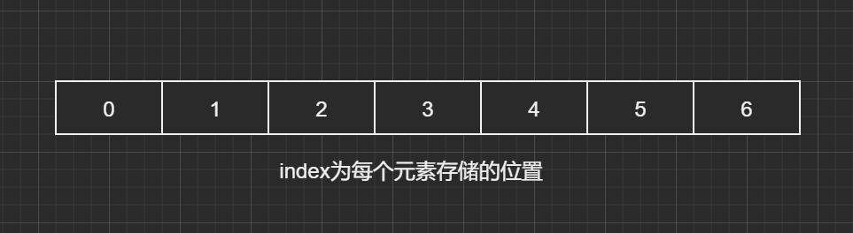
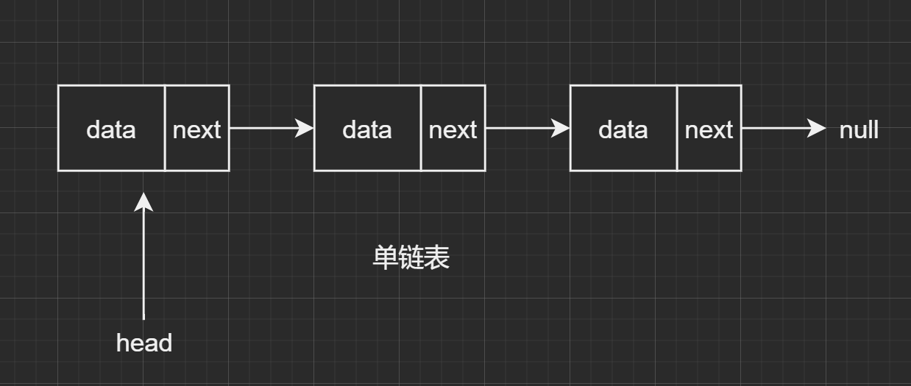
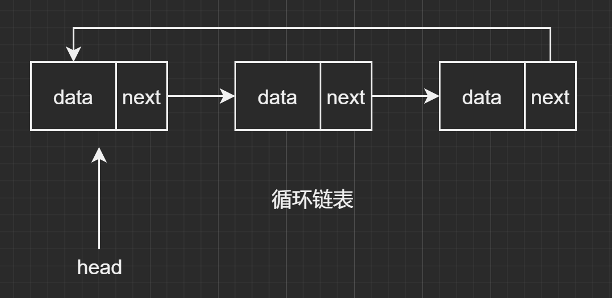
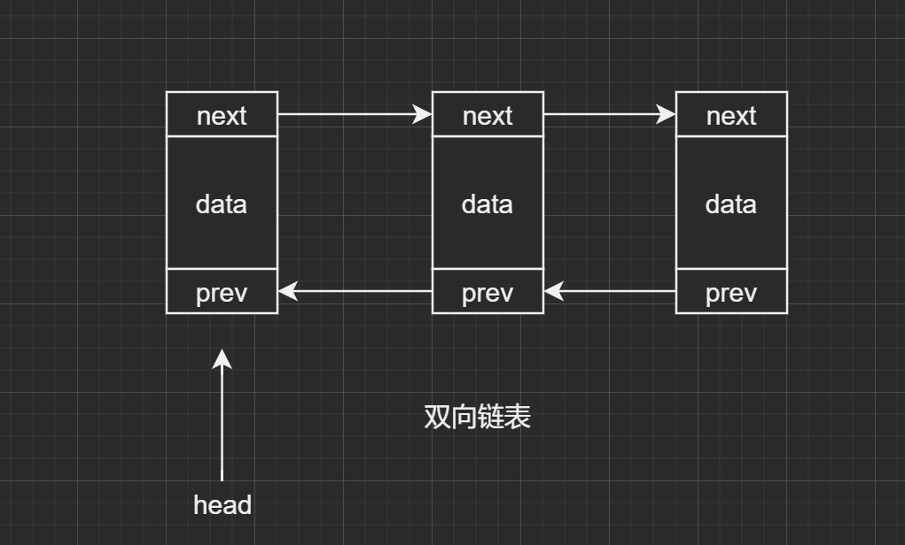

## 何为线性表

在逻辑上呈现为线性关系，就像数组和链表一样

## 分类

按照存储结构，线性表可分为顺序存储和链式存储

顺序存储主要体现为在一段连续的存储单元中存放数据，查找通过index的方式获得，时间复杂度为O(1)，插入删除为O(n)，因为其存储空间是需要连续的，所以在分配空间时大了会浪费空间，小了会造成元素的溢出，典型的案例是数组

链式存储则是用任意的一个空间来存储链表中某个节点，元素个数不受控制，在单链表中时间复杂度查找O(n)，插入删除O(1)

### 数组

### 链表

## JDK中的相关应用

### ArrayList

具备动态数组的能力，即原来的容量=size，再加元素时就会先开辟一个为原来1.5倍容量的新数组，将原来的数组数据copy过来，再释放旧数组，再把新加的元素放入到这个新数组中

### LinkedList

LinkedList是一个双向链表，实现了Queue、Deque接口，适合插入删除操作，其中也可以包含重复的元素还维护了元素插入时的顺序，但不是线程安全的