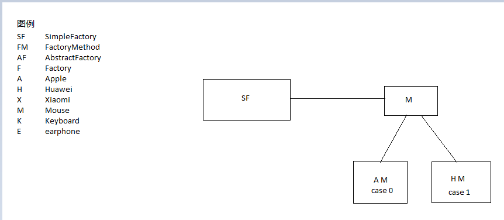
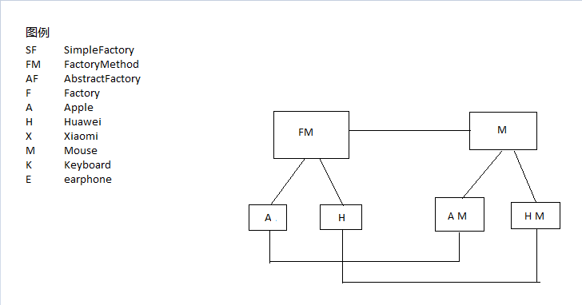
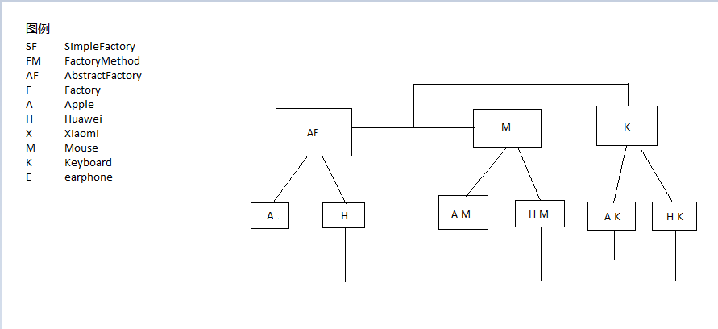

## 策略模式

解决问题的方式很多，不同的策略或许能更高效地找到最合适的方式，在有些情况下，需要对策略的实现方式进行切换，使得程序变得灵活，通过这种方式封装不同的算法，避免多重条件的判断，完善程序的扩展性，且策略模式是一种行为型模式

`Strategy.java`
```java
public interface Strategy {
    public int doSomething(int A, int B);
}
```

`AddStrategy.java`
```java
public class AddStrategy implements Strategy {

    @Override
    public int doSomething(int A, int B) {
        return A+B;
    }
}
```

`SubtractStrategy.java`
```java
public class SubtractStrategy implements Strategy{
    @Override
    public int doSomething(int A, int B) {
        return A-B;
    }
}
```

`ContextFactory.java`
```java
public class ContextFactory {

    private Strategy strategy;

    public ContextFactory(String operation){
        switch (operation){
            case "add":
                Strategy add = new AddStrategy();
                strategy = add;
                break;
            case "subtract":
                Strategy subtract = new SubtractStrategy();
                strategy = subtract;
                break;
            default:
                break;
        }
    }

    public int executeStrategy(int A, int B){
        return strategy.doSomething(A, B);
    }
}
```

`TestStrategy.java`
```java
public class TestStrategy {
    public static void main(String[] args) {
        System.out.println("add:" + start("add"));
        System.out.println("subtract:" + start("subtract"));
    }

    public static int start(String type){
        ContextFactory cf = new ContextFactory(type);
        return cf.executeStrategy(33,66);
    }
}
```

`Run result`
```
add:99
subtract:-33
```

策略模式不可避免的使客户端进行算法选择，本例采用策略模式与简单工厂相结合的方式，实现与客户端的解耦，大大减少了客户端的操作步骤

由此可见策略模式的缺点在于如果策略的实现方式过多，则相对麻烦，且需要向外暴露策略类，如果策略过多，则可以考虑混合模式解决

## 代理模式
代理模式作为一种比较常用的设计模式，顾名思义，你需要一个牛逼的代理，打个比方，你要是想要接触一些大牌明星，明面上基本上见不着的，这时候你就需要一个访问层，比如她的经理人之类的，间接地传达一些消息，否者会对明星的生活带来很多困扰，基于这种思想，代理模式也就很好理解了，就是为了让你间接地控制一些敏感的对象，八道不胡说，先上代码

`IUser.java`
```java
public interface IUser {
    public void whoAreYou();
}
```

`User.java`
```java
public class User implements IUser {

    private String name;

    public User(String name){
        this.name = name;
        init();
    }

    public void init(){
        System.out.println("init:"+name);
    }

    @Override
    public void whoAreYou() {
        System.out.println("begin:"+name);
    }
}
```

`Proxy.java`
```java
public class Proxy implements IUser {

    private String name;
    private User user;

    public Proxy(String name){
        this.name = name;
    }

    @Override
    public void whoAreYou() {
        if (user == null){
            user = new User(name);
        }
        user.whoAreYou();
    }
}
```

`TestProxy.java`
```java
public class TestProxy {
    public static void main(String[] args) {
        IUser proxy = new Proxy("zs");
        proxy.whoAreYou();
        System.out.println("---贫富分割线---");
        proxy.whoAreYou();
    }
}
```

`Run result`
```
init:zs
begin:zs
---贫富分割线---
begin:zs
```

作为一种优秀的结构型模式，从上述代码可看出利用Proxy类可以访问User中的方法，这种方式较为安全，在对象处理上，采用了Lazy loading的思想，避免浪费资源

## 工厂模式
对于工厂模式而言，可能大家并不会陌生，顾名思义所谓工厂就是啥事都给你做了，顾客等着消费产品就好了，首先咋们就来聊聊这简单工厂模式的道道

废话不多说先上代码

`Operation.java`
```java
public interface Operation {
    public double getResult(double A, double B) throws Exception;
}
```

`SimpleFactory.java`
```java
public class SimpleFactory {

    private static Operation operation = null;

    private static Operation add(){
        System.out.println("add日志");
        return new Add();
    }

    private static Operation subtract(){
        System.out.println("subtract日志");
        return new Subtract();
    }

    private static Operation multiply(){
        System.out.println("multiply日志");
        return new Multiply();
    }

    private static Operation divide(){
        System.out.println("divide日志");
        return new Divide();
    }

    public static Operation createOperation(String command){

        /*
        * @since 1.7 the param of switch can be String
        * @before 1.7 the param of switch can be int,short,byte,char
        * */
        switch (command){
            case "+":
                operation = add();
                break;
            case "-":
                operation = subtract();
                break;
            case "*":
                operation = multiply();
                break;
            case "/":
                operation = divide();
                break;
            default:
                break;
        }
        return operation;
    }
}

class Add implements Operation{

    @Override
    public double getResult(double A, double B) throws Exception {
        return A+B;
    }

}

class Subtract implements Operation{

    @Override
    public double getResult(double A, double B) throws Exception {
        return A-B;
    }

}

class Multiply implements Operation{

    @Override
    public double getResult(double A, double B) throws Exception {
        return A*B;
    }

}

class Divide implements Operation{

    @Override
    public double getResult(double A, double B) throws Exception {
        if (B == 0){
            throw new Exception("Divide by zero error");
        }
        return A/B;
    }
}
```

`Client.java`
```java
public class Client {
    public static void main(String[] args) throws Exception {
        Operation operation1 = SimpleFactory.createOperation("+");
        System.out.println(operation1.getResult(33, 66));
        Operation operation2 = SimpleFactory.createOperation("-");
        System.out.println(operation2.getResult(33, 66));
        Operation operation3 = SimpleFactory.createOperation("*");
        System.out.println(operation3.getResult(3,6));
        Operation operation4 = SimpleFactory.createOperation("/");
        System.out.println(operation4.getResult(3,6));
        System.out.println(operation4.getResult(3,0));
    }
}
```

`Run result`
```
add日志
99.0
subtract日志
-33.0
multiply日志
18.0
divide日志
0.5
Exception in thread "main" java.lang.Exception: Divide by zero error
```

可见简单工厂模式的实现逻辑较为简单，从步骤上来讲，先写一个接口，然后写一堆操作类去实现接口中的getResult方法为创建对应的类作准备，然后在工厂的创建静态方法里做switch、case分支，由此可见，若要增加一个新的实现类就必须修改工厂类中的代码，虽然在客户端只用通过操作符创建对象而且还可以在工厂类里增加日志信息或者逻辑判断，但在工厂类的修改却相对繁琐，这也是简单工厂模式的缺点

### Factory Mode
如果说简单工厂模式是为新增产品服务的，那么工厂模式则需要再新增工厂，简单工厂模式的设计理念不符合开闭原则(面向扩展开放，面向修改关闭)，每次新增实现类时都需要修改工厂类中的代码，那么工厂模式则能解决这种问题

先上代码

`FactoryMode.java`
```java
public interface FactoryMode {
    public Operation createOperation();
}
```

`AddFactory.java`
```java
public class AddFactory implements FactoryMode {
    @Override
    public Operation createOperation() {
        System.out.println("add工厂模式");
        return new Add();
    }
}
```

`DivideFactory.java`
```java
public class DivideFactory implements FactoryMode {
    @Override
    public Operation createOperation() {
        System.out.println("divide工厂模式");
        return new Divide();
    }
}
```

`Client.java`
```java
class Client1{
    public static void main(String[] args) throws Exception {
        FactoryMode addFactory = (AddFactory) Class.forName("com.ycw.factory.AddFactory").newInstance();
        FactoryMode divideFactory = (FactoryMode) Class.forName("com.ycw.factory.DivideFactory").newInstance();
        Operation operation1 = addFactory.createOperation();
        Operation operation2 = divideFactory.createOperation();
        System.out.println(operation1.getResult(33, 66));
        System.out.println(operation2.getResult(3, 6));
        System.out.println(operation2.getResult(3, 0));
    }
}
```

`Run result`
```
add工厂模式
divide工厂模式
99.0
0.5
Exception in thread "main" java.lang.Exception: Divide by zero error
```

这种将工厂抽象为一个接口让不同功能的工厂去实现创建操作类的方法，使得简单工厂模式实现了解耦，将工厂的内部逻辑转移到客户端实现

### Abstract Factory

代码来

`User.java`
```java
public class User {
    private int id;
    private String name;

    public User(int id, String name) {
        this.id = id;
        this.name = name;
    }

    @Override
    public String toString() {
        return "User{" +
                "id=" + id +
                ", name='" + name + '\'' +
                '}';
    }

    public int getId() {
        return id;
    }

    public void setId(int id) {
        this.id = id;
    }

    public String getName() {
        return name;
    }

    public void setName(String name) {
        this.name = name;
    }
}
```

`Function.java`
```java
public class Function {
    private int id;
    private String name;

    public Function(int id, String name) {
        this.id = id;
        this.name = name;
    }

    @Override
    public String toString() {
        return "Function{" +
                "id=" + id +
                ", name='" + name + '\'' +
                '}';
    }

    public int getId() {
        return id;
    }

    public void setId(int id) {
        this.id = id;
    }

    public String getName() {
        return name;
    }

    public void setName(String name) {
        this.name = name;
    }
}
```

`IUser.java`
```java
public interface IUser {
    public void insert(User user);
    public User getUser(int id);
}
```

`IFuntion.java`
```java
public interface IFunction {
    public void insert(Function function);
    public Function getFunction(int id);
}
```

`AbstractFactory.java`
```java
public interface AbstractFactory {
    public IUser createUser();
    public IFunction createFunction();
    public IUser getUser();
    public IFunction getFunction();
}
```

`MysqlFactory.java`
```java
public class MysqlFactory implements AbstractFactory {

    @Override
    public IUser createUser() {
        return new MysqlUser();
    }

    @Override
    public IFunction createFunction() {
        return new MysqlFunction();
    }

    @Override
    public IUser getUser() {
        return new MysqlUser();
    }

    @Override
    public IFunction getFunction() {
        return new MysqlFunction();
    }
}
```

`MysqlUser.java`
```java
public class MysqlUser implements IUser {

    @Override
    public void insert(User user) {
        System.out.println("Mysql创建了User");
    }

    @Override
    public User getUser(int id) {
        return new User(id, "Mysql-zs");
    }

}
```

`MysqlFunction.java`
```java
public class MysqlFunction implements IFunction {

    @Override
    public void insert(Function function) {
        System.out.println("Mysql创建了function");
    }

    @Override
    public Function getFunction(int id) {
        return new Function(id, "Mysql-function");
    }

}
```

`SqlServerFactory.java`
```java
public class SqlServerFactory implements AbstractFactory {
    @Override
    public IUser createUser() {
        return new SqlServerUser();
    }

    @Override
    public IFunction createFunction() {
        return new SqlServerFunction();
    }

    @Override
    public IUser getUser() {
        return new SqlServerUser();
    }

    @Override
    public IFunction getFunction() {
        return new SqlServerFunction();
    }
}
```

`SqlServerUser.java`
```java
public class SqlServerUser implements IUser {
    @Override
    public void insert(User user) {
        System.out.println("SqlServer创建了User");
    }

    @Override
    public User getUser(int id) {
        return new User(id, "Sql-zs");
    }
}
```

`SqlServerFunction.java`
```java
public class SqlServerFunction implements IFunction {
    @Override
    public void insert(Function function) {
        System.out.println("SqlServer创建了function");
    }

    @Override
    public Function getFunction(int id) {
        return new Function(1, "Sql-function");
    }
}
```

`Client.java`
```java
class Client2{
    public static void main(String[] args) {

        AbstractFactory mysqlFactory = new MysqlFactory();

        IUser userOperation1 = mysqlFactory.createUser();
        User user1 = new User(1,"zs");
        userOperation1.insert(user1);
        IUser userOperation2 = mysqlFactory.getUser();
        System.out.println(userOperation2.getUser(1));

        IFunction functionOperation1 = mysqlFactory.createFunction();
        Function function1 = new Function(1,"function");
        functionOperation1.insert(function1);
        IFunction functionOperation2 = mysqlFactory.getFunction();
        System.out.println(functionOperation2.getFunction(1));

        AbstractFactory sqlServerFactory = new SqlServerFactory();

        IUser userOperation3 = sqlServerFactory.createUser();
        User user2 = new User(1,"zs");
        userOperation3.insert(user2);
        IUser userOperation4 = sqlServerFactory.getUser();
        System.out.println(userOperation4.getUser(1));

        IFunction functionOperation3 = sqlServerFactory.createFunction();
        Function function2 = new Function(1,"function");
        functionOperation3.insert(function2);
        IFunction functionOperation4 = sqlServerFactory.getFunction();
        System.out.println(functionOperation4.getFunction(1));
    }
}
```

`Run result`
```
Mysql创建了User
User{id=1, name='Mysql-zs'}
Mysql创建了function
Function{id=1, name='Mysql-function'}
SqlServer创建了User
User{id=1, name='Sql-zs'}
SqlServer创建了function
Function{id=1, name='Sql-function'}
```

代码的确有点多啊，不敢兴趣的小伙伴可以直接拉过去测试一波(￣(∞)￣)　

这里简单讲解下抽象工厂模式的特点，从给出的代码来看，抽象工厂模式比较适合切换不同的数据库的访问，实现抽象工厂接口可以配置不同的工厂类，在其内部可以实现对不同产品的配置，与工厂模式的区别在于，工厂模式只能对单一产品进行配置，而抽象工厂能够对一系列的产品批量配置

抽象工厂本身是对功能的细化，能够实现客户端与具体工厂的分离，客户端只需要了解IUser和IFunction中的接口操作case就能够解决问题

### Easter Egg
又到了灵魂画师的环节，参考了了下菜鸟教程，浅显易懂



主要就是通过case来操作对象的创建的，只能创建一个产品



与SF不同的是此时的M是通过工厂来创建的，只需AppleFactory.createMouse()即可实现



AF即是生产多个产品，在此基础上可以做些拓展，比如加一个X工厂或者E产品之类的，道理是一样的

## 观察者模式
观察者模式有两个核心对象，主题和观察者，一般来说主题不用知道谁是他的观察者，只需要调用方法通知全体，但其缺点是必须依赖于这些观察者对象，这可以通过依赖委托来改进，这种模式能够实现解耦，让双方都依赖于抽象而不依赖具体，通常用在观察者自身改变时也需要改变和他一样的观察者的状态

`Subject.java`
```java
public abstract class Subject {
    List<Observer> observerList = new ArrayList<>();

    public void add(Observer observer){
        observerList.add(observer);
    }

    public void delete(Observer observer){
        observerList.remove(observer);
    }

    public void send(){
        for (Observer observer:observerList){
            observer.modify();
        }
    }
}
```

`SpecificSubject.java`
```java
public class SpecificSubject extends Subject {
    private String subjectState;

    public String getSubjectState() {
        return subjectState;
    }

    public void setSubjectState(String subjectState) {
        this.subjectState = subjectState;
    }
}
```

`Observer.java`
```java
public abstract class Observer {
    public abstract void modify();
}
```

`SpecificObserver.java`
```java
public class SpecificObserver extends Observer {

    private SpecificSubject subject;
    private String name;
    private String observerState;

    public SpecificObserver(SpecificSubject subject, String name) {
        this.subject = subject;
        this.name = name;
    }

    public SpecificSubject subject(){
        return subject;
    }

    @Override
    public void modify() {
        observerState = subject.getSubjectState();
        System.out.println(name+" "+observerState);
    }
}
```

`TestObserver.java`
```java
public class TestObserver {
    public static void main(String[] args) {
        SpecificSubject subject = new SpecificSubject();
        subject.setSubjectState("ok");
        Observer observer1 = new SpecificObserver(subject,"one");
        Observer observer2 = new SpecificObserver(subject,"two");
        subject.add(observer1);
        subject.add(observer2);
        subject.send();
    }
}
```

`Run result`
```
one ok
two ok
```

## 建造者模式
当我们需要创建一个复杂对象的时候往往需要利用到建造者模式(创建型模式)，典型的像StringBuilder类，其原理就是将复杂对象拆分为简单对象来构建，各个简单对象是通过一定的算法来组装的，用不同的表示就能通过同样的创建过程创建出不同的复杂对象

下面我们通过一个简单的例子来阐述建造者模式的特点

`Product.java`
```java
public interface Product {
    float price();
    Screen screen();
    String name();
}
```

`Phone.java`
```java
public abstract class Phone implements Product {
}
```

`Apple.java`
```java
public class Apple extends Phone {
    @Override
    public float price() {
        return 6666f;
    }

    @Override
    public Screen screen() {
        return new Small();
    }

    @Override
    public String name() {
        return "Apple";
    }
}
```

`HuaWei.java`
```java
public class HuaWei extends Phone {
    @Override
    public float price() {
        return 5555f;
    }

    @Override
    public Screen screen() {
        return new Small();
    }

    @Override
    public String name() {
        return "HuaWei";
    }
}
```

`PC.java`
```java
public abstract class PC implements Product{
}
```

`Mac.java`
```java
public class Mac extends PC {
    @Override
    public float price() {
        return 10000f;
    }

    @Override
    public Screen screen() {
        return new Big();
    }

    @Override
    public String name() {
        return "Mac";
    }
}
```

`MateBook.java`
```java
public class MateBook extends PC {
    @Override
    public float price() {
        return 8888f;
    }

    @Override
    public Screen screen() {
        return new Big();
    }

    @Override
    public String name() {
        return "MateBook";
    }
}
```

`Screen.java`
```java
public interface Screen {
    String screen();
}
```

`Big.java`
```java
public class Big implements Screen {
    @Override
    public String screen() {
        return "Big";
    }
}
```

`Small.java`
```java
public class Small implements Screen {
    @Override
    public String screen() {
        return "Small";
    }
}
```

`Set.java`
```java
public class Set {
    List<Product> productList = new ArrayList<>();

    public void addProduct(Product product){
        productList.add(product);
    }

    public float getCost(){
        float cost = 0.0f;
        for (Product product:productList){
            cost += product.price();
        }
        return cost;
    }

    public void showProduct(){
        for (Product product:productList){
            System.out.println(product.name()+" "+product.price()+" "+product.screen().screen());
        }
    }
}
```

`SetBuilder.java`
```java
public class SetBuilder {

    public Set AppleSet(){
        Set set = new Set();
        set.addProduct(new Apple());
        set.addProduct(new Mac());
        return set;
    }

    public Set HuaWeiSet(){
        Set set = new Set();
        set.addProduct(new HuaWei());
        set.addProduct(new MateBook());
        return set;
    }
}
```

`TestBuilder.java`
```java
public class TestBuilder {
    public static void main(String[] args) {

        SetBuilder sb = new SetBuilder();

        Set set1 = sb.AppleSet();
        System.out.println("Total Cost:"+set1.getCost());
        set1.showProduct();
        System.out.println("---贫富分割线---");
        Set set2 = sb.HuaWeiSet();
        System.out.println("Total Cost:"+set2.getCost());
        set2.showProduct();
    }
}
```

`Run result`
```
Total Cost:16666.0
Apple 6666.0 Small
Mac 10000.0 Big
---贫富分割线---
Total Cost:14443.0
HuaWei 5555.0 Small
MateBook 8888.0 Big
```

由测试类我们可以看出，对于复杂对象的创建过程客户端并不需要过多的关心，只要创建出Builder对象调用其中方法即可拿到复杂对象，然后再调用封装好的复杂对象中的方法即可拿到数据

这样做的好处就是Builder类相对独立，可扩展复杂对象的构建过程，可以控制对象的生成，提高了安全性

## 模板方法模式
模板方法模式作为一个行为模式，他的目的在于从顶层逻辑中封装一些有顺序的抽象方法的集合，形成一种逻辑骨架，然后用子类实现，且子类对象调用模板封装的方法时与其定义的顺序有关

`AbstractTemplate.java`
```java
public abstract class AbstractTemplate {
    public abstract void A();
    public abstract void B();
    public abstract void init();

    public final void T(){
        init();
        A();
        B();
    }
}
```

`A.java`
```java
public class A extends AbstractTemplate {
    @Override
    public void A() {
        System.out.println("A类执行A方法");
    }

    @Override
    public void B() {
        System.out.println("A类执行B方法");
    }

    @Override
    public void init() {
        System.out.println("A类初始化");
    }
}
```

`B.java`
```java
public class B extends AbstractTemplate {
    @Override
    public void A() {
        System.out.println("B类执行A方法");
    }

    @Override
    public void B() {
        System.out.println("B类执行B方法");
    }

    @Override
    public void init() {
        System.out.println("B类初始化");
    }
}
```

`TestTemplate.java`
```java
public class TestTemplate {
    public static void main(String[] args) {
        AbstractTemplate at = new A();
        at.T();
        at = new B();
        at.T();
    }
}
```

`Run result`
```
A类初始化
A类执行A方法
A类执行B方法
B类初始化
B类执行A方法
B类执行B方法
```

由此可见模板方法模式的有点在于封装不变或固定的内容，通过子类实现扩展功能，一般模板方法用final修饰，防止被篡改

## 外观模式
一般来说系统之间的关联都是比较复杂的，如何管理这些关系呢，这时候就需要外观模式的协调，使客户端调用复杂的子系统变得简单，可以说外观模式是一种控制器，客户端想要用哪个功能只要熟悉外观对象提供的方法即可

`IUser.java`
```java
public interface IUser {
    void WhoAreYou();
}
```

`A.java`
```java
public class A implements IUser {
    @Override
    public void WhoAreYou() {
        System.out.println("I'm A");
    }
}
```

`B.java`
```java
public class B implements IUser {
    @Override
    public void WhoAreYou() {
        System.out.println("I'm B");
    }
}
```

`Facade.java`
```java
public class Facade {
    private A a;
    private B b;

    public Facade(){
        this.a = new A();
        this.b = new B();
    }

    public void showA(){
        a.WhoAreYou();
    }

    public void showB(){
        b.WhoAreYou();
    }
}
```

`TestFacade.java`
```java
public class TestFacade {
    public static void main(String[] args) {
        Facade facade = new Facade();
        facade.showA();
        facade.showB();
    }
}
```

`Run result`
```
I'm A
I'm B
```

这种做法能够减少系统之间的依赖，客户端只能先通过外观对象访问系统提高了安全性，但是这种结构型模式不符合开闭原则，即添加新的子系统时需要修比较麻烦

## 原型模式
>参照了许多大佬的博客，这里先给出自己一些关于原型模式的理解，从名字本身来讲，原型就是一个model，就像前人造的轮子的蓝图，你依葫芦画瓢再克隆出来一个不就行了，思想还是很简单的，关键在于它的实现

### Shallow Copy
从话里听出来实现的核心就是克隆，那么就来谈谈克隆的道道，众所周知，在猿类的思想中有深拷贝和浅拷贝的操作，所谓浅拷贝就是复制对象的内容，对象中的引用、容器、数组这些复杂类型是copy他们的地址、而修改浅拷贝后的对象的基本类型或包装类型的值和原来的对象没有关系，但修改复杂类型就会跟原对象牵连了

### Deep Copy
深拷贝其实就是复制一个完全不同的对象，这样强调其区别其实不为过，主要在于复杂类型的地址问题，但这两种克隆方式都是创建出了不同的对象，所以说通过具体原型类创建出来的对象和原对象的地址是不同的

说多了不好理解，写看波代码

`Prototype.java`
```java
public interface Prototype {
    SpecificPrototype clone();
}
```

`SpecificPrototype.java`
```java
public class SpecificPrototype implements Prototype {

    private int property1;
    private String property2;
    private Property property;

    public int getProperty1() {
        return property1;
    }

    public void setProperty1(int property1) {
        this.property1 = property1;
    }

    public String getProperty2() {
        return property2;
    }

    public void setProperty2(String property2) {
        this.property2 = property2;
    }

    public Property getProperty() {
        return property;
    }

    public void setProperty(Property property) {
        this.property = property;
    }

    @Override
    public SpecificPrototype clone() {
        SpecificPrototype specificPrototype = new SpecificPrototype();
        specificPrototype.setProperty1(this.property1);
        specificPrototype.setProperty2(this.property2);
        specificPrototype.setProperty(this.property);
        return specificPrototype;
    }
}

/*
 * 实现Cloneable接口可以直接调用封装好的clone方法
 * */
class SpecificPrototype1 implements Cloneable{

    private int property1;
    private String property2;
    private Property property;

    public int getProperty1() {
        return property1;
    }

    public void setProperty1(int property1) {
        this.property1 = property1;
    }

    public String getProperty2() {
        return property2;
    }

    public void setProperty2(String property2) {
        this.property2 = property2;
    }

    public Property getProperty() {
        return property;
    }

    public void setProperty(Property property) {
        this.property = property;
    }

    public SpecificPrototype1 clone() throws CloneNotSupportedException {
        SpecificPrototype1 sp = (SpecificPrototype1) super.clone();
        return sp;
    }
}

/*
* 需要实现Cloneable和Serializable接口
* */
class SpecificPrototype2 implements Cloneable, Serializable{

    private int property1;
    private String property2;
    private Property1 property;

    public int getProperty1() {
        return property1;
    }

    public void setProperty1(int property1) {
        this.property1 = property1;
    }

    public String getProperty2() {
        return property2;
    }

    public void setProperty2(String property2) {
        this.property2 = property2;
    }

    public Property1 getProperty() {
        return property;
    }

    public void setProperty(Property1 property) {
        this.property = property;
    }

    /*
    * 通过字节数组流的方式结合序列化实现深拷贝，通过内存读取的方式实现
    * */
    public SpecificPrototype2 deepClone() throws IOException, ClassNotFoundException {
        ByteArrayOutputStream bos = new ByteArrayOutputStream();
        ObjectOutputStream oos = new ObjectOutputStream(bos);
        oos.writeObject(this);
        ByteArrayInputStream bis = new ByteArrayInputStream(bos.toByteArray());
        ObjectInputStream ois = new ObjectInputStream(bis);
        return (SpecificPrototype2) ois.readObject();
    }
}
```

`Property.java`
```java
public class Property{}

//需要实现序列化接口
class Property1 implements Serializable {}
```

`Client.java`
```java
public class Client {
    public SpecificPrototype startClone(SpecificPrototype sp){
        return sp.clone();
    }
}

class Client1{
    public SpecificPrototype1 startClone(SpecificPrototype1 sp1) throws CloneNotSupportedException {
        return sp1.clone();
    }
}

class Client2{
    public SpecificPrototype2 startClone(SpecificPrototype2 sp2) throws IOException, ClassNotFoundException {
        return sp2.deepClone();
    }
}
```

`TestPrototype.java`
```java
public class TestPrototype {
    public static void main(String[] args) throws CloneNotSupportedException, IOException, ClassNotFoundException {

        //简单浅拷贝
        SpecificPrototype sp = new SpecificPrototype();
        sp.setProperty1(1);
        sp.setProperty2("abc");
        Property property = new Property();
        sp.setProperty(property);
        System.out.println(sp);

        Client client = new Client();
        SpecificPrototype prototypeClone = client.startClone(sp);
        System.out.println(prototypeClone);
        System.out.println(sp.getProperty());
        System.out.println(prototypeClone.getProperty());
        System.out.println("DeepClone:" + (sp.getProperty() != prototypeClone.getProperty()));

        //具体原型类实现Cloneable接口的浅拷贝
        SpecificPrototype1 sp1 = new SpecificPrototype1();
        sp1.setProperty1(1);
        sp1.setProperty2("abc");
        Property property1 = new Property();
        sp1.setProperty(property1);
        System.out.println(sp1);

        Client1 client1 = new Client1();
        SpecificPrototype1 prototypeClone1 = client1.startClone(sp1);
        System.out.println(prototypeClone1);
        System.out.println(sp1.getProperty());
        System.out.println(prototypeClone1.getProperty());
        System.out.println("DeepClone:" + (sp1.getProperty() != prototypeClone1.getProperty()));

        //具体原型类实现Cloneable和Serializable接口，通过流的方式实现深拷贝
        SpecificPrototype2 sp2 = new SpecificPrototype2();
        sp2.setProperty1(1);
        sp2.setProperty2("abc");
        Property1 property2 = new Property1();
        sp2.setProperty(property2);
        System.out.println(sp2);

        Client2 client2 = new Client2();
        SpecificPrototype2 prototypeClone2 = client2.startClone(sp2);
        System.out.println(prototypeClone2);
        System.out.println(sp2.getProperty());
        System.out.println(prototypeClone2.getProperty());
        System.out.println("DeepClone:" + (sp2.getProperty() != prototypeClone2.getProperty()));
    }
}
```

`Run result`
```
com.ycw.prototype.SpecificPrototype@3b6eb2ec
com.ycw.prototype.SpecificPrototype@6e8dacdf
com.ycw.prototype.Property@7a79be86
com.ycw.prototype.Property@7a79be86
DeepClone:false
com.ycw.prototype.SpecificPrototype1@21bcffb5
com.ycw.prototype.SpecificPrototype1@668bc3d5
com.ycw.prototype.Property@3cda1055
com.ycw.prototype.Property@3cda1055
DeepClone:false
com.ycw.prototype.SpecificPrototype2@79b4d0f
com.ycw.prototype.SpecificPrototype2@9629756
com.ycw.prototype.Property1@7c0e2abd
com.ycw.prototype.Property1@62ee68d8
DeepClone:true
```

根据得出的结果可以看出前两个是浅拷贝，只不过后者多了个Cloneable接口，而最后一个是深拷贝，这样的结果就很好对比分析了，原型模式的分析大致如此

## 中介者模式
根据面向对象的七大设计原则中的迪米特原则，也就是最少知道原则实现低耦合高内聚的设计思想，将对象之间的交互隔离开来，但不缺乏功能的完整性，这就是中介者模式的核心思想，简单来说就是其他所有需要交互的对象都与中介者对象相关联，通过中介者的操作实现对象间的交互

`Mediator.java`
```java
public abstract class Mediator {
    public abstract void send(String msg, WeChat weChat);
}
```

`SpecificMediator.java`
```java
public class SpecificMediator extends Mediator {

    private A a;
    private B b;

    public A getA() {
        return a;
    }

    public void setA(A a) {
        this.a = a;
    }

    public B getB() {
        return b;
    }

    public void setB(B b) {
        this.b = b;
    }

    @Override
    public void send(String msg, WeChat weChat) {
        if (weChat == a){
            b.notify(msg);
        }
        else {
            a.notify(msg);
        }
    }
}
```

`WeChat.java`
```java
public abstract class WeChat {

    private Mediator mediator;

    public WeChat(Mediator mediator) {
        this.mediator = mediator;
    }
}
```

`A.java`
```java
public class A extends WeChat {

    private Mediator mediator;

    public A(Mediator mediator) {
        super(mediator);
        this.mediator = mediator;
    }

    public void send(String msg){
        mediator.send(msg, this);
    }

    public void notify(String msg){
        System.out.println("B-->A A收到msg:"+msg);
    }
}
```

`B.java`
```java
public class B extends WeChat {

    private Mediator mediator;

    public B(Mediator mediator) {
        super(mediator);
        this.mediator = mediator;
    }

    public void send(String msg){
        mediator.send(msg, this);
    }

    public void notify(String msg){
        System.out.println("A-->B B收到msg:"+msg);
    }
}
```

`TestMediator.java`
```java
public class TestMediator {
    public static void main(String[] args) {
        SpecificMediator mediator = new SpecificMediator();
        A a = new A(mediator);
        B b = new B(mediator);
        mediator.setA(a);
        mediator.setB(b);
        a.send("天王盖地虎");
        b.send("小鸡炖蘑菇");
    }
}
```

`Run result`
```
A-->B B收到msg:天王盖地虎
B-->A A收到msg:小鸡炖蘑菇
```

从这个例子可以看出消息实际上都是通过mediator来实现交互的，只不过需要再创建交互对象的时候需要“认识”mediator即可，这种行为型模式也有缺点，中介者需要认识所有对象，使得其组织变得难以维护，而且不能在职责混乱的时候使用

## 装饰模式
所谓装饰模式就是在不改变原先功能代码的前提下为已有功能动态地添加新功能，装饰类和被装饰类之间无耦合，用起来十分灵活，可以扩展或撤销功能，打个比方你买个面包可以要包装袋也可以不要，就是这么简单

`IUser.java`
```java
public interface IUser {
    String WhoAreYou();
}
```

`A.java`
```java
public class A implements IUser {

    private String name;

    public A(String name) {
        this.name = name;
    }

    @Override
    public String WhoAreYou() {
        return this.name;
    }
}
```

`B.java`
```java
public class B implements IUser {

    private String name;

    public B(String name) {
        this.name = name;
    }

    @Override
    public String WhoAreYou() {
        return this.name;
    }
}
```

`AbstractDecorator.java`
```java
public abstract class AbstractDecorator implements IUser{

    private IUser user;

    AbstractDecorator(IUser user){
        this.user = user;
    }

    @Override
    public String WhoAreYou(){
        return user.WhoAreYou();
    }
}
```

`SpecificDecorator.java`
```java
public class SpecificDecorator extends AbstractDecorator {

    private SpecificDecorator sd;

    SpecificDecorator(IUser user) {
        super(user);
    }

    @Override
    public String WhoAreYou(){
        setDecoratorProperty(sd);
        return super.WhoAreYou();
    }

    private void setDecoratorProperty(SpecificDecorator sd){
        System.out.println("this is a decorator");
    }

}
```

`TestDecorator.java`
```java
public class TestDecorator {
    public static void main(String[] args) {
        IUser A = new A("zs");
        SpecificDecorator sd = new SpecificDecorator(A);
        System.out.println(sd.WhoAreYou());
        System.out.println("---贫富分割线---");
        IUser B = new B("ls");
        System.out.println(B.WhoAreYou());
    }
}
```

`Run result`
```
this is a decorator
zs
---贫富分割线---
ls
```

可见装饰模式用起来十分方便，想加就加，符合面向扩展开放，面向修改关闭的设计原则
